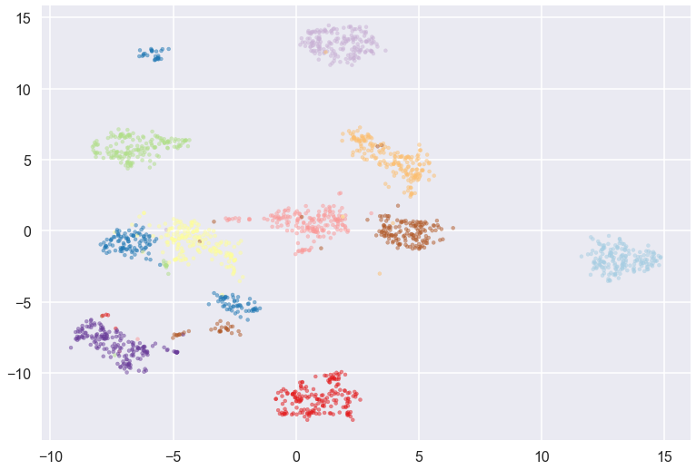
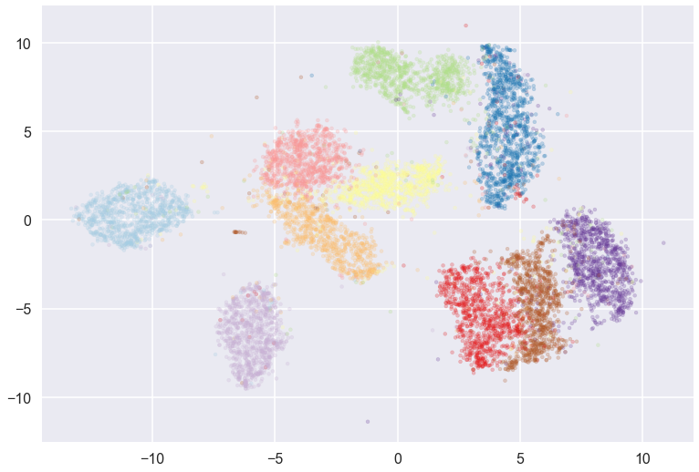
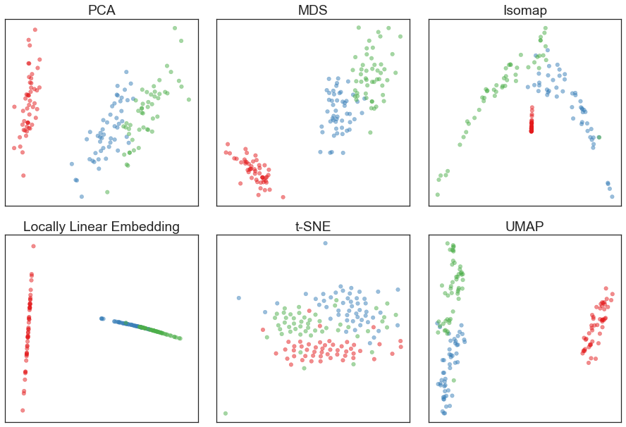

====
UMAP
====

Uniform Manifold Approximation and Projection

Currently this is completely experimental, and supports a very limited range of
functionality. For basic usage you can do something like:

.. code:: python

    import umap
    from sklearn.datasets import load_digits

    digits = load_digits()

    embedding = umap.UMAP().fit_transform(digits.data)

This algorithm is still under development. There are no promises that this will
work well on your data, but if it doesn't please let me know so I can work
to make the algorithm better, or understand what is going astray.

A paper documenting the algorithm and the mathematical motivation behind
it is forthcoming.

--------------------
What to do right now
--------------------

This is experimental code to let people try things out and provide feedback.
Some parameters that perhaps should be exposed aren't. Some parameters that
perhaps shouldn't be exposed are. Many parameters are probably badly named.
I haven't tried the algorithm on a very wide range of datasets yet.

So ... if you are interested please grab the code and try it out. I would
greatly appreciate feedback on how it worked on varying datasets. Please
consult the docstrings and play with parameters to see what works, and
by all means suggest better names for parameters!

----------
Installing
----------

UMAP should mostly work providing you have all the requirements. The primary
requirements at this time are:

* numpy
* scipy
* scikit-learn
* cython

--------
Examples
--------

How well does it work? Here are some examples on the digits dataset.

First the small sklearn digits data (~1700 digits in 64 space):

Now on the full test set (10000 digits in 784 space):

And because no ML presentation is complete without it, the Iris dataset:

------------
Contributing
------------

Contributions are more than welcome! All of the code is highly experimental
at the current time (the algorithm itself is under active development), so
unfortunately it is not as approachable as it will hopefully eventually be.
However, if you are interested please contact me (file and issue) and we
can discuss ideas for contributions. Everything from code to notebooks to
examples and documentation are all *equally valuable* so please don't feel
you can't contribute.

