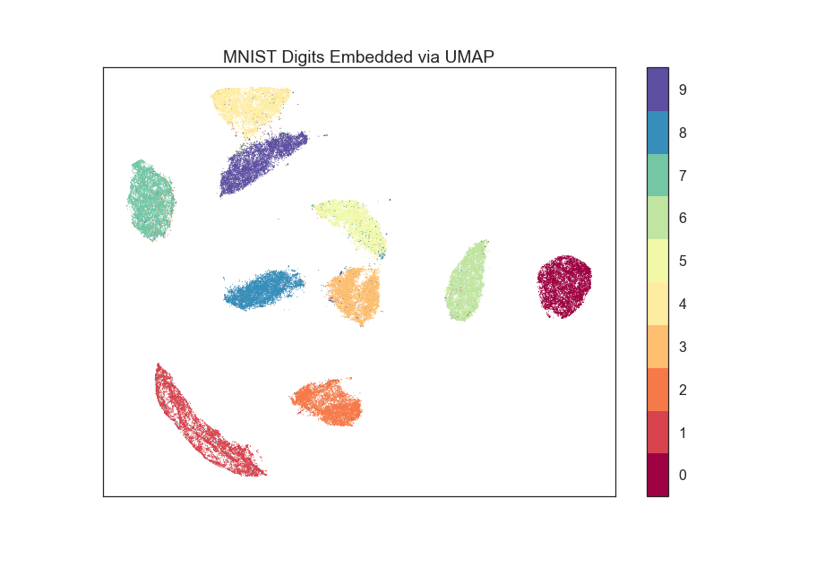
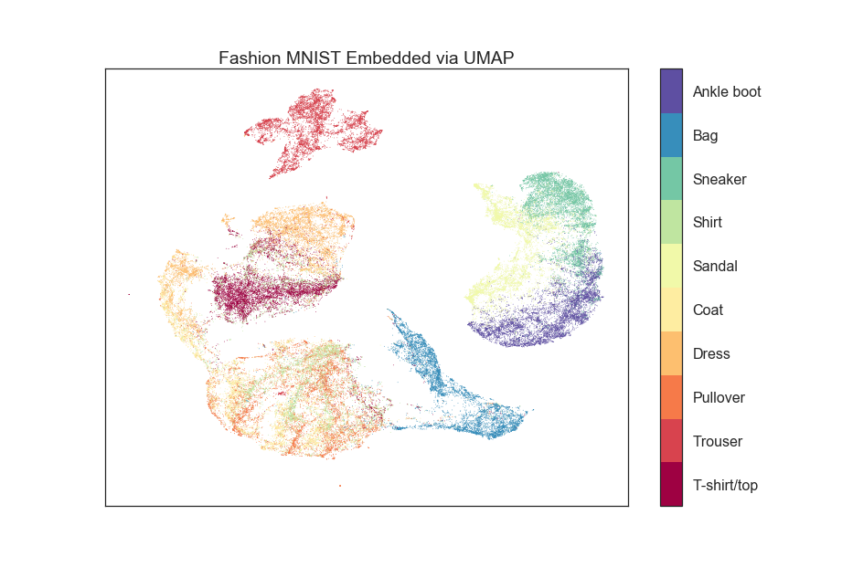
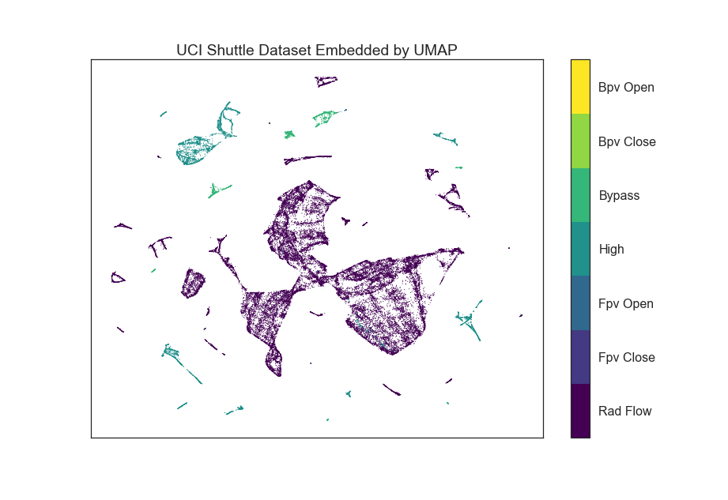

.. image:: https://img.shields.io/pypi/v/umap-learn.svg
    :target: https://pypi.python.org/pypi/umap-learn/
    :alt: PyPI Version
.. image:: https://img.shields.io/pypi/l/umap-learn.svg
    :target: https://github.com/lmcinnes/umap/blob/master/LICENSE
    :alt: License

====
UMAP
====

Uniform Manifold Approximation and Projection (UMAP) is a dimension reduction
technique that can be used for visualisation similarly to t-SNE, but also for
general non-linear dimension reduction. The algorithm is founded on three
assumptions about the data

1. The data is uniformly distributed on Riemannian manifold;
2. The Riemannian metric is locally constant (or can be approximated as such);
3. The manifold is locally connected (not globally, but locally).

From these assumptions it is possible to model the manifold with a fuzzy
topological structure. The embedding is found by searching for a low dimensional
projection of the data that has the closest possible equivalent fuzzy
topological structure.

The important thing is that you don't need to worry about that -- you can use
UMAP right now for dimension reduction and visualisation as easily as a drop
in replacement for scikit-learn's t-SNE.

---------------
How to use UMAP
---------------

The umap package inherits from sklearn classes, and thus drops in neatly
next to other sklearn transformers with an identical calling API.

.. code:: python

    import umap
    from sklearn.datasets import load_digits

    digits = load_digits()

    embedding = umap.UMAP().fit_transform(digits.data)

There are a number of parameters that can be set for the UMAP class; the
major ones are as follows:

* ``n_neighbors``: This determines the number of neighboring points used in
local approximations of manifold structure. Larger values will result in more
global structure being preserved at the loss of detailed local structure. In
general this parameter should often be in the range 5 to 50, with a choice of
10 to 15 being a sensible default.

* ``min_dist``: This controls how tightly the embedding is allowed compress
points together. Larger values ensure embedded points are more evenly
distributed, while smaller values allow the algorithm to optimise more
accurately with regard to local structure. Sensible values are in the range 0
.001 to 0.5, with 0.1 being a reasonable default.

* ``metric``: This determines the choice of metric used to measure distance
in the input space. A wide variety of metrics are already coded, and a user
defined function can be passed as long as it has been JITd by numba.

An example of making use of these options:

.. code:: python

    import umap
    from sklearn.datasets import load_digits

    digits = load_digits()

    embedding = umap.UMAP(n_neighbors=5,
                          min_dist=0.3,
                          metric='correlation').fit_transform(digits.data)

Further details and tutorials are coming.

----------------
Benefits of UMAP
----------------

UMAP has a few signficant wins in its current incarnation.

First of all UMAP is *fast*. It can handle large datasets and high
dimensional data without too much difficulty, scaling beyond what most t-SNE
packages can manage.

Second, UMAP scales well in embedding dimension -- it isn't just for
visualisation! You can use UMAP as a general purpose dimension reduction
technique as a preliminary step to other machine learning tasks. With a
little care (documentation on how to be careful is coming) it partners well
with the `hdbscan <https://github.com/scikit-learn-contrib/hdbscan>`_
clustering library.

Third, UMAP often performs better at preserving aspects of global structure of
the data than t-SNE. This means that it can often provide a better "big
picture" view of your data as well as preserving local neighbor relations.

Fourth, UMAP supports a wide variety of distance functions, including
non-metric distance functions such as *cosine distance* and *correlation
distance*. You can finally embed word vectors properly using cosine distance!

Finally UMAP has solid theoretical foundations in manifold learning (paper
forthcoming). This both justifies the approach and allows for further
extensions that will soon be added to the library (embedding dataframes,
semi-supervised dimension reduction, etc.).

------------------------
Performance and Examples
------------------------

UMAP is very efficient at embedding large high dimensional datasets. In
particular it scales well with both input dimension and embedding dimension.
Thus, for a problem such as the 784-dimensional MNIST digits dataset with
70000 data samples, UMAP can complete the embedding in around 2.5 minutes (as
compared with around 45 minutes for most t-SNE implementations). Despite this
runtime efficiency UMAP still produces high quality embeddings.

The obligatory MNIST digits dataset, embedded in 2 minutes  and 22
seconds using a 3.1 GHz Intel Core i7 processor (n_neighbors=10, min_dist=0
.001):

The MNIST digits dataset is fairly straightforward however. A better test is
the more recent "Fashion MNIST" dataset of images of fashion items (again
70000 data sample in 784 dimensions). UMAP
produced this embedding in 2 minutes exactly (n_neighbors=5, min_dist=0.1):

The UCI shuttle dataset (43500 sample in 8 dimensions) embeds well under
*correlation* distance in 2 minutes and 39 seconds (note the longer time
required for correlation distance computations):

----------
Installing
----------

UMAP depends upon ``scikit-learn``, and thus ``scikit-learn``'s dependencies
such as ``numpy`` and ``scipy``. UMAP adds a requirement for ``numba`` for
performance reasons. The original version used Cython, but the improved code
clarity, simplicity and performance of Numba made the transition necessary.

Requirements:

* numpy
* scipy
* scikit-learn
* numba

**Install Options**

PyPI install, presuming you have numab and sklearn and all its requirements
(numpy and scipy) installed:

.. code:: bash

    pip install umap-learn

If pip is having difficulties pulling the dependencies then we'd suggest installing
the dependencies manually using anaconda followed by pulling hdbscan from pip:

.. code:: bash

    conda install numpy scipy
    conda install scikit-learn
    conda install numba
    pip install umap-learn

For a manual install get this package:

.. code:: bash

    wget https://github.com/lmcinnes/umap/archive/master.zip
    unzip master.zip
    rm master.zip
    cd umap-master

Install the requirements

.. code:: bash

    sudo pip install -r requirements.txt

or

.. code:: bash

    conda install scikit-learn numba

Install the package

.. code:: bash

    python setup.py install

----------------
Help and Support
----------------

This project is still very young. I am currently trying to get example
notebooks and documentation prepared, but it may be a while before those are
available. In the meantime please `open an issue <https://github.com/lmcinnes/umap/issues/new>`_
and I will try to provide any help and guidance that I can. Please also check
the docstrings on the code, which provide some descriptions of the parameters.

-------
License
-------

The umap package is 3-clause BSD licensed. Enjoy.

------------
Contributing
------------

Contributions are more than welcome! There are lots of opportunities
for potential projects, so please get in touch if you would like to
help out. Everything from code to notebooks to
examples and documentation are all *equally valuable* so please don't feel
you can't contribute. To contribute please `fork the project <https://github.com/lmcinnes/umap/issues#fork-destination-box>`_ make your changes and
submit a pull request. We will do our best to work through any issues with
you and get your code merged into the main branch.

