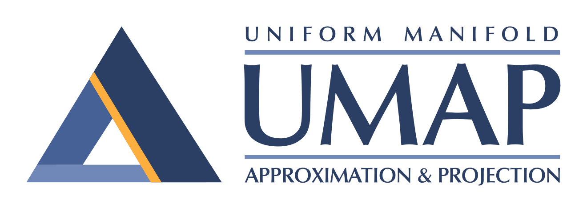
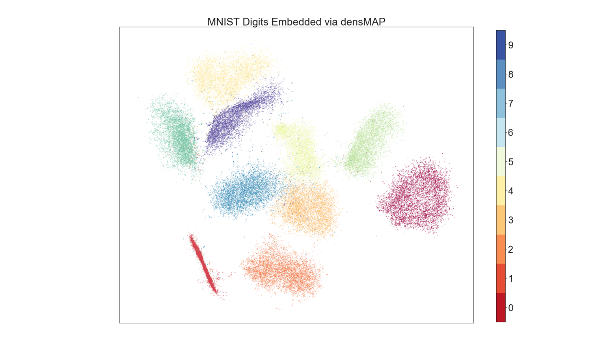

.. -*- mode: rst -*-

|pypi_version|_ |pypi_downloads|_

|conda_version|_ |conda_downloads|_

|License|_ |build_status|_ |Coverage|_

|Docs|_ |joss_paper|_

.. |pypi_version| image:: https://img.shields.io/pypi/v/umap-learn.svg
.. _pypi_version: https://pypi.python.org/pypi/umap-learn/

.. |pypi_downloads| image:: https://pepy.tech/badge/umap-learn/month
.. _pypi_downloads: https://pepy.tech/project/umap-learn

.. |conda_version| image:: https://anaconda.org/conda-forge/umap-learn/badges/version.svg
.. _conda_version: https://anaconda.org/conda-forge/umap-learn

.. |conda_downloads| image:: https://anaconda.org/conda-forge/umap-learn/badges/downloads.svg
.. _conda_downloads: https://anaconda.org/conda-forge/umap-learn

.. |License| image:: https://img.shields.io/pypi/l/umap-learn.svg
.. _License: https://github.com/lmcinnes/umap/blob/master/LICENSE.txt

.. |build_status| image:: https://dev.azure.com/lelandmcinnes/UMAP%20project%20builds/_apis/build/status/lmcinnes.umap?branchName=master
.. _build_status: https://dev.azure.com/lelandmcinnes/UMAP%20project%20builds/_build/latest?definitionId=2&branchName=master

.. |Coverage| image:: https://coveralls.io/repos/github/lmcinnes/umap/badge.svg
.. _Coverage: https://coveralls.io/github/lmcinnes/umap

.. |Docs| image:: https://readthedocs.org/projects/umap-learn/badge/?version=latest
.. _Docs: https://umap-learn.readthedocs.io/en/latest/?badge=latest

.. |joss_paper| image:: http://joss.theoj.org/papers/10.21105/joss.00861/status.svg
.. _joss_paper: https://doi.org/10.21105/joss.00861

====
UMAP
====

Uniform Manifold Approximation and Projection (UMAP) is a dimension reduction
technique that can be used for visualisation similarly to t-SNE, but also for
general non-linear dimension reduction. The algorithm is founded on three
assumptions about the data:

1. The data is uniformly distributed on a Riemannian manifold;
2. The Riemannian metric is locally constant (or can be approximated as such);
3. The manifold is locally connected.

From these assumptions it is possible to model the manifold with a fuzzy
topological structure. The embedding is found by searching for a low dimensional
projection of the data that has the closest possible equivalent fuzzy
topological structure.

The details for the underlying mathematics can be found in
`our paper on ArXiv <https://arxiv.org/abs/1802.03426>`_:

McInnes, L, Healy, J, *UMAP: Uniform Manifold Approximation and Projection
for Dimension Reduction*, ArXiv e-prints 1802.03426, 2018

The important thing is that you don't need to worry about that—you can use
UMAP right now for dimension reduction and visualisation as easily as a drop
in replacement for scikit-learn's t-SNE.

Documentation is `available via Read the Docs <https://umap-learn.readthedocs.io/>`_.

**New: this package now also provides support for densMAP.** The densMAP algorithm augments UMAP
to preserve local density information in addition to the topological structure of the data.
Details of this method are described in the following `paper <https://doi.org/10.1101/2020.05.12.077776>`_:

Narayan, A, Berger, B, Cho, H, *Density-Preserving Data Visualization Unveils
Dynamic Patterns of Single-Cell Transcriptomic Variability*, bioRxiv, 2020

----------
Installing
----------

UMAP depends upon ``scikit-learn``, and thus ``scikit-learn``'s dependencies
such as ``numpy`` and ``scipy``. UMAP adds a requirement for ``numba`` for
performance reasons. The original version used Cython, but the improved code
clarity, simplicity and performance of Numba made the transition necessary.

Requirements:

* Python 3.6 or greater
* numpy
* scipy
* scikit-learn
* numba

Recommended packages:

* `pynndescent <https://github.com/lmcinnes/pynndescent>`_
* For plotting
   * matplotlib
   * datashader
   * holoviews
* for Parametric UMAP  
   * tensorflow > 2.0.0

Installing pynndescent can significantly increase performance, and in later versions
it will become a hard dependency.

**Install Options**

Conda install, via the excellent work of the conda-forge team:

.. code:: bash

    conda install -c conda-forge umap-learn

The conda-forge packages are available for Linux, OS X, and Windows 64 bit.

PyPI install, presuming you have numba and sklearn and all its requirements
(numpy and scipy) installed:

.. code:: bash

    pip install umap-learn

If you wish to use the plotting functionality you can use

.. code:: bash

    pip install umap-learn[plot]

to install all the plotting dependencies.

If you wish to use Parametric UMAP, you need to install Tensorflow, which can be
installed either using the instructions at https://www.tensorflow.org/install 
(reccomended) or using 

.. code:: bash

    pip install umap-learn[parametric_umap]

for a CPU-only version of Tensorflow.

If pip is having difficulties pulling the dependencies then we'd suggest installing
the dependencies manually using anaconda followed by pulling umap from pip:

.. code:: bash

    conda install numpy scipy
    conda install scikit-learn
    conda install numba
    pip install umap-learn

For a manual install get this package:

.. code:: bash

    wget https://github.com/lmcinnes/umap/archive/master.zip
    unzip master.zip
    rm master.zip
    cd umap-master

Install the requirements

.. code:: bash

    sudo pip install -r requirements.txt

or

.. code:: bash

    conda install scikit-learn numba

Install the package

.. code:: bash

    python setup.py install

---------------
How to use UMAP
---------------

The umap package inherits from sklearn classes, and thus drops in neatly
next to other sklearn transformers with an identical calling API.

.. code:: python

    import umap
    from sklearn.datasets import load_digits

    digits = load_digits()

    embedding = umap.UMAP().fit_transform(digits.data)

There are a number of parameters that can be set for the UMAP class; the
major ones are as follows:

 -  ``n_neighbors``: This determines the number of neighboring points used in
    local approximations of manifold structure. Larger values will result in
    more global structure being preserved at the loss of detailed local
    structure. In general this parameter should often be in the range 5 to
    50, with a choice of 10 to 15 being a sensible default.

 -  ``min_dist``: This controls how tightly the embedding is allowed compress
    points together. Larger values ensure embedded points are more evenly
    distributed, while smaller values allow the algorithm to optimise more
    accurately with regard to local structure. Sensible values are in the
    range 0.001 to 0.5, with 0.1 being a reasonable default.

 -  ``metric``: This determines the choice of metric used to measure distance
    in the input space. A wide variety of metrics are already coded, and a user
    defined function can be passed as long as it has been JITd by numba.

An example of making use of these options:

.. code:: python

    import umap
    from sklearn.datasets import load_digits

    digits = load_digits()

    embedding = umap.UMAP(n_neighbors=5,
                          min_dist=0.3,
                          metric='correlation').fit_transform(digits.data)

UMAP also supports fitting to sparse matrix data. For more details
please see `the UMAP documentation <https://umap-learn.readthedocs.io/>`_

----------------
Benefits of UMAP
----------------

UMAP has a few signficant wins in its current incarnation.

First of all UMAP is *fast*. It can handle large datasets and high
dimensional data without too much difficulty, scaling beyond what most t-SNE
packages can manage. This includes very high dimensional sparse datasets. UMAP
has successfully been used directly on data with over a million dimensions.

Second, UMAP scales well in embedding dimension—it isn't just for
visualisation! You can use UMAP as a general purpose dimension reduction
technique as a preliminary step to other machine learning tasks. With a
little care it partners well with the `hdbscan
<https://github.com/scikit-learn-contrib/hdbscan>`_ clustering library (for
more details please see `Using UMAP for Clustering
<https://umap-learn.readthedocs.io/en/latest/clustering.html>`_).

Third, UMAP often performs better at preserving some aspects of global structure
of the data than most implementations of t-SNE. This means that it can often
provide a better "big picture" view of your data as well as preserving local neighbor
relations.

Fourth, UMAP supports a wide variety of distance functions, including
non-metric distance functions such as *cosine distance* and *correlation
distance*. You can finally embed word vectors properly using cosine distance!

Fifth, UMAP supports adding new points to an existing embedding via
the standard sklearn ``transform`` method. This means that UMAP can be
used as a preprocessing transformer in sklearn pipelines.

Sixth, UMAP supports supervised and semi-supervised dimension reduction.
This means that if you have label information that you wish to use as
extra information for dimension reduction (even if it is just partial
labelling) you can do that—as simply as providing it as the ``y``
parameter in the fit method.

Seventh, UMAP supports a variety of additional experimental features including: an
"inverse transform" that can approximate a high dimensional sample that would map to
a given position in the embedding space; the ability to embed into non-euclidean
spaces including hyperbolic embeddings, and embeddings with uncertainty; very
preliminary support for embedding dataframes also exists.

Finally, UMAP has solid theoretical foundations in manifold learning
(see `our paper on ArXiv <https://arxiv.org/abs/1802.03426>`_).
This both justifies the approach and allows for further
extensions that will soon be added to the library.

------------------------
Performance and Examples
------------------------

UMAP is very efficient at embedding large high dimensional datasets. In
particular it scales well with both input dimension and embedding dimension.
For the best possible performance we recommend installing the nearest neighbor
computation library `pynndescent <https://github.com/lmcinnes/pynndescent>`_ .
UMAP will work without it, but if installed it will run faster, particularly on
multicore machines.

For a problem such as the 784-dimensional MNIST digits dataset with
70000 data samples, UMAP can complete the embedding in under a minute (as
compared with around 45 minutes for scikit-learn's t-SNE implementation).
Despite this runtime efficiency, UMAP still produces high quality embeddings.

The obligatory MNIST digits dataset, embedded in 42 
seconds (with pynndescent installed and after numba jit warmup)
using a 3.1 GHz Intel Core i7 processor (n_neighbors=10, min_dist=0.001):

.. image:: images/umap_example_mnist1.png
    :alt: UMAP embedding of MNIST digits

The MNIST digits dataset is fairly straightforward, however. A better test is
the more recent "Fashion MNIST" dataset of images of fashion items (again
70000 data sample in 784 dimensions). UMAP
produced this embedding in 49 seconds (n_neighbors=5, min_dist=0.1):

.. image:: images/umap_example_fashion_mnist1.png
    :alt: UMAP embedding of "Fashion MNIST"

The UCI shuttle dataset (43500 sample in 8 dimensions) embeds well under
*correlation* distance in 44 seconds (note the longer time
required for correlation distance computations):

.. image:: images/umap_example_shuttle.png
    :alt: UMAP embedding the UCI Shuttle dataset

The following is a densMAP visualization of the MNIST digits dataset with 784 features
based on the same parameters as above (n_neighbors=10, min_dist=0.001). densMAP reveals
that the cluster corresponding to digit 1 is noticeably denser, suggesting that
there are fewer degrees of freedom in the images of 1 compared to other digits.

--------
Plotting
--------

UMAP includes a subpackage ``umap.plot`` for plotting the results of UMAP embeddings.
This package needs to be imported separately since it has extra requirements
(matplotlib, datashader and holoviews). It allows for fast and simple plotting and
attempts to make sensible decisions to avoid overplotting and other pitfalls. An
example of use:

.. code:: python

    import umap
    import umap.plot
    from sklearn.datasets import load_digits

    digits = load_digits()

    mapper = umap.UMAP().fit(digits.data)
    umap.plot.points(mapper, labels=digits.target)

The plotting package offers basic plots, as well as interactive plots with hover
tools and various diagnostic plotting options. See the documentation for more details.

---------------
Parametric UMAP
---------------

Parametric UMAP provides support for training a neural network to learn a UMAP based
transformation of data. This can be used to support faster inference of new unseen
data, more robust inverse transforms, autoencoder versions of UMAP and
semi-supervised classification (particularly for data well separated by UMAP and very
limited amounts of labelled data). See the
`documentation of Parametric UMAP <https://umap-learn.readthedocs.io/en/0.5dev/parametric_umap.html>`_
or the
`example notebooks <https://github.com/lmcinnes/umap/tree/master/notebooks/Parametric_UMAP>`_
for more.

-------
densMAP
-------

The densMAP algorithm augments UMAP to additionally preserve local density information
in addition to the topological structure captured by UMAP. One can easily run densMAP
using the umap package by setting the ``densmap`` input flag:

.. code:: python

    embedding = umap.UMAP(densmap=True).fit_transform(data)

This functionality is built upon the densMAP `implementation <https://github.com/hhcho/densvis>`_ provided by the developers
of densMAP, who also contributed to integrating densMAP into the umap package.

densMAP inherits all of the parameters of UMAP. The following is a list of additional
parameters that can be set for densMAP:

 - ``dens_frac``: This determines the fraction of epochs (a value between 0 and 1) that will include the density-preservation term in the optimization objective. This parameter is set to 0.3 by default. Note that densMAP switches density optimization on after an initial phase of optimizing the embedding using UMAP.

 - ``dens_lambda``: This determines the weight of the density-preservation objective. Higher values prioritize density preservation, and lower values (closer to zero) prioritize the UMAP objective. Setting this parameter to zero reduces the algorithm to UMAP. Default value is 2.0.

 - ``dens_var_shift``: Regularization term added to the variance of local densities in the embedding for numerical stability. We recommend setting this parameter to 0.1, which consistently works well in many settings.

 - ``output_dens``: When this flag is True, the call to ``fit_transform`` returns, in addition to the embedding, the local radii (inverse measure of local density defined in the `densMAP paper <https://doi.org/10.1101/2020.05.12.077776>`_) for the original dataset and for the embedding. The output is a tuple ``(embedding, radii_original, radii_embedding)``. Note that the radii are log-transformed. If False, only the embedding is returned. This flag can also be used with UMAP to explore the local densities of UMAP embeddings. By default this flag is False.

For densMAP we recommend larger values of ``n_neighbors`` (e.g. 30) for reliable estimation of local density.

An example of making use of these options (based on a subsample of the mnist_784 dataset):

.. code:: python

    import umap
    from sklearn.datasets import fetch_openml
    from sklearn.utils import resample

    digits = fetch_openml(name='mnist_784')
    subsample, subsample_labels = resample(digits.data, digits.target, n_samples=7000,
                                           stratify=digits.target, random_state=1)

    embedding, r_orig, r_emb = umap.UMAP(densmap=True, dens_lambda=2.0, n_neighbors=30,
                                         output_dens=True).fit_transform(subsample)

See `the documentation <https://umap-learn.readthedocs.io/en/0.5dev/densmap_demo.html>`_ for more details.

----------------
Help and Support
----------------

Documentation is at `Read the Docs <https://umap-learn.readthedocs.io/>`_.
The documentation `includes a FAQ <https://umap-learn.readthedocs.io/en/latest/faq.html>`_ that
may answer your questions. If you still have questions then please
`open an issue <https://github.com/lmcinnes/umap/issues/new>`_
and I will try to provide any help and guidance that I can.

--------
Citation
--------

If you make use of this software for your work we would appreciate it if you
would cite the paper from the Journal of Open Source Software:

.. code:: bibtex

    @article{mcinnes2018umap-software,
      title={UMAP: Uniform Manifold Approximation and Projection},
      author={McInnes, Leland and Healy, John and Saul, Nathaniel and Grossberger, Lukas},
      journal={The Journal of Open Source Software},
      volume={3},
      number={29},
      pages={861},
      year={2018}
    }

If you would like to cite this algorithm in your work the ArXiv paper is the
current reference:

.. code:: bibtex

   @article{2018arXivUMAP,
        author = {{McInnes}, L. and {Healy}, J. and {Melville}, J.},
        title = "{UMAP: Uniform Manifold Approximation
        and Projection for Dimension Reduction}",
        journal = {ArXiv e-prints},
        archivePrefix = "arXiv",
        eprint = {1802.03426},
        primaryClass = "stat.ML",
        keywords = {Statistics - Machine Learning,
                    Computer Science - Computational Geometry,
                    Computer Science - Learning},
        year = 2018,
        month = feb,
   }

Additionally, if you use the densMAP algorithm in your work please cite the following reference:

.. code:: bibtex

    @article {NBC2020,
        author = {Narayan, Ashwin and Berger, Bonnie and Cho, Hyunghoon},
        title = {Density-Preserving Data Visualization Unveils Dynamic Patterns of Single-Cell Transcriptomic Variability},
        journal = {bioRxiv},
        year = {2020},
        doi = {10.1101/2020.05.12.077776},
        publisher = {Cold Spring Harbor Laboratory},
        URL = {https://www.biorxiv.org/content/early/2020/05/14/2020.05.12.077776},
        eprint = {https://www.biorxiv.org/content/early/2020/05/14/2020.05.12.077776.full.pdf},
    }

If you use the Parametric UMAP algorithm in your work please cite the following reference:

.. code:: bibtex

    @article {NBC2020,
        author = {Sainburg, Tim and McInnes, Leland and Gentner, Timothy Q.},
        title = {Parametric UMAP: learning embeddings with deep neural networks for representation and semi-supervised learning},
        journal = {ArXiv e-prints},
        archivePrefix = "arXiv",
        eprint = {2009.12981},
        primaryClass = "stat.ML",
        keywords = {Statistics - Machine Learning,
                    Computer Science - Computational Geometry,
                    Computer Science - Learning},
        year = 2020,
        }

-------
License
-------

The umap package is 3-clause BSD licensed.

We would like to note that the umap package makes heavy use of
NumFOCUS sponsored projects, and would not be possible without
their support of those projects, so please `consider contributing to NumFOCUS <https://www.numfocus.org/membership>`_.

------------
Contributing
------------

Contributions are more than welcome! There are lots of opportunities
for potential projects, so please get in touch if you would like to
help out. Everything from code to notebooks to
examples and documentation are all *equally valuable* so please don't feel
you can't contribute. To contribute please
`fork the project <https://github.com/lmcinnes/umap/issues#fork-destination-box>`_
make your changes and
submit a pull request. We will do our best to work through any issues with
you and get your code merged into the main branch.

