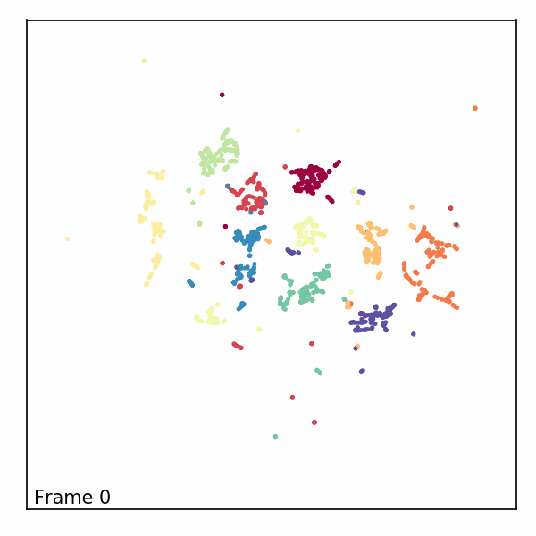

How to use AlignedUMAP
======================

It may happen that it would be beneficial to have different UMAP
embeddings aligned with each other. There are several ways to go about
doing this. One simple approach is to simply embed each dataset with
UMAP independently and then solve for a `Procrustes
transformation <https://en.wikipedia.org/wiki/Procrustes_transformation>`__
on shared points. An alternative approach is to embed the first dataset
and then construct an initial embedding for the second dataset based on
locations of shared points in the first embedding and then go from
there. A third approach, which will provide better alignments in
general, is to optimize both embeddings at the same time with some form
of constraint as to how far shared points can take different locations
in different embeddings *during* the optimization. This last option is
possible, but is not easily tractable to implement yourself (unlike the
first two options). To remedy this issue it has been implemented as a
separate model class in ``umap-learn`` called ``AlignedUMAP``. The
resulting class is quite flexible, but here we will walk through simple
usage on some basic (and somewhat contrived) data just to demonstrate
how to get it running on data.

.. code:: python3

    import numpy as np
    import sklearn.datasets
    import umap
    import umap.plot
    import umap.utils as utils
    import umap.aligned_umap
    import matplotlib.pyplot as plt

For our demonstration we’ll just use the pendigits dataset from sklearn.

.. code:: python3

    digits = sklearn.datasets.load_digits()

To make a sequence of datasets with some shared points between each
different dataset we’ll first sort the data so we have some vaguely
sensible progression. In this case we’ll sort by the total amount of
“ink” in the handwritten digit. This isn’t meant to be meaningful, it is
merely meant to provide something useful to slicing into overlapping
chunks that we will want to embed separately and yet keep aligned.

.. code:: python3

    ordered_digits = digits.data[np.argsort(digits.data.sum(axis=1))]
    ordered_target = digits.target[np.argsort(digits.data.sum(axis=1))]
    plt.matshow(ordered_digits[-1].reshape((8,8)))

.. image:: images/aligned_umap_basic_usage_5_1.png

We can then divide up the dataset into slices of 400 samples, moving
along in chunks of 150 to ensure that there are overlaps between
consecutive slices. This will give us a list of ten different datasets
that we can embed, with the goal being to ensure that the positions of
points in the embeddings are relatively consistent.

.. code:: python3

    slices = [ordered_digits[150 * i:min(ordered_digits.shape[0], 150 * i + 400)] for i in range(10)]

To ensure that consistency ``AlignedUMAP`` will need more information
than *just* the datasets – we also need some information about how the
datasets relate to one another. These take the form of dictionaries that
relate the indices of one dataset to the indices of another. Currently
``AlignedUMAP`` only supports sequences of datasets with relations
between each consecutive pair in the sequence. To construct the
relations for this dataset we note that the last 250 samples of one
dataset are going to be the same samples as the first 250 samples of the
next dataset – this makes it easy to construct the dictionary: it is
mapping

::

   150 --> 0
   151 --> 1
   ...
   398 --> 248
   399 --> 249

which we can construct easily using a dictionary comprehension. We will
have the same relation between each consecutive pair, so to make the
list of relations between pairs we can just duplicate the constructed
relation the requisite number of times.

.. code:: python3

    relation_dict = {i+150:i for i in range(400-150)}
    relation_dicts = [relation_dict.copy() for i in range(len(slices) - 1)]

Note that while in this case the relation defines a map between
identical samples in different datasets it can be much more general –
see the politics example later for a case where the relation is
constructed from external information (representatives names and
states).

Now that we have both a list of data slices and a list of relations
between the consecutive pairs we can use the ``AlignedUMAP`` class to
generate a list of embeddings. The ``AlignedUMAP`` class takes most of
the parameters that UMAP accepts. The major difference is that the fit
method requires a *list* of datasets, and a keyword argument
``relations`` that specifies the relation dictionaries between
consecutive pairs of datasets. Other than that things are essentially
push-button.

.. code:: python3

    %%time
    aligned_mapper = umap.AlignedUMAP().fit(slices, relations=relation_dicts)

.. parsed-literal::

    CPU times: user 57.4 s, sys: 8.43 s, total: 1min 5s
    Wall time: 57.4 s

You will note that this took a non-trivial amount of time to run,
despite being on the relatively small pendigits dataset. This is because
we are completing 10 different UMAP embeddings at once, so on average we
are taking about five seconds per embedding, which is more reasonable –
the alignment does have overhead cost however.

The next step is to look at the results. To ensure that the plots we
produce have a consistent x and y axis we’ll use a small function to
compute a set of axis bounds for plotting.

.. code:: python3

    def axis_bounds(embedding):
        left, right = embedding.T[0].min(), embedding.T[0].max()
        bottom, top = embedding.T[1].min(), embedding.T[1].max()
        adj_h, adj_v = (right - left) * 0.1, (top - bottom) * 0.1
        return [left - adj_h, right + adj_h, bottom - adj_v, top + adj_v]

Now it is just a matter of plotting the results in ten different scatter
plots. We can do this most easily with matplotlib directly, setting up a
grid of plots. Note that the progression proceeds by row then column, so
read the progression as if you were reading a page of text (across, then
down).

.. code:: python3

    fig, axs = plt.subplots(5,2, figsize=(10, 20))
    ax_bound = axis_bounds(np.vstack(aligned_mapper.embeddings_))
    for i, ax in enumerate(axs.flatten()):
        current_target = ordered_target[150 * i:min(ordered_target.shape[0], 150 * i + 400)]
        ax.scatter(*aligned_mapper.embeddings_[i].T, s=2, c=current_target, cmap="Spectral")
        ax.axis(ax_bound)
        ax.set(xticks=[], yticks=[])
    plt.tight_layout()

.. image:: images/aligned_umap_basic_usage_15_0.png

So despite being different embeddings on different datasets, the
clusters keep their general alignment – the top left plot and bottom
right plot have the same rough positions for specific digit clusters. We
can also, to a degree, see how the structure changes over the course of
the different slices. Thus we are keeping the various embeddings
aligned, but allowing the changes dictated by the differing structures
of each different slice of data.

Online updating of aligned embeddings
-------------------------------------

It may be the case that we have incoming temporal data and would like to
have embeddings of time-windows that, ideally, align with the embeddings
of prior time-windows. As long as we overlap the time-windows we use to
allow for relations between time windows then this is possible – except
that the previous code required all the time-windows to be input *at
once* for fitting. We would instead like to train an initial model and
then update it as we go. This is possible via the ``update`` method
which we’ll demonstrate below.

First we need to fit a base ``AlignedUMAP`` model; we’ll use the first
two slices and the first relation dict to do so.

.. code:: python3

    %%time
    updating_mapper = umap.AlignedUMAP().fit(slices[:2], relations=relation_dicts[:1])

.. parsed-literal::

    CPU times: user 9.32 s, sys: 1.47 s, total: 10.8 s
    Wall time: 9.17 s

Note that this is fairly quick, since we are only fitting two slices.
Given the trained model the update method requires a new slice of data
to add, along with a relation dictionary (passed in with the
``relations`` keyword argument as with ``fit``). This will append a new
embedding to the ``embeddings_`` attribute of the model for the new
data, aligned with what has been seen so far.

.. code:: python3

    for i in range(2,len(slices)):
        %time updating_mapper.update(slices[i], relations={v:k for k,v in relation_dicts[i-1].items()})

.. parsed-literal::

    CPU times: user 7.78 s, sys: 1.15 s, total: 8.93 s
    Wall time: 7.92 s
    CPU times: user 6.64 s, sys: 1.17 s, total: 7.81 s
    Wall time: 6.6 s
    CPU times: user 6.94 s, sys: 1.17 s, total: 8.11 s
    Wall time: 6.81 s
    CPU times: user 6.45 s, sys: 1.51 s, total: 7.96 s
    Wall time: 6.45 s
    CPU times: user 7.44 s, sys: 1.32 s, total: 8.76 s
    Wall time: 7.16 s
    CPU times: user 7.68 s, sys: 1.73 s, total: 9.41 s
    Wall time: 7.59 s
    CPU times: user 7.88 s, sys: 1.65 s, total: 9.54 s
    Wall time: 7.39 s
    CPU times: user 7.82 s, sys: 1.98 s, total: 9.8 s
    Wall time: 7.7 s

Note that each new slice takes a relatively short period of time, as we
might hope. The downside of this, as you can imagine, is that we have no
“forward” relations – the windows over slices only look backward. This
means the results are less good, but we are trading that for the ability
to quickly and easily update as we go.

We can look at how we did using essentially the same code as before.

.. code:: python3

    fig, axs = plt.subplots(5,2, figsize=(10, 20))
    ax_bound = axis_bounds(np.vstack(updating_mapper.embeddings_))
    for i, ax in enumerate(axs.flatten()):
        current_target = ordered_target[150 * i:min(ordered_target.shape[0], 150 * i + 400)]
        ax.scatter(*updating_mapper.embeddings_[i].T, s=2, c=current_target, cmap="Spectral")
        ax.axis(ax_bound)
        ax.set(xticks=[], yticks=[])
    plt.tight_layout()

.. image:: images/aligned_umap_basic_usage_22_0.png

We see that the alignment is indeed working, so new slices remain
comparable with previously trained slices. As noted the overall
alignments and progression is not as nice as the previous version, but
it does have the significant benefit of allowing an update as you go
approach.

Note that right now this model keeps all the previous data, so it will
only really work in a batch streaming approach where occasionally a
fresh model is trained, dropping some of the historical data before
continuing with updates.

Aligning varying parameters
---------------------------

It is possible to align UMAP embedding that vary in the parameters used
instead of the data. To demonstrate how this can work we’ll continue to
use the pendigits dataset, but instead of slicing the data as we did
before, we’ll use the full dataset. That means that our relations
between datasets are simply constant relations. We can construct those
ahead of time:

.. code:: python3

    constant_dict = {i:i for i in range(digits.data.shape[0])}
    constant_relations = [constant_dict for i in range(9)]

To run AlignedUMAP over a range of parameters you simply need to pass in
a *list* of the sequence of parameters you wish to use. You can do this
for several different parameters – just ensure that all the lists are
the same length! In this case we’ll try looking at how the embeddings
change if we change ``n_neighbors`` and ``min_dist``. This means that
when we create the AlignedUMAP object we pass a list, instead of a
single value, to each of those parameters. To make the visualization a
little more interesting we’ll also vary some of the alignment parameters
(there are only two of major consequence). Specifically we’ll adjust the
``alignment_window_size``, which controls how far forward and backward
across the datasets we look when doing alignment, and the
``alignment_regularisation`` which controls how heavily we weight the
alignment aspect versus the UMAP layout. Larger values of
``alignment_regularisation`` will work harder to keep points aligned
across embeddings (at the cost of the embedding quality at each slice),
while smaller values will allow the optimisation to focus more on the
individual embeddings and put less emphasis on aligning the embeddings
with each other.

Given a model we can then fit it. As before we need to hand it a list of
datasets, and a list of relations. Since we are using the same data each
time (and varying the parameters) we can just repeat the full pendigits
dataset. Note that the number of datasets needs to match the number of
parameter values being used. The same goes for the number of relations
(one less than the number of parameter values).

.. code:: python3

    neighbors_mapper = umap.AlignedUMAP(
        n_neighbors=[3,4,5,7,11,16,22,29,37,45,54],
        min_dist=[0.01,0.05,0.1,0.15,0.2,0.25,0.3,0.35,0.4,0.45],
        alignment_window_size=2,
        alignment_regularisation=1e-3,
    ).fit(
        [digits.data for i in range(10)], relations=constant_relations
    )

As before we can look at the results by plotting each of the embeddings.

.. code:: python3

    fig, axs = plt.subplots(5,2, figsize=(10, 20))
    ax_bound = axis_bounds(np.vstack(neighbors_mapper.embeddings_))
    for i, ax in enumerate(axs.flatten()):
        ax.scatter(*neighbors_mapper.embeddings_[i].T, s=2, c=digits.target, cmap="Spectral")
        ax.axis(ax_bound)
        ax.set(xticks=[], yticks=[])
    plt.tight_layout()

.. image:: images/aligned_umap_basic_usage_29_1.png

To get a better feel for the evolution of the embedding over the change
in parameter values we can plot the data in three dimensions, with the
third dimension being the parameter value chosen. To better show how
data points in the embedding *move* with respect to the changing
parameters we can plot them not as points, but as *curves* connecting
the same point in each sequential embedding. For three dimensional plots
like this we’ll make use of the `plotly <https://plotly.com>`__ plotting
library.

.. code:: python3

    import plotly.graph_objects as go
    import plotly.express as px
    import pandas as pd

The first thing we’ll have to do is wrangle the data into a suitable
format for plotly. That’s the reason we loaded up pandas as well –
plotly likes dataframes. This involves stacking all the embeddings
together, and then assigning an extra ``z`` value according to which
embedding we are in. For the purposes of visualization we’ll just have a
linear scale from 0 to 1 of the appropriate length for the z
coordinates.

.. code:: python3

    n_embeddings = len(neighbors_mapper.embeddings_)
    es = neighbors_mapper.embeddings_
    embedding_df = pd.DataFrame(np.vstack(es), columns=('x', 'y'))
    embedding_df['z'] = np.repeat(np.linspace(0, 1.0, n_embeddings), es[0].shape[0])
    embedding_df['id'] = np.tile(np.arange(es[0].shape[0]), n_embeddings)
    embedding_df['digit'] = np.tile(digits.target, n_embeddings)

The next thing we can do to improve the visualization is to smooth out
the curves rather than leaving them as piecewise linear lines. To to
this we can use the ``scipy.interpolate`` functionality to create smooth
cubic splines that pass through all the points of the curve we wish to
create.

.. code:: python3

    import scipy.interpolate

The interpolate module has a function ``interp1d`` that generates a
(vector of) smooth function given a one dimensional set of datapoints
that it needs to pass through. We can generate separate functions for
the x and y coordinates for each pendigit sample, allowing us to
generate smooth curves in three dimensions.

.. code:: python3

    fx = scipy.interpolate.interp1d(
        embedding_df.z[embedding_df.id == 0], embedding_df.x.values.reshape(n_embeddings, digits.data.shape[0]).T, kind="cubic"
    )
    fy = scipy.interpolate.interp1d(
        embedding_df.z[embedding_df.id == 0], embedding_df.y.values.reshape(n_embeddings, digits.data.shape[0]).T, kind="cubic"
    )
    z = np.linspace(0, 1.0, 100)

With that in hand it is just a matter of plotting all the curves. In
plotly parlance each curve is a “trace” and we generate each one
separately (along with a suitable colour given by the digit the sample
represents). We then add all the traces to a figure, and display the
figure.

.. code:: python3

    palette = px.colors.diverging.Spectral
    interpolated_traces = [fx(z), fy(z)]
    traces = [
        go.Scatter3d(
            x=interpolated_traces[0][i], 
            y=interpolated_traces[1][i], 
            z=z*3.0, 
            mode="lines",
            line=dict(
                color=palette[digits.target[i]],
                width=3.0
            ),
            opacity=1.0,
        )
        for i in range(digits.data.shape[0])
    ]
    fig = go.Figure(data=traces)
    fig.update_layout(
        width=800,
        height=700,
        autosize=False,
        showlegend=False,
    )
    fig.show()

Since it is tricky to get the interactive plotly figure embedded in
documentation we have a static image here, but if you run this yourself
you will have a fully interactive view of the data.

Alternatively, we can visualize the third dimension as an evolution of the
embeddings through time by rendering each z-slice as a frame in an animated
GIF. To do this, we'll first need to import some notebook display tools and
matplotlib's `animation <https://matplotlib.org/stable/api/animation_api.html>`_
module.

.. code:: python3

    from IPython.display import display, Image, HTML
    from matplotlib import animation

Next, we'll create a new figure, initialize a blank scatter plot, then use
``FuncAnimation`` to update the point positions (called "offsets") one frame at
a time.

.. code:: python3

    fig = plt.figure(figsize=(4, 4), dpi=150)
    ax = fig.add_subplot(1, 1, 1)

    scat = ax.scatter([], [], s=2)
    scat.set_array(digits.target)
    scat.set_cmap('Spectral')
    text = ax.text(ax_bound[0] + 0.5, ax_bound[2] + 0.5, '')
    ax.axis(ax_bound)
    ax.set(xticks=[], yticks=[])
    plt.tight_layout()

    offsets = np.array(interpolated_traces).T
    num_frames = offsets.shape[0]

    def animate(i):
        scat.set_offsets(offsets[i])
        text.set_text(f'Frame {i}')
        return scat

    anim = animation.FuncAnimation(
        fig,
        init_func=None,
        func=animate,
        frames=num_frames,
        interval=40)

Then we can save the animation as a GIF and close our animation. Depending on
your machine, you may need to change which writer the save method uses.

.. code:: python3

    anim.save("aligned_umap_pendigits_anim.gif", writer="pillow")
    plt.close(anim._fig)

Finally, we can read in our rendered GIF and display it in the notebook.

.. code:: python3

    with open("aligned_umap_pendigits_anim.gif", "rb") as f:
        display(Image(f.read()))

