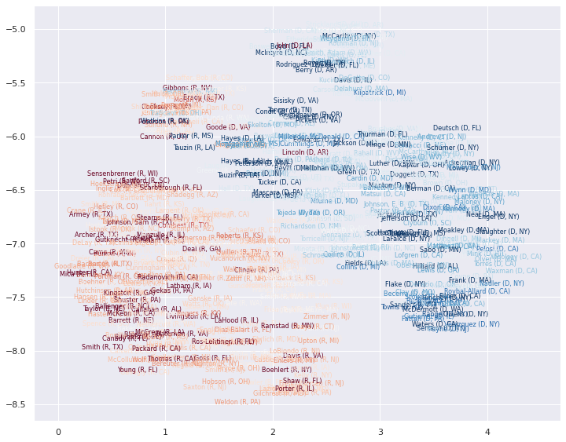
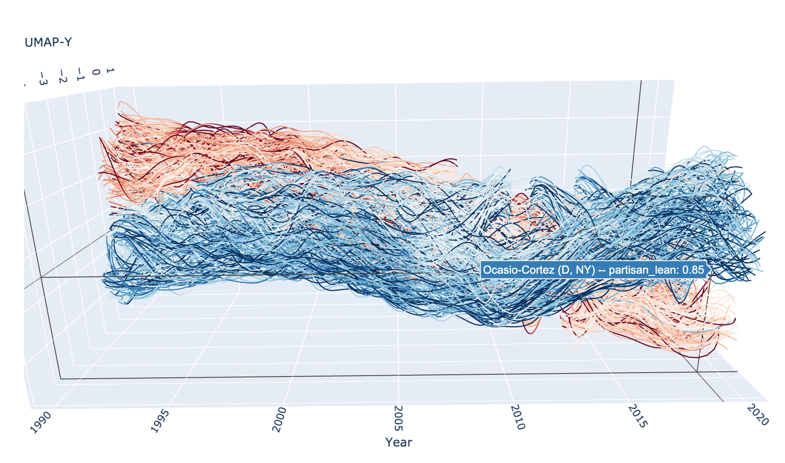

AlignedUMAP for Time Varying Data
=================================

It is not uncommon to have datasets that can be partitioned into
segments, often with respect to time, where we want to understand not
only the structure of each segment, but how that structure changes over
the different segments. An example of this is the relative political
leanings of the US congress over time. In determining the relative
political leanings we can look at the representatives voting record on
roll call votes, with the presumption that representatives with similar
political principles will have similar voting records. We can, of
course, look at such data for any given congress, but since
representatives are commonly re-elected we can also consider how their
relative position in congress changes with time – an ideal use case for
AlignedUMAP.

First we’ll need a selection of libraries. Aside from UMAP we will need
to do a little bit of data wrangling; for that we’ll need pandas, and
also for matching up names of representatives we’ll make use of the
library ``fuzzywuzzy`` which provides easy to use fuzzy string matching.

.. code:: python3

    import umap
    import umap.utils as utils
    import umap.aligned_umap
    import sklearn.decomposition
    
    import pandas as pd
    import numpy as np
    
    import matplotlib.pyplot as plt
    import seaborn as sns
    
    from fuzzywuzzy import fuzz, process
    import re

.. code:: python3

    sns.set(style="darkgrid", color_codes=True)

Next we’ll need to voting records for the representatives, along with
the associated metadata from the roll call vote records. You can obtain
the data https://clerk.house.gov; a notebook demonstrating how to pull
down the data and parse it into the csv files used here is available
`here <https://github.com/lmcinnes/umap_doc_notebooks/blob/master/parse_voting_records.ipynb>`__.

Processing Congressional Voting Records
---------------------------------------

The voting records provide a row for each representative with a -1 for
“No”, 0 for “Present” or “Not Voting”, and 1 for “Aye”. A separate csv
file contains the raw data of all the votes with a row for each
legislators vote on each roll-call item. We really just need some
metadata – which state they represent and the party they represent so we
can decorate the results with this kind of information later. For that
we just need to extra the names, states, and parties for each year. We
can grab those columns and then drop duplicates. A catch: the party is
very occasionally entered incorrectly, and occasionally representatives
switch parties, making duplicated rows. We’ll just take the first entry
of such duplciates for now.

.. code:: python3

    votes = [pd.read_csv(f"house_votes/{year}_voting_record.csv", index_col=0).sort_index()
             for year in range(1990,2021)]
    metadata = [pd.read_csv(
        f"house_votes/{year}_full.csv", 
        index_col=0
    )[["legislator", "state", "party"]].drop_duplicates(["legislator", "state"]).sort_values('legislator') 
                for year in range(1990,2021)]

Let’s take a look at the voting record for a single year to see what
sort of data we are looking at:

.. code:: python3

    votes[5]

.. raw:: html

    

    
    <table border="1" class="dataframe">
      <thead>
        <tr style="text-align: right;">
          <th></th>
          <th>104-1st-1</th>
          <th>104-1st-10</th>
          <th>104-1st-100</th>
          <th>104-1st-101</th>
          <th>104-1st-102</th>
          <th>104-1st-103</th>
          <th>104-1st-104</th>
          <th>104-1st-105</th>
          <th>104-1st-106</th>
          <th>104-1st-107</th>
          <th>...</th>
          <th>104-1st-90</th>
          <th>104-1st-91</th>
          <th>104-1st-92</th>
          <th>104-1st-93</th>
          <th>104-1st-94</th>
          <th>104-1st-95</th>
          <th>104-1st-96</th>
          <th>104-1st-97</th>
          <th>104-1st-98</th>
          <th>104-1st-99</th>
        </tr>
        <tr>
          <th>legislator</th>
          <th></th>
          <th></th>
          <th></th>
          <th></th>
          <th></th>
          <th></th>
          <th></th>
          <th></th>
          <th></th>
          <th></th>
          <th></th>
          <th></th>
          <th></th>
          <th></th>
          <th></th>
          <th></th>
          <th></th>
          <th></th>
          <th></th>
          <th></th>
          <th></th>
        </tr>
      </thead>
      <tbody>
        <tr>
          <th>Abercrombie</th>
          <td>0.0</td>
          <td>1.0</td>
          <td>-1.0</td>
          <td>-1.0</td>
          <td>-1.0</td>
          <td>-1.0</td>
          <td>1.0</td>
          <td>1.0</td>
          <td>-1.0</td>
          <td>1.0</td>
          <td>...</td>
          <td>-1.0</td>
          <td>-1.0</td>
          <td>1.0</td>
          <td>-1.0</td>
          <td>1.0</td>
          <td>-1.0</td>
          <td>-1.0</td>
          <td>1.0</td>
          <td>1.0</td>
          <td>1.0</td>
        </tr>
        <tr>
          <th>Ackerman</th>
          <td>0.0</td>
          <td>1.0</td>
          <td>-1.0</td>
          <td>1.0</td>
          <td>-1.0</td>
          <td>-1.0</td>
          <td>1.0</td>
          <td>1.0</td>
          <td>-1.0</td>
          <td>1.0</td>
          <td>...</td>
          <td>1.0</td>
          <td>-1.0</td>
          <td>-1.0</td>
          <td>1.0</td>
          <td>1.0</td>
          <td>-1.0</td>
          <td>-1.0</td>
          <td>1.0</td>
          <td>1.0</td>
          <td>1.0</td>
        </tr>
        <tr>
          <th>Allard</th>
          <td>0.0</td>
          <td>1.0</td>
          <td>1.0</td>
          <td>1.0</td>
          <td>-1.0</td>
          <td>1.0</td>
          <td>-1.0</td>
          <td>-1.0</td>
          <td>1.0</td>
          <td>-1.0</td>
          <td>...</td>
          <td>-1.0</td>
          <td>-1.0</td>
          <td>-1.0</td>
          <td>-1.0</td>
          <td>1.0</td>
          <td>1.0</td>
          <td>1.0</td>
          <td>1.0</td>
          <td>0.0</td>
          <td>-1.0</td>
        </tr>
        <tr>
          <th>Andrews</th>
          <td>0.0</td>
          <td>1.0</td>
          <td>0.0</td>
          <td>-1.0</td>
          <td>-1.0</td>
          <td>1.0</td>
          <td>-1.0</td>
          <td>0.0</td>
          <td>0.0</td>
          <td>0.0</td>
          <td>...</td>
          <td>-1.0</td>
          <td>1.0</td>
          <td>-1.0</td>
          <td>-1.0</td>
          <td>1.0</td>
          <td>1.0</td>
          <td>-1.0</td>
          <td>1.0</td>
          <td>-1.0</td>
          <td>-1.0</td>
        </tr>
        <tr>
          <th>Archer</th>
          <td>0.0</td>
          <td>1.0</td>
          <td>1.0</td>
          <td>-1.0</td>
          <td>-1.0</td>
          <td>1.0</td>
          <td>-1.0</td>
          <td>-1.0</td>
          <td>1.0</td>
          <td>-1.0</td>
          <td>...</td>
          <td>-1.0</td>
          <td>-1.0</td>
          <td>-1.0</td>
          <td>-1.0</td>
          <td>-1.0</td>
          <td>1.0</td>
          <td>1.0</td>
          <td>1.0</td>
          <td>-1.0</td>
          <td>0.0</td>
        </tr>
        <tr>
          <th>...</th>
          <td>...</td>
          <td>...</td>
          <td>...</td>
          <td>...</td>
          <td>...</td>
          <td>...</td>
          <td>...</td>
          <td>...</td>
          <td>...</td>
          <td>...</td>
          <td>...</td>
          <td>...</td>
          <td>...</td>
          <td>...</td>
          <td>...</td>
          <td>...</td>
          <td>...</td>
          <td>...</td>
          <td>...</td>
          <td>...</td>
          <td>...</td>
        </tr>
        <tr>
          <th>Young (AK)</th>
          <td>0.0</td>
          <td>1.0</td>
          <td>1.0</td>
          <td>1.0</td>
          <td>-1.0</td>
          <td>1.0</td>
          <td>-1.0</td>
          <td>-1.0</td>
          <td>1.0</td>
          <td>-1.0</td>
          <td>...</td>
          <td>-1.0</td>
          <td>-1.0</td>
          <td>-1.0</td>
          <td>-1.0</td>
          <td>-1.0</td>
          <td>1.0</td>
          <td>1.0</td>
          <td>1.0</td>
          <td>-1.0</td>
          <td>-1.0</td>
        </tr>
        <tr>
          <th>Young (FL)</th>
          <td>0.0</td>
          <td>1.0</td>
          <td>1.0</td>
          <td>-1.0</td>
          <td>-1.0</td>
          <td>1.0</td>
          <td>-1.0</td>
          <td>-1.0</td>
          <td>1.0</td>
          <td>-1.0</td>
          <td>...</td>
          <td>-1.0</td>
          <td>-1.0</td>
          <td>-1.0</td>
          <td>-1.0</td>
          <td>-1.0</td>
          <td>1.0</td>
          <td>1.0</td>
          <td>1.0</td>
          <td>-1.0</td>
          <td>-1.0</td>
        </tr>
        <tr>
          <th>Zeliff</th>
          <td>0.0</td>
          <td>1.0</td>
          <td>1.0</td>
          <td>-1.0</td>
          <td>-1.0</td>
          <td>1.0</td>
          <td>-1.0</td>
          <td>-1.0</td>
          <td>1.0</td>
          <td>-1.0</td>
          <td>...</td>
          <td>-1.0</td>
          <td>-1.0</td>
          <td>-1.0</td>
          <td>-1.0</td>
          <td>-1.0</td>
          <td>1.0</td>
          <td>1.0</td>
          <td>1.0</td>
          <td>-1.0</td>
          <td>-1.0</td>
        </tr>
        <tr>
          <th>Zimmer</th>
          <td>0.0</td>
          <td>1.0</td>
          <td>1.0</td>
          <td>-1.0</td>
          <td>-1.0</td>
          <td>1.0</td>
          <td>-1.0</td>
          <td>-1.0</td>
          <td>1.0</td>
          <td>-1.0</td>
          <td>...</td>
          <td>-1.0</td>
          <td>1.0</td>
          <td>-1.0</td>
          <td>-1.0</td>
          <td>-1.0</td>
          <td>1.0</td>
          <td>1.0</td>
          <td>1.0</td>
          <td>-1.0</td>
          <td>-1.0</td>
        </tr>
        <tr>
          <th>de la Garza</th>
          <td>0.0</td>
          <td>1.0</td>
          <td>1.0</td>
          <td>1.0</td>
          <td>-1.0</td>
          <td>1.0</td>
          <td>1.0</td>
          <td>1.0</td>
          <td>-1.0</td>
          <td>1.0</td>
          <td>...</td>
          <td>0.0</td>
          <td>-1.0</td>
          <td>-1.0</td>
          <td>1.0</td>
          <td>1.0</td>
          <td>-1.0</td>
          <td>1.0</td>
          <td>1.0</td>
          <td>-1.0</td>
          <td>1.0</td>
        </tr>
      </tbody>
    </table>
    
438 rows × 885 columns

    

We can examine the associated metadata for the same year.

.. code:: python3

    metadata[5]

.. raw:: html

    

    
    <table border="1" class="dataframe">
      <thead>
        <tr style="text-align: right;">
          <th></th>
          <th>legislator</th>
          <th>state</th>
          <th>party</th>
        </tr>
      </thead>
      <tbody>
        <tr>
          <th>0</th>
          <td>Abercrombie</td>
          <td>HI</td>
          <td>D</td>
        </tr>
        <tr>
          <th>1</th>
          <td>Ackerman</td>
          <td>NY</td>
          <td>D</td>
        </tr>
        <tr>
          <th>2</th>
          <td>Allard</td>
          <td>CO</td>
          <td>R</td>
        </tr>
        <tr>
          <th>3</th>
          <td>Andrews</td>
          <td>NJ</td>
          <td>D</td>
        </tr>
        <tr>
          <th>4</th>
          <td>Archer</td>
          <td>TX</td>
          <td>R</td>
        </tr>
        <tr>
          <th>...</th>
          <td>...</td>
          <td>...</td>
          <td>...</td>
        </tr>
        <tr>
          <th>430</th>
          <td>Young (AK)</td>
          <td>AK</td>
          <td>R</td>
        </tr>
        <tr>
          <th>431</th>
          <td>Young (FL)</td>
          <td>FL</td>
          <td>R</td>
        </tr>
        <tr>
          <th>432</th>
          <td>Zeliff</td>
          <td>NH</td>
          <td>R</td>
        </tr>
        <tr>
          <th>433</th>
          <td>Zimmer</td>
          <td>NJ</td>
          <td>R</td>
        </tr>
        <tr>
          <th>89</th>
          <td>de la Garza</td>
          <td>TX</td>
          <td>D</td>
        </tr>
      </tbody>
    </table>
    
438 rows × 3 columns

    

You may note that sometimes representatives names list a state in
parenthesis afterwards. This is to provide disambiguation for
representatives that happen to have the last name. This actually
complicates matters for us since the disambiguation is only applied in
those cases where there is a name collision in that sitting of congress.
That means that for several years a representative may have simply their
last name, but then switch to being disambiguated, before potentially
switching back again. This would make it much harder to consistently
treck representatives over their entire career in congress. To fix this
up we’ll simply re-index by a unique representative ID that has their
last name, party, and state all listed over all the voting dataframes.
We’ll need a function to generate those from the metadata, and then
we’ll need to apply it to all the reocrds. Importantly we’ll have to
finesse those situations where representatives are listed twice (under
un-ambiguous and disambiguated names) with some groupby tricks.

.. code:: python3

    def unique_legislator(row):
        name, state, party = row.legislator, row.state, row.party
        # Strip of disambiguating state designators
        if re.search(r'(\w+) \([A-Z]{2}\)', name) is not None:
            name = name[:-5]
        return f"{name} ({party}, {state})"

.. code:: python3

    for i, _ in enumerate(votes):
        votes[i].index = pd.Index(metadata[i].apply(unique_legislator, axis=1), name="legislator_index")
        votes[i] = votes[i].groupby(level=0).sum()
        metadata[i].index = pd.Index(metadata[i].apply(unique_legislator, axis=1), name="legislator_index")
        metadata[i] = metadata[i].groupby(level=0).first()

Now that we have the data at least a little wrangled into order there is
the question of ensuring some degree of continuity fore representatives.
To make this a little easier we’ll use voting records over *four year
spans* instead of over single years. Equally importantly we’ll do this
in a sliding window fashion so that we consider the record for 1990-1994
and then the record for 1991-1995 and so on. By overlapping the windows
in this way we can ensure a little greater continuity of political
stance through the years. To make this happen we just have to merge data
frames in a sliding set of pairs, and then merge the pairs via the same
approach:

.. code:: python3

    votes = [
        pd.merge(
            v1, v2, how="outer", on="legislator_index"
        ).fillna(0.0).sort_index()
        for v1, v2 in zip(votes[:-1], votes[1:])
    ] + votes[-1:]
    
    metadata = [
        pd.concat([m1, m2]).groupby("legislator_index").first().sort_index()
        for m1, m2 in zip(metadata[:-1], metadata[1:])
    ] + metadata[-1:]

That’s the pairs of years; now we merge these pairwise to get sets of
four years worth of votes.

.. code:: python3

    votes = [
        pd.merge(
            v1, v2, how="outer", on="legislator_index"
        ).fillna(0.0).sort_index()
        for v1, v2 in zip(votes[:-1], votes[1:])
    ] + votes[-1:]
    
    metadata = [
        pd.concat([m1, m2]).groupby(level=0).first().sort_index()
        for m1, m2 in zip(metadata[:-1], metadata[1:])
    ] + metadata[-1:]

Applying AlignedUMAP
--------------------

To make use of AlignedUMAP we need to generate relations between
consecutive dataset slices. In this case that means we need to have a
relation describing row from one four year slice corresponds to a row
from the following four year slice for the same representative. For
AlignedUMAP to work this should be formatted as a list of dictionaries;
each dictionary gives a mapping from indices of one slice to indices of
the next. Importantly this mapping can be partial – it only has to
relate indices for which there is a match between the two slices.

The vote dataframes that we are using for slices are already indexed
with unique identifiers for representatives, so to make relations we
simply have to match them up, creating a dictionary of indices from one
to the other. In practice we can do this relatively efficiently by using
pandas to merge dataframes on the pandas indexes of the two vote
dataframes with the data being simply the numeric indices of the rows.
The resulting dictionary is then just the dictionary of pairs given by
the inner join.

.. code:: python3

    def make_relation(from_df, to_df):
        left = pd.DataFrame(data=np.arange(len(from_df)), index=from_df.index)
        right = pd.DataFrame(data=np.arange(len(to_df)), index=to_df.index)
        merge = pd.merge(left, right, left_index=True, right_index=True)
        return dict(merge.values)

With a function for relation creation in place we simply need to apply
it to each consecutive pair of vote dataframes.

.. code:: python3

    relations = [make_relation(x,y) for x, y in zip(votes[:-1], votes[1:])]

If you are still unsure of what these relations are it might be
beneficial to look at a few of the dictionaries, along with the
corresponding pairs of vote dataframes. Here is (part of) the first
relation dictionary:

.. code:: python3

    relations[0]

.. parsed-literal::

    {0: 0,
     1: 1,
     3: 2,
     4: 3,
     5: 4,
     6: 5,
     7: 6,
     8: 7,
     9: 8,
     10: 9,
     11: 10,
     12: 11,
     13: 12,
     14: 13,
     15: 14,
     ...
     475: 547,
     476: 549,
     477: 550,
     478: 552,
     479: 553,
     480: 554,
     481: 555,
     482: 556,
     483: 557,
     484: 559}

Now we are finally in a position to run AlignedUMAP. Most of the
standard UMAP parameters are available for use, including choosing a
metric and a number of neighbors. Here we will also make use of the
extra AlignedUMAP parameters ``alignment_regularisation`` and
``alignment_window_size``. The first is a value that weights how
important retaining alignment is. Typically the value is much smaller
than this (the default is 0.01), but given the relatively high
volatility in voting records we are going to increase it here. The
second parameter, ``alignment_window_size`` determines how far out on
either side AlignedUMAP will look when aligning embeddings – even though
the relations are specified only between consecutive slices it will
chain them together to construct relations reaching further. In this
case we’ll have it look as far out as 5 slices either side.

.. code:: python3

    %%time
    aligned_mapper = umap.aligned_umap.AlignedUMAP(
        metric="cosine",
        n_neighbors=20,
        alignment_regularisation=0.1, 
        alignment_window_size=5,
        n_epochs=200,
        random_state=42,
    ).fit(votes, relations=relations)
    embeddings = aligned_mapper.embeddings_

.. parsed-literal::

    CPU times: user 6min 7s, sys: 30.6 s, total: 6min 37s
    Wall time: 5min 57s

Visualizing the Results
-----------------------

Now we need to plot the data somehow. To make the visualization
interesting it would be beneficial to have some colour variation –
ideally showing a different view of the relative political stance. For
that we want to attempt to get an idea of the position of each candidate
from an alternative source. To do this we can try to extract the vote
margin that the representative won by. The catch here is that while the
election data can be collected and processed, the names don’t match
perfectly as they come from a different source. That means we need to do
our best to get a name match for each candidate. We’ll use fuzzy string
matching restricted to the relevant year and state to try to get a good
match. A notebook providing details for obtaining and processing the
election winners data can be found
`here <https://github.com/lmcinnes/umap_doc_notebooks/blob/master/voting_data_by_district.ipynb>`__.

.. code:: python3

    election_winners = pd.read_csv('election_winners_1976-2018.csv', index_col=0)
    election_winners.head()

.. raw:: html

    

    
    <table border="1" class="dataframe">
      <thead>
        <tr style="text-align: right;">
          <th></th>
          <th>year</th>
          <th>state</th>
          <th>district</th>
          <th>winner</th>
          <th>party</th>
          <th>winning_ratio</th>
        </tr>
      </thead>
      <tbody>
        <tr>
          <th>0</th>
          <td>1976</td>
          <td>AK</td>
          <td>0</td>
          <td>Don Young</td>
          <td>republican</td>
          <td>0.289986</td>
        </tr>
        <tr>
          <th>0</th>
          <td>1976</td>
          <td>AL</td>
          <td>1</td>
          <td>Jack Edwards</td>
          <td>republican</td>
          <td>0.374808</td>
        </tr>
        <tr>
          <th>0</th>
          <td>1976</td>
          <td>AL</td>
          <td>2</td>
          <td>William L. \\"Bill\"\" Dickinson"</td>
          <td>republican</td>
          <td>0.423953</td>
        </tr>
        <tr>
          <th>0</th>
          <td>1976</td>
          <td>AL</td>
          <td>3</td>
          <td>Bill Nichols</td>
          <td>democrat</td>
          <td>1.000000</td>
        </tr>
        <tr>
          <th>0</th>
          <td>1976</td>
          <td>AL</td>
          <td>4</td>
          <td>Tom Bevill</td>
          <td>democrat</td>
          <td>0.803825</td>
        </tr>
      </tbody>
    </table>
    

Now we need to simply go through the metadata and fill it out with the
extra information we can glean from the election winners data. Since we
can’t do exact name matching (the data for both is somewhat messy when
it comes to text fields like names) we can’t simply perform a join, but
must instead process things year by year and representative by
representative, finding the best string match on name that we can for
the given year and state election. In practice we are undoubtedly going
to get some of these wrong, and if the goal was a rigorous analysis
based on this data a lot more care would need to be taken. Since this is
just a demonstration and we’ll only be using this extra information as a
colour channel in plots we can excuise a few errors here and there from
in-exact data processing.

.. code:: python3

    n_name_misses = 0
    for year, df in enumerate(metadata, 1990):
        df["partisan_lean"] = 0.5
        df["district"] = np.full(len(df), -1, dtype=np.int8)
        for idx, (loc, row) in enumerate(df.iterrows()):
            name, state, party = row.legislator, row.state, row.party
            # Strip of disambiguating state designators
            if re.search(r'(\w+) \([A-Z]{2}\)', name) is not None:
                name = name[:-5]
            # Get a party designator matching the election_winners data
            party = "republican" if party == "R" else "democrat"
            # Restrict to the right state and time-frame
            state_election_winners = election_winners[(election_winners.state == state) 
                                                      & (election_winners.year <= year + 4)
                                                      & (election_winners.year >= year - 4)]
            # Try to match a name; and fail "gracefully"
            try:
                matched_name = process.extractOne(
                    name, 
                    state_election_winners.winner.tolist(),
                    scorer=fuzz.partial_token_sort_ratio,
                    score_cutoff=50,
                )
            except:
                matched_name = None
                
            # If we got a unique match, get the election data
            if matched_name is not None:
                winner = state_election_winners[state_election_winners.winner == matched_name[0]]
            else:
                winner = []
                
            # We either have none, one, or *several* match elections. Take a best guess.
            if len(winner) < 1:
                df.loc[loc, ["partisan_lean"]] = 0.25 if party == "republican" else 0.75
                n_name_misses += 1
            elif len(winner) > 1:
                df.iloc[idx, 4] = int(winner.district.values[-1])
                df.iloc[idx, 3] = float(winner.winning_ratio.values[-1])
            else:
                df.iloc[idx, 4] = int(winner.district.values)
                df.iloc[idx, 3] = float(winner.winning_ratio.values[0])
                
    print(f"Failed to match a name {n_name_misses} times")

.. parsed-literal::

    Failed to match a name 100 times

Now that we have the relative partisan leanings based on district
election margins we can color the plot. We can obviously label the plot
with the representatives names. The last remaining catch (when using
matplotlib for the plotting) is the get the plot bounds (since we will
be placing text markers directly into the plot, and thus not
autogenerating bounds). This is a simple enough matter of computing some
bounds as an adjustment a little outside the data limits.

.. code:: python3

    def axis_bounds(embedding):
        left = embedding.T[0].min()
        right = embedding.T[0].max()
        bottom = embedding.T[1].min()
        top = embedding.T[1].max()
        width = right - left
        height = top - bottom
        adj_h = width * 0.1
        adj_v = height * 0.05
        return [left - adj_h, right + adj_h, bottom - adj_v, top + adj_v]

Now for the plot. Let’s pick a random time slice (you are welcome to try
others) and draw the representatives names in their embedded locations
for that slice, coloured by their relative election victory margin.

.. code:: python3

    fig, ax = plt.subplots(figsize=(12,12))
    e = 5
    ax.axis(axis_bounds(embeddings[e]))
    ax.set_aspect('equal')
    for i in range(embeddings[e].shape[0]):
        ax.text(embeddings[e][i, 0],
                embeddings[e][i, 1],
                metadata[e].index.values[i],
                color=plt.cm.RdBu(np.float32(metadata[e]["partisan_lean"].values[i])), 
                fontsize=8,
                horizontalalignment='center',
                verticalalignment='center',
               )

This gives a good idea of the layout in a single time slices, and by
plotting different time slices we can get some idea of how things have
evolved. We can go further, however, by plotting a representative as
curve through time as their relative political position in congress
changes. For that we will need a 3D plot – we need both the UMAP x and y
coordinates, as well as a third coordinate giving the year. I found this
easiest to do in plotly, so let’s import that. To make nice smooth
curves through time we will also import the ``scipy.interpolate`` module
which will let is interpolate a smooth curve from the discrete positions
that a representatives appears in over time.

.. code:: python3

    import plotly.graph_objects as go
    import scipy.interpolate

Wrangling the data into shape for this is the next step; first let’s get
everything in a single dataframe that we can extract relevant data from
on an as-needed basis.

.. code:: python3

    df = pd.DataFrame(np.vstack(embeddings), columns=('x', 'y'))
    df['z'] = np.concatenate([[year] * len(embeddings[i]) for i, year in enumerate(range(1990, 2021))])
    df['representative_id'] = np.concatenate([v.index for v in votes])
    df['partisan_lean'] = np.concatenate([m["partisan_lean"].values for m in metadata])

Next we’ll need that interpolation of the curve for a given
representative. We’ll write a function to handle that as there is a
little bit of case-based logic that makes it non-trivial. We are going
to get handed year data and want to interpolate the UMAP x and y
coordinates for a single representative.

The first major catch is that many representatives don’t have a single
contiguous block of years for which they were in congress: they were
elected for several years, missed re-election, and then came back to
congress several years later (possibly in another district). Each such
block of contiguous years needs to be a separate path, and we shouldn’t
connect them. We therefore need some logic to find the contiguous blocks
and generate smooth paths for each of them.

Another catch is that some representatives have only been in office for
a year or two (special elections and so forth) and we can’t do a cubic
spline interpolation for that; we can devolve to linear interpolation or
quadratic splines for those cases, so simply add the point itself for
the odd single year cases.

With those issues in hand we can then simply use the scipy ``interp1d``
function to generate smooth curves through the points.

.. code:: python3

    INTERP_KIND = {2:"linear", 3:"quadratic", 4:"cubic"}
    
    def interpolate_paths(z, x, y, c, rep_id):
        consecutive_year_blocks = np.where(np.diff(z) != 1)[0] + 1
        z_blocks = np.split(z, consecutive_year_blocks)    
        x_blocks = np.split(x, consecutive_year_blocks)
        y_blocks = np.split(y, consecutive_year_blocks)  
        c_blocks = np.split(c, consecutive_year_blocks)
        
        paths = []
        
        for block_idx, zs in enumerate(z_blocks):
            
            text = f"{rep_id} -- partisan_lean: {np.mean(c_blocks[block_idx]):.2f}"
            
            if len(zs) > 1:
                kind = INTERP_KIND.get(len(zs), "cubic")
            else:
                paths.append(
                    (zs, x_blocks[block_idx], y_blocks[block_idx], c_blocks[block_idx], text)
                )
                continue
                
            z = np.linspace(np.min(zs), np.max(zs), 100)
            x = scipy.interpolate.interp1d(zs, x_blocks[block_idx], kind=kind)(z)
            y = scipy.interpolate.interp1d(zs, y_blocks[block_idx], kind=kind)(z)
            c = scipy.interpolate.interp1d(zs, c_blocks[block_idx], kind="linear")(z)
            
            paths.append((z, x, y, c, text))
            
        return paths

And now we can use plotly to draw the resulting curves. For plotly we
use the ``Scatter3D`` method, which supports a “lines” mode that can
draw curves in 3D space. We can colour the curves by the partisan lean
score we derived from the election data – in fact the colour can vary
through the trace as the election margins vary. Since this is a plotly
plot it is interactive, so you can rotate it around and view it from all
angles.

Unfortunately the interactive plotly plot does not embed into the documentation
well, so we present here a static image. If you run this yourself, however,
you will get the interactive version.

.. code:: python3

    traces = []
    for rep in df.representative_id.unique():
        z = df.z[df.representative_id == rep].values
        x = df.x[df.representative_id == rep].values
        y = df.y[df.representative_id == rep].values
        c = df.partisan_lean[df.representative_id == rep]
        
        for z, x, y, c, text in interpolate_paths(z, x, y, c, rep):
            trace = go.Scatter3d(
                x=x, y=z, z=y, 
                mode="lines",
                hovertext=text,
                hoverinfo="text",
                line=dict(
                    color=c,
                    cmin=0.0,
                    cmid=0.5,
                    cmax=1.0,
                    cauto=False,
                    colorscale="RdBu",
                    colorbar=dict(),
                    width=2.5,
                ),
                opacity=1.0,
            )
            traces.append(trace)
    
    fig = go.Figure(data=traces)
    fig.update_layout(
        width=800,
        height=600,
        scene=dict(
            aspectratio = dict( x=0.5, y=1.25, z=0.5 ),
            yaxis_title="Year",
            xaxis_title="UMAP-X",
            zaxis_title="UMAP-Y",
        ),
        scene_camera=dict(eye=dict( x=0.5, y=0.8, z=0.75 )),
        autosize=False,
        showlegend=False,
    )
    fig_widget = go.FigureWidget(fig)
    fig_widget

..
    .. raw:: html
       :file: aligned_umap_plotly_plot.html

This concludes our exploration for now.

