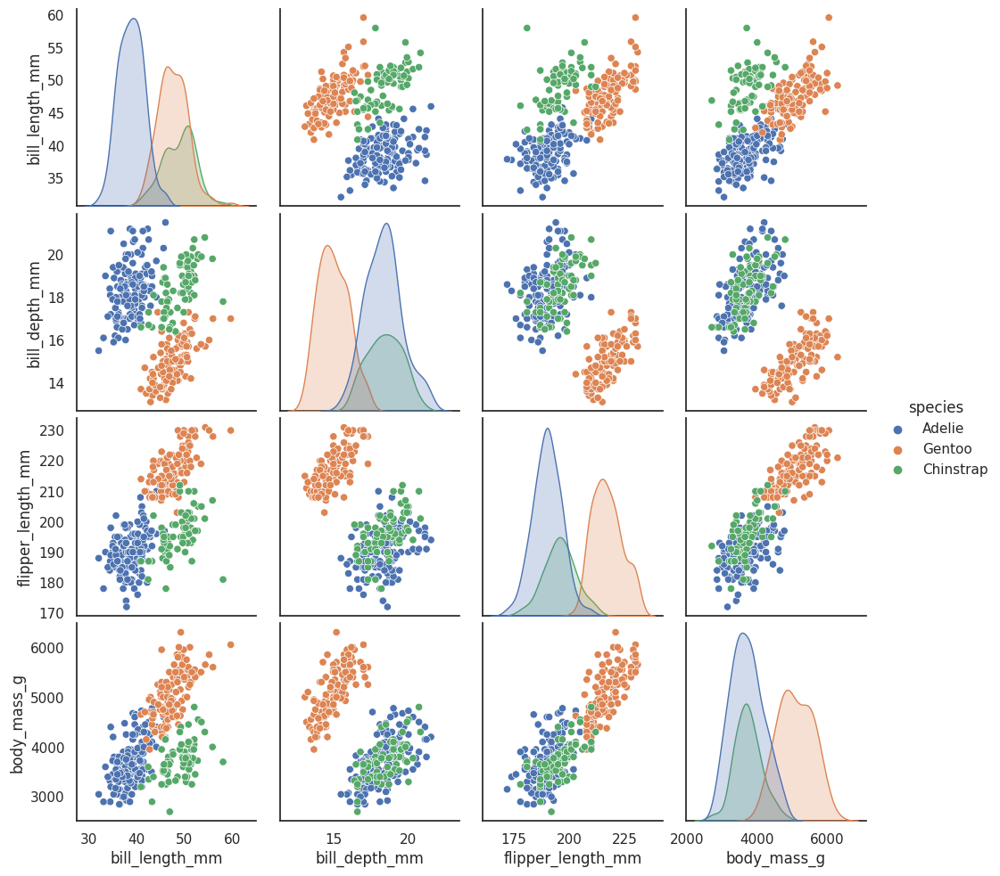

How to Use UMAP
===============

UMAP is a general purpose manifold learning and dimension reduction
algorithm. It is designed to be compatible with
`scikit-learn <http://scikit-learn.org/stable/index.html>`__, making use
of the same API and able to be added to sklearn pipelines. If you are
already familiar with sklearn you should be able to use UMAP as a drop
in replacement for t-SNE and other dimension reduction classes. If you
are not so familiar with sklearn this tutorial will step you through the
basics of using UMAP to transform and visualise data.

First we'll need to import a bunch of useful tools. We will need numpy
obviously, but we'll use some of the datasets available in sklearn, as
well as the ``train_test_split`` function to divide up data. Finally
we'll need some plotting tools (matplotlib and seaborn) to help us
visualise the results of UMAP, and pandas to make that a little easier.

.. code:: python3

    import numpy as np
    from sklearn.datasets import load_digits
    from sklearn.model_selection import train_test_split
    from sklearn.preprocessing import StandardScaler
    import matplotlib.pyplot as plt
    import seaborn as sns
    import pandas as pd
    %matplotlib inline

.. code:: python3

    sns.set(style='white', context='notebook', rc={'figure.figsize':(14,10)})

Penguin data
------------

.. image:: https://raw.githubusercontent.com/allisonhorst/palmerpenguins/c19a904462482430170bfe2c718775ddb7dbb885/man/figures/lter_penguins.png
   :width: 300px
   :align: center
   :alt: Penguins

The next step is to get some data to work with. To ease us into things
we'll start with the `penguin
dataset <https://github.com/allisonhorst/penguins>`__. It isn't very
representative of what real data would look like, but it is small both
in number of points and number of features, and will let us get an idea
of what the dimension reduction is doing.

.. code:: python3

    penguins = pd.read_csv("https://raw.githubusercontent.com/allisonhorst/palmerpenguins/c19a904462482430170bfe2c718775ddb7dbb885/inst/extdata/penguins.csv")
    penguins.head()

.. raw:: html

    

    
    <table border="1" class="dataframe">
      <thead>
        <tr style="text-align: right;">
          <th></th>
          <th>species</th>
          <th>island</th>
          <th>bill_length_mm</th>
          <th>bill_depth_mm</th>
          <th>flipper_length_mm</th>
          <th>body_mass_g</th>
          <th>sex</th>
          <th>year</th>
        </tr>
      </thead>
      <tbody>
        <tr>
          <th>0</th>
          <td>Adelie</td>
          <td>Torgersen</td>
          <td>39.1</td>
          <td>18.7</td>
          <td>181.0</td>
          <td>3750.0</td>
          <td>male</td>
          <td>2007</td>
        </tr>
        <tr>
          <th>1</th>
          <td>Adelie</td>
          <td>Torgersen</td>
          <td>39.5</td>
          <td>17.4</td>
          <td>186.0</td>
          <td>3800.0</td>
          <td>female</td>
          <td>2007</td>
        </tr>
        <tr>
          <th>2</th>
          <td>Adelie</td>
          <td>Torgersen</td>
          <td>40.3</td>
          <td>18.0</td>
          <td>195.0</td>
          <td>3250.0</td>
          <td>female</td>
          <td>2007</td>
        </tr>
        <tr>
          <th>3</th>
          <td>Adelie</td>
          <td>Torgersen</td>
          <td>NaN</td>
          <td>NaN</td>
          <td>NaN</td>
          <td>NaN</td>
          <td>NaN</td>
          <td>2007</td>
        </tr>
        <tr>
          <th>4</th>
          <td>Adelie</td>
          <td>Torgersen</td>
          <td>36.7</td>
          <td>19.3</td>
          <td>193.0</td>
          <td>3450.0</td>
          <td>female</td>
          <td>2007</td>
        </tr>
      </tbody>
    </table>
    

Since this is for demonstration purposes we will get rid of the NAs in
the data; in a real world setting one would wish to take more care with
proper handling of missing data.

.. code:: python3

    penguins = penguins.dropna()
    penguins.species.value_counts()

.. parsed-literal::

    Adelie       146
    Gentoo       119
    Chinstrap     68
    Name: species, dtype: int64

.. image:: https://github.com/allisonhorst/palmerpenguins/blob/c19a904462482430170bfe2c718775ddb7dbb885/man/figures/culmen_depth.png?raw=true
   :width: 300px
   :align: center
   :alt: Diagram of culmen measurements on a penguin

See the `github repostiory <https://github.com/allisonhorst/penguins>`__
for more details about the dataset itself. It consists of measurements
of bill (culmen) and flippers and weights of three species of penguins,
along with some other metadata about the penguins. In total we have 333
different penguins measured. Visualizing this data is a little bit
tricky since we can't plot in 4 dimensions easily. Fortunately four is
not that large a number, so we can just to a pairwise feature
scatterplot matrix to get an ideas of what is going on. Seaborn makes
this easy.

.. code:: python3

    sns.pairplot(penguins.drop("year", axis=1), hue='species');

This gives us some idea of what the data looks like by giving as all the
2D views of the data. Four dimensions is low enough that we can (sort
of) reconstruct what the full dimensional data looks like in our heads.
Now that we sort of know what we are looking at, the question is what
can a dimension reduction technique like UMAP do for us? By reducing the
dimension in a way that preserves as much of the structure of the data
as possible we can get a visualisable representation of the data
allowing us to "see" the data and its structure and begin to get some
intuition about the data itself.

To use UMAP for this task we need to first construct a UMAP object that
will do the job for us. That is as simple as instantiating the class. So
let's import the umap library and do that.

.. code:: python3

    import umap

.. code:: python3

    reducer = umap.UMAP()

Before we can do any work with the data it will help to clean up it a
little. We won't need NAs, we just want the measurement columns, and
since the measurements are on entirely different scales it will be
helpful to convert each feature into z-scores (number of standard
deviations from the mean) for comparability.

.. code:: python3

    penguin_data = penguins[
        [
            "bill_length_mm",
            "bill_depth_mm",
            "flipper_length_mm",
            "body_mass_g",
        ]
    ].values
    scaled_penguin_data = StandardScaler().fit_transform(penguin_data)

Now we need to train our reducer, letting it learn about the manifold.
For this UMAP follows the sklearn API and has a method ``fit`` which we
pass the data we want the model to learn from. Since, at the end of the
day, we are going to want to reduced representation of the data we will
use, instead, the ``fit_transform`` method which first calls ``fit`` and
then returns the transformed data as a numpy array.

.. code:: python3

    embedding = reducer.fit_transform(scaled_penguin_data)
    embedding.shape

.. parsed-literal::

    (333, 2)

The result is an array with 333 samples, but only two feature columns
(instead of the four we started with). This is because, by default, UMAP
reduces down to 2D. Each row of the array is a 2-dimensional
representation of the corresponding penguin. Thus we can plot the
``embedding`` as a standard scatterplot and color by the target array
(since it applies to the transformed data which is in the same order as
the original).

.. code:: python3

    plt.scatter(
        embedding[:, 0], 
        embedding[:, 1], 
        c=[sns.color_palette()[x] for x in penguins.species.map({"Adelie":0, "Chinstrap":1, "Gentoo":2})])
    plt.gca().set_aspect('equal', 'datalim')
    plt.title('UMAP projection of the Penguin dataset', fontsize=24);

.. image:: images/basic_usage_17_1.png

This does a useful job of capturing the structure of the data, and as
can be seen from the matrix of scatterplots this is relatively accurate.
Of course we learned at least this much just from that matrix of
scatterplots -- which we could do since we only had four different
dimensions to analyse. If we had data with a larger number of dimensions
the scatterplot matrix would quickly become unwieldy to plot, and far
harder to interpret. So moving on from the Penguin dataset, let's consider
the digits dataset.

Digits data
-----------

First we will load the dataset from sklearn.

.. code:: python3

    digits = load_digits()
    print(digits.DESCR)

.. parsed-literal::

    .. _digits_dataset:
    
    Optical recognition of handwritten digits dataset
    --------------------------------------------------
    
    **Data Set Characteristics:**
    
        :Number of Instances: 5620
        :Number of Attributes: 64
        :Attribute Information: 8x8 image of integer pixels in the range 0..16.
        :Missing Attribute Values: None
        :Creator: E. Alpaydin (alpaydin '@' boun.edu.tr)
        :Date: July; 1998
    
    This is a copy of the test set of the UCI ML hand-written digits datasets
    https://archive.ics.uci.edu/ml/datasets/Optical+Recognition+of+Handwritten+Digits
    
    The data set contains images of hand-written digits: 10 classes where
    each class refers to a digit.
    
    Preprocessing programs made available by NIST were used to extract
    normalized bitmaps of handwritten digits from a preprinted form. From a
    total of 43 people, 30 contributed to the training set and different 13
    to the test set. 32x32 bitmaps are divided into nonoverlapping blocks of
    4x4 and the number of on pixels are counted in each block. This generates
    an input matrix of 8x8 where each element is an integer in the range
    0..16. This reduces dimensionality and gives invariance to small
    distortions.
    
    For info on NIST preprocessing routines, see M. D. Garris, J. L. Blue, G.
    T. Candela, D. L. Dimmick, J. Geist, P. J. Grother, S. A. Janet, and C.
    L. Wilson, NIST Form-Based Handprint Recognition System, NISTIR 5469,
    1994.
    
    .. topic:: References
    
      - C. Kaynak (1995) Methods of Combining Multiple Classifiers and Their
        Applications to Handwritten Digit Recognition, MSc Thesis, Institute of
        Graduate Studies in Science and Engineering, Bogazici University.
      - E. Alpaydin, C. Kaynak (1998) Cascading Classifiers, Kybernetika.
      - Ken Tang and Ponnuthurai N. Suganthan and Xi Yao and A. Kai Qin.
        Linear dimensionalityreduction using relevance weighted LDA. School of
        Electrical and Electronic Engineering Nanyang Technological University.
        2005.
      - Claudio Gentile. A New Approximate Maximal Margin Classification
        Algorithm. NIPS. 2000.

We can plot a number of the images to get an idea of what we are looking
at. This just involves matplotlib building a grid of axes and then
looping through them plotting an image into each one in turn.

.. code:: python3

    fig, ax_array = plt.subplots(20, 20)
    axes = ax_array.flatten()
    for i, ax in enumerate(axes):
        ax.imshow(digits.images[i], cmap='gray_r')
    plt.setp(axes, xticks=[], yticks=[], frame_on=False)
    plt.tight_layout(h_pad=0.5, w_pad=0.01)

As you can see these are quite low resolution images -- for the most
part they are recognisable as digits, but there are a number of cases
that are sufficiently blurred as to be questionable even for a human to
guess at. The zeros do stand out as the easiest to pick out as notably
different and clearly zeros. Beyond that things get a little harder:
some of the squashed thing eights look awfully like ones, some of the
threes start to look a little like crossed sevens when drawn badly, and
so on.

Each image can be unfolded into a 64 element long vector of grayscale
values. It is these 64 dimensional vectors that we wish to analyse: how
much of the digits structure can we discern? At least in principle 64
dimensions is overkill for this task, and we would reasonably expect
that there should be some smaller number of "latent" features that would
be sufficient to describe the data reasonably well. We can try a
scatterplot matrix -- in this case just of the first 10 dimensions so
that it is at least plottable, but as you can quickly see that approach
is not going to be sufficient for this data.

.. code:: python3

    digits_df = pd.DataFrame(digits.data[:,1:11])
    digits_df['digit'] = pd.Series(digits.target).map(lambda x: 'Digit {}'.format(x))
    sns.pairplot(digits_df, hue='digit', palette='Spectral');

In contrast we can try using UMAP again. It works exactly as before:
construct a model, train the model, and then look at the transformed
data. To demonstrate more of UMAP we'll go about it differently this
time and simply use the ``fit`` method rather than the ``fit_transform``
approach we used for Penguins.

.. code:: python3

    reducer = umap.UMAP(random_state=42)
    reducer.fit(digits.data)

.. parsed-literal::

    UMAP(a=None, angular_rp_forest=False, b=None,
         force_approximation_algorithm=False, init='spectral', learning_rate=1.0,
         local_connectivity=1.0, low_memory=False, metric='euclidean',
         metric_kwds=None, min_dist=0.1, n_components=2, n_epochs=None,
         n_neighbors=15, negative_sample_rate=5, output_metric='euclidean',
         output_metric_kwds=None, random_state=42, repulsion_strength=1.0,
         set_op_mix_ratio=1.0, spread=1.0, target_metric='categorical',
         target_metric_kwds=None, target_n_neighbors=-1, target_weight=0.5,
         transform_queue_size=4.0, transform_seed=42, unique=False, verbose=False)

Now, instead of returning an embedding we simply get back the reducer
object, now having trained on the dataset we passed it. To access the
resulting transform we can either look at the ``embedding_`` attribute
of the reducer object, or call transform on the original data.

.. code:: python3

    embedding = reducer.transform(digits.data)
    # Verify that the result of calling transform is 
    # idenitical to accessing the embedding_ attribute
    assert(np.all(embedding == reducer.embedding_))
    embedding.shape

.. parsed-literal::

    (1797, 2)

We now have a dataset with 1797 rows (one for each hand-written digit
sample), but only 2 columns. As with the Penguins example we can now plot
the resulting embedding, coloring the data points by the class that
they belong to (i.e. the digit they represent).

.. code:: python3

    plt.scatter(embedding[:, 0], embedding[:, 1], c=digits.target, cmap='Spectral', s=5)
    plt.gca().set_aspect('equal', 'datalim')
    plt.colorbar(boundaries=np.arange(11)-0.5).set_ticks(np.arange(10))
    plt.title('UMAP projection of the Digits dataset', fontsize=24);

We see that UMAP has successfully captured the digit classes. There are
also some interesting effects as some digit classes blend into one
another (see the eights, ones, and sevens, with some nines in between),
and also cases where digits are pushed away as clearly distinct (the
zeros on the right, the fours at the top, and a small subcluster of ones
at the bottom come to mind). To get a better idea of why UMAP chose to
do this it is helpful to see the actual digits involve. One can do this
using `bokeh <https://bokeh.pydata.org/en/latest/>`__ and mouseover
tooltips of the images.

First we'll need to encode all the images for inclusion in a dataframe.

.. code:: python3

    from io import BytesIO
    from PIL import Image
    import base64

.. code:: python3

    def embeddable_image(data):
        img_data = 255 - 15 * data.astype(np.uint8)
        image = Image.fromarray(img_data, mode='L').resize((64, 64), Image.Resampling.BICUBIC)
        buffer = BytesIO()
        image.save(buffer, format='png')
        for_encoding = buffer.getvalue()
        return 'data:image/png;base64,' + base64.b64encode(for_encoding).decode()

Next we need to load up bokeh and the various tools from it that will be
needed to generate a suitable interactive plot.

.. code:: python3

    from bokeh.plotting import figure, show, output_notebook
    from bokeh.models import HoverTool, ColumnDataSource, CategoricalColorMapper
    from bokeh.palettes import Spectral10
    
    output_notebook()

.. raw:: html

    
    

        
        Loading BokehJS ...
    

Finally we generate the plot itself with a custom hover tooltip that
embeds the image of the digit in question in it, along with the digit
class that the digit is actually from (this can be useful for digits
that are hard even for humans to classify correctly).

.. code:: python3

    digits_df = pd.DataFrame(embedding, columns=('x', 'y'))
    digits_df['digit'] = [str(x) for x in digits.target]
    digits_df['image'] = list(map(embeddable_image, digits.images))
    
    datasource = ColumnDataSource(digits_df)
    color_mapping = CategoricalColorMapper(factors=[str(9 - x) for x in digits.target_names],
                                           palette=Spectral10)
    
    plot_figure = figure(
        title='UMAP projection of the Digits dataset',
        plot_width=600,
        plot_height=600,
        tools=('pan, wheel_zoom, reset')
    )
    
    plot_figure.add_tools(HoverTool(tooltips="""
    

        

            
        

        

            Digit:
            @digit
        

    

    """))
    
    plot_figure.circle(
        'x',
        'y',
        source=datasource,
        color=dict(field='digit', transform=color_mapping),
        line_alpha=0.6,
        fill_alpha=0.6,
        size=4
    )
    show(plot_figure)

.. raw:: html
   :file: basic_usage_bokeh_example.html

As can be seen, the nines that blend between the ones and the sevens are
odd looking nines (that aren't very rounded) and do, indeed, interpolate
surprisingly well between ones with hats and crossed sevens. In contrast
the small disjoint cluster of ones at the bottom of the plot is made up
of ones with feet (a horizontal line at the base of the one) which are,
indeed, quite distinct from the general mass of ones.

This concludes our introduction to basic UMAP usage -- hopefully this
has given you the tools to get started for yourself. Further tutorials,
covering UMAP parameters and more advanced usage are also available when
you wish to dive deeper.

--------------

.. raw:: html

   <h3>

Penguin data information

.. raw:: html

   </h3>

Peguin data are from:

**Gorman KB, Williams TD, Fraser WR** (2014) Ecological Sexual
Dimorphism and Environmental Variability within a Community of Antarctic
Penguins (Genus *Pygoscelis*). PLoS ONE 9(3): e90081.
doi:10.1371/journal.pone.0090081

See the full paper
`HERE <https://journals.plos.org/plosone/article?id=10.1371/journal.pone.0090081>`__.

.. raw:: html

   <h4>

Original data access and use

.. raw:: html

   </h4>

From Gorman et al.: “Data reported here are publicly available within
the PAL-LTER data system (datasets #219, 220, and 221):
http://oceaninformatics.ucsd.edu/datazoo/data/pallter/datasets. These
data are additionally archived within the United States (US) LTER
Network’s Information System Data Portal: https://portal.lternet.edu/.
Individuals interested in using these data are therefore expected to
follow the US LTER Network’s Data Access Policy, Requirements and Use
Agreement: https://lternet.edu/data-access-policy/.”

Anyone interested in publishing the data should contact `Dr. Kristen
Gorman <https://www.uaf.edu/cfos/people/faculty/detail/kristen-gorman.php>`__
about analysis and working together on any final products.

Penguin images by Alison Horst.
