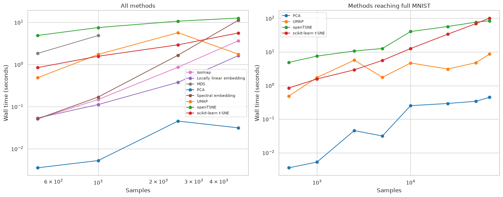
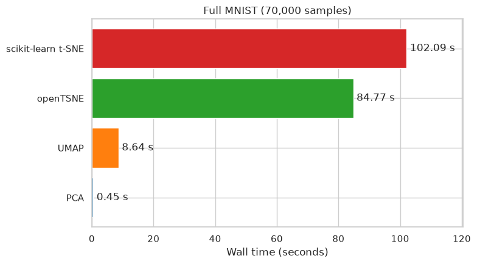
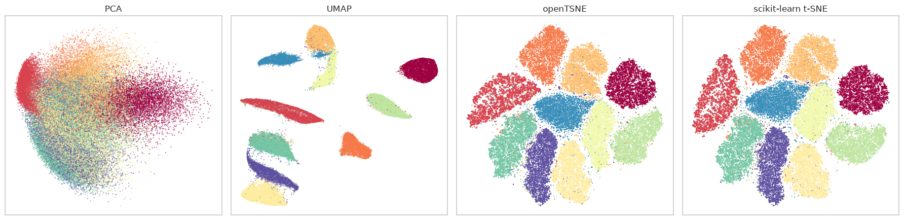
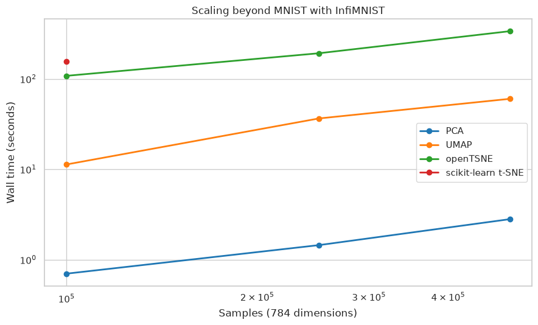

Performance Comparison of Dimension Reduction Implementations
=============================================================

Different dimension reduction techniques have very different
computational costs. The algorithm matters, but so do implementation
details such as nearest-neighbor search, numerical solvers, and parallel
execution. The shape of the input data matters as well. In this notebook
we will compare current maintained implementations on increasingly large
subsets of MNIST and see how their runtimes scale.

This is intended as a practical implementation comparison rather than a
claim that every method solves exactly the same optimization problem.
Each estimator uses its current defaults except where parameters are set
explicitly for reproducibility, parallelism, or to select the new UMAP
layout path.

Benchmark setup
---------------

The comparison includes PCA and the manifold-learning implementations
provided by scikit-learn, together with UMAP and
`openTSNE <https://opentsne.readthedocs.io/>`__. The old version of this
benchmark used MulticoreTSNE. That project has not published a release
since 2019 and does not build cleanly with current Python and CMake
versions, so openTSNE is now the maintained external t-SNE
implementation in the comparison.

All algorithms are allowed to use every available thread. UMAP is
configured with recursive initialization and the Adam optimizer, and is
warmed up before measurement so Numba compilation is not included in its
timings. The input is converted once to a C-contiguous ``float32``
array. A fixed permutation produces nested subsets: every smaller
benchmark is a prefix of the larger ones.

The methods with quadratic memory or runtime are stopped at smaller
sizes. MDS is measured through 1,000 samples; spectral embedding,
Isomap, and locally linear embedding through 5,000. PCA, UMAP, openTSNE,
and scikit-learn t-SNE are measured through all 70,000 MNIST samples.
Small measurements are repeated to expose timing variation, while the
most expensive large runs are performed once.

.. code:: ipython3

    import contextlib
    import gc
    import io
    import os
    import platform
    import struct
    import subprocess
    import tarfile
    from pathlib import Path
    from time import perf_counter
    from urllib.request import urlretrieve

    import matplotlib.pyplot as plt
    import numba
    import numpy as np
    import openTSNE
    import pandas as pd
    import pynndescent
    import scipy
    import seaborn as sns
    import sklearn
    from openTSNE import TSNE as OpenTSNE
    from sklearn.datasets import fetch_openml
    from sklearn.decomposition import PCA
    from sklearn.manifold import (
        Isomap,
        LocallyLinearEmbedding,
        MDS,
        SpectralEmbedding,
        TSNE,
    )
    from threadpoolctl import threadpool_info
    import umap

    sns.set_theme(context="notebook", style="whitegrid")

For a performance comparison it is important to record the software and
hardware context. In particular, the version of an implementation can
matter as much as the algorithm name. The following is the environment
used to produce the results on this page.

.. code:: ipython3

    versions = pd.Series(
        {
            "Python": platform.python_version(),
            "NumPy": np.__version__,
            "SciPy": scipy.__version__,
            "scikit-learn": sklearn.__version__,
            "Numba": numba.__version__,
            "PyNNDescent": pynndescent.__version__,
            "openTSNE": openTSNE.__version__,
            "umap-learn": umap.__version__,
        },
        name="version",
    )
    print(versions.to_string())
    print(f"Logical CPUs: {os.cpu_count()}")
    print(f"Numba threads: {numba.get_num_threads()}")
    print("Native thread pools:")
    for pool in threadpool_info():
        print(
            f"  {pool['internal_api']}: {pool['num_threads']} threads "
            f"({pool.get('prefix', 'unknown')})"
        )

.. parsed-literal::

    Python          3.12.3
    NumPy            2.5.2
    SciPy           1.18.0
    scikit-learn     1.9.0
    Numba           0.67.0
    PyNNDescent      0.6.0
    openTSNE         1.0.4
    umap-learn       0.6.0
    Logical CPUs: 64
    Numba threads: 64
    Native thread pools:
      openblas: 64 threads (libscipy_openblas)
      openblas: 64 threads (libscipy_openblas)
      openmp: 64 threads (libgomp)
      openmp: 64 threads (libgomp)

Loading MNIST
-------------

MNIST remains a useful common benchmark for manifold-learning
implementations: it has 70,000 samples, 784 input dimensions, and enough
structure that the resulting embeddings can also be inspected visually.
We convert the data to the representation used by the benchmark and
apply one deterministic permutation.

.. code:: ipython3

    mnist = fetch_openml("mnist_784", version=1, as_frame=False)
    data = np.ascontiguousarray(mnist.data, dtype=np.float32)
    labels = np.asarray(mnist.target, dtype=np.int32)

    permutation = np.random.RandomState(42).permutation(data.shape[0])
    data = np.ascontiguousarray(data[permutation])
    labels = labels[permutation]

    data.shape, data.dtype, data.flags.c_contiguous

.. parsed-literal::

    ((70000, 784), dtype('float32'), True)

Estimator configurations
------------------------

Every timing constructs a fresh estimator. ``n_jobs=-1`` is used
wherever the implementation exposes it, so no artificial thread cap is
imposed. The t-SNE implementations retain their current iteration
defaults; these defaults are not identical, which is one reason the
results should be read as implementation timings rather than a
controlled comparison of optimizer kernels. MDS uses one random
initialization, matching its current ``n_init=1`` default while making
the initialization choice explicit.

.. code:: ipython3

    def make_pca():
        return PCA(n_components=2, random_state=42)

    def make_umap():
        return umap.UMAP(
            n_components=2,
            init="recursive",
            optimizer="adam",
            compatibility_layout=False,
            n_jobs=-1,
            random_state=42,
        )

    def make_open_tsne():
        return OpenTSNE(n_components=2, n_jobs=-1, random_state=42)

    def make_sklearn_tsne():
        return TSNE(n_components=2, n_jobs=-1, random_state=42)

    def make_lle():
        return LocallyLinearEmbedding(
            n_components=2, n_jobs=-1, random_state=42
        )

    def make_spectral():
        return SpectralEmbedding(n_components=2, n_jobs=-1, random_state=42)

    def make_isomap():
        return Isomap(n_components=2, n_jobs=-1)

    def make_mds():
        return MDS(
            n_components=2,
            n_init=1,
            init="random",
            n_jobs=-1,
            random_state=42,
        )

    benchmark_specs = {
        "PCA": {"factory": make_pca, "max_size": 70000},
        "UMAP": {"factory": make_umap, "max_size": 70000},
        "openTSNE": {"factory": make_open_tsne, "max_size": 70000},
        "scikit-learn t-SNE": {
            "factory": make_sklearn_tsne,
            "max_size": 70000,
        },
        "Locally linear embedding": {"factory": make_lle, "max_size": 5000},
        "Spectral embedding": {
            "factory": make_spectral,
            "max_size": 5000,
        },
        "Isomap": {"factory": make_isomap, "max_size": 5000},
        "MDS": {"factory": make_mds, "max_size": 1000},
    }

    sizes = [500, 1000, 2500, 5000, 10000, 25000, 50000, 70000]
    repeats = {500: 3, 1000: 3, 2500: 2, 5000: 2, 10000: 1, 25000: 1, 50000: 1, 70000: 1}

Warming up UMAP
---------------

UMAP uses Numba to compile performance-critical functions. It has
separate optimizer kernels for small and large inputs, so we run the
exact UMAP configuration once on both a 500-row and a 5,000-row subset
before starting the timer. This exercises the compiled paths used by the
measured fits, so the UMAP results below do not include one-time JIT
compilation.

.. code:: ipython3

    %%capture
    make_umap().fit_transform(np.ascontiguousarray(data[:500]))
    make_umap().fit_transform(np.ascontiguousarray(data[:5000]))

Measuring scaling by dataset size
---------------------------------

The helper below times only ``fit_transform`` (or openTSNE’s equivalent
``fit`` operation). It verifies that every result is finite, retains the
full-MNIST embeddings for visual inspection, and releases estimator
state between runs. Progress is printed as the notebook executes because
the complete benchmark takes several minutes.

.. code:: ipython3

    full_embeddings = {}
    records = []

    def fit_embedding(name, estimator, sample):
        if name == "openTSNE":
            return np.asarray(estimator.fit(sample))
        if name == "UMAP":
            with contextlib.redirect_stdout(io.StringIO()):
                return estimator.fit_transform(sample)
        return estimator.fit_transform(sample)

    for name, spec in benchmark_specs.items():
        for size in sizes:
            if size > spec["max_size"]:
                continue
            sample = np.ascontiguousarray(data[:size])
            for run in range(repeats[size]):
                estimator = spec["factory"]()
                start = perf_counter()
                embedding = fit_embedding(name, estimator, sample)
                elapsed = perf_counter() - start
                if not np.isfinite(embedding).all():
                    raise RuntimeError(f"{name} returned a non-finite embedding")
                records.append(
                    {
                        "algorithm": name,
                        "samples": size,
                        "run": run + 1,
                        "seconds": elapsed,
                    }
                )
                if size == data.shape[0] and run == 0:
                    full_embeddings[name] = np.asarray(embedding).copy()
                print(
                    f"{name:26s} {size:6d} samples, run {run + 1}: "
                    f"{elapsed:8.3f} s"
                )
                del estimator, embedding
                gc.collect()

    results = pd.DataFrame.from_records(records)

.. parsed-literal::

    PCA                           500 samples, run 1:    0.005 s
    PCA                           500 samples, run 2:    0.004 s
    PCA                           500 samples, run 3:    0.003 s
    PCA                          1000 samples, run 1:    0.006 s
    PCA                          1000 samples, run 2:    0.005 s
    PCA                          1000 samples, run 3:    0.005 s
    PCA                          2500 samples, run 1:    0.077 s
    PCA                          2500 samples, run 2:    0.014 s
    PCA                          5000 samples, run 1:    0.032 s
    PCA                          5000 samples, run 2:    0.031 s
    PCA                         10000 samples, run 1:    0.251 s
    PCA                         25000 samples, run 1:    0.292 s
    PCA                         50000 samples, run 1:    0.339 s
    PCA                         70000 samples, run 1:    0.445 s
    UMAP                          500 samples, run 1:    0.487 s
    UMAP                          500 samples, run 2:    0.675 s
    UMAP                          500 samples, run 3:    0.463 s
    UMAP                         1000 samples, run 1:    1.233 s
    UMAP                         1000 samples, run 2:    1.733 s
    UMAP                         1000 samples, run 3:    5.270 s
    UMAP                         2500 samples, run 1:    5.390 s
    UMAP                         2500 samples, run 2:    6.008 s
    UMAP                         5000 samples, run 1:    1.635 s
    UMAP                         5000 samples, run 2:    1.870 s
    UMAP                        10000 samples, run 1:    4.689 s
    UMAP                        25000 samples, run 1:    3.100 s
    UMAP                        50000 samples, run 1:    4.794 s
    UMAP                        70000 samples, run 1:    8.642 s
    openTSNE                      500 samples, run 1:    5.209 s
    openTSNE                      500 samples, run 2:    4.566 s
    openTSNE                      500 samples, run 3:    4.897 s
    openTSNE                     1000 samples, run 1:    6.917 s
    openTSNE                     1000 samples, run 2:    7.524 s
    openTSNE                     1000 samples, run 3:    9.010 s
    openTSNE                     2500 samples, run 1:   10.263 s
    openTSNE                     2500 samples, run 2:   11.093 s
    openTSNE                     5000 samples, run 1:   13.579 s
    openTSNE                     5000 samples, run 2:   11.711 s
    openTSNE                    10000 samples, run 1:   40.524 s
    openTSNE                    25000 samples, run 1:   57.214 s
    openTSNE                    50000 samples, run 1:   77.162 s
    openTSNE                    70000 samples, run 1:   84.773 s
    scikit-learn t-SNE            500 samples, run 1:    0.995 s
    scikit-learn t-SNE            500 samples, run 2:    0.748 s
    scikit-learn t-SNE            500 samples, run 3:    0.846 s
    scikit-learn t-SNE           1000 samples, run 1:    1.475 s
    scikit-learn t-SNE           1000 samples, run 2:    1.571 s
    scikit-learn t-SNE           1000 samples, run 3:    1.584 s
    scikit-learn t-SNE           2500 samples, run 1:    2.887 s
    scikit-learn t-SNE           2500 samples, run 2:    2.973 s
    scikit-learn t-SNE           5000 samples, run 1:    5.445 s
    scikit-learn t-SNE           5000 samples, run 2:    5.756 s
    scikit-learn t-SNE          10000 samples, run 1:   12.595 s
    scikit-learn t-SNE          25000 samples, run 1:   33.862 s
    scikit-learn t-SNE          50000 samples, run 1:   69.572 s
    scikit-learn t-SNE          70000 samples, run 1:  102.095 s
    Locally linear embedding      500 samples, run 1:    0.054 s
    Locally linear embedding      500 samples, run 2:    0.053 s
    Locally linear embedding      500 samples, run 3:    0.054 s
    Locally linear embedding     1000 samples, run 1:    0.113 s
    Locally linear embedding     1000 samples, run 2:    0.112 s
    Locally linear embedding     1000 samples, run 3:    0.112 s
    Locally linear embedding     2500 samples, run 1:    0.380 s
    Locally linear embedding     2500 samples, run 2:    0.377 s
    Locally linear embedding     5000 samples, run 1:    1.639 s
    Locally linear embedding     5000 samples, run 2:    1.613 s
    Spectral embedding            500 samples, run 1:    0.051 s
    Spectral embedding            500 samples, run 2:    0.059 s
    Spectral embedding            500 samples, run 3:    0.052 s
    Spectral embedding           1000 samples, run 1:    0.171 s
    Spectral embedding           1000 samples, run 2:    0.162 s
    Spectral embedding           1000 samples, run 3:    0.169 s
    Spectral embedding           2500 samples, run 1:    1.666 s
    Spectral embedding           2500 samples, run 2:    1.661 s
    Spectral embedding           5000 samples, run 1:   11.206 s
    Spectral embedding           5000 samples, run 2:   11.325 s
    Isomap                        500 samples, run 1:    0.094 s
    Isomap                        500 samples, run 2:    0.051 s
    Isomap                        500 samples, run 3:    0.051 s
    Isomap                       1000 samples, run 1:    0.148 s
    Isomap                       1000 samples, run 2:    0.147 s
    Isomap                       1000 samples, run 3:    0.209 s
    Isomap                       2500 samples, run 1:    0.859 s
    Isomap                       2500 samples, run 2:    0.867 s
    Isomap                       5000 samples, run 1:    3.658 s
    Isomap                       5000 samples, run 2:    3.685 s
    MDS                           500 samples, run 1:    2.083 s
    MDS                           500 samples, run 2:    1.837 s
    MDS                           500 samples, run 3:    1.810 s
    MDS                          1000 samples, run 1:    4.814 s
    MDS                          1000 samples, run 2:    4.872 s
    MDS                          1000 samples, run 3:    4.996 s

The table reports the median time at each measured size. At sizes with
repeated runs, the minimum and maximum show the observed spread. A
single large run should be treated as a representative measurement on
this machine rather than a precise estimate of expected runtime
elsewhere.

.. code:: ipython3

    summary = (
        results.groupby(["algorithm", "samples"])["seconds"]
        .agg(median="median", minimum="min", maximum="max", runs="size")
        .reset_index()
    )
    summary

.. raw:: html

    

    
    <table border="1" class="dataframe">
      <thead>
        <tr style="text-align: right;">
          <th></th>
          <th>algorithm</th>
          <th>samples</th>
          <th>median</th>
          <th>minimum</th>
          <th>maximum</th>
          <th>runs</th>
        </tr>
      </thead>
      <tbody>
        <tr>
          <th>0</th>
          <td>Isomap</td>
          <td>500</td>
          <td>0.051414</td>
          <td>0.051231</td>
          <td>0.094258</td>
          <td>3</td>
        </tr>
        <tr>
          <th>1</th>
          <td>Isomap</td>
          <td>1000</td>
          <td>0.147952</td>
          <td>0.146672</td>
          <td>0.209341</td>
          <td>3</td>
        </tr>
        <tr>
          <th>2</th>
          <td>Isomap</td>
          <td>2500</td>
          <td>0.863099</td>
          <td>0.859302</td>
          <td>0.866895</td>
          <td>2</td>
        </tr>
        <tr>
          <th>3</th>
          <td>Isomap</td>
          <td>5000</td>
          <td>3.671477</td>
          <td>3.657586</td>
          <td>3.685367</td>
          <td>2</td>
        </tr>
        <tr>
          <th>4</th>
          <td>Locally linear embedding</td>
          <td>500</td>
          <td>0.053908</td>
          <td>0.053482</td>
          <td>0.054242</td>
          <td>3</td>
        </tr>
        <tr>
          <th>5</th>
          <td>Locally linear embedding</td>
          <td>1000</td>
          <td>0.112078</td>
          <td>0.112007</td>
          <td>0.112769</td>
          <td>3</td>
        </tr>
        <tr>
          <th>6</th>
          <td>Locally linear embedding</td>
          <td>2500</td>
          <td>0.378100</td>
          <td>0.376638</td>
          <td>0.379563</td>
          <td>2</td>
        </tr>
        <tr>
          <th>7</th>
          <td>Locally linear embedding</td>
          <td>5000</td>
          <td>1.626079</td>
          <td>1.612987</td>
          <td>1.639171</td>
          <td>2</td>
        </tr>
        <tr>
          <th>8</th>
          <td>MDS</td>
          <td>500</td>
          <td>1.837274</td>
          <td>1.810016</td>
          <td>2.083045</td>
          <td>3</td>
        </tr>
        <tr>
          <th>9</th>
          <td>MDS</td>
          <td>1000</td>
          <td>4.872294</td>
          <td>4.814347</td>
          <td>4.995596</td>
          <td>3</td>
        </tr>
        <tr>
          <th>10</th>
          <td>PCA</td>
          <td>500</td>
          <td>0.003549</td>
          <td>0.003461</td>
          <td>0.004815</td>
          <td>3</td>
        </tr>
        <tr>
          <th>11</th>
          <td>PCA</td>
          <td>1000</td>
          <td>0.005262</td>
          <td>0.005130</td>
          <td>0.005525</td>
          <td>3</td>
        </tr>
        <tr>
          <th>12</th>
          <td>PCA</td>
          <td>2500</td>
          <td>0.045501</td>
          <td>0.014020</td>
          <td>0.076981</td>
          <td>2</td>
        </tr>
        <tr>
          <th>13</th>
          <td>PCA</td>
          <td>5000</td>
          <td>0.031429</td>
          <td>0.030882</td>
          <td>0.031976</td>
          <td>2</td>
        </tr>
        <tr>
          <th>14</th>
          <td>PCA</td>
          <td>10000</td>
          <td>0.251379</td>
          <td>0.251379</td>
          <td>0.251379</td>
          <td>1</td>
        </tr>
        <tr>
          <th>15</th>
          <td>PCA</td>
          <td>25000</td>
          <td>0.292048</td>
          <td>0.292048</td>
          <td>0.292048</td>
          <td>1</td>
        </tr>
        <tr>
          <th>16</th>
          <td>PCA</td>
          <td>50000</td>
          <td>0.339294</td>
          <td>0.339294</td>
          <td>0.339294</td>
          <td>1</td>
        </tr>
        <tr>
          <th>17</th>
          <td>PCA</td>
          <td>70000</td>
          <td>0.445202</td>
          <td>0.445202</td>
          <td>0.445202</td>
          <td>1</td>
        </tr>
        <tr>
          <th>18</th>
          <td>Spectral embedding</td>
          <td>500</td>
          <td>0.051504</td>
          <td>0.051446</td>
          <td>0.058991</td>
          <td>3</td>
        </tr>
        <tr>
          <th>19</th>
          <td>Spectral embedding</td>
          <td>1000</td>
          <td>0.169126</td>
          <td>0.161534</td>
          <td>0.171198</td>
          <td>3</td>
        </tr>
        <tr>
          <th>20</th>
          <td>Spectral embedding</td>
          <td>2500</td>
          <td>1.663456</td>
          <td>1.661293</td>
          <td>1.665620</td>
          <td>2</td>
        </tr>
        <tr>
          <th>21</th>
          <td>Spectral embedding</td>
          <td>5000</td>
          <td>11.265803</td>
          <td>11.206218</td>
          <td>11.325389</td>
          <td>2</td>
        </tr>
        <tr>
          <th>22</th>
          <td>UMAP</td>
          <td>500</td>
          <td>0.487351</td>
          <td>0.462969</td>
          <td>0.675488</td>
          <td>3</td>
        </tr>
        <tr>
          <th>23</th>
          <td>UMAP</td>
          <td>1000</td>
          <td>1.733225</td>
          <td>1.232503</td>
          <td>5.270428</td>
          <td>3</td>
        </tr>
        <tr>
          <th>24</th>
          <td>UMAP</td>
          <td>2500</td>
          <td>5.699280</td>
          <td>5.390092</td>
          <td>6.008468</td>
          <td>2</td>
        </tr>
        <tr>
          <th>25</th>
          <td>UMAP</td>
          <td>5000</td>
          <td>1.752656</td>
          <td>1.635308</td>
          <td>1.870004</td>
          <td>2</td>
        </tr>
        <tr>
          <th>26</th>
          <td>UMAP</td>
          <td>10000</td>
          <td>4.688822</td>
          <td>4.688822</td>
          <td>4.688822</td>
          <td>1</td>
        </tr>
        <tr>
          <th>27</th>
          <td>UMAP</td>
          <td>25000</td>
          <td>3.100488</td>
          <td>3.100488</td>
          <td>3.100488</td>
          <td>1</td>
        </tr>
        <tr>
          <th>28</th>
          <td>UMAP</td>
          <td>50000</td>
          <td>4.793603</td>
          <td>4.793603</td>
          <td>4.793603</td>
          <td>1</td>
        </tr>
        <tr>
          <th>29</th>
          <td>UMAP</td>
          <td>70000</td>
          <td>8.642001</td>
          <td>8.642001</td>
          <td>8.642001</td>
          <td>1</td>
        </tr>
        <tr>
          <th>30</th>
          <td>openTSNE</td>
          <td>500</td>
          <td>4.896973</td>
          <td>4.565968</td>
          <td>5.208966</td>
          <td>3</td>
        </tr>
        <tr>
          <th>31</th>
          <td>openTSNE</td>
          <td>1000</td>
          <td>7.524373</td>
          <td>6.917383</td>
          <td>9.010068</td>
          <td>3</td>
        </tr>
        <tr>
          <th>32</th>
          <td>openTSNE</td>
          <td>2500</td>
          <td>10.678129</td>
          <td>10.262818</td>
          <td>11.093441</td>
          <td>2</td>
        </tr>
        <tr>
          <th>33</th>
          <td>openTSNE</td>
          <td>5000</td>
          <td>12.644981</td>
          <td>11.711069</td>
          <td>13.578894</td>
          <td>2</td>
        </tr>
        <tr>
          <th>34</th>
          <td>openTSNE</td>
          <td>10000</td>
          <td>40.524147</td>
          <td>40.524147</td>
          <td>40.524147</td>
          <td>1</td>
        </tr>
        <tr>
          <th>35</th>
          <td>openTSNE</td>
          <td>25000</td>
          <td>57.214099</td>
          <td>57.214099</td>
          <td>57.214099</td>
          <td>1</td>
        </tr>
        <tr>
          <th>36</th>
          <td>openTSNE</td>
          <td>50000</td>
          <td>77.162361</td>
          <td>77.162361</td>
          <td>77.162361</td>
          <td>1</td>
        </tr>
        <tr>
          <th>37</th>
          <td>openTSNE</td>
          <td>70000</td>
          <td>84.773057</td>
          <td>84.773057</td>
          <td>84.773057</td>
          <td>1</td>
        </tr>
        <tr>
          <th>38</th>
          <td>scikit-learn t-SNE</td>
          <td>500</td>
          <td>0.846224</td>
          <td>0.747842</td>
          <td>0.995453</td>
          <td>3</td>
        </tr>
        <tr>
          <th>39</th>
          <td>scikit-learn t-SNE</td>
          <td>1000</td>
          <td>1.570837</td>
          <td>1.475310</td>
          <td>1.584474</td>
          <td>3</td>
        </tr>
        <tr>
          <th>40</th>
          <td>scikit-learn t-SNE</td>
          <td>2500</td>
          <td>2.929857</td>
          <td>2.887064</td>
          <td>2.972651</td>
          <td>2</td>
        </tr>
        <tr>
          <th>41</th>
          <td>scikit-learn t-SNE</td>
          <td>5000</td>
          <td>5.600585</td>
          <td>5.444851</td>
          <td>5.756319</td>
          <td>2</td>
        </tr>
        <tr>
          <th>42</th>
          <td>scikit-learn t-SNE</td>
          <td>10000</td>
          <td>12.594556</td>
          <td>12.594556</td>
          <td>12.594556</td>
          <td>1</td>
        </tr>
        <tr>
          <th>43</th>
          <td>scikit-learn t-SNE</td>
          <td>25000</td>
          <td>33.861999</td>
          <td>33.861999</td>
          <td>33.861999</td>
          <td>1</td>
        </tr>
        <tr>
          <th>44</th>
          <td>scikit-learn t-SNE</td>
          <td>50000</td>
          <td>69.571772</td>
          <td>69.571772</td>
          <td>69.571772</td>
          <td>1</td>
        </tr>
        <tr>
          <th>45</th>
          <td>scikit-learn t-SNE</td>
          <td>70000</td>
          <td>102.094551</td>
          <td>102.094551</td>
          <td>102.094551</td>
          <td>1</td>
        </tr>
      </tbody>
    </table>
    

Comparing scaling
-----------------

The first plot focuses on the range where all maintained implementations
can be compared. The second follows the four implementations that
complete the full MNIST dataset. Logarithmic axes make differences in
scaling easier to see.

.. code:: ipython3

    palette = dict(
        zip(benchmark_specs, sns.color_palette("tab10", len(benchmark_specs)))
    )
    fig, axes = plt.subplots(1, 2, figsize=(15, 6))

    small = summary[summary["samples"] <= 5000]
    for name, group in small.groupby("algorithm", sort=False):
        axes[0].plot(
            group["samples"],
            group["median"],
            marker="o",
            label=name,
            color=palette[name],
        )
    axes[0].set(title="All methods", xlabel="Samples", ylabel="Wall time (seconds)")
    axes[0].set_xscale("log")
    axes[0].set_yscale("log")
    axes[0].legend(fontsize=8)

    scalable_names = ["PCA", "UMAP", "openTSNE", "scikit-learn t-SNE"]
    scalable = summary[summary["algorithm"].isin(scalable_names)]
    for name, group in scalable.groupby("algorithm", sort=False):
        axes[1].plot(
            group["samples"],
            group["median"],
            marker="o",
            label=name,
            color=palette[name],
        )
    axes[1].set(
        title="Methods reaching full MNIST",
        xlabel="Samples",
        ylabel="Wall time (seconds)",
    )
    axes[1].set_xscale("log")
    axes[1].set_yscale("log")
    axes[1].legend(fontsize=8)

    plt.tight_layout()
    plt.show()

The small-data plot demonstrates why no single benchmark size tells the
whole story. Methods with dense pairwise computations can be quite
reasonable for hundreds of samples and then rapidly become impractical.
PCA remains the least expensive option, but it is a linear projection
and is solving a different problem from the manifold methods.

UMAP’s curve is not monotonic around the small-to-medium transition.
UMAP selects different nearest-neighbor and layout implementations
according to dataset size; crossing one of those implementation
boundaries can make a somewhat larger dataset faster. This is another
reason to benchmark the sizes relevant to an application instead of
fitting a single smooth complexity curve through all measurements.

On the larger subsets, current scikit-learn t-SNE is much more
competitive than the historical benchmark suggested, and openTSNE
remains a strong maintained t-SNE implementation. UMAP nevertheless has
substantially lower runtime on this dataset and hardware. The exact
ratios are machine- and version-dependent; the shapes of the scaling
curves are more informative than any single number.

Full-MNIST results
------------------

The full-data measurements provide a concrete summary for this machine.
All methods shown here processed the same 70,000-row C-contiguous
``float32`` matrix and were allowed to use all available threads.

.. code:: ipython3

    full_summary = (
        summary[summary["samples"] == data.shape[0]]
        .set_index("algorithm")
        .loc[["PCA", "UMAP", "openTSNE", "scikit-learn t-SNE"]]
    )
    full_summary[["median", "runs"]]

.. raw:: html

    

    
    <table border="1" class="dataframe">
      <thead>
        <tr style="text-align: right;">
          <th></th>
          <th>median</th>
          <th>runs</th>
        </tr>
        <tr>
          <th>algorithm</th>
          <th></th>
          <th></th>
        </tr>
      </thead>
      <tbody>
        <tr>
          <th>PCA</th>
          <td>0.445202</td>
          <td>1</td>
        </tr>
        <tr>
          <th>UMAP</th>
          <td>8.642001</td>
          <td>1</td>
        </tr>
        <tr>
          <th>openTSNE</th>
          <td>84.773057</td>
          <td>1</td>
        </tr>
        <tr>
          <th>scikit-learn t-SNE</th>
          <td>102.094551</td>
          <td>1</td>
        </tr>
      </tbody>
    </table>
    

.. code:: ipython3

    fig, axis = plt.subplots(figsize=(8, 4.5))
    bars = axis.barh(
        full_summary.index,
        full_summary["median"],
        color=[palette[name] for name in full_summary.index],
    )
    axis.set(xlabel="Wall time (seconds)", title="Full MNIST (70,000 samples)")
    axis.bar_label(bars, fmt="%.2f s", padding=4)
    axis.set_xlim(0, full_summary["median"].max() * 1.18)
    plt.tight_layout()
    plt.show()

Runtime is only one part of a dimension reduction comparison. To make
sure the successful full-data runs also produced recognizable
embeddings, we can inspect the four results side by side. These plots
are not a formal quality benchmark; each method has parameters that can
change the result and runtime.

.. code:: ipython3

    fig, axes = plt.subplots(1, 4, figsize=(18, 4.5))
    for name, axis in zip(
        ["PCA", "UMAP", "openTSNE", "scikit-learn t-SNE"], axes
    ):
        embedding = full_embeddings[name]
        axis.scatter(
            embedding[:, 0],
            embedding[:, 1],
            c=labels,
            cmap="Spectral",
            s=0.12,
            rasterized=True,
        )
        axis.set_title(name)
        axis.set_xticks([])
        axis.set_yticks([])
    plt.tight_layout()
    plt.show()

Scaling beyond MNIST with InfiMNIST
-----------------------------------

MNIST ends at 70,000 samples, so it cannot show how the scalable methods
behave farther out.
`InfiMNIST <https://leon.bottou.org/projects/infimnist>`__ provides a
deterministic supply of transformed MNIST digits. Each pattern still has
784 byte-valued features, but indices at and above 70,000 apply
pseudorandom deformations to the original training images. This lets us
increase sample count without changing the data domain or
dimensionality.

The InfiMNIST 1.3 archive is distributed under the GNU Lesser General
Public License version 3. The notebook downloads and builds it in
``~/.cache/umap-benchmarks``; neither the 350 MB source/data archive nor
generated samples are stored in this repository. A C compiler and
``make`` are required when populating the cache for the first time. The
archive checksum is verified before extraction.

.. code:: ipython3

    INFIMNIST_VERSION = "1.3"
    INFIMNIST_URL = "https://leon.bottou.org/_media/projects/infimnist.tar.gz"
    INFIMNIST_SHA256 = "bff89ae6a80bd7be5de0cc67eaac0db7bb1945287d27c216a18f9924069dc1bb"
    INFIMNIST_SAMPLES = 500_000
    INFIMNIST_FIRST_INDEX = 70_000

    cache_root = Path.home() / ".cache" / "umap-benchmarks"
    archive_path = cache_root / "infimnist.tar.gz"
    source_dir = cache_root / "infimnist"
    executable = source_dir / "infimnist"
    generated_dir = source_dir / "generated"
    images_path = generated_dir / "infimnist-500k-images-idx3-ubyte"
    labels_path = generated_dir / "infimnist-500k-labels-idx1-ubyte"
    cache_root.mkdir(parents=True, exist_ok=True)

    def sha256(path):
        import hashlib

        digest = hashlib.sha256()
        with path.open("rb") as stream:
            for chunk in iter(lambda: stream.read(1024 * 1024), b""):
                digest.update(chunk)
        return digest.hexdigest()

    if not archive_path.exists():
        print(f"Downloading InfiMNIST {INFIMNIST_VERSION} (~350 MB)...")
        urlretrieve(INFIMNIST_URL, archive_path)
    if sha256(archive_path) != INFIMNIST_SHA256:
        raise RuntimeError("The cached InfiMNIST archive has an unexpected checksum")

    if not source_dir.exists():
        with tarfile.open(archive_path, "r:gz") as archive:
            archive.extractall(cache_root, filter="data")
    if not executable.exists():
        subprocess.run(["make", "-C", str(source_dir)], check=True)

    def idx_header(path, fields):
        with path.open("rb") as stream:
            return struct.unpack(">" + "I" * fields, stream.read(4 * fields))

    def infimnist_cache_is_valid():
        return (
            images_path.exists()
            and labels_path.exists()
            and idx_header(images_path, 4) == (2051, INFIMNIST_SAMPLES, 28, 28)
            and idx_header(labels_path, 2) == (2049, INFIMNIST_SAMPLES)
        )

    if not infimnist_cache_is_valid():
        generated_dir.mkdir(exist_ok=True)
        last_index = INFIMNIST_FIRST_INDEX + INFIMNIST_SAMPLES - 1
        temporary_images = images_path.with_suffix(".tmp")
        temporary_labels = labels_path.with_suffix(".tmp")
        print(f"Generating {INFIMNIST_SAMPLES:,} deterministic InfiMNIST samples...")
        with temporary_images.open("wb") as stream:
            subprocess.run(
                [
                    str(executable),
                    "-d",
                    str(source_dir / "data"),
                    "patterns",
                    str(INFIMNIST_FIRST_INDEX),
                    str(last_index),
                ],
                stdout=stream,
                check=True,
            )
        with temporary_labels.open("wb") as stream:
            subprocess.run(
                [
                    str(executable),
                    "-d",
                    str(source_dir / "data"),
                    "labels",
                    str(INFIMNIST_FIRST_INDEX),
                    str(last_index),
                ],
                stdout=stream,
                check=True,
            )
        temporary_images.replace(images_path)
        temporary_labels.replace(labels_path)

    if not infimnist_cache_is_valid():
        raise RuntimeError("Generated InfiMNIST IDX files failed validation")

    infimnist_images = np.memmap(
        images_path,
        mode="r",
        dtype=np.uint8,
        offset=16,
        shape=(INFIMNIST_SAMPLES, 784),
    )
    infimnist_labels = np.memmap(
        labels_path,
        mode="r",
        dtype=np.uint8,
        offset=8,
        shape=(INFIMNIST_SAMPLES,),
    )

    print(f"InfiMNIST {INFIMNIST_VERSION}: {infimnist_images.shape}, {infimnist_images.dtype}")
    display_path = Path("~") / images_path.relative_to(Path.home())
    print(f"Image cache: {display_path} ({images_path.stat().st_size / 2**20:.1f} MiB)")

.. parsed-literal::

    InfiMNIST 1.3: (500000, 784), uint8
    Image cache: ~/.cache/umap-benchmarks/infimnist/generated/infimnist-500k-images-idx3-ubyte (373.8 MiB)

The generated image file is memory-mapped as ``uint8``, keeping the
persistent cache compact. For each measurement the requested prefix is
converted to a C-contiguous ``float32`` array before the timer starts,
matching the data representation used in the MNIST benchmark.

PCA, UMAP, and openTSNE are measured at 100,000, 250,000, and 500,000
samples. Current scikit-learn t-SNE completes 100,000 samples, but a
separate 250,000-sample probe did not finish after twenty minutes on
this machine, so its extended curve is deliberately capped at 100,000
rather than turning notebook regeneration into an impractical workload.
Each high-scale point is measured once.

.. code:: ipython3

    large_specs = {
        "PCA": {"factory": make_pca, "max_size": 500_000},
        "UMAP": {"factory": make_umap, "max_size": 500_000},
        "openTSNE": {"factory": make_open_tsne, "max_size": 500_000},
        "scikit-learn t-SNE": {"factory": make_sklearn_tsne, "max_size": 100_000},
    }
    large_sizes = [100_000, 250_000, 500_000]
    large_records = []
    large_embeddings = {}

    for name, spec in large_specs.items():
        for size in large_sizes:
            if size > spec["max_size"]:
                continue
            sample = np.ascontiguousarray(infimnist_images[:size], dtype=np.float32)
            estimator = spec["factory"]()
            start = perf_counter()
            embedding = fit_embedding(name, estimator, sample)
            elapsed = perf_counter() - start
            if not np.isfinite(embedding).all():
                raise RuntimeError(f"{name} returned a non-finite InfiMNIST embedding")
            large_records.append(
                {"algorithm": name, "samples": size, "seconds": elapsed}
            )
            if size == 500_000:
                large_embeddings[name] = np.asarray(embedding).copy()
            print(f"{name:22s} {size:7,d} samples: {elapsed:8.3f} s")
            del sample, estimator, embedding
            gc.collect()

    large_results = pd.DataFrame.from_records(large_records)
    large_results

.. parsed-literal::

    PCA                    100,000 samples:    0.701 s
    PCA                    250,000 samples:    1.450 s
    PCA                    500,000 samples:    2.808 s
    UMAP                   100,000 samples:   11.310 s
    UMAP                   250,000 samples:   36.502 s
    UMAP                   500,000 samples:   60.169 s
    openTSNE               100,000 samples:  108.110 s
    openTSNE               250,000 samples:  192.118 s
    openTSNE               500,000 samples:  336.963 s
    scikit-learn t-SNE     100,000 samples:  155.445 s

.. raw:: html

    

    
    <table border="1" class="dataframe">
      <thead>
        <tr style="text-align: right;">
          <th></th>
          <th>algorithm</th>
          <th>samples</th>
          <th>seconds</th>
        </tr>
      </thead>
      <tbody>
        <tr>
          <th>0</th>
          <td>PCA</td>
          <td>100000</td>
          <td>0.700818</td>
        </tr>
        <tr>
          <th>1</th>
          <td>PCA</td>
          <td>250000</td>
          <td>1.449518</td>
        </tr>
        <tr>
          <th>2</th>
          <td>PCA</td>
          <td>500000</td>
          <td>2.807720</td>
        </tr>
        <tr>
          <th>3</th>
          <td>UMAP</td>
          <td>100000</td>
          <td>11.310292</td>
        </tr>
        <tr>
          <th>4</th>
          <td>UMAP</td>
          <td>250000</td>
          <td>36.502425</td>
        </tr>
        <tr>
          <th>5</th>
          <td>UMAP</td>
          <td>500000</td>
          <td>60.168777</td>
        </tr>
        <tr>
          <th>6</th>
          <td>openTSNE</td>
          <td>100000</td>
          <td>108.110346</td>
        </tr>
        <tr>
          <th>7</th>
          <td>openTSNE</td>
          <td>250000</td>
          <td>192.117548</td>
        </tr>
        <tr>
          <th>8</th>
          <td>openTSNE</td>
          <td>500000</td>
          <td>336.962846</td>
        </tr>
        <tr>
          <th>9</th>
          <td>scikit-learn t-SNE</td>
          <td>100000</td>
          <td>155.444559</td>
        </tr>
      </tbody>
    </table>
    

.. code:: ipython3

    fig, axis = plt.subplots(figsize=(9, 5.5))
    for name, group in large_results.groupby("algorithm", sort=False):
        axis.plot(
            group["samples"],
            group["seconds"],
            marker="o",
            linewidth=2,
            label=name,
            color=palette[name],
        )
    axis.set(
        title="Scaling beyond MNIST with InfiMNIST",
        xlabel="Samples (784 dimensions)",
        ylabel="Wall time (seconds)",
    )
    axis.set_xscale("log")
    axis.set_yscale("log")
    axis.legend()
    plt.tight_layout()
    plt.show()

The larger dataset makes the scaling differences much clearer. UMAP
takes about a minute at 500,000 samples on this machine, while openTSNE
takes several minutes. PCA is faster still, with the same caveat as
before that it is a linear method solving a different problem. The
scikit-learn t-SNE curve stops at 100,000 because larger runs were not
practical under this notebook’s regeneration budget.

As with the MNIST results, these values describe this package set and
machine. InfiMNIST makes it straightforward to extend the experiment to
one million samples or more when a longer benchmark budget is
appropriate.

Reproducing the benchmark
-------------------------

The exact package versions are recorded in
``notebooks/benchmarking-requirements.txt``. From the repository root
the environment can be recreated with:

.. code:: bash

   uv venv --python 3.12 .benchmark-latest-venv
   uv pip install --python .benchmark-latest-venv/bin/python -e . \
       -r notebooks/benchmarking-requirements.txt

The notebook can then be executed and converted into the published page
with:

.. code:: bash

   PATH="$PWD/.benchmark-latest-venv/bin:$PATH" \
       .benchmark-latest-venv/bin/jupyter nbconvert --to notebook --execute \
       --inplace notebooks/benchmarking.ipynb \
       --ExecutePreprocessor.timeout=3600 --ExecutePreprocessor.kernel_name=python3
   PATH="$PWD/.benchmark-latest-venv/bin:$PATH" \
       .benchmark-latest-venv/bin/jupyter nbconvert --to rst \
       notebooks/benchmarking.ipynb --output benchmarking --output-dir doc
   sed -i 's/[[:space:]]\+$//' doc/benchmarking.rst

Performance results should always be regenerated after changing package
versions, thread limits, estimator defaults, or the benchmark machine.
