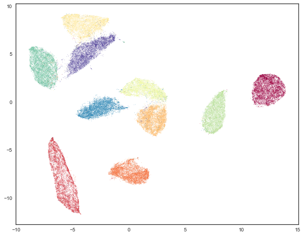
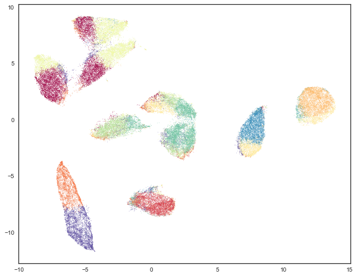
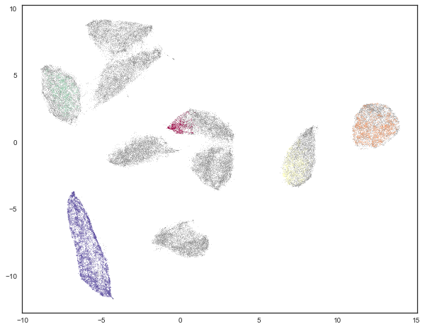
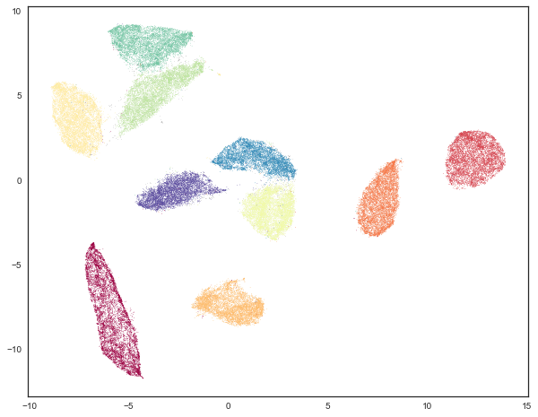

Using UMAP for Clustering
=========================

UMAP can be used as an effective preprocessing step to boost the
performance of density based clustering. This is somewhat controversial,
and should be attempted with care. For a good discussion of some of the
issues involved in this, please see the various answers `in this
stackoverflow
thread <https://stats.stackexchange.com/questions/263539/clustering-on-the-output-of-t-sne>`__
on clustering the results of t-SNE. Many of the points of concern raised
there are salient for clustering the results of UMAP. The most notable
is that UMAP, like t-SNE, does not completely preserve density. UMAP,
like t-SNE, can also create false tears in clusters, resulting in a 
finer clustering than is necessarily present in
the data. Despite these concerns there are still valid reasons to use
UMAP as a preprocessing step for clustering. As with any clustering
approach one will want to do some exploration and evaluation of the
clusters that come out to try to validate them if possible.

With all of that said, let's work through an example to demonstrate the
difficulties that can face clustering approaches and how UMAP can
provide a powerful tool to help overcome them.

First we'll need a selection of libraries loaded up. Obviously we'll
need data, and we can use sklearn's ``fetch_openml`` to get it. We'll
also need the usual tools of numpy, and plotting. Next we'll need umap,
and some clustering options. Finally, since we'll be working with
labeled data, we can make use of strong cluster evaluation metrics
`Adjusted Rand
Index <https://en.wikipedia.org/wiki/Rand_index#Adjusted_Rand_index>`__
and `Adjusted Mutual
Information <https://en.wikipedia.org/wiki/Adjusted_mutual_information>`__.

.. code:: python3

    from sklearn.datasets import fetch_openml
    from sklearn.decomposition import PCA
    import numpy as np
    import matplotlib.pyplot as plt
    %matplotlib inline
    
    # Dimension reduction and clustering libraries
    import umap
    import hdbscan
    import sklearn.cluster as cluster
    from sklearn.metrics import adjusted_rand_score, adjusted_mutual_info_score

Now let's set up the plotting and grab the data we'll be using -- in
this case the MNIST handwritten digits dataset. MNIST consists of 28x28
pixel grayscale images of handwritten digits (0 through 9). These can be
unraveled such that each digit is described by a 784 dimensional vector
(the gray scale value of each pixel in the image). Ideally we would like
the clustering to recover the digit structure.

.. code:: python3

    mnist = fetch_openml('mnist_784', version=1)
    mnist.target = mnist.target.astype(int)

For visualization purposes we can reduce the data to 2-dimensions using
UMAP. When we cluster the data in high dimensions we can visualize the
result of that clustering. First, however, we'll view the data colored
by the digit that each data point represents -- we'll use a different
color for each digit. This will help frame what follows.

.. code:: python3

    standard_embedding = umap.UMAP(random_state=42).fit_transform(mnist.data)
    plt.scatter(standard_embedding[:, 0], standard_embedding[:, 1], c=mnist.target.astype(int), s=0.1, cmap='Spectral');

Traditional clustering
~~~~~~~~~~~~~~~~~~~~~~

Now we would like to cluster the data. As a first attempt let's try the
traditional approach: K-Means. In this case we can solve one of the hard
problems for K-Means clustering -- choosing the right k value, giving
the number of clusters we are looking for. In this case we know the
answer is exactly 10. We will use sklearns K-Means implementation
looking for 10 clusters in the original 784 dimensional data.

.. code:: python3

    kmeans_labels = cluster.KMeans(n_clusters=10).fit_predict(mnist.data)

And how did the clustering do? We can look at the results by coloring
out UMAP embedded data by cluster membership.

.. code:: python3

    plt.scatter(standard_embedding[:, 0], standard_embedding[:, 1], c=kmeans_labels, s=0.1, cmap='Spectral');

This is not really the result we were looking for (though it does expose
interesting properties of how K-Means chooses clusters in high
dimensional space, and how UMAP unwraps manifolds by finding manifold
boundaries). While K-Means gets some cases correct, such as the two clusters
on the right side which are mostly correct, most of the rest of the data looks
somewhat arbitrarily carved up among the remaining clusters. We can put
this impression to the test by evaluating the adjusted Rand score and
adjusted mutual information for this clustering as compared with the
true labels.

.. code:: python3

    (
        adjusted_rand_score(mnist.target, kmeans_labels), 
        adjusted_mutual_info_score(mnist.target, kmeans_labels)
    )

.. parsed-literal::

    (0.36675295135972552, 0.49614118437750965)

As might be expected, we have not done a particularly good job -- both
scores take values in the range 0 to 1, with 0 representing a bad
(essentially random) clustering and 1 representing perfectly recovering
the true labels. K-Means definitely was not random, but it was also
quite a long way from perfectly recovering the true labels. Part of the
problem is the way K-Means works, based on centroids with an assumption
of largely spherical clusters -- this is responsible for some of the
sharp divides that K-Means puts across digit classes. We can potentially
improve on this by using a smarter density based algorithm. In this case
we've chosen to try HDBSCAN, which we believe to be among the most
advanced density based techniques. For the sake of performance we'll
reduce the dimensionality of the data down to 50 dimensions via PCA
(this recovers most of the variance), since HDBSCAN scales somewhat
poorly with the dimensionality of the data it will work on.

.. code:: python3

    lowd_mnist = PCA(n_components=50).fit_transform(mnist.data)
    hdbscan_labels = hdbscan.HDBSCAN(min_samples=10, min_cluster_size=500).fit_predict(lowd_mnist)

We can now inspect the results. Before we do, however, it should be
noted that one of the features of HDBSCAN is that it can refuse to
cluster some points and classify them as "noise". To visualize this
aspect we will color points that were classified as noise gray, and then
color the remaining points according to the cluster membership.

.. code:: python3

    clustered = (hdbscan_labels >= 0)
    plt.scatter(standard_embedding[~clustered, 0], 
                standard_embedding[~clustered, 1], 
                color=(0.5, 0.5, 0.5), 
                s=0.1,
                alpha=0.5)
    plt.scatter(standard_embedding[clustered, 0], 
                standard_embedding[clustered, 1], 
                c=hdbscan_labels[clustered], 
                s=0.1, 
                cmap='Spectral');

This looks somewhat underwhelming. It meets HDBSCAN's approach of "not
being wrong" by simply refusing to classify the majority of the data.
The result is a clustering that almost certainly fails to recover all
the labels. We can verify this by looking at the clustering validation
scores.

.. code:: python3

    (
        adjusted_rand_score(mnist.target, hdbscan_labels), 
        adjusted_mutual_info_score(mnist.target, hdbscan_labels)
    )

.. parsed-literal::

    (0.053830107882840102, 0.19756104096566332)

These scores are far worse than K-Means! Partially this is due to the
fact that these scores assume that the noise points are simply an extra
cluster. We can instead only look at the subset of the data that HDBSCAN
was actually confident enough to assign to clusters -- a simple
sub-selection will let us recompute the scores for only that data.

.. code:: python3

    clustered = (hdbscan_labels >= 0)
    (
        adjusted_rand_score(mnist.target[clustered], hdbscan_labels[clustered]), 
        adjusted_mutual_info_score(mnist.target[clustered], hdbscan_labels[clustered])
    )

.. parsed-literal::

    (0.99843407988303912, 0.99405521087764015)

And here we see that where HDBSCAN was willing to cluster it got things
almost entirely correct. This is what it was designed to do -- be right
for what it can, and defer on anything that it couldn't have sufficient
confidence in. Of course the catch here is that it deferred clustering a
lot of the data. How much of the data did HDBSCAN actually assign to
clusters? We can compute that easily enough.

.. code:: python3

    np.sum(clustered) / mnist.data.shape[0]

.. parsed-literal::

    0.17081428571428572

It seems that less than 18% of the data was clustered. While HDBSCAN did
a great job on the data it could cluster it did a poor job of actually
managing to cluster the data. The problem here is that, as a density
based clustering algorithm, HDBSCAN tends to suffer from the curse of
dimensionality: high dimensional data requires more observed samples to
produce much density. If we could reduce the dimensionality of the data
more we would make the density more evident and make it far easier for
HDBSCAN to cluster the data. The problem is that trying to use PCA to do
this is going to become problematic. While reducing the 50 dimensions
still explained a lot of the variance of the data, reducing further is
going to quickly do a lot worse. This is due to the linear nature of
PCA. What we need is strong manifold learning, and this is where UMAP
can come into play.

UMAP enhanced clustering
~~~~~~~~~~~~~~~~~~~~~~~~

Our goal is to make use of UMAP to perform non-linear manifold aware
dimension reduction so we can get the dataset down to a number of
dimensions small enough for a density based clustering algorithm to make
progress. One advantage of UMAP for this is that it doesn't require you
to reduce to only two dimensions -- you can reduce to 10 dimensions
instead since the goal is to cluster, not visualize, and the performance
cost with UMAP is minimal. As it happens MNIST is such a simple dataset
that we really can push it all the way down to only two dimensions, but
in general you should explore different embedding dimension options.

The next thing to be aware of is that when using UMAP for dimension
reduction you will want to select different parameters than if you were
using it for visualization. First of all we will want a larger
``n_neighbors`` value -- small values will focus more on very local
structure and are more prone to producing fine grained cluster structure
that may be more a result of patterns of noise in the data than actual
clusters. In this case we'll double it from the default 15 up to 30.
Second it is beneficial to set ``min_dist`` to a very low value. Since
we actually want to pack points together densely (density is what we
want after all) a low value will help, as well as making cleaner
separations between clusters. In this case we will simply set
``min_dist`` to be 0.

.. code:: python3

    clusterable_embedding = umap.UMAP(
        n_neighbors=30,
        min_dist=0.0,
        n_components=2,
        random_state=42,
    ).fit_transform(mnist.data)

We can visualize the results of this so see how it compares with more
visualization attuned parameters:

.. code:: python3

    plt.scatter(clusterable_embedding[:, 0], clusterable_embedding[:, 1],
                c=mnist.target, s=0.1, cmap='Spectral');

.. image:: images/clustering_27_1.png

As you can see we still have the general global structure, but we are
packing points together more tightly within clusters, and consequently
we can see larger gaps between the clusters. Ultimately this embedding
was for clustering purposes only, and we will go back to the original
embedding for visualization purposes from here on out.

The next step is to cluster this data. We'll use HDBSCAN again, with the
same parameter setting as before.

.. code:: python3

    labels = hdbscan.HDBSCAN(
        min_samples=10,
        min_cluster_size=500,
    ).fit_predict(clusterable_embedding)

And now we can visualize the results, just as before.

.. code:: python3

    clustered = (labels >= 0)
    plt.scatter(standard_embedding[~clustered, 0], 
                standard_embedding[~clustered, 1], 
                color=(0.5, 0.5, 0.5), 
                s=0.1,
                alpha=0.5)
    plt.scatter(standard_embedding[clustered, 0], 
                standard_embedding[clustered, 1], 
                c=labels[clustered], 
                s=0.1, 
                cmap='Spectral');

We can see that we have done a much better job of finding clusters
rather than merely assigning the majority of data as noise. This is
because we no longer have to try to cope with the relative lack
of density in 50 dimensional space and now HDBSCAN can more cleanly
discern the clusters.

We can also make a quantitative assessment by using the clustering
quality measures as before.

.. code:: python3

    adjusted_rand_score(mnist.target, labels), adjusted_mutual_info_score(mnist.target, labels)

.. parsed-literal::

    (0.9239306564265013, 0.90302671641133736)

Where before HDBSCAN performed very poorly, we now have scores of 0.9 or
better. This is because we actually clustered far more of the data. As
before we can also look at how the clustering did on just the data that
HDBSCAN was confident in clustering.

.. code:: python3

    clustered = (labels >= 0)
    (
        adjusted_rand_score(mnist.target[clustered], labels[clustered]), 
        adjusted_mutual_info_score(mnist.target[clustered], labels[clustered])
    )

.. parsed-literal::

    (0.93240371696811541, 0.91912906363537572)

This is a little worse than the original HDBSCAN, but it is unsurprising
that you are going to be wrong more often if you make more predictions.
The question is how much more of the data is HDBSCAN actually
clustering? Previously we were clustering only 17% of the data.

.. code:: python3

    np.sum(clustered) / mnist.data.shape[0]

.. parsed-literal::

    0.99164285714285716

Now we are clustering over 99% of the data! And our results in terms of
adjusted Rand score and adjusted mutual information are in line with the
current state of the art techniques using convolutional autoencoder
techniques. That's not bad for an approach that is simply viewing the
data as arbitrary 784 dimensional vectors.

Hopefully this has outlined how UMAP can be beneficial for clustering.
As with all things care must be taken, but clearly UMAP can provide
significantly better clustering results when used judiciously.

