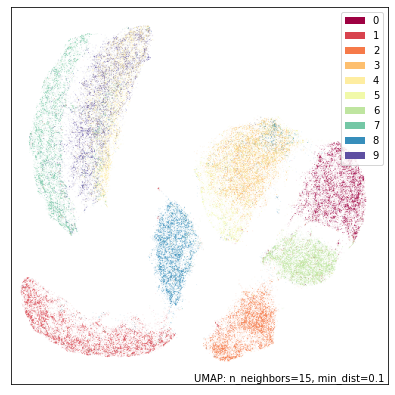

Combining multiple UMAP models
==============================

It is possible to combine together multiple UMAP models, assuming that
they are operating on the same underlying data. To get an idea of how
this works recall that UMAP uses an intermediate fuzzy topological
representation (see :ref:`how_umap_works`). Given different views of the
same underlying data this will generate different fuzzy topological
representations. We can apply intersections or unions to these
representations to get a new composite fuzzy topological representation
which we can then embed into low dimensional space in the standard UMAP
way. The key is that, to be able to sensibly intersect or union these
representations, there must be one-to-one correspondences between the
data samples from the two different views.

To get an idea of how this might work it is useful to see it in
practice. Let’s load some libraries and get started.

.. code:: python3

    import sklearn.datasets
    from sklearn.preprocessing import RobustScaler
    import seaborn as sns
    import pandas as pd
    import numpy as np
    import umap
    import umap.plot

MNIST digits example
--------------------

To begin with let’s use a relatively familiar dataset – the MNIST digits
dataset that we’ve used in other sections of this tutorial. The data is
(grayscale) 28x28 pixel images of handwritten digits (0 through 9); in
total there are 70,000 such images, and each image is unrolled into a
784 element vector.

.. code:: python3

    mnist = sklearn.datasets.fetch_openml("mnist_784")

To ensure we have an idea of what this dataset looks like through the
lens of UMAP we can run UMAP on the full dataset.

.. code:: python3

    mapper = umap.UMAP(random_state=42).fit(mnist.data)

.. code:: python3

    umap.plot.points(mapper, labels=mnist.target, width=500, height=500)

.. image:: images/composing_models_6_1.png

To make the problem more interesting let’s carve the dataset in two – not
into two sets of 35,000 samples, but instead carve each image in half.
That is, we’ll end up with 70,000 samples each of which is the top half
of the image of the handwritten digit, and another 70,000 samples each
of which is the bottom half of the image of the handwritten digit.

.. code:: python3

    top = mnist.data[:, :28 * 14]
    bottom = mnist.data[:, 28 * 14:]

This is a little artificial, but it provides us with an example dataset
where we have two distinct views of the data which we can still well
understand. In practice this situation would be more likely to arise
when there are two different data collection processes sampling from the
same underlying population. In our case we could simply glue the data
back together (hstack the numpy arrays for example), but potentially
this isn’t feasible as the different data views may have different
scales or modalities. So, despite the fact that we could glue things
back together in this case, we will proceed as if we can’t – as may be
the case for many real world problems.

Let’s first look at what UMAP does individually on each dataset. We’ll
start with the top halves of the digits:

.. code:: python3

    top_mapper = umap.UMAP(random_state=42).fit(top)

.. code:: python3

    umap.plot.points(top_mapper, labels=mnist.target, width=500, height=500)

While UMAP still manages to mostly separate the different digit classes
we can see the results are quite different from UMAP on the full
standard MNIST dataset. The twos and threes are blurred together (as we
would expect given that we don’t have the bottom half of the image wich
would let us tell them apart); The twos and threes are also in a large
grouping that pulls together all of the eights, sevens and nines (again,
what we would expect given only the top half of the digit), while the
fives and sixes are somewhat distinct, but clearly are similar to each
other. It is only the ones, fours and zeros that are very clearly
discernible.

Now let’s see what sorts of results we get with the bottom halves of the
digits:

.. code:: python3

    bot_mapper = umap.UMAP(random_state=42).fit(bottom)

.. code:: python3

    umap.plot.points(bot_mapper, labels=mnist.target, width=500, height=500)

This is clearly a very different view of the data. Now it is the fours
and nines that blur together (presumably many of the nines are drawn
with straight rather than curved stems), with sevens nearby. The twos
and the threes are very distinct from each other, but the threes and the
fives are combined (as one might expect given that the bottom halves
*should* look similar). Zeros and sixes are distinct, but close to each
other. Ones, eights and twos are the most distinctive digits in this
view.

So, assuming we can’t just glue the raw data together and stick a
reasonable metric on it, what can we do? We can perform intersections or
unions on the fuzzy topological representations. There is also some work
to be done re-asserting UMAP’s theoretical assumptions (local
connectivity, approximately uniform distributions). Fortunately UMAP
makes this relatively easy as long as you have a copy of fitted UMAP
models on hand (which we do in this case). To intersect two models
simply use the ``*`` operator; to union them use the ``+`` operator.
Note that this will actually take some time since we need to compute the
2D embedding of the combined model.

.. code:: python3

    intersection_mapper = top_mapper * bot_mapper
    union_mapper = top_mapper + bot_mapper

With that complete we can visualize the results. First let’s look at the
intersection:

.. code:: python3

    umap.plot.points(intersection_mapper, labels=mnist.target, width=500, height=500)

.. image:: images/composing_models_18_1.png

As you can see, while this isn’t as good as a UMAP plot for the full
MNIST dataset it has recovered the individual digits quite well. The
worst of the remaining overlap is between the threes and fives in the
center, which is it still struggling to fully distinguish. But note,
also, that we have recovered more of the overall structure than either
of the two different individual views, with the layout of different
digit classes more closely resembling that of the UMAP run on the full
dataset.

Now let’s look at the union.

.. code:: python3

    umap.plot.points(union_mapper, labels=mnist.target, width=500, height=500)

Given that UMAP is agnostic to rotation or reflection of the final
layout, this is essentially the same result as the intersection since it
is almost the reflection of it in the y-axis. This sort of result
(intersection and union being similar) is not always the case (in fact
it is not that common), but since the underlying structure of the digits
dataset is so clear we find that either way of piecing it together from
the two half datasets manage to find the same core underlying structure.

If you are willing to try something a little more experimental there is
also a third option using the ``-`` operator which effectively
intersects with the fuzzy set complement (and is thus not commutative,
just as ``-`` implies). The goal here is to try to provide a sense of
what the data looks like when we contrast it against a second view.

.. code:: python3

    contrast_mapper = top_mapper - bot_mapper

.. code:: python3

    umap.plot.points(contrast_mapper, labels=mnist.target, width=500, height=500)

In this case the result is not overly dissimilar from the embedding of
just the top half, so the contrast has perhaps not shown is as much as
we might have hoped.

Diamonds dataset example
------------------------

Now let’s try the same approach on a different dataset where the option
of just running UMAP on the full dataset is not available. For this
we’ll use the diamonds dataset. In this dataset each row represents a
different diamond and provides details on the weight (carat), cut,
color, clarity, size (depth, table, x, y, z) and price of the given
diamond. How these different factors interplay is somewhat complicated.

.. code:: python3

    diamonds = sns.load_dataset('diamonds')
    diamonds.head()

.. raw:: html

    

    
    <table border="1" class="dataframe">
      <thead>
        <tr style="text-align: right;">
          <th></th>
          <th>carat</th>
          <th>cut</th>
          <th>color</th>
          <th>clarity</th>
          <th>depth</th>
          <th>table</th>
          <th>price</th>
          <th>x</th>
          <th>y</th>
          <th>z</th>
        </tr>
      </thead>
      <tbody>
        <tr>
          <th>0</th>
          <td>0.23</td>
          <td>Ideal</td>
          <td>E</td>
          <td>SI2</td>
          <td>61.5</td>
          <td>55.0</td>
          <td>326</td>
          <td>3.95</td>
          <td>3.98</td>
          <td>2.43</td>
        </tr>
        <tr>
          <th>1</th>
          <td>0.21</td>
          <td>Premium</td>
          <td>E</td>
          <td>SI1</td>
          <td>59.8</td>
          <td>61.0</td>
          <td>326</td>
          <td>3.89</td>
          <td>3.84</td>
          <td>2.31</td>
        </tr>
        <tr>
          <th>2</th>
          <td>0.23</td>
          <td>Good</td>
          <td>E</td>
          <td>VS1</td>
          <td>56.9</td>
          <td>65.0</td>
          <td>327</td>
          <td>4.05</td>
          <td>4.07</td>
          <td>2.31</td>
        </tr>
        <tr>
          <th>3</th>
          <td>0.29</td>
          <td>Premium</td>
          <td>I</td>
          <td>VS2</td>
          <td>62.4</td>
          <td>58.0</td>
          <td>334</td>
          <td>4.20</td>
          <td>4.23</td>
          <td>2.63</td>
        </tr>
        <tr>
          <th>4</th>
          <td>0.31</td>
          <td>Good</td>
          <td>J</td>
          <td>SI2</td>
          <td>63.3</td>
          <td>58.0</td>
          <td>335</td>
          <td>4.34</td>
          <td>4.35</td>
          <td>2.75</td>
        </tr>
      </tbody>
    </table>
    

For our purposes let’s take “price” as a “target” variable (as is often
the case when the dataset is used in machine learning contexts). What we
would like to do is provide a UMAP embedding of the data using the
remaining features. This is tricky since we can’t exactly use a
euclidean metric over the whole thing. What we can do, however, is split
the data into two distinct types: the purely numeric features relating
to size and weight, and the categorical features of color, cut and
clarity. Let’s pull each of those feature sets out so we can work with
them independently.

.. code:: python3

    numeric = diamonds[["carat", "table", "x", "y", "z"]].copy()
    ordinal = diamonds[["cut", "color", "clarity"]].copy()

Now we have a new problem: the numeric features are not at all on the
same scales, so any sort of standard distance metric across them will be
dominated by those features with the largest ranges. We can correct for
that by performing feature scaling. To do that we’ll make use of
sklearn’s ``RobustScaler`` which uses robust statistics (such as the
median and interquartile range) to center and rescale the data feature
by feature. If we look at the results on the first five rows we see that
the different features are all now reasonably comparable, and it is
reasonable to apply something like euclidean distance across them.

.. code:: python3

    scaled_numeric = RobustScaler().fit_transform(numeric)
    scaled_numeric[:5]

.. parsed-literal::

    array([[-0.734375  , -0.66666667, -0.95628415, -0.95054945, -0.97345133],
           [-0.765625  ,  1.33333333, -0.98907104, -1.02747253, -1.07964602],
           [-0.734375  ,  2.66666667, -0.90163934, -0.9010989 , -1.07964602],
           [-0.640625  ,  0.33333333, -0.81967213, -0.81318681, -0.79646018],
           [-0.609375  ,  0.33333333, -0.7431694 , -0.74725275, -0.69026549]])

What is the best way to handle the categorical features? If they are
purely categorical it would make sense to one-hot encode the categories
and use “dice” distance between them. A downside of that is that, with
so few categories, it is a very coarse metric which will fail to provide
much differentiation. For the diamonds dataset, however, the categories
come with a strict order: Ideal cut is better than Premium cut, which is
better than Very Good cut and so on. Color grades work similarly, and
there is a distinct grading scheme for clarity as well. We can use an
ordinal encoding on these categories. Now, while the *ranges* of values
may vary, the differences between them are all comparable – a difference
of 1 for each grade level. That means we don’t need to rescale this data
after the ordinal coding.

.. code:: python3

    ordinal["cut"] = ordinal.cut.map({"Fair":0, "Good":1, "Very Good":2, "Premium":3, "Ideal":4})
    ordinal["color"] = ordinal.color.map({"D":0, "E":1, "F":2, "G":3, "H":4, "I":5, "J":6})
    ordinal["clarity"] = ordinal.clarity.map({"I1":0, "SI2":1, "SI1":2, "VS2":3, "VS1":4, "VVS2":5, "VVS1":6, "IF":7})

.. code:: python3

    ordinal

.. raw:: html

    

    
    <table border="1" class="dataframe">
      <thead>
        <tr style="text-align: right;">
          <th></th>
          <th>cut</th>
          <th>color</th>
          <th>clarity</th>
        </tr>
      </thead>
      <tbody>
        <tr>
          <th>0</th>
          <td>4</td>
          <td>1</td>
          <td>1</td>
        </tr>
        <tr>
          <th>1</th>
          <td>3</td>
          <td>1</td>
          <td>2</td>
        </tr>
        <tr>
          <th>2</th>
          <td>1</td>
          <td>1</td>
          <td>4</td>
        </tr>
        <tr>
          <th>3</th>
          <td>3</td>
          <td>5</td>
          <td>3</td>
        </tr>
        <tr>
          <th>4</th>
          <td>1</td>
          <td>6</td>
          <td>1</td>
        </tr>
        <tr>
          <th>...</th>
          <td>...</td>
          <td>...</td>
          <td>...</td>
        </tr>
        <tr>
          <th>53935</th>
          <td>4</td>
          <td>0</td>
          <td>2</td>
        </tr>
        <tr>
          <th>53936</th>
          <td>1</td>
          <td>0</td>
          <td>2</td>
        </tr>
        <tr>
          <th>53937</th>
          <td>2</td>
          <td>0</td>
          <td>2</td>
        </tr>
        <tr>
          <th>53938</th>
          <td>3</td>
          <td>4</td>
          <td>1</td>
        </tr>
        <tr>
          <th>53939</th>
          <td>4</td>
          <td>0</td>
          <td>1</td>
        </tr>
      </tbody>
    </table>
    
53940 rows × 3 columns

    

As noted we can use euclidean as a sensible distance on the rescaled
numeric data. On the other hand since the different ordinal categories
are entirelty independent of each other, and we have a strict ordinal
codin, the socalled “manhattan” metric makes more sense here – it is
simply the sum of the absolute differences in each category. As before
we can now train UMAP models on each dataset – this time, however, since
the datasets are different we need different metrics and even different
values of ``n_neighbors``.

.. code:: python3

    numeric_mapper = umap.UMAP(n_neighbors=15, random_state=42).fit(scaled_numeric)
    ordinal_mapper = umap.UMAP(metric="manhattan", n_neighbors=150, random_state=42).fit(ordinal.values)

We can look at the results of each of these independent views of the
dataset reduced to 2D using UMAP. Let’s first look at the numeric data
on size and weight of the diamonds. We can colour by the price to get
some idea of how the dataset fits together.

.. code:: python3

    umap.plot.points(numeric_mapper, values=diamonds["price"], cmap="viridis")

We see that while the data generally correlates somewhat with the price
of the diamonds there are distinctly different threads in the data,
presumably corresponding to different styles of cut, and how that
results in different sizing of diamonds in the various dimensions,
depending on the weight.

In contrast we ca look at the ordinal data. In this case we’ll colour it
by the different categories as well as by price.

.. code:: python3

    fig, ax = umap.plot.plt.subplots(2, 2, figsize=(12,12))
    umap.plot.points(ordinal_mapper, labels=diamonds["color"], ax=ax[0,0])
    umap.plot.points(ordinal_mapper, labels=diamonds["clarity"], ax=ax[0,1])
    umap.plot.points(ordinal_mapper, labels=diamonds["cut"], ax=ax[1,0])
    umap.plot.points(ordinal_mapper, values=diamonds["price"], cmap="viridis", ax=ax[1,1])

As you can see this is a markedly different result! The ordinal data has
a relatively coarse metric, since the different categories can only take
on a small range of discrete values. This means that, with respect to
the trio of color, cut, and clarity, diamonds are largely either almost
identical, or quite distinct. The result is very tight groupings which
have very high density. You can see a gradient of color from left to
right in the plot; colouring by cut or clarity show different
stratifications. The combination of these very distinct statifications
results in this highly clustered embedding. It is exactly for this
reason that we need such a high ``n_neighbors`` value: the very local
structure of the data is merely clusters of identical categories; we
need to see wider to learn more structure.

Given these radically different views of the data, what do we get if we
try to integrate them together? As before we can use the intersection
and union operators to simply combine the models. As noted before this
is a somewhat time-consuming operation as a new 2D representation for
the combined models needs to be optimized.

.. code:: python3

    intersection_mapper = numeric_mapper * ordinal_mapper
    union_mapper = numeric_mapper + ordinal_mapper

Let’s start by looking at the intersection; here we are only really
decreasing connectivity since edges are assigned the probability of
existing in *both* data views (before re-asserting local connectivity
and uniform distribution assumptions).

.. code:: python3

    umap.plot.points(intersection_mapper, values=diamonds["price"], cmap="viridis")

.. image:: images/composing_models_42_1.png

What we get most closely represents the numeric data view. Why is this?
Because the categorical data view has points either connected with
certainty (because they are, or are nearly, identical) or very loosely.
The points connected with near certainty are very dense clusters –
almost points in the plot – and mostly what we are doing with the
intersection is breaking up those clusters with the more fine-grained
and variable connectivity provided by the numerical data. At th esame
time we have shifted the result significantly from the numerical data
view on its own; the categorical information has made each cluster more
uniform (rather than being a gradient) in its price.

Given this result, what would you expect of the union?

.. code:: python3

    umap.plot.points(union_mapper, labels=diamonds["color"])

What we get in practice looks a lot more like the categorical view of
the data. This time we are only *increasing* the connectivity (prior to
re-asserting local connectivity and uniform distribution assumptions);
thus we retain most of the structure of the high-connectivity
categorical view. Note, however, that we have created more connected and
coherent clusters in the center of the plot, showing a range of diamond
colors, and the introduction of the numerical size and weight
information has induced a rearrangement of the individual clusters
around the fringes.

We can go a step further and experiment with the contrast composition
method.

.. code:: python3

    contrast_mapper = numeric_mapper - ordinal_mapper

.. code:: python3

    umap.plot.points(contrast_mapper, values=diamonds["price"], cmap="viridis")

.. image:: images/composing_models_47_1.png

Here we see that we’ve retained a lot of the structure of the numeric
data view, but have refined and broken it down further into clear
clusters with price gradients running through each of them.

To further demonstrate the power of this approach we can go a step
further and intersect a higher ``n_neighbors`` based embedding of the
numeric data view with our existing union of numeric and categorical
data – providing a model that is a composition of three simpler models.

.. code:: python3

    intersect_union_mapper = umap.UMAP(random_state=42, n_neighbors=60).fit(numeric) * union_mapper

.. code:: python3

    umap.plot.points(intersect_union_mapper, values=diamonds["price"], cmap="viridis")

.. image:: images/composing_models_50_1.png

Here the greater global structure from the larger ``n_neighbors`` value
glues together longer strands and we get an interesting result out. In
this case it is not necessarily particularly informative, but it is
included as a demonstration that even composed models can be composed
with each other, stacking together potentially many different views.
