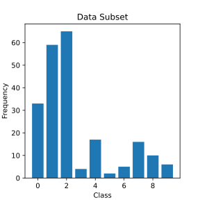
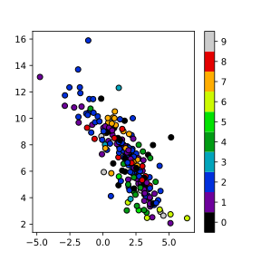
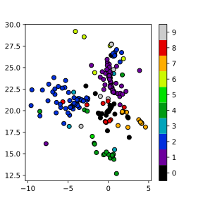

Better Preserving Local Density with DensMAP
============================================

A notable assumption in UMAP is that the data is uniformly distributed
on some manifold and that it is ultimately this manifold that we would
like to present. This is highly effective for many use cases, but it can
be the case that one would like to preserve more information about the
relative local density of data. A recent paper presented a technique
called
`DensMAP <https://www.biorxiv.org/content/10.1101/2020.05.12.077776v1>`__
the computes estimates of the local density and uses those estimates as
a regularizer in the optimization of the low dimensional representation.
The details are well explained in `the
paper <https://www.biorxiv.org/content/10.1101/2020.05.12.077776v1>`__
and we encourage those curious about the details to read it. The result
is a low dimensional representation that preserves information about the
relative local density of the data. To see what this means in practice
let’s load some modules and try it out on some familiar data.

.. code:: python3

    import sklearn.datasets
    import umap
    import umap.plot

For test data we will make use of the now familiar (see earlier tutorial
sections) MNIST and Fashion-MNIST datasets. MNIST is a collection of
70,000 gray-scale images of hand-written digits. Fashion-MNIST is a
collection of 70,000 gray-scale images of fashion items.

.. code:: python3

    mnist = sklearn.datasets.fetch_openml("mnist_784")
    fmnist = sklearn.datasets.fetch_openml("Fashion-MNIST")

Before we try out DensMAP let’s run standard UMAP so we have a baseline
to compare to. We’ll start with MNIST digits.

.. code:: python3

    %%time
    mapper = umap.UMAP(random_state=42).fit(mnist.data)

.. parsed-literal::

    CPU times: user 2min, sys: 15 s, total: 2min 15s
    Wall time: 1min 43s

.. code:: python3

    umap.plot.points(mapper, labels=mnist.target, width=500, height=500)

.. image:: images/densmap_demo_6_1.png

Now let’s try running DensMAP instead. In practice this is as easy as
adding the parameter ``densmap=True`` to the UMAP constructor – this
will cause UMAP use use DensMAP regularization with the default DensMAP
parameters.

.. code:: python3

    %%time
    dens_mapper = umap.UMAP(densmap=True, random_state=42).fit(mnist.data)

.. parsed-literal::

    CPU times: user 3min 42s, sys: 12.9 s, total: 3min 55s
    Wall time: 2min 20s

Note that this is a little slower than standard UMAP – there is a little
more work to be done. It is worth noting, however, that the DensMAP
overhead is relatively constant, so the difference in runtime won’t
increase much as you scale out DensMAP to larger datasets.

Now let’s see what sort of results we get:

.. code:: python3

    umap.plot.points(dens_mapper, labels=mnist.target, width=500, height=500)

This is a significantly different result – although notably the same
groupings of digits and overall structure have resulted. The most
striking aspects are that the ones cluster has be compressed into a very
narrow and dense stripe, while other digit clusters, most notably the
zeros and the twos have expanded out to fill more space in the plot.
This is due to the fact that in the high dimensional space the ones are
indeed more densely packed together, with largely only variation along
one dimension (the angle with which the stroke of the one is drawn). In
contrast a digit like the zero has a lot more variation (rounder,
narrower, taller, shorter, sloping one way or another); this results in
less local density in high dimensional space, and this lack of local
density has been preserved by DensMAP.

Let’s now look at the Fashion-MNIST dataset; as before we’ll start by
reminding ourselves what the default UMAP results look like:

.. code:: python3

    %%time
    mapper = umap.UMAP(random_state=42).fit(fmnist.data)

.. parsed-literal::

    CPU times: user 1min 6s, sys: 8.66 s, total: 1min 15s
    Wall time: 49.8 s

.. code:: python3

    umap.plot.points(mapper, labels=fmnist.target, width=500, height=500)

.. image:: images/densmap_demo_13_1.png

Now let’s try running DensMAP. As before that is as simple as setting
the ``densmap=True`` flag.

.. code:: python3

    %%time
    dens_mapper = umap.UMAP(densmap=True, random_state=42).fit(fmnist.data)

.. parsed-literal::

    CPU times: user 3min 48s, sys: 8.07 s, total: 3min 56s
    Wall time: 2min 21s

.. code:: python3

    umap.plot.points(dens_mapper, labels=fmnist.target, width=500, height=500)

.. image:: images/densmap_demo_16_1.png

Again we see that DensMAP provides a plot similar to UMAP broadly, but
with striking differences. Here we get to see that the cluster of bags
(label 8 in blue) is actually quite sparse, while the cluster of pants
(label 1 in red) is actually quite dense with little variation compared
to other categories. We even see information internal to clusters.
Consider the cluster of boots (label 9 in violet): at the top end it is
quite dense, but it fades out into a much sparse region.

So far we have used DensMAP with default parameters, but the
implementation provides several parameters for adjusting exactly how the
local density regularisation is handled. We encourage readers to consult
the paper for the details of the many parameters available. For general
use the main parameter of interest is called ``dens_lambda`` and it
controls how strongly the local density regularisation acts. Larger
values of ``dens_lambda`` with make preserving the local density a
priority over the the standard UMAP objective, while smaller values lean
more towards classical UMAP. The default value is 2.0. Let’s play with
it a little so we can see the effects of varying it. To start we’ll use
a higher ``dens_lambda`` of 5.0:

.. code:: python3

    %%time
    dens_mapper = umap.UMAP(densmap=True, dens_lambda=5.0, random_state=42).fit(fmnist.data)

.. parsed-literal::

    CPU times: user 3min 47s, sys: 5.04 s, total: 3min 52s
    Wall time: 2min 18s

.. code:: python3

    umap.plot.points(dens_mapper, labels=fmnist.target, width=500, height=500)

This looks kind of like what we had before, but blurrier. And also …
smaller? The plot bounds are set by the data, so the fact that it is
smaller represents the fact that there are some points right out to the
edges of the plot. These are likely points that are in locally very
sparse regions of the high dimensional space and are thus pushed well
away from everything else. We can see this better if we use raw
matplotlib and a scatter plot with larger point size:

.. code:: python3

    fig, ax = umap.plot.plt.subplots(figsize=(7,7))
    ax.scatter(*dens_mapper.embedding_.T, c=fmnist.target.astype('int8'), cmap="Spectral", s=1)

.. image:: images/densmap_demo_21_1.png

Aside from seeing the issues with overplotting we can see that there
are, in fact, quite a few points that create a very soft halo of of
sparse points around the fringes.

Now let’s try going the other way and reduce ``dens_lambda`` to a small
value, so that in principle we can recover something quite close to the
default UMAP plot, with just a hint of local density information
encoded.

.. code:: python3

    %%time
    dens_mapper = umap.UMAP(densmap=True, dens_lambda=0.1, random_state=42).fit(fmnist.data)

.. parsed-literal::

    CPU times: user 3min 47s, sys: 3.78 s, total: 3min 51s
    Wall time: 2min 16s

.. code:: python3

    umap.plot.points(dens_mapper, labels=fmnist.target, width=500, height=500)

And indeed, this looks very much like the original plot, but the bags
(label 8 in blue) are slightly more diffused, and the pants (label 1 in
red) are a little denser. This is very much the default UMAP with just a
tweak to better reflect some notion of local density.

Supervised DensMAP on the Galaxy10SDSS dataset
----------------------------------------------

The `Galaxy10SDSS dataset <https://astronn.readthedocs.io/en/latest/galaxy10sdss.html>`__
is a crowd sourced human labelled dataset of galaxy images,
which have been separated in to ten classes. DensMAP can
learn an embedding that partially separates the data. To
keep runtime small, DensMAP is applied to a subset of the
data.

.. code:: python3

    import numpy as np
    import h5py
    import matplotlib.pyplot as plt
    import umap
    import os
    import math
    import requests

    if not os.path.isfile("Galaxy10.h5"):
        url = "http://astro.utoronto.ca/~bovy/Galaxy10/Galaxy10.h5"
        r = requests.get(url, allow_redirects=True)
        open("Galaxy10.h5", "wb").write(r.content)

    # To get the images and labels from file
    with h5py.File("Galaxy10.h5", "r") as F:
        images = np.array(F["images"])
        labels = np.array(F["ans"])

    X_train = np.empty([math.floor(len(labels) / 100), 14283], dtype=np.float64)
    y_train = np.empty([math.floor(len(labels) / 100)], dtype=np.float64)
    X_test = X_train
    y_test = y_train
    # Get a subset of the data
    for i in range(math.floor(len(labels) / 100)):
        X_train[i, :] = np.array(np.ndarray.flatten(images[i, :, :, :]), dtype=np.float64)
        y_train[i] = labels[i]
        X_test[i, :] = np.array(
            np.ndarray.flatten(images[i + math.floor(len(labels) / 100), :, :, :]),
            dtype=np.float64,
        )
        y_test[i] = labels[i + math.floor(len(labels) / 100)]

    # Plot distribution
    classes, frequency = np.unique(y_train, return_counts=True)
    fig = plt.figure(1, figsize=(4, 4))
    plt.clf()
    plt.bar(classes, frequency)
    plt.xlabel("Class")
    plt.ylabel("Frequency")
    plt.title("Data Subset")
    plt.savefig("galaxy10_subset.svg")

The figure shows that the selected subset of the data set is
unbalanced, but the entire dataset is also unbalanced, so
this experiment will still use this subset. The next step is
to examine the output of the standard DensMAP algorithm.

.. code:: python3

    reducer = umap.UMAP(
        densmap=True, n_components=2, random_state=42, verbose=False
    )
    reducer.fit(X_train)

    galaxy10_densmap = reducer.transform(X_train)
    fig = plt.figure(1, figsize=(4, 4))
    plt.clf()
    plt.scatter(
        galaxy10_densmap[:, 0],
        galaxy10_densmap[:, 1],
        c=y_train,
        cmap=plt.cm.nipy_spectral,
        edgecolor="k",
        label=y_train,
    )
    plt.colorbar(boundaries=np.arange(11) - 0.5).set_ticks(np.arange(10))
    plt.savefig("galaxy10_2D_densmap.svg")

The standard DensMAP algorithm does not separate the galaxies
according to their type. Supervised DensMAP can do better.

.. code:: python3

    reducer = umap.UMAP(
        densmap=True, n_components=2, random_state=42, verbose=False
    )
    reducer.fit(X_train, y_train)

    galaxy10_densmap_supervised = reducer.transform(X_train)
    fig = plt.figure(1, figsize=(4, 4))
    plt.clf()
    plt.scatter(
        galaxy10_densmap_supervised[:, 0],
        galaxy10_densmap_supervised[:, 1],
        c=y_train,
        cmap=plt.cm.nipy_spectral,
        edgecolor="k",
        label=y_train,
    )
    plt.colorbar(boundaries=np.arange(11) - 0.5).set_ticks(np.arange(10))
    plt.savefig("galaxy10_2D_densmap_supervised.svg")

.. image:: images/galaxy10_2D_densmap_supervised.svg

Supervised DensMAP does indeed do better. There is a litle overlap
between some of the classes, but the original dataset
also has some ambiguities in the classification.  The best
check of this method is to project the testing data onto the
learned embedding.

.. code:: python3

    galaxy10_densmap_supervised_prediction = reducer.transform(X_test)
    fig = plt.figure(1, figsize=(4, 4))
    plt.clf()
    plt.scatter(
        galaxy10_densmap_supervised_prediction[:, 0],
        galaxy10_densmap_supervised_prediction[:, 1],
        c=y_test,
        cmap=plt.cm.nipy_spectral,
        edgecolor="k",
        label=y_test,
    )
    plt.colorbar(boundaries=np.arange(11) - 0.5).set_ticks(np.arange(10))
    plt.savefig("galaxy10_2D_densmap_supervised_prediction.svg")

This shows that the learned embedding can be used on new data
sets, and so this method may be helpful for examining images
of galaxies. Try out this method on the full 200 Mb dataset
as well as the newer 2.54 Gb
`Galaxy 10 DECals dataset <https://astronn.readthedocs.io/en/latest/galaxy10.html>`__
