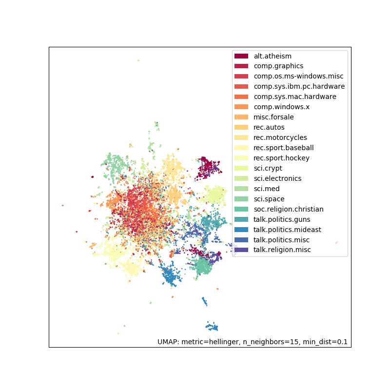
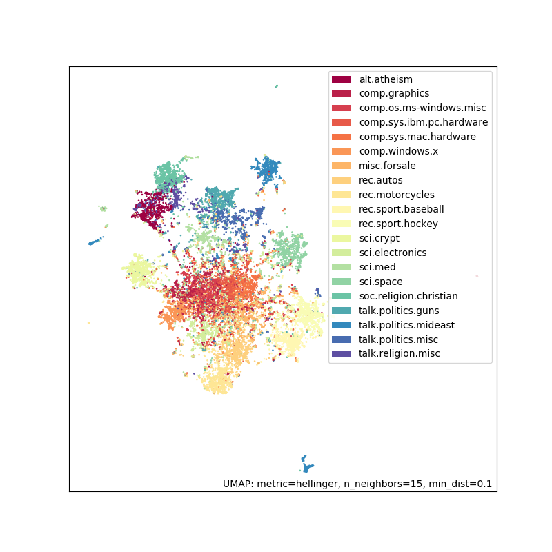

Document embedding using UMAP
=============================

This is a tutorial of using UMAP to embed text (but this can be extended
to any collection of tokens). We are going to use the `20 newsgroups
dataset <http://qwone.com/~jason/20Newsgroups/>`__ which is a collection
of forum posts labelled by topic. We are going to embed these documents
and see that similar documents (i.e. posts in the same subforum) will
end up close together. You can use this embedding for other downstream
tasks, such as visualizing your corpus, or run a clustering algorithm
(e.g. HDBSCAN). We will use a bag of words model and use UMAP on the
count vectors as well as the TF-IDF vectors.

To start with let's load the relevant libraries. **This requires UMAP version >= 0.4.0.**

.. code:: python3

    import pandas as pd
    import umap
    import umap.plot
    
    # Used to get the data
    from sklearn.datasets import fetch_20newsgroups
    from sklearn.feature_extraction.text import CountVectorizer, TfidfVectorizer
    
    # Some plotting libraries
    import matplotlib.pyplot as plt
    %matplotlib notebook
    from bokeh.plotting import show, save, output_notebook, output_file
    from bokeh.resources import INLINE 
    output_notebook(resources=INLINE)

Next let's download and explore the 20 newsgroups dataset.

.. code:: python3

    %%time
    dataset = fetch_20newsgroups(subset='all',
                                 shuffle=True, random_state=42)

.. parsed-literal::

    CPU times: user 280 ms, sys: 52 ms, total: 332 ms
    Wall time: 460 ms

Let's see the size of the corpus:

.. code:: python3

    print(f'{len(dataset.data)} documents')
    print(f'{len(dataset.target_names)} categories')

.. parsed-literal::

    18846 documents
    20 categories

Here are the categories of documents. As you can see many are related to
one another (e.g. ‘comp.sys.ibm.pc.hardware’ and
‘comp.sys.mac.hardware’) but they are not all correlated (e.g. ‘sci.med’
and ‘rec.sport.baseball’).

.. code:: python3

    dataset.target_names

.. parsed-literal::

    ['alt.atheism',
     'comp.graphics',
     'comp.os.ms-windows.misc',
     'comp.sys.ibm.pc.hardware',
     'comp.sys.mac.hardware',
     'comp.windows.x',
     'misc.forsale',
     'rec.autos',
     'rec.motorcycles',
     'rec.sport.baseball',
     'rec.sport.hockey',
     'sci.crypt',
     'sci.electronics',
     'sci.med',
     'sci.space',
     'soc.religion.christian',
     'talk.politics.guns',
     'talk.politics.mideast',
     'talk.politics.misc',
     'talk.religion.misc']

Let’s look at a couple of sample documents:

.. code:: python3

    for idx, document in enumerate(dataset.data[:3]):
        category = dataset.target_names[dataset.target[idx]]
        
        print(f'Category: {category}')
        print('---------------------------')
        # Print the first 500 characters of the post
        print(document[:500])
        print('---------------------------')

.. parsed-literal::

    Category: rec.sport.hockey
    ---------------------------
    From: Mamatha Devineni Ratnam <mr47+@andrew.cmu.edu>
    Subject: Pens fans reactions
    Organization: Post Office, Carnegie Mellon, Pittsburgh, PA
    Lines: 12
    NNTP-Posting-Host: po4.andrew.cmu.edu
    
    
    
    I am sure some bashers of Pens fans are pretty confused about the lack
    of any kind of posts about the recent Pens massacre of the Devils. Actually,
    I am  bit puzzled too and a bit relieved. However, I am going to put an end
    to non-PIttsburghers' relief with a bit of praise for the Pens. Man, they
    are killin
    ---------------------------
    Category: comp.sys.ibm.pc.hardware
    ---------------------------
    From: mblawson@midway.ecn.uoknor.edu (Matthew B Lawson)
    Subject: Which high-performance VLB video card?
    Summary: Seek recommendations for VLB video card
    Nntp-Posting-Host: midway.ecn.uoknor.edu
    Organization: Engineering Computer Network, University of Oklahoma, Norman, OK, USA
    Keywords: orchid, stealth, vlb
    Lines: 21
    
      My brother is in the market for a high-performance video card that supports
    VESA local bus with 1-2MB RAM.  Does anyone have suggestions/ideas on:
    
      - Diamond Stealth Pro Local 
    ---------------------------
    Category: talk.politics.mideast
    ---------------------------
    From: hilmi-er@dsv.su.se (Hilmi Eren)
    Subject: Re: ARMENIA SAYS IT COULD SHOOT DOWN TURKISH PLANES (Henrik)
    Lines: 95
    Nntp-Posting-Host: viktoria.dsv.su.se
    Reply-To: hilmi-er@dsv.su.se (Hilmi Eren)
    Organization: Dept. of Computer and Systems Sciences, Stockholm University
    
    
    
    
    \|>The student of "regional killings" alias Davidian (not the Davidian religios sect) writes:
    
    
    \|>Greater Armenia would stretch from Karabakh, to the Black Sea, to the
    \|>Mediterranean, so if you use the term "Greater Armenia
    ---------------------------

Now we will create a dataframe with the target labels to be used in plotting. This will allow us to see the newsgroup 
when we hover over the plotted points (if using interactive plotting). This will help us evaluate (by eye) how good the embedding looks.

.. code:: python3

    category_labels = [dataset.target_names[x] for x in dataset.target]
    hover_df = pd.DataFrame(category_labels, columns=['category'])

Using raw counts
----------------

Next, we are going to use a bag-of-words approach (i.e. word order doesn’t
matter) and construct a word document matrix. In this matrix the rows
will correspond to a document (i.e. post) and each column will
correspond to a particular word. The values will be the counts of how
many times a given word appeared in a particular document.

We will use sklearns CountVectorizer function to do this for us along
with a couple other preprocessing steps:

1) Split the text into tokens (i.e. words) by splitting on whitespace

2) Remove english stopwords (the, and, etc)

3) Remove all words which occur less than 5 times in the entire corpus
   (via the min_df parameter)

.. code:: python3

    vectorizer = CountVectorizer(min_df=5, stop_words='english')
    word_doc_matrix = vectorizer.fit_transform(dataset.data)

This gives us a 18846x34880 matrix where there are 18846 documents (same
as above) and 34880 unique tokens. This matrix is sparse since most
words do not appear in most documents.

.. code:: python3

    word_doc_matrix

.. parsed-literal::

    <18846x34880 sparse matrix of type '<class 'numpy.int64'>'
    	with 1939023 stored elements in Compressed Sparse Row format>

Now we are going to do dimension reduction using UMAP to reduce the matrix
from 34880 dimensions to 2 dimensions (since n_components=2). We need a
distance metric and will use `Hellinger
distance <https://en.wikipedia.org/wiki/Hellinger_distance>`__ which
measures the similarity between two probability distributions. Each
document has a set of counts generated by a `multinomial
distribution <https://en.wikipedia.org/wiki/Multinomial_distribution>`__
where we can use Hellinger distance to measure the similarity of these
distributions.

.. code:: python3

    %%time
    embedding = umap.UMAP(n_components=2, metric='hellinger').fit(word_doc_matrix)

.. parsed-literal::

    CPU times: user 2min 24s, sys: 1.18 s, total: 2min 25s
    Wall time: 2min 3s

Now we have an embedding of 18846x2.

.. code:: python3

    embedding.embedding_.shape

.. parsed-literal::

    (18846, 2)

Let’s plot the embedding. If you are running this in a notebook, you should use the
interactive plotting method as it lets you hover over your points and see what
category they belong to.

.. code:: python3

    # For interactive plotting use
    # f = umap.plot.interactive(embedding, labels=dataset.target, hover_data=hover_df, point_size=1)
    # show(f)
    f = umap.plot.points(embedding, labels=hover_df['category'])

As you can see this does reasonably well. There is some separation and
groups that you would expect to be similar (such as ‘rec.sport.baseball’
and ‘rec.sport.hockey’) are close together. The big clump in the middle
corresponds to a lot of extremely similar newsgroups like
‘comp.sys.ibm.pc.hardware’ and ‘comp.sys.mac.hardware’.

Using TF-IDF
------------

We will now do the same pipeline with the only change being the use of
`TF-IDF <https://en.wikipedia.org/wiki/Tf%E2%80%93idf>`__ weighting.
TF-IDF gives less weight to words that appear frequently across a large
number of documents since they are more popular in general. It asserts
a higher weight to words that appear frequently in a smaller subset of
documents since they are probably important words for those documents.

To do the TF-IDF weighting we will use sklearns TfidfVectorizer with the
same parameters as CountVectorizer above.

.. code:: python3

    tfidf_vectorizer = TfidfVectorizer(min_df=5, stop_words='english')
    tfidf_word_doc_matrix = tfidf_vectorizer.fit_transform(dataset.data)

We get a matrix of the same size as before:

.. code:: python3

    tfidf_word_doc_matrix

.. parsed-literal::

    <18846x34880 sparse matrix of type '<class 'numpy.float64'>'
    	with 1939023 stored elements in Compressed Sparse Row format>

Again we use Hellinger distance and UMAP to embed the documents

.. code:: python3

    %%time
    tfidf_embedding = umap.UMAP(metric='hellinger').fit(tfidf_word_doc_matrix)

.. parsed-literal::

    CPU times: user 2min 19s, sys: 1.27 s, total: 2min 20s
    Wall time: 1min 57s

.. code:: python3

    # For interactive plotting use
    # fig = umap.plot.interactive(tfidf_embedding, labels=dataset.target, hover_data=hover_df, point_size=1)
    # show(fig)
    fig = umap.plot.points(tfidf_embedding, labels=hover_df['category'])

The results look fairly similar to before but this can be a useful trick
to have in your toolbox.

Potential applications
----------------------

Now that we have an embedding, what can we do with it?

- Explore/visualize your corpus to identify topics/trends
- Cluster the embedding to find groups of related documents
- Look for nearest neighbours to find related documents
- Look for anomalous documents