Embedding to non-Euclidean spaces
=================================

By default UMAP embeds data into Euclidean space. For 2D visualization
that means that data is embedded into a 2D plane suitable for a
scatterplot. In practice, however, there aren't really any major
constraints that prevent the algorithm from working with other more
interesting embedding spaces. In this tutorial we'll look at how to get
UMAP to embed into other spaces, how to embed into your own custom
space, and why this sort of approach might be useful.

To start we'll load the usual selection of libraries. In this case we
will not be using the ``umap.plot`` functionality, but working with
matplotlib directly since we'll be generating some custom visualizations
for some of the more unique embedding spaces.

.. code:: python3

    import numpy as np
    import numba
    import sklearn.datasets
    import matplotlib.pyplot as plt
    import seaborn as sns
    from mpl_toolkits.mplot3d import Axes3D
    import umap
    %matplotlib inline

.. code:: python3

    sns.set(style='white', rc={'figure.figsize':(10,10)})

As a test dataset we'll use the PenDigits dataset from sklearn --
embedding into exotic spaces can be considerably more computationally
taxing, so a simple relatively small dataset is going to be useful.

.. code:: python3

    digits = sklearn.datasets.load_digits()

Plane embeddings
----------------

Plain old plane embeddings are simple enough -- it is the default for
UMAP. Here we'll run through the example again, just to ensure you are
familiar with how this works, and what the result of a UMAP embedding of
the PenDigits dataset looks like in the simple case of embedding in the
plane.

.. code:: python3

    plane_mapper = umap.UMAP(random_state=42).fit(digits.data)

.. code:: python3

    plt.scatter(plane_mapper.embedding_.T[0], plane_mapper.embedding_.T[1], c=digits.target, cmap='Spectral')

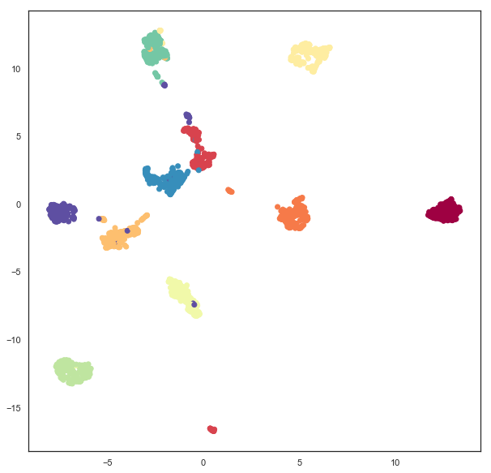

Spherical embeddings
--------------------

What if we wanted to embed data onto a sphere rather than a plane? This
might make sense, for example, if we have reason to expect some sort of
periodic behaviour or other reasons to expect that no point can be
infinitely far from any other. To make UMAP embed onto a sphere we need
to make use of the ``output_metric`` parameter, which specifies what
metric to use for the **output** space. By default UMAP uses a Euclidean
``output_metric`` (and even has a special faster code-path for this
case), but you can pass in other metrics. Among the metrics UMAP
supports is the Haversine metric, used for measuring distances on a
sphere, given in latitude and longitude (in radians). If we set the
``output_metric`` to ``"haversine"`` then UMAP will use that to measure
distance in the embedding space.

.. code:: python3

    sphere_mapper = umap.UMAP(output_metric='haversine', random_state=42).fit(digits.data) 

The result is the pendigits data embedded with respect to haversine
distance on a sphere. The catch is that if we visualize this naively
then we will get nonsense.

.. code:: python3

    plt.scatter(sphere_mapper.embedding_.T[0], sphere_mapper.embedding_.T[1], c=digits.target, cmap='Spectral')

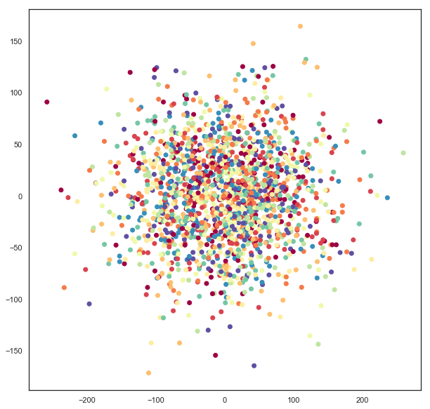

What has gone astray is that under the embedding distance metric a point
at :math:`(0, \pi)` is distance zero from a point at :math:`(0, 3\pi)`
since that will wrap all the way around the equator. You'll note that
the scales on the x and y axes of the above plot go well outside the
ranges :math:`(-\pi, \pi)` and :math:`(0, 2\pi)`, so this isn't the
right representation of the data. We can, however, use straightforward
formulas to map this data onto a sphere embedded in 3d-space.

.. code:: python3

    x = np.sin(sphere_mapper.embedding_[:, 0]) * np.cos(sphere_mapper.embedding_[:, 1])
    y = np.sin(sphere_mapper.embedding_[:, 0]) * np.sin(sphere_mapper.embedding_[:, 1])
    z = np.cos(sphere_mapper.embedding_[:, 0])

Now ``x``, ``y``, and ``z`` give 3d coordinates for each embedding point
that lies on the surface of a sphere. We can visualize this using
matplotlib's 3d plotting capabilities, and see that we have in fact
induced a quite reasonable embedding of the data onto the surface of a
sphere.

.. code:: python3

    fig = plt.figure()
    ax = fig.add_subplot(111, projection='3d')
    ax.scatter(x, y, z, c=digits.target, cmap='Spectral')

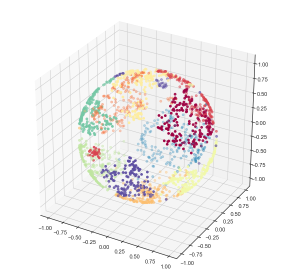

If you prefer a 2d plot we can convert these into lat/long coordinates
in the appropriate ranges and get the equivalent of a map projection of
the sphere data.

.. code:: python3

    x = np.arctan2(x, y)
    y = -np.arccos(z)

.. code:: python3

    plt.scatter(x, y, c=digits.target.astype(np.int32), cmap='Spectral')

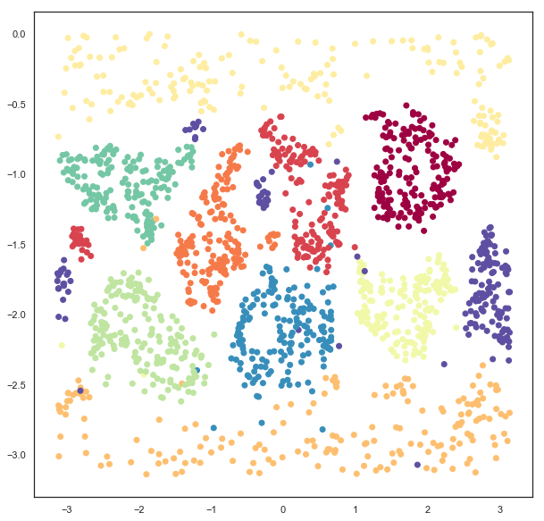

Embedding on a Custom Metric Space
----------------------------------

What if you have some other custom notion of a metric space that you
would like to embed data into? In the same way that UMAP can support
custom written distance metrics for the input data (as long as they can
be compiled with numba), the ``output_metric`` parameter can accept
custom distance functions. One catch is that, to support gradient
descent optimization, the distance function needs to return both the
distance, and a vector for the gradient of the distance. This latter
point may require a little bit of calculus on the users part. A second
catch is that it is highly beneficial to parameterize the embedding
space in a way that has no coordinate constraints -- otherwise the
gradient descent may step a point outside the embedding space, resulting
in bad things happening. This is why, for example, the sphere example
simply has points wrap around rather than constraining coordinates to be
in the appropriate ranges.

Let's work through an example where we construct a distance metric and
gradient for a different sort of space: a
`torus <https://en.wikipedia.org/wiki/Torus>`__. A torus is essentially
just the outer surface of a donut. We can parameterize the torus in
terms of x, y coordinates with the caveat that we can `"wrap around"
(similar to the
sphere) <https://en.wikipedia.org/wiki/Torus#Flat_torus>`__. In such a
model distances are mostly just euclidean distances, we just have to
check for which is the shorter direction -- across or wrapping around --
and ensure we account for the equivalence of wrapping around several
times. We can write a simple function to calculate that.

.. code:: python3

    @numba.njit(fastmath=True)
    def torus_euclidean_grad(x, y, torus_dimensions=(2*np.pi,2*np.pi)):
        """Standard euclidean distance.
    
        ..math::
            D(x, y) = \sqrt{\sum_i (x_i - y_i)^2}
        """
        distance_sqr = 0.0
        g = np.zeros_like(x)
        for i in range(x.shape[0]):
            a = abs(x[i] - y[i])
            if 2*a < torus_dimensions[i]:
                distance_sqr += a ** 2
                g[i] = (x[i] - y[i])
            else:
                distance_sqr += (torus_dimensions[i]-a) ** 2
                g[i] = (x[i] - y[i]) * (a - torus_dimensions[i]) / a
        distance = np.sqrt(distance_sqr)
        return distance, g/(1e-6 + distance)

Note that the gradient just derives from the standard euclidean
gradient, we just have to check the direction according to the way we've
wrapped around to compute the distance. We can now plug that function
directly in to the ``output_metric`` parameter and end up embedding data
on a torus.

.. code:: python3

    torus_mapper = umap.UMAP(output_metric=torus_euclidean_grad, random_state=42).fit(digits.data) 

As with the sphere case, a naive visualisation will look strange, due
the the wrapping around and equivalence of looping several times. But,
also just like the torus, we can construct a suitable visualization by
computing the 3d coordinates for the points using a little bit of
straightforward geometry (yes, I still had to look it up to check).

.. code:: python3

    R = 3 # Size of the doughnut circle
    r = 1 # Size of the doughnut cross-section
    
    x = (R + r * np.cos(torus_mapper.embedding_[:, 0])) * np.cos(torus_mapper.embedding_[:, 1])
    y = (R + r * np.cos(torus_mapper.embedding_[:, 0])) * np.sin(torus_mapper.embedding_[:, 1])
    z = r * np.sin(torus_mapper.embedding_[:, 0])

Now we can visualize the result using matplotlib and see that, indeed,
the data has been suitably embedded onto a torus.

.. code:: python3

    fig = plt.figure()
    ax = fig.add_subplot(111, projection='3d')
    ax.scatter(x, y, z, c=digits.target, cmap='Spectral')
    ax.set_zlim3d(-3, 3)
    ax.view_init(35, 70)

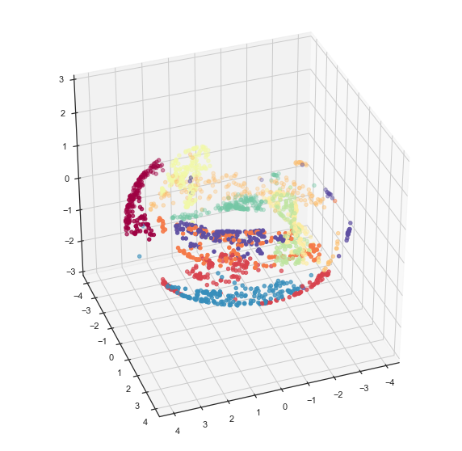

And as with the torus we can do a little geometry and unwrap the torus
into a flat plane with the appropriate bounds.

.. code:: python3

    u = np.arctan2(x,y)
    v = np.arctan2(np.sqrt(x**2 + y**2) - R, z)

.. code:: python3

    plt.scatter(u, v, c=digits.target, cmap='Spectral')

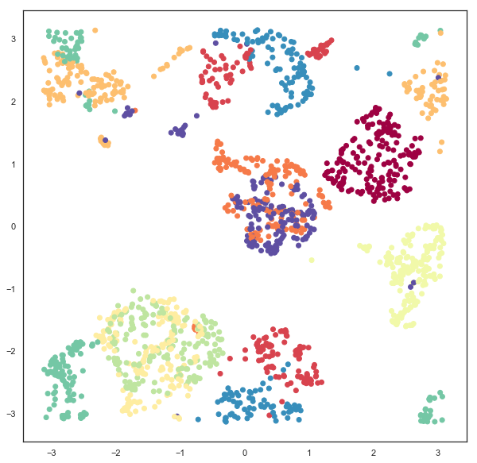

A Practical Example
-------------------

While the examples given so far may have some use (because some data
does have suitable periodic or looping structures that we expect will be
better represented in a sphere or a torus), most data doesn't really
fall in the realm of something that a user can, apriori, expect to lie
on an exotic manifold. Are there more practical uses for the ability to
embed in other spaces? It turns out that there are. One interesting
example to consider is the space formed by 2d-Gaussian distributions. We
can measure the distance between two Gaussians (parameterized by a 2d
vector for the mean, and 2x2 matrix giving the covariance) by the
negative log of the inner product between the PDFs (since this has a
nice closed form solution, and is reasonably computable). That gives us
a metric space to embed into where samples are represented not as points
in 2d, but as Gaussian distributions in 2d, encoding some uncertainty in
how each sample in the high dimensional space is to be embedded.

Of course we still have the issues of parameterizations that are
suitable for SGD -- requiring that the covariance matrix be symmetric
and positive definite is challenging. Instead we can parameterize the
covariance in terms of a width, height and angle, and recover the
covariance matrix from these if required. That gives us a total of 5
components to embed into (two for the mean, 3 for parameters describing
the covariance). We can simply do this since the appropriate metric is
defined already. Note that we have to specifically pass
``n_components=5`` since we need to explicitly embed into a 5
dimensional space to support all the covariance parameters associated to
2d Gaussians.

.. code:: python3

    gaussian_mapper = umap.UMAP(output_metric='gaussian_energy', 
                                n_components=5,
                                random_state=42).fit(digits.data)

Since we have embedded the data into a 5 dimensional space visualization
is not as trivial as it was earlier. We can get a start on visualizing
the results by looking at just the means, which are the 2d locations of
the modes of the Gaussians. A traditional scatter plot will suffice for
this.

.. code:: python3

    plt.scatter(gaussian_mapper.embedding_.T[0], gaussian_mapper.embedding_.T[1], c=digits.target, cmap='Spectral')

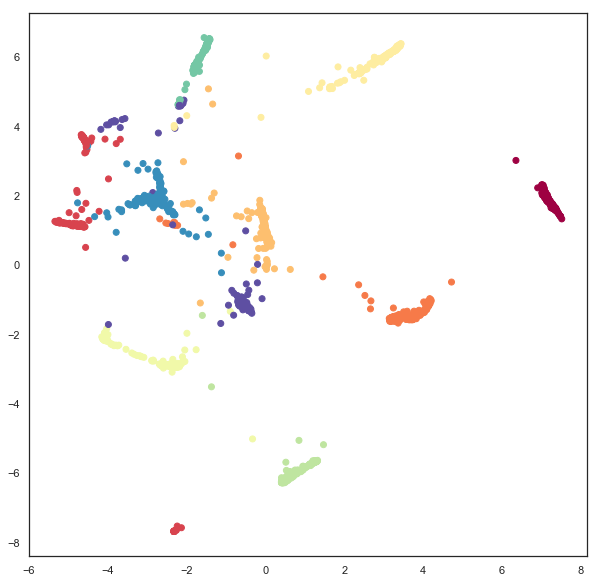

We see that we have gotten a result similar to a standard embedding into
euclidean space, but with less clear clustering, and more points between
clusters. To get a clearer idea of what is going on it will be necessary
to devise a means to display some of the extra information contained in
the extra 3 dimensions providing covariance data. To do this it will be
helpful to be able to draw ellipses corresponding to super-level sets of
the PDF of the 2d Gaussian. We can start on this by writing a simple
function to draw ellipses on a plot accoriding to a position, a width, a
height, and an angle (since this is the format the embedding computed
the data).

.. code:: python3

    from matplotlib.patches import Ellipse
    
    def draw_simple_ellipse(position, width, height, angle, 
                            ax=None, from_size=0.1, to_size=0.5, n_ellipses=3,
                            alpha=0.1, color=None, 
                            **kwargs):
        ax = ax or plt.gca()
        angle = (angle / np.pi) * 180
        width, height = np.sqrt(width), np.sqrt(height)
        # Draw the Ellipse
        for nsig in np.linspace(from_size, to_size, n_ellipses):
            ax.add_patch(Ellipse(position, nsig * width, nsig * height,
                                 angle, alpha=alpha, lw=0, color=color, **kwargs))

Now we can plot the data by providing a scatterplot of the centers (as
before), but overlaying that over a super-level-set ellipses of the
associated Gaussians. The obvious catch is that this will induce a lot
of over-plotting, but it will at least provide a way to start
understanding the embedding we have produced.

.. code:: python3

    fig = plt.figure(figsize=(10,10))
    ax = fig.add_subplot(111)
    colors = plt.get_cmap('Spectral')(np.linspace(0, 1, 10))
    for i in range(gaussian_mapper.embedding_.shape[0]):
        pos = gaussian_mapper.embedding_[i, :2]
        draw_simple_ellipse(pos, gaussian_mapper.embedding_[i, 2], 
                            gaussian_mapper.embedding_[i, 3], 
                            gaussian_mapper.embedding_[i, 4],
                            ax, color=colors[digits.target[i]], 
                            from_size=0.2, to_size=1.0, alpha=0.05)
    ax.scatter(gaussian_mapper.embedding_.T[0], 
               gaussian_mapper.embedding_.T[1], 
               c=digits.target, cmap='Spectral', s=3)

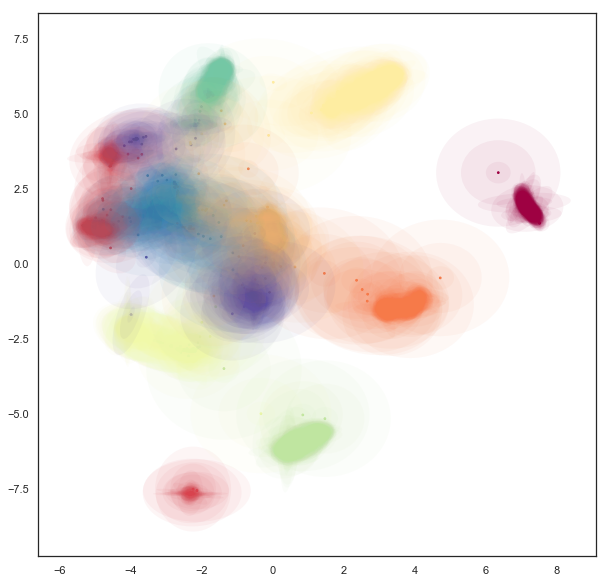

Now we can see that the covariance structure for the points can vary
greatly, both in absolute size, and in shape. We note that many of the
points falling between clusters have much larger variances, in a sense
representing the greater uncertainty of the location of the embedding.
It is also worth noting that the shape of the ellipses can vary
significantly -- there are several very stretched ellipses, quite
distinct from many of the very round ellipses; in a sense this
represents where the uncertainty falls more along a single line for
example.

While this plot highlights some of the covariance structure in the
outlying points, in practice the overplotting here obscures a lot of the
more interesting structure in the clusters themselves. We can try to see
this structure better by plotting only a single ellipse per point and
using a lower alpha channel value for the ellipses, making them more
translucent.

.. code:: python3

    fig = plt.figure(figsize=(10,10))
    ax = fig.add_subplot(111)
    for i in range(gaussian_mapper.embedding_.shape[0]):
        pos = gaussian_mapper.embedding_[i, :2]
        draw_simple_ellipse(pos, gaussian_mapper.embedding_[i, 2], 
                            gaussian_mapper.embedding_[i, 3], 
                            gaussian_mapper.embedding_[i, 4],
                            ax, n_ellipses=1,
                            color=colors[digits.target[i]], 
                            from_size=1.0, to_size=1.0, alpha=0.01)
    ax.scatter(gaussian_mapper.embedding_.T[0], 
               gaussian_mapper.embedding_.T[1], 
               c=digits.target, cmap='Spectral', s=3)

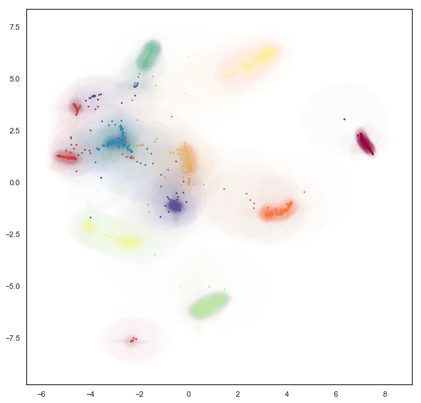

This lets us see the variation of density of clusters with respect to
the covariance structure -- some clusters have consistently very tight
covariance, while others are more spread out (and hence have, in a sense,
greater associated uncertainty. Of course we still have a degree of
overplotting even here, and it will become increasingly difficult to
tune alpha channels to make things visible. Instead what we would want
is an actual density plot, showing the the density of the sum over all
of these Gaussians.

To do this we'll need to define some functions, whose execution will be
accelerated using numba: the evaluation of the density of a 2d Gaussian
at a given point; an evaluation of the density of a given point summing
over a set of several Gaussians; and a function to generate the density
for each point in some grid (summing only over nearby Gaussians to make
this naive approach more computable).

.. code:: python3

    from sklearn.neighbors import KDTree
    
    @numba.njit(fastmath=True)
    def eval_gaussian(x, pos=np.array([0, 0]), cov=np.eye(2, dtype=np.float32)):
        det = cov[0,0] * cov[1,1] - cov[0,1] * cov[1,0]
        if det > 1e-16:
            cov_inv = np.array([[cov[1,1], -cov[0,1]], [-cov[1,0], cov[0,0]]]) * 1.0 / det
            diff = x - pos
            m_dist = cov_inv[0,0] * diff[0]**2 - \
                (cov_inv[0,1] + cov_inv[1,0]) * diff[0] * diff[1] + \
                cov_inv[1,1] * diff[1]**2
            return (np.exp(-0.5 * m_dist)) / (2 * np.pi * np.sqrt(np.abs(det)))
        else:
            return 0.0
        
    @numba.njit(fastmath=True)
    def eval_density_at_point(x, embedding):
        result = 0.0
        for i in range(embedding.shape[0]):
            pos = embedding[i, :2]
            t = embedding[i, 4]
            U = np.array([[np.cos(t), np.sin(t)], [np.sin(t), -np.cos(t)]])
            cov = U @ np.diag(embedding[i, 2:4]) @ U 
            result += eval_gaussian(x, pos=pos, cov=cov)
        return result
    
    def create_density_plot(X, Y, embedding):
        Z = np.zeros_like(X)
        tree = KDTree(embedding[:, :2])
        for i in range(X.shape[0]):
            for j in range(X.shape[1]):
                nearby_points = embedding[tree.query_radius([[X[i,j],Y[i,j]]], r=2)[0]]
                Z[i, j] = eval_density_at_point(np.array([X[i,j],Y[i,j]]), nearby_points)
        return Z / Z.sum()

Now we simply need an appropriate grid of points. We can use the plot
bounds seen above, and a grid size selected for the sake of
computability. The numpy ``meshgrid`` function can supply the actual
grid.

.. code:: python3

    X, Y = np.meshgrid(np.linspace(-7, 9, 300), np.linspace(-8, 8, 300))

Now we can use the function defined above to compute the density at each
point in the grid, given the Gaussians produced by the embedding.

.. code:: python3

    Z = create_density_plot(X, Y, gaussian_mapper.embedding_)

Now we can view the result as a density plot using ``imshow``.

.. code:: python3

    plt.imshow(Z, origin='lower', cmap='Reds', extent=(-7, 9, -8, 8), vmax=0.0005)
    plt.colorbar()

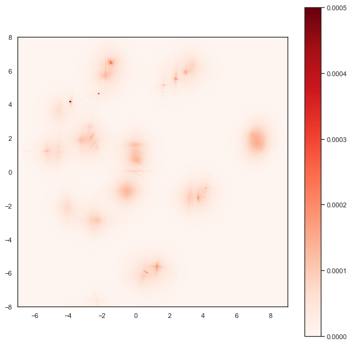

Here we see the finer structure within the various clusters, including
some of the interesting linear structures, demonstrating that this
Gaussian uncertainty based embedding has captured quite detailed and
useful information about the inter-relationships among the PenDigits
dataset.

Bonus: Embedding in Hyperbolic space
------------------------------------

As a bonus example let's look at embedding data into hyperbolic space.
The most popular model for this for visualization is `Poincare's disk
model <https://en.wikipedia.org/wiki/Poincar%C3%A9_disk_model>`__. An
example of a regular tiling of hyperbolic space in Poincare's disk model
is shown below; you may note it is similar to famous images by M.C.
Escher.

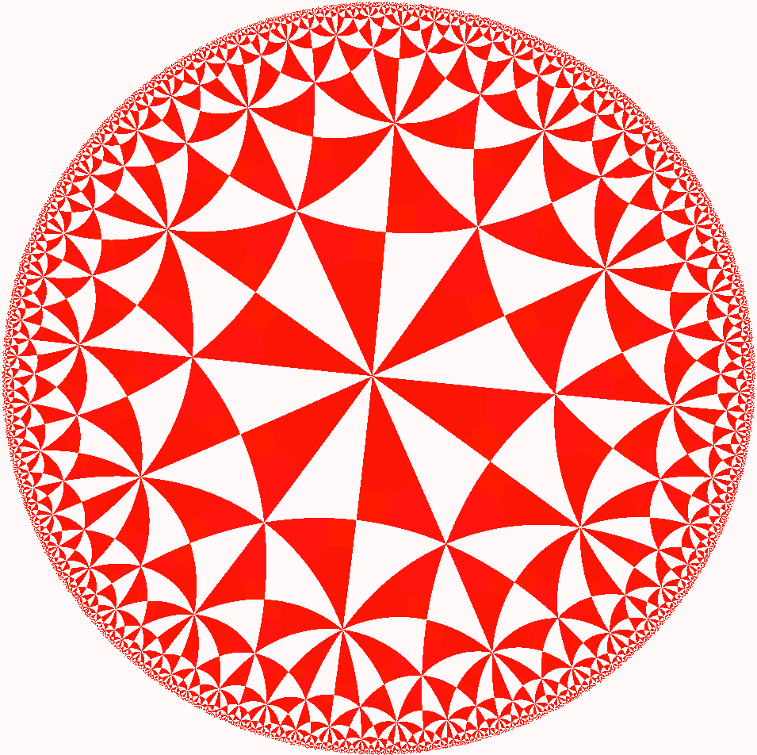

Ideally we would be able to embed directly into this Poincare disk
model, but in practice this proves to be very difficult. The issue is
that the disk has a "line at infinity" in a circle of radius one
bounding the disk. Outside of that circle things are not well defined.
As you may recall from the discussion of embedding onto spheres and
toruses it is best if we can have a parameterisation of the embedding
space that it is hard to move out of. The Poincare disk model is almost
the opposite of this -- as soon as we move outside the unit circle we
have moved off the manifold and further updates will be badly defined.
We therefore instead need a different parameterisation of hyperbolic
space that is less constrained. One option is the Poincare half-plane
model, but this, again, has a boundary that it is easy to move beyond.
The simplest option is the `hyperboloid
model <https://en.wikipedia.org/wiki/Hyperboloid_model>`__. Under this
model we can simply move in x and y coordinates, and solve for the
corresponding z coordinate when we need to compute distances. This model
has been implemented under the distance metric ``"hyperboloid"`` so we
can simply use it out-of-the-box.

.. code:: python3

    hyperbolic_mapper = umap.UMAP(output_metric='hyperboloid', 
                                  random_state=42).fit(digits.data)

A straightforward visualization option is to simply view the x and y
coordinates we have arrived at:

.. code:: python3

    plt.scatter(hyperbolic_mapper.embedding_.T[0], 
                hyperbolic_mapper.embedding_.T[1], 
                c=digits.target, cmap='Spectral')

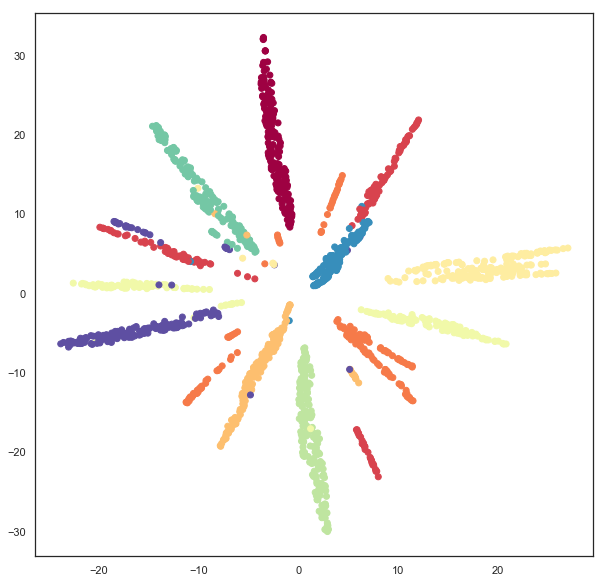

We can also solve for the z coordinate and view the data lying on a
hyperboloid in 3d space.

.. code:: python3

    x = hyperbolic_mapper.embedding_[:, 0]
    y = hyperbolic_mapper.embedding_[:, 1]
    z = np.sqrt(1 + np.sum(hyperbolic_mapper.embedding_**2, axis=1))

.. code:: python3

    fig = plt.figure()
    ax = fig.add_subplot(111, projection='3d')
    ax.scatter(x, y, z, c=digits.target, cmap='Spectral')
    ax.view_init(35, 80)

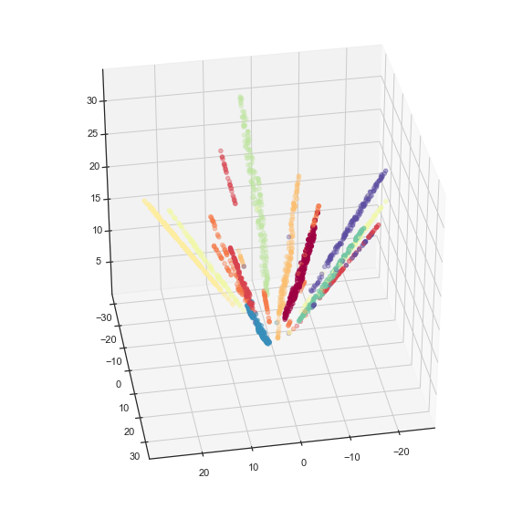

But we can do more -- since we have embedded the data successfully in
hyperbolic space we can map the data into the Poincare disk model. This
is, in fact, a straightforward computation.

.. code:: python3

    disk_x = x / (1 + z)
    disk_y = y / (1 + z)

Now we can visualize the data in a Poincare disk model embedding as we
first wanted. For this we simply generate a scatterplot of the data, and
then draw in the bounding circle of the line at infinity.

.. code:: python3

    fig = plt.figure()
    ax = fig.add_subplot(111)
    ax.scatter(disk_x, disk_y, c=digits.target, cmap='Spectral')
    boundary = plt.Circle((0,0), 1, fc='none', ec='k')
    ax.add_artist(boundary)
    ax.axis('off');

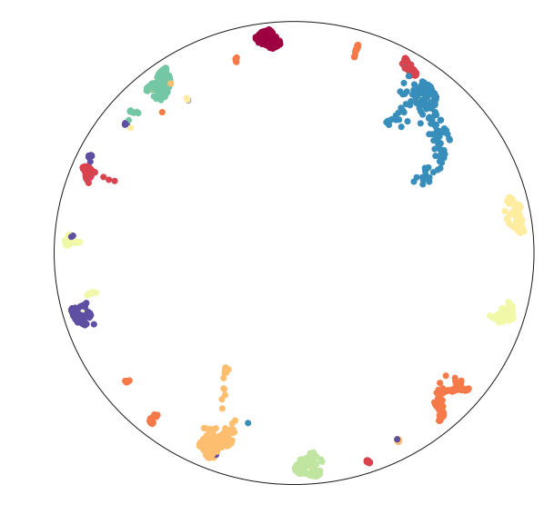

Hopefully this has provided a useful example of how to go about
embedding into non-euclidean spaces. This last example ideally
highlights the limitations of this approach (we really need a suitable
parameterisation), and some potential approaches to get around this: we
can use an alternative parameterisation for the embedding, and then
transform the data into the desired representation.
