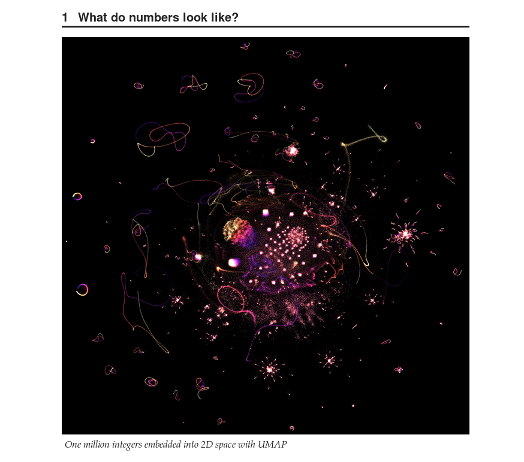
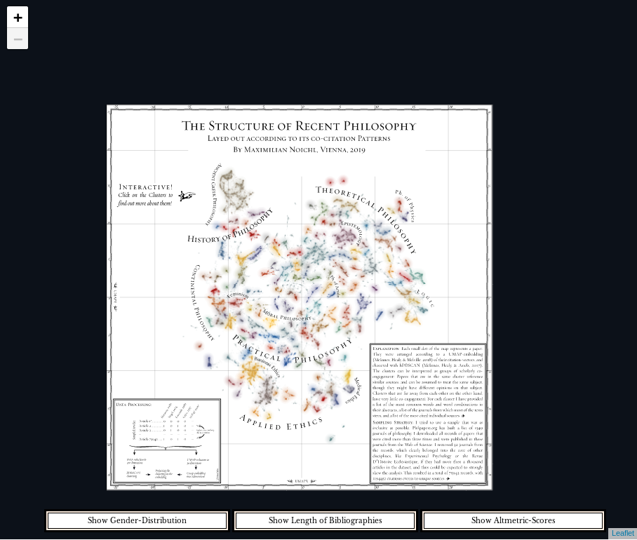
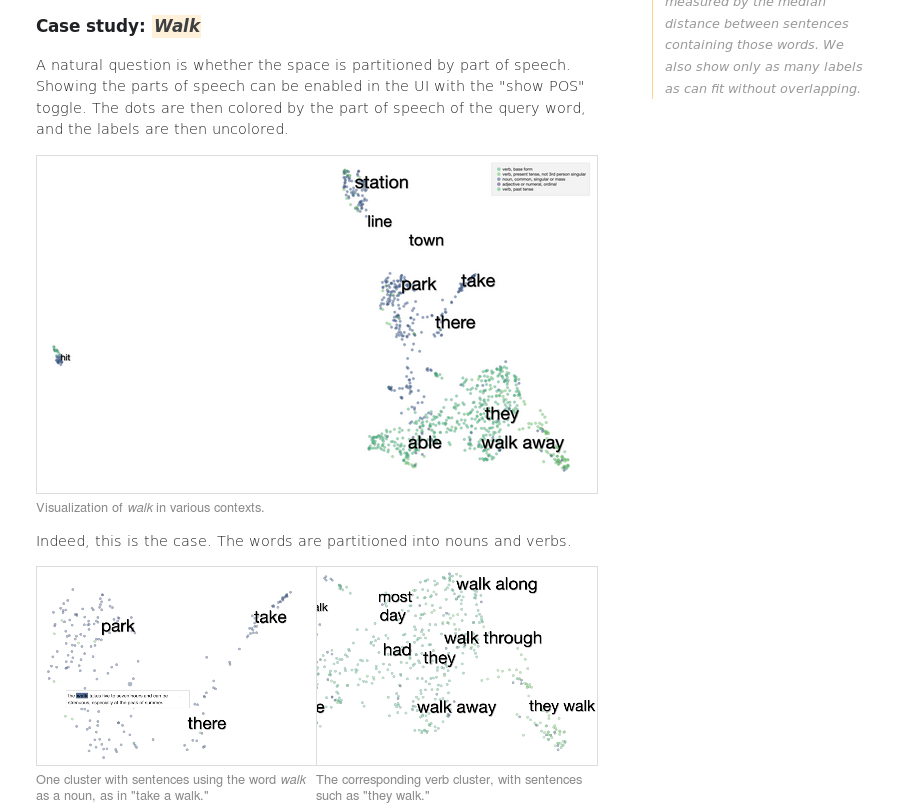
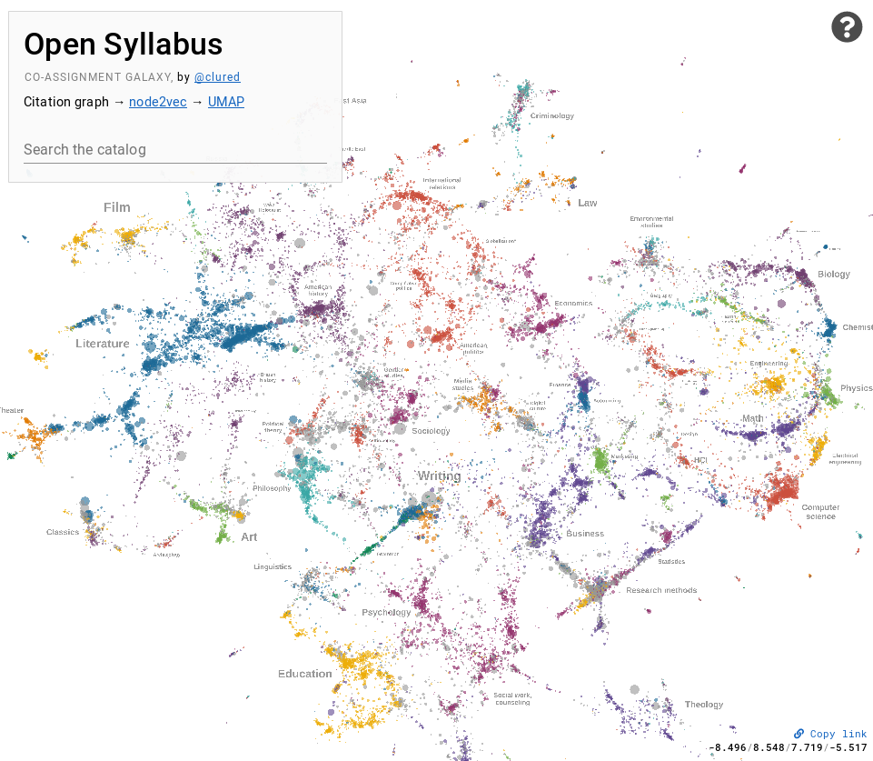

Exploratory Analysis of Interesting Datasets
============================================

UMAP is a useful tool for general exploratory analysis of data -- it can provide
a unique lens through which to view data that can highlight structures and
properties hiding in data that are not as apparent when analysed with other techniques.
Below is a selection of uses cases of UMAP being used for interesting explorations
of intriguing datasets -- everything from pure math and outputs of neural networks,
to philosophy articles, and scientific texts.

Prime factorizations of numbers
-------------------------------
What would happen if we applied UMAP to the integers? First we would need a way
to express an integer in a high dimensional space. That can be done by looking
at the prime factorization of each number. Next you have to take enough numbers
to actually generate an interesting visualization. John Williamson set about doing
exactly this, and the results are fascinating. While they may not actually tell us
anything new about number theory they do highlight interesting structures
in prime factorizations, and demonstrate how UMAP can aid in interesting explorations
of datasets that we might think we know well. It's worth visiting the linked article
below as Dr. Williamson provides a rich and detailed exploration of UMAP as
applied to prime factorizations of integers.

`UMAP on prime factorizations <https://johnhw.github.io/umap_primes/index.md.html>`__

Thanks to John Williamson.

Structure of Recent Philosophy
------------------------------
Philosophy is an incredibly diverse subject, ranging from social and moral philosophy to
logic and philosophy of math; from analysis of ancient Greek philosophy to modern business
ethics. If we could get an overview of all the philosophy papers published in the last
century what might it look like? Maximilian Noichl provides just such an exploration,
looking at a large sampling of philosophy papers and comparing them according to their
citations. The results are intriguing, and can be explored interactively in the
viewer Maximilian built for it.

`Structure of Recent Philosophy <https://homepage.univie.ac.at/noichlm94/full/zoom_final/index.html>`__

Thanks to Maximilian Noichl.

Language, Context, and Geometry in Neural Networks
--------------------------------------------------
Among recent developments in natural language processing is the BERT neural network
based technique for analysis of language. Among many things that BERT can do one is
context sensitive embeddings of words -- providing numeric vector representations of words
that are sensitive to the context of how the word is used. Exactly what goes on inside
the neural network to do this is a little mysterious (since the network is very complex
with many many parameters). A tram of researchers from Google set out to explore the
word embedding space generated by BERT, and among the tools used was UMAP. The linked
blog post provides a detailed and inspiring analysis of what BERT's word embeddings
look like, and how the different layers of BERT represent different aspects of language.

`Language, Context, and Geometry in Neural Networks <https://pair-code.github.io/interpretability/context-atlas/blogpost/>`__

Thanks to Andy Coenen, Emily Reif, Ann Yuan, Been Kim, Adam Pearce, Fernanda Viégas, and Martin Wattenberg.

Activation Atlas
----------------
Understanding the image processing capabilities (and deficits!) of modern
convolutional neural networks is a challenge. Certainly these models are capable
of amazing feats in, for example, image classification. They can also be brittle
in unexpected ways, with carefully designed images able to induce otherwise
baffling mis-classifications. To better understand this researchers from
Google and OpenAI built the activation atlas -- analysing the space of activations
of a neural network. Here UMAP provides a means to compress the activation landscape
down to 2 dimensions for visualization. The result was an impressive interactive paper
in the Distill journal, providing rich visualizations and new insights into
the working of convolutional neural networks.

.. image:: images/activation_atlas.png
   :width: 400px

`The Activation Atlas <https://distill.pub/2019/activation-atlas/>`__

Thanks to Shan Carter, Zan Armstrong, Ludwig Schubert, Ian Johnson, and Chris Olah.

Open Syllabus Galaxy
--------------------
Suppose you wanted to explore the space of commonly assigned texts from Open Syllabus? That
gives you over 150,000 texts to consider. Since the texts are open you can actually analyse
the text content involved. With some NLP and neural network wizardry David McClure build
a network of such texts and then used node2vec and UMAP to generate a map of them. The result
is a galaxy of textbooks showing inter-relationships between subjects, similar and related texts,
and generally just a an interesting ladscape of science to be explored. As with some
of the other projects here David made a great interactive viewer allowing for rich exploration
of the results.

`Open Syllabus Galaxy <https://galaxy.opensyllabus.org/>`__

Thanks to David McClure.
