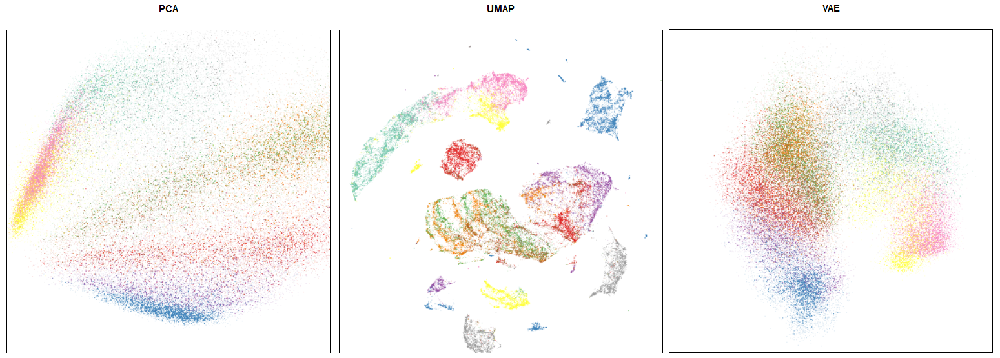

Frequently Asked Questions
==========================

Compiled here are a set of frequently asked questions,
along with answers. If you don't find your question listed here
then please feel free to add an
`issue on github <https://github.com/lmcinnes/umap/issues/new>`_.
More questions are always welcome, and the authors will do
their best to answer. If you feel you have a common question
that isn't answered here then please suggest that the question
(and answer) be added to the FAQ when you file the issue.

Should I normalise my features?
-------------------------------

The default answer is yes, but, of course, the real answer is
"it depends". If your features have meaningful relationships
with one another (say, latitude and longitude vales) then
normalising per feature is not a good idea. For features that
are essentially independent it does make sense to get all the
features on (relatively) the same scale. The best way to do
this is to use
`pre-processing tools from scikit-learn <http://scikit-learn.org/stable/modules/preprocessing.html>`_.
All the advice given there applies as sensible preprocessing
for UMAP, and since UMAP is scikit-learn compatible you
can put all of this together into a `scikit-learn pipeline <http://scikit-learn.org/stable/modules/generated/sklearn.pipeline.Pipeline.html>`_

Can I cluster the results of UMAP?
----------------------------------

This is hard to answer well, but essentially the answer is
"yes, with care". To start with it matters what clustering
algorithm you are going to use. Since UMAP does not necessarily
produce clean spherical clusters something like K-Means
is a poor choice. I would recommend
`HDBSCAN <https://github.com/scikit-learn-contrib/hdbscan>`_ or
similar. The catch here is that UMAP, with its uniform density
assumption, does not preserve density well. What UMAP will do,
however, is contract connected components of the manifold
together. Providing you have enough data for UMAP to
distinguish that information then you can get *useful*
clustering results out since algorithms like HDBSCAN will
easily pick out the components after applying UMAP.

UMAP does offer significant improvements over algorithms
like t-SNE for clustering. First, by preserving more
global structure and creating meaningful separation
between connected components of the manifold on which
the data lies, UMAP offers more meaningful clusters.
Second, because it supports arbitrary embedding
dimensions, UMAP allows embedding to larger dimensional
spaces that make it more amenable to clustering.

The clusters are all squashed together and I can't see internal structure
-------------------------------------------------------------------------

One of UMAPs goals is to have distance between clusters of points
be meaningful. This means that clusters can end up spread out
with a fair amount of space between them. As a result the
clusters themselves can end up more visually packed together
than in, say, t-SNE. This is intended. A catch, however, is
that many plots (for example matplotlib's scatter plot with
default parameters) tend to show the clusters only as indistinct
blobs with no internal structure. The solution for this is
really a matter of tuning the plot more than anything else.

If you are using matplotlib consider using the ``s`` parameter
that specifies the glyph size in scatter plots. Depending on
how much data you have reducing this to anything from 5 to
0.001 can have a notable effect. The ``size`` parameter in
bokeh is similarly useful (but does not need to be quite so small).

More generally the real solution, particular with large datasets,
is to use `datashader <http://datashader.org/>`_ for plotting.
Datashader is a plotting llibrary that handles aggregation
of large scale data in scatter plots in a way that can better
show the underlying detail that can otherwise be lost. We
highly recommend investing the time to learn datashader for
UMAP plot particularly for larger datasets.

Is there GPU or multicore-CPU support?
--------------------------------------

Not at this time. The bottlenecks in the code are the
(approximate) nearest neighbor search and the optimization
of the low dimensional representation. The first of these
(ANN) is performed by a random projection forest and
nearest-neighbor-descent. Both of those are, at the least,
parellelisable in principle, and could be converted to
support multicore (at the cost of single core performance).
The optimization is performed via a (slightly custom)
stochastic gradient descent. SGD is both parallelisable
and amenable to GPUs. This means that in principle UMAP
could support multicore and use GPUs for optimization.
In practice this would involve GPU expertise and would
potentially hurt single core performance, and so has
been deferred for now. If you have expertise in GPU
programming with Numba and would be interested in
adding GPU support we would welcome your contributions.

Can I add a custom loss function?
---------------------------------

To allow for fast performance the SGD phase of UMAP has
been hand-coded for the specific needs of UMAP. This makes
custom loss functions a little difficult to handle. Now
that Numba (as of version 0.38) supports passing functions
it is posisble that future versions of UMAP may support
such functionality. In the meantime you should definitely
look into `smallvis <https://github.com/jlmelville/smallvis>`_,
a library for t-SNE, LargeVis, UMAP, and related algorithms.
Smallvis only works for small datasets, but provides
much greater flexibility and control.

Is the support for the R language?
----------------------------------

Yes! A number of people have worked hard to make UMAP
available to R users.

If you want to use the reference
implementation under the hood but want a nice R interface
the we recommend `umapr <https://github.com/ropenscilabs/umapr>`_
which wraps the python code with reticulate.

If you want a pure R version then there are a couple
of options: `UMAP <https://github.com/tkonopka/umap>`_
and `UWOT <https://github.com/jlmelville/uwot>`_. Both are good
reimplementations of UMAP in R. If performance is
a major factor we recommend UWOT at this time.

Is there a C/C++ implementation?
--------------------------------

Not that we are aware of. For now Numba has done a very
admirable job of providing high performance and the
developers of UMAP have not felt the need to move to
lower level languages. At some point a multithreaded
C++ implementation may be made available, but there are
no time-frames for when that would happen.

I can't get UMAP to run properly!
---------------------------------

There are, inevitably, a number of issues and corner cases
that can cause issues for UMAP. Some know issues that can
cause problems are:

- UMAP doesn't currently support 32-bit Windows.
  This is due to issues with Numba of that platform
  and will not likely be resolved soon. Sorry :-(
- If you have pip installed the package ``umap``
  at any time (instead of ``umap-learn``) this can
  cause serious issues. You will want to purge/remove
  everything umap related in your ``site-packages``
  directory and re-install ``umap-learn``.
- Having any files called ``umap.py`` in the current
  directory you will have issues as that will be
  loaded instead of the ``umap`` module.

It is worth checking the
`issues page on github <https://github.com/lmcinnes/umap/issues>`_
for potential solutions. If all else fails please add an
`issue on github <https://github.com/lmcinnes/umap/issues/new>`_.

What is the difference between UMAP / VAEs / PCA?
-------------------------------------------------

This is an example of an embedding for a popular Fashion MNIST dataset.

    Comparison of UMAP / PCA / VAE embeddings

Note that FMNIST is mostly a toy dataset (MNIST on steroids).
On such a simplistic case UMAP shows distillation results
(i.e. if we use its embedding in a downsteam task like classification)
comparable to VAEs, which are more computationally expensive.

By definition:

- PCA is linear transformation, you can apply it
  to mostly any kind of data in an unsupervised fashion.
  Also it works really fast. For most real world tasks
  its embeddings are mostly too simplistic / useless.
- VAE is a kind of encoder-decoder neural network,
  trained with KLD loss and BCE (or MSE) loss
  to enforce the resulting embedding to be continuous.
  VAE is and extension of auto-encoder network,
  which by design should produce embeddings that are
  not only relevant to actually encoding the data, but are
  also smooth.

From a more practical standpoint:

- PCA mostly works for any reasonable dataset on a modern machine.
  (up to tens or hundreds of millions of rows);
- VAEs have been shown to work only for toy datasets
  and to our knowledge there was no real life useful application to
  a real world sized dataset (i.e. ImageNet);
- Applying UMAP to real world tasks usually provides a good starting
  point for downstream tasks (data visualization, clustering, classification)
  and works reasonably fast;
- Consider a typical pipeline: high-dimensional embedding (300+)
  => PCA to reduce to 50 dimensions => UMAP to reduce to 10-20 dimensions
  => HDBSCAN for clustering / some plain algorithm for classification;

Which tool should I use?

- PCA for very large or high dimensional datasets (or maybe consider finding
  a domain specific matrix factorization technique, e.g. topic modelling for texts);
- UMAP for smaller datasets;
- VAEs are mostly experimental;

Where can I learn more?

- While PCA is ubiqutous, you may `look <https://github.com/snakers4/playing_with_vae>`_
  at this example comparing PCA / UMAP / VAEs;

Successful use-cases
--------------------

UMAP can be / has been Successfully applied to the following domains:

- Pre-processing phrase vectors for clustering;
- Pre-processing image embeddings (Inception) for clustering;
