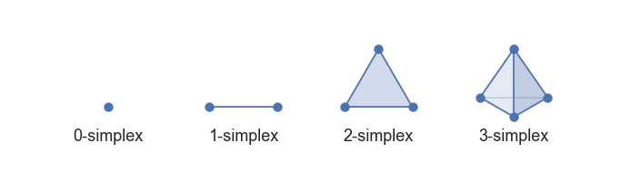
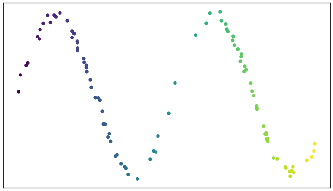
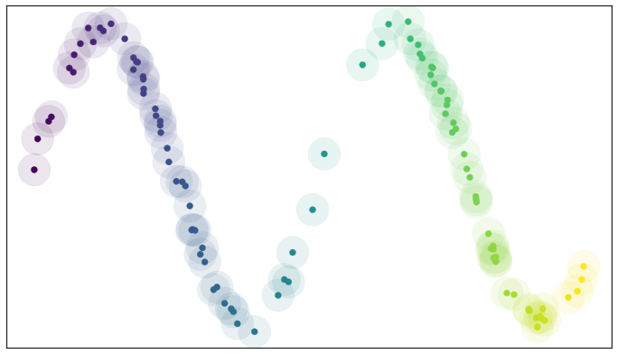
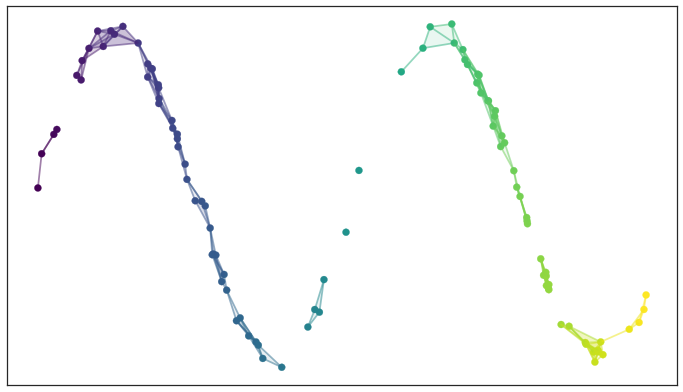
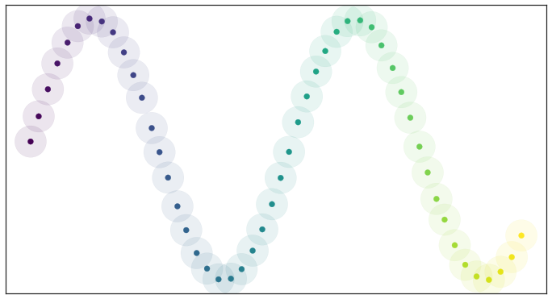
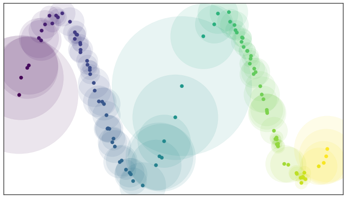
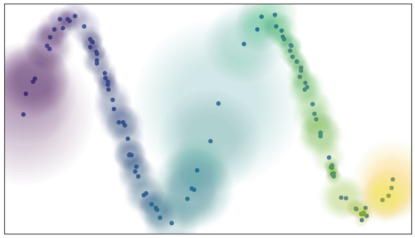
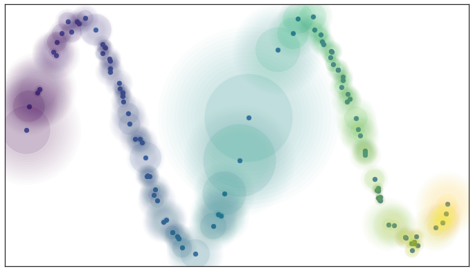
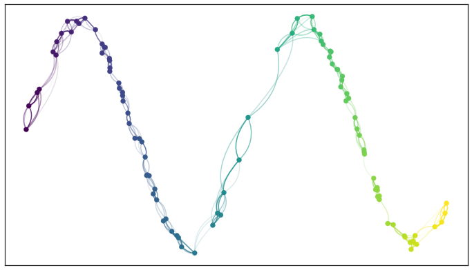

.. _how_umap_works:

How UMAP Works
==============

UMAP is an algorithm for dimension reduction based on manifold learning
techniques and ideas from topological data analysis. It provides a very
general framework for approaching manifold learning and dimension
reduction, but can also provide specific concrete realizations. This
article will discuss how the algorithm works in practice. There exist
deeper mathematical underpinnings, but for the sake of readability by a
general audience these will merely be referenced and linked. If you are
looking for the mathematical description please see the `UMAP
paper <https://arxiv.org/abs/1802.03426>`__.

To begin making sense of UMAP we will need a little bit of mathematical
background from algebraic topology and topological data analysis. This
will provide a basic algorithm that works well in theory, but
unfortunately not so well in practice. The next step will be to make use
of some basic Riemannian geometry to bring real world data a little
closer to the underlying assumptions of the topological data analysis
algorithm. Unfortunately this will introduce new complications, which
will be resolved through a combination of deep math (details of which
will be elided) and fuzzy logic. We can then put the pieces back
together again, and combine them with a new approach to finding a low
dimensional representation more fitting to the new data structures at
hand. Putting this all together we arrive at the basic UMAP algorithm.

Topological Data Analysis and Simplicial Complexes
--------------------------------------------------

Simplicial complexes are a means to construct topological spaces out of
simple combinatorial components. This allows one to reduce the
complexities of dealing with the continuous geometry of topological
spaces to the task of relatively simple combinatorics and counting. This
method of taming geometry and topology will be fundamental to our
approach to topological data analysis in general, and dimension
reduction in particular.

The first step is to provide some simple combinatorial building blocks
called `*simplices* <https://en.wikipedia.org/wiki/Simplex>`__.
Geometrically a simplex is a very simple way to build a
:math:`k`-dimensional object. A :math:`k` dimensional simplex is called
a :math:`k`-simplex, and it is formed by taking the convex hull of
:math:`k+1` independent points. Thus a 0-simplex is a point, a 1-simplex
is a line segment (between two zero simplices), a 2-simplex is a
triangle (with three 1-simplices as "faces"), and a 3-simplex is a
tetrahedron (with four 2-simplices as "faces"). Such a simple
construction allows for easy generalization to arbitrary dimensions.

   Low dimensional simplices

This has a very simple combinatorial underlying structure, and
ultimately one can regard a :math:`k`-simplex as an arbitrary set of
:math:`k+1` objects with faces (and faces of faces etc.) given by
appropriately sized subsets -- one can always provide a "geometric
realization" of this abstract set description by constructing the
corresponding geometric simplex.

Simplices can provide building blocks, but to construct interesting
topological spaces we need to be able to glue together such building
blocks. This can be done by constructing a `*simplicial
complex* <https://en.wikipedia.org/wiki/Simplicial_complex>`__.
Ostensibly a simplicial complex is a set of simplices glued together
along faces. More explicitly a simplicial complex :math:`\mathcal{K}` is
a set of simplices such that any face of any simplex in
:math:`\mathcal{K}` is also in :math:`\mathcal{K}` (ensuring all faces
exist), and the intersection of any two simplices in :math:`\mathcal{K}`
is a face of both simplices. A large class of topological spaces can be
constructed in this way -- just gluing together simplices of various
dimensions along their faces. A little further abstraction will get to
`*simplicial sets* <https://en.wikipedia.org/wiki/Simplicial_set>`__
which are purely combinatorial, have a nice category theoretic
presentation, and can generate a much broader class of topological
spaces, but that will take us too far afield for this article. The
intuition of simplicial complexes will be enough to illustrate the
relevant ideas and motivation.

How does one apply these theoretical tools from topology to finite sets
of data points? To start we'll look at how one might construct a
simplicial complex from a topological space. The tool we will consider is
the construction of a `Čech
complex <https://en.wikipedia.org/wiki/%C4%8Cech_cohomology>`__ given an
open cover of a topological space. That's a lot of verbiage if you
haven't done much topology, but we can break it down fairly easily for
our use case. An open cover is essentially just a family of sets whose
union is the whole space, and a Čech complex is a combinatorial way to
convert that into a simplicial complex. It works fairly simply: let each
set in the cover be a 0-simplex; create a 1-simplex between two such
sets if they have a non-empty intersection; create a 2-simplex between
three such sets if the triple intersection of all three is non-empty;
and so on. Now, that doesn't sound very advanced -- just looking at
intersections of sets. The key is that the background topological theory
actually provides guarantees about how well this simple process can
produce something that represents the topological space itself in a
meaningful way (the `Nerve
theorem <https://en.wikipedia.org/wiki/Nerve_of_a_covering>`__ is the relevant
result for those interested). Obviously the quality of the cover is
important, and finer covers provide more accuracy, but the reality is
that despite its simplicity the process captures much of the topology.

Next we need to understand how to apply that process to a finite set of
data samples. If we assume that the data samples are drawn from some
underlying topological space then to learn about the topology of that
space we need to generate an open cover of it. If our data actually lie
in a metric space (i.e. we can measure distance between points) then one
way to approximate an open cover is to simply create balls of some fixed
radius about each data point. Since we only have finite samples, and not
the topological space itself, we cannot be sure it is truly an open
cover, but it might be as good an approximation as we could
reasonably expect. This approach also has the advantage that the Čech
complex associated to the cover will have a 0-simplex for each data
point.

To demonstrate the process let's consider a test dataset like this

   Test data set of a noisy sine wave

If we fix a radius we can then picture the open sets of our cover as
circles (since we are in a nice visualizable two dimensional case). The
result is something like this

   A basic open cover of the test data

We can then depict the the simplicial complex of 0-, 1-, and 2-simplices
as points, lines, and triangles

   A simplicial complex built from the test data

It is harder to easily depict the higher dimensional simplices, but you
can imagine how they would fit in. There are two things to note here:
first, the simplicial complex does a reasonable job of starting to
capture the fundamental topology of the dataset; second, most of the
work is really done by the 0- and 1-simplices, which are easier to deal
with computationally (it is just a graph, in the nodes and edges sense).
The second observation motivates the `Vietoris-Rips
complex <https://en.wikipedia.org/wiki/Vietoris%E2%80%93Rips_complex>`__,
which is similar to the Čech complex but is entirely determined by the
0- and 1-simplices. Vietoris-Rips complexes are much easier to work with
computationally, especially for large datasets, and are one of the major
tools of topological data analysis.

If we take this approach to get a topological representation then we can
build a dimension reduction algorithm by finding a low dimensional
representation of the data that has a similar topological
representation. If we only care about the 0- and 1-simplices then the
topological representation is just a graph, and finding a low
dimensional representation can be described as a `graph layout
problem <https://en.wikipedia.org/wiki/Graph_drawing>`__. If one wants to use, for example, spectral methods for
graph layout then we arrive at algorithms like `Laplacian
eigenmaps <https://en.wikipedia.org/wiki/Nonlinear_dimensionality_reduction#Laplacian_eigenmaps>`__ and `Diffusion maps <https://en.wikipedia.org/wiki/Nonlinear_dimensionality_reduction#Diffusion_maps>`__. Force directed layouts are
also an option, and provide algorithms closer to `MDS <https://en.wikipedia.org/wiki/Multidimensional_scaling>`__ or `Sammon
mapping <https://en.wikipedia.org/wiki/Sammon_mapping>`__ in flavour.

I would not blame those who have read this far to wonder why we took
such an abstract roundabout road to simply building a neighborhood-graph
on the data and then laying out that graph. There are a couple of
reasons. The first reason is that the topological approach, while
abstract, provides sound theoretical justification for what we are
doing. While building a neighborhood-graph and laying it out in lower
dimensional space makes heuristic sense and is computationally tractable,
it doesn't provide the same underlying motivation of capturing the
underlying topological structure of the data faithfully -- for that we
need to appeal to the powerful topological machinery I've hinted lies in
the background. The second reason is that it is this more abstract
topological approach that will allow us to generalize the approach and
get around some of the difficulties of the sorts of algorithms described
above. While ultimately we will end up with a process that is fairly
simple computationally, understanding *why* various manipulations matter
is important to truly understanding the algorithm (as opposed to merely
computing with it).

Adapting to Real World Data
---------------------------

The approach described above provides a nice theory for why a
neighborhood graph based approach should capture manifold structure when
doing dimension reduction. The problem tends to come when one tries to
put the theory into practice. The first obvious difficulty (and we can
see it even our example above) is that choosing the right radius for the
balls that make up the open cover is hard. If you choose something too
small the resulting simplicial complex splits into many connected
components. If you choose something too large the simplicial complex
turns into just a few very high dimensional simplices (and their faces
etc.) and fails to capture the manifold structure anymore. How should
one solve this?

The dilemma is in part due to the theorem (called the `Nerve
theorem <https://en.wikipedia.org/wiki/Nerve_of_a_covering>`__) that
provides our justification that this process captures the topology.
Specifically, the theorem says that the simplicial complex will be
(homotopically) equivalent to the union of the cover. In our case,
working with finite data, the cover, for certain radii, doesn't cover
the whole of the manifold that we imagine underlies the data -- it is
that lack of coverage that results in the disconnected components.
Similarly, where the points are too bunched up, our cover does cover
"too much" and we end up with higher dimensional simplices than we might
ideally like. If the data were *uniformly distributed* across the
manifold then selecting a suitable radius would be easy -- the average
distance between points would work well. Moreover with a uniform
distribution we would be guaranteed that our cover would actually cover
the whole manifold with no "gaps" and no unnecessarily disconnected
components. Similarly, we would not suffer from those unfortunate
bunching effects resulting in unnecessarily high dimensional simplices.

If we consider data that is uniformly distributed along the same
manifold it is not hard to pick a good radius (a little above half the
average distance between points) and the resulting open cover looks
pretty good:

   Open balls over uniformly\_distributed\_data

Because the data is evenly spread we actually cover the underlying
manifold and don't end up with clumping. In other words, all this theory
works well assuming that the data is uniformly distributed over the
manifold.

Unsurprisingly this uniform distribution assumption crops up elsewhere
in manifold learning. The proofs that Laplacian eigenmaps work well
require the assumption that the data is uniformly distributed on the
manifold. Clearly if we had a uniform distribution of points on the
manifold this would all work a lot better -- but we don't! Real world
data simply isn't that nicely behaved. How can we resolve this? By
turning the problem on its head: assume that the data is uniformly
distributed on the manifold, and ask what that tells us about the
manifold itself. If the data *looks* like it isn't uniformly distributed
that must simply be because the notion of distance is varying across the
manifold -- space itself is warping: stretching or shrinking according
to where the data appear sparser or denser.

By assuming that the data is uniformly distributed we can actually
compute (an approximation of) a local notion of distance for each point
by making use of a little standard `Riemannian
geometry <https://en.wikipedia.org/wiki/Riemannian_geometry>`__. In
practical terms, once you push the math through, this turns out to mean
that a unit ball about a point stretches to the *k*-th nearest neighbor
of the point, where *k* is the sample size we are using to approximate
the local sense of distance. Each point is given its own unique distance
function, and we can simply select balls of radius one with respect to
that local distance function!

   Open balls of radius one with a locally varying metric

This theoretically derived result matches well with many traditional
graph based algorithms: a standard approach for such algorithms is to
use a *k*-neighbor graph instead of using balls of some fixed radius to
define connectivity. What this means is that each point in the dataset
is given an edge to each of its *k* nearest neighbors -- the effective
result of our locally varying metric with balls of radius one. Now,
however, we can explain why this works in terms of simplicial complexes
and the Nerve theorem.

Of course we have traded choosing the radius of the balls for choosing a
value for *k*. However it is often easier to pick a resolution scale in
terms of number of neighbors than it is to correctly choose a distance.
This is because choosing a distance is very dataset dependent: one needs
to look at the distribution of distances in the dataset to even begin to
select a good value. In contrast, while a *k* value is still dataset
dependent to some degree, there are reasonable default choices, such as
the 10 nearest neighbors, that should work acceptably for most datasets.

At the same time the topological interpretation of all of this gives us
a more meaningful interpretation of *k*. The choice of *k* determines how
locally we wish to estimate the Riemannian metric. A small choice of *k*
means we want a very local interpretation which will more accurately
capture fine detail structure and variation of the Riemannian metric.
Choosing a large *k* means our estimates will be based on larger
regions, and thus, while missing some of the fine detail structure, they
will be more broadly accurate across the manifold as a whole, having
more data to make the estimate with.

We also get a further benefit from this Riemannian metric based
approach: we actually have a local metric space associated to each
point, and can meaningfully measure distance, and thus we could weight
the edges of the graph we might generate by how far apart (in terms of
the local metric) the points on the edges are. In slightly more
mathematical terms we can think of this as working in a fuzzy topology
where being in an open set in a cover is no longer a binary yes or no,
but instead a fuzzy value between zero and one. Obviously the certainty
that points are in a ball of a given radius will decay as we move away
from the center of the ball. We could visualize such a fuzzy cover as
looking something like this

   Fuzzy open balls of radius one with a locally varying metric

None of that is very concrete or formal -- it is merely an intuitive
picture of what we would like to have happen. It turns out that we can
actually formalize all of this by stealing the `singular
set <https://en.wikipedia.org/wiki/Simplicial_set#Singular_set_for_a_space>`__
and `geometric
realization <https://en.wikipedia.org/wiki/Simplicial_set#Geometric_realization>`__
functors from algebraic topology and then adapting them to apply to
metric spaces and fuzzy simplicial sets. The mathematics involved in
this is outside the scope of this exposition, but for those interested
you can look at the `original work on this by David
Spivak <http://math.mit.edu/~dspivak/files/metric_realization.pdf>`__
and our `paper <https://arxiv.org/abs/1802.03426>`__. It will have to
suffice to say that there is some mathematical machinery that lets us
realize this intuition in a well defined way.

This resolves a number of issues, but a new problem presents itself when
we apply this sort of process to real data, especially in higher
dimensions: a lot of points become essentially totally isolated. One
would imagine that this shouldn't happen if the manifold the data was
sampled from isn't pathological. So what property are we expecting that
manifold to have that we are somehow missing with the current approach?
What we need to add is the idea of local connectivity.

Note that this is not a requirement that the manifold as a whole be
connected -- it can be made up of many connected components. Instead it
is a requirement that at any point on the manifold there is some
sufficiently small neighborhood of the point that *is* connected (this
"in a sufficiently small neighborhood" is what the "local" part means).
For the practical problem we are working with, where we only have a
finite approximation of the manifold, this means that no point should be
*completely* isolated -- it should connect to at least one other point.
In terms of fuzzy open sets what this amounts to is that we should have
complete confidence that the open set extends as far as the closest
neighbor of each point. We can implement this by simply having the fuzzy
confidence decay in terms of distance *beyond* the first nearest
neighbor. We can visualize the result in terms of our example dataset
again.

   Local connectivity and fuzzy open sets

Again this can be formalized in terms of the aforementioned mathematical
machinery from algebraic topology. From a practical standpoint this
plays an important role for high dimensional data -- in high dimensions
distances tend to be larger, but also more similar to one another (see
`the curse of
dimensionality <https://en.wikipedia.org/wiki/Curse_of_dimensionality>`__).
This means that the distance to the first nearest neighbor can be quite
large, but the distance to the tenth nearest neighbor can often be only
slightly larger (in relative terms). The local connectivity constraint
ensures that we focus on the difference in distances among nearest
neighbors rather than the absolute distance (which shows little
differentiation among neighbors).

Just when we think we are almost there, having worked around some of the
issues of real world data, we run aground on a new obstruction: our
local metrics are not compatible! Each point has its own local metric
associated to it, and from point *a*'s perspective the distance from
point *a* to point *b* might be 1.5, but from the perspective of point
*b* the distance from point *b* to point *a* might only be 0.6. Which
point is right? How do we decide? Going back to our graph based
intuition we can think of this as having directed edges with varying
weights something like this.

   Edges with incompatible weights

Between any two points we might have up to two edges and the weights on
those edges disagree with one another. There are a number of options for
what to do given two disagreeing weights -- we could take the maximum,
the minimum, the arithmetic mean, the geometric mean, or something else
entirely. What we would really like is some principled way to make the
decision. It is at this point that the mathematical machinery we built
comes into play. Mathematically we actually have a family of fuzzy
simplicial sets, and the obvious choice is to take their union -- a well
defined operation. There are a a few ways to define fuzzy unions,
depending on the nature of the logic involved, but here we have
relatively clear probabilistic semantics that make the choice
straightforward. In graph terms what we get is the following: if we want
to merge together two disagreeing edges with weight *a* and *b* then we
should have a single edge with combined weight :math:`a + b - a \cdot b`. 
The way to think of this is that the weights are effectively the 
probabilities that an edge (1-simplex) exists. The combined weight is 
then the probability that at least one of the edges exists.

If we apply this process to union together all the fuzzy simplicial sets
we end up with a single fuzzy simplicial complex, which we can again
think of as a weighted graph. In computational terms we are simply
applying the edge weight combination formula across the whole graph
(with non-edges having a weight of 0). In the end we have something that
looks like this.

.. figure:: images/how_umap_works_umap_graph.png
   :alt: Graph with combined edge weights

   Graph with combined edge weights

So in some sense in the end we have simply constructed a weighted graph
(although we could make use of higher dimensional simplices if we
wished, just at significant extra computational cost). What the
mathematical theory lurking in the background did for us is determine
*why* we should construct *this* graph. It also helped make the
decisions about exactly *how* to compute things, and gives a concrete
interpretation of *what* this graph means. So while in the end we just
constructed a graph, the math answered the important questions to get us
here, and can help us determine what to do next.

So given that we now have a fuzzy topological representation of the data
(which the math says will capture the topology of the manifold
underlying the data), how do we go about converting that into a low
dimensional representation?

Finding a Low Dimensional Representation
----------------------------------------

Ideally we want the low dimensional representation to have as similar
a fuzzy topological structure as possible. The first question
is how do we determine the fuzzy topological structure of a low
dimensional representation, and the second question is how do we find a
good one.

The first question is largely already answered -- we should presumably
follow the same procedure we just used to find the fuzzy topological
structure of our data. There is a quirk, however: this time around the
data won't be lying on some manifold, we'll have a low dimensional
representation that is lying on a very particular manifold. That
manifold is, of course, just the low dimensional euclidean space we are
trying to embed into. This means that all the effort we went to
previously to make vary the notion of distance across the manifold is
going to be misplaced when working with the low dimensional
representation. We explicitly *want* the distance on the manifold to be
standard euclidean distance with respect to the global coordinate
system, not a varying metric. That saves some trouble. The other quirk
is that we made use of the distance to the nearest neighbor, again
something we computed given the data. This is also a property we would
like to be globally true across the manifold as we optimize toward a
good low dimensional representation, so we will have to accept it as a
hyper-parameter ``min_dist`` to the algorithm.

The second question, 'how do we find a good low dimensional
representation', hinges on our ability to measure how "close" a match we
have found in terms of fuzzy topological structures. Given such a
measure we can turn this into an optimization problem of finding the low
dimensional representation with the closest fuzzy topological structure.
Obviously if our measure of closeness turns out to have various
properties the nature of the optimization techniques we can apply will
differ.

Going back to when we were merging together the conflicting weights
associated to simplices, we interpreted the weights as the probability
of the simplex existing. Thus, since both topological structures we are
comparing share the same 0-simplices, we can imagine that we are
comparing the two vectors of probabilities indexed by the 1-simplices.
Given that these are Bernoulli variables (ultimately the simplex either
exists or it doesn't, and the probability is the parameter of a
Bernoulli distribution), the right choice here is the cross entropy.

Explicitly, if the set of all possible 1-simplices is :math:`E`, and we
have weight functions such that :math:`w_h(e)` is the weight of the
1-simplex :math:`e` in the high dimensional case and :math:`w_l(e)` is
the weight of :math:`e` in the low dimensional case, then the cross
entropy will be

.. math::

   \sum_{e\in E} w_h(e) \log\left(\frac{w_h(e)}{w_l(e)}\right) + (1 - w_h(e)) \log\left(\frac{1 - w_h(e)}{1 - w_l(e)}\right)

This might look complicated, but if we go back to thinking in terms of a
graph we can view minimizing the cross entropy as a kind of force
directed graph layout algorithm.

The first term, :math:`w_h(e) \log\left(\frac{w_h(e)}{w_l(e)}\right)`,
provides an attractive force between the points :math:`e` spans whenever
there is a large weight associated to the high dimensional case. This is
because this term will be minimized when :math:`w_l(e)` is as large as
possible, which will occur when the distance between the points is as
small as possible.

In contrast the second term,
:math:`(1 - w_h(e)) \log\left(\frac{1 - w_h(e)}{1 - w_l(e)}\right)`,
provides a repulsive force between the ends of :math:`e` whenever
:math:`w_h(e)` is small. This is because the term will be minimized by
making :math:`w_l(e)` as small as possible.

On balance this process of pull and push, mediated by the weights on
edges of the topological representation of the high dimensional data,
will let the low dimensional representation settle into a state that
relatively accurately represents the overall topology of the source
data.

The UMAP Algorithm
------------------

Putting all these pieces together we can construct the UMAP algorithm.
The first phase consists of constructing a fuzzy topological
representation, essentially as described above. The second phase is
simply optimizing the low dimensional representation to have as close
a fuzzy topological representation as possible as measured by cross
entropy.

When constructing the initial fuzzy topological representation we can
take a few shortcuts. In practice, since fuzzy set membership strengths
decay away to be vanishingly small, we only need to compute them for the
nearest neighbors of each point. Ultimately that means we need a way to
quickly compute (approximate) nearest neighbors efficiently, even in
high dimensional spaces. We can do this by taking advantage of the
`Nearest-Neighbor-Descent algorithm of Dong et
al <http://www.cs.princeton.edu/cass/papers/www11.pdf>`__. The remaining
computations are now only dealing with local neighbors of each point and
are thus very efficient.

In optimizing the low dimensional embedding we can again take some
shortcuts. We can use stochastic gradient descent for the optimization
process. To make the gradient descent problem easier it is beneficial if
the final objective function is differentiable. We can arrange for that
by using a smooth approximation of the actual membership strength
function for the low dimensional representation, selecting from a
suitably versatile family. In practice UMAP uses the family of curves of
the form :math:`\frac{1}{1 + a x^{2b}}`. Equally we don't want to have to
deal with all possible edges, so we can use the negative sampling trick
(as used by word2vec and LargeVis), to simply sample negative examples
as needed. Finally since the Laplacian of the topological representation
is an approximation of the Laplace-Beltrami operator of the manifold we
can use spectral embedding techniques to initialize the low dimensional
representation into a good state.

Putting all these pieces together we arrive at an algorithm that is fast
and scalable, yet still built out of sound mathematical theory.
Hopefully this introduction has helped provide some intuition for that
underlying theory, and for how the UMAP algorithm works in practice.
