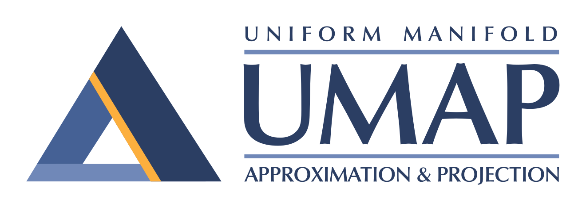

.. umap documentation master file, created by
   sphinx-quickstart on Fri Jun  8 10:09:40 2018.
   You can adapt this file completely to your liking, but it should at least
   contain the root `toctree` directive.

UMAP: Uniform Manifold Approximation and Projection for Dimension Reduction
===========================================================================

Uniform Manifold Approximation and Projection (UMAP) is a dimension reduction
technique that can be used for visualisation similarly to t-SNE, but also for
general non-linear dimension reduction. The algorithm is founded on three
assumptions about the data

1. The data is uniformly distributed on Riemannian manifold;
2. The Riemannian metric is locally constant (or can be approximated as such);
3. The manifold is locally connected.

From these assumptions it is possible to model the manifold with a fuzzy
topological structure. The embedding is found by searching for a low dimensional
projection of the data that has the closest possible equivalent fuzzy
topological structure.

The details for the underlying mathematics can be found in
`our paper on ArXiv <https://arxiv.org/abs/1802.03426>`_:

McInnes, L, Healy, J, *UMAP: Uniform Manifold Approximation and Projection
for Dimension Reduction*, ArXiv e-prints 1802.03426, 2018

You can find the software `on github <https://github.com/lmcinnes/>`_.

**Installation**

Conda install, via the excellent work of the conda-forge team:

.. code:: bash

    conda install -c conda-forge umap-learn

The conda-forge packages are available for linux, OS X, and Windows 64 bit.

PyPI install, presuming you have numba and sklearn and all its requirements
(numpy and scipy) installed:

.. code:: bash

    pip install umap-learn

.. toctree::
   :maxdepth: 2
   :caption: User Guide / Tutorial:

   basic_usage
   parameters
   plotting
   reproducibility
   transform
   inverse_transform
   parametric_umap
   sparse
   supervised
   clustering
   outliers
   composing_models
   densmap_demo
   mutual_nn_umap
   document_embedding
   embedding_space
   aligned_umap_basic_usage
   aligned_umap_politics_demo
   precomputed_k-nn
   release_notes
   faq

.. toctree::
   :maxdepth: 2
   :caption: Background on UMAP:

   how_umap_works
   performance

.. toctree::
   :maxdepth: 2
   :caption: Examples of UMAP usage

   interactive_viz
   exploratory_analysis
   scientific_papers

.. toctree::
   :caption: API Reference:

   api

Indices and tables
==================

* :ref:`genindex`
* :ref:`modindex`
* :ref:`search`
