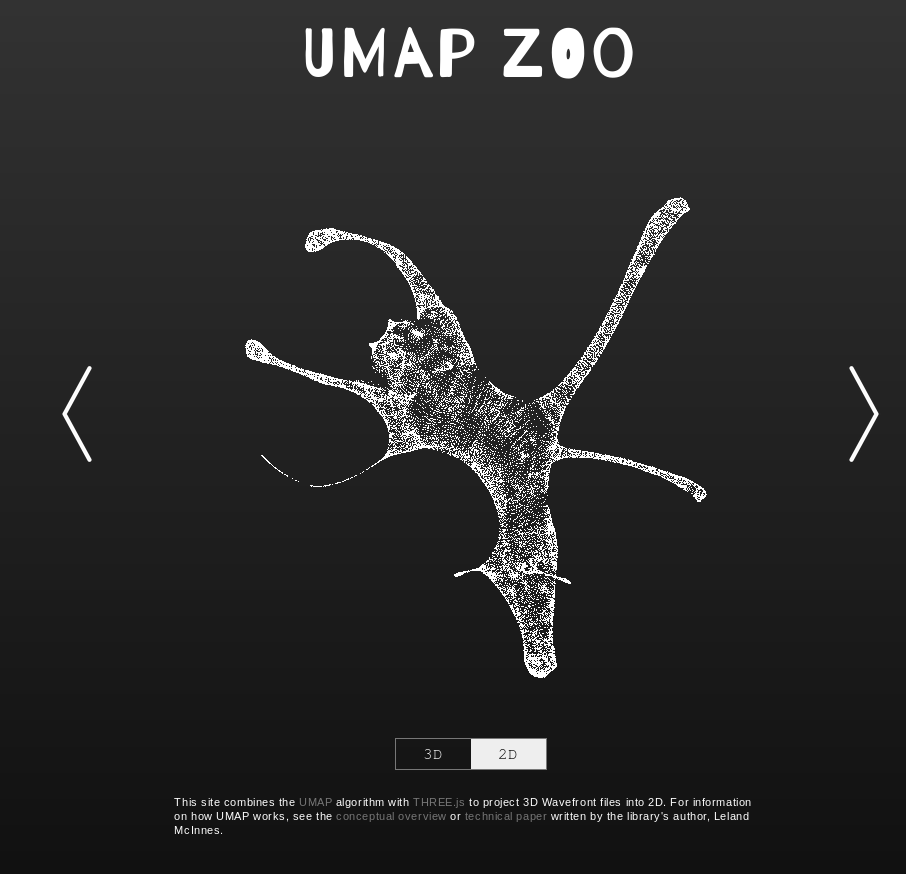
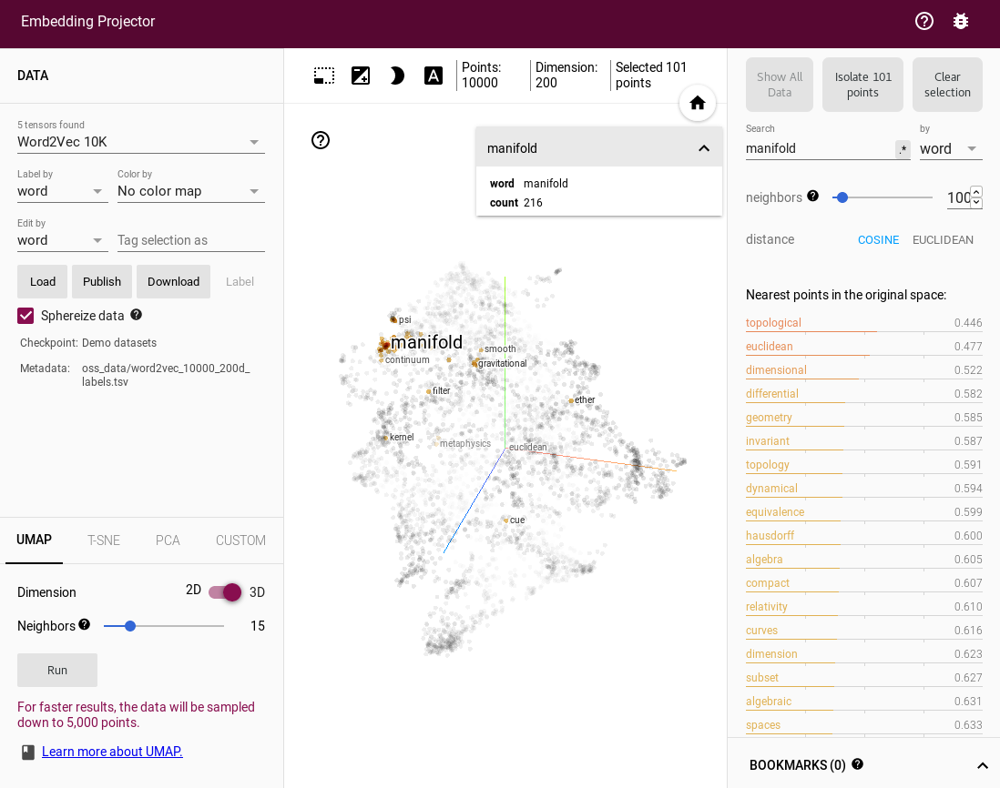
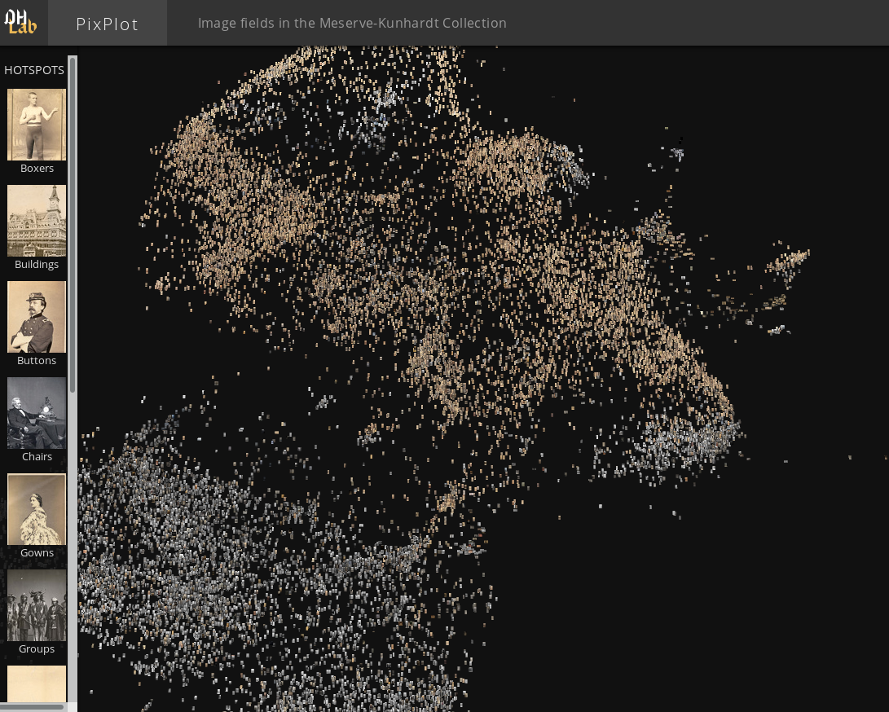
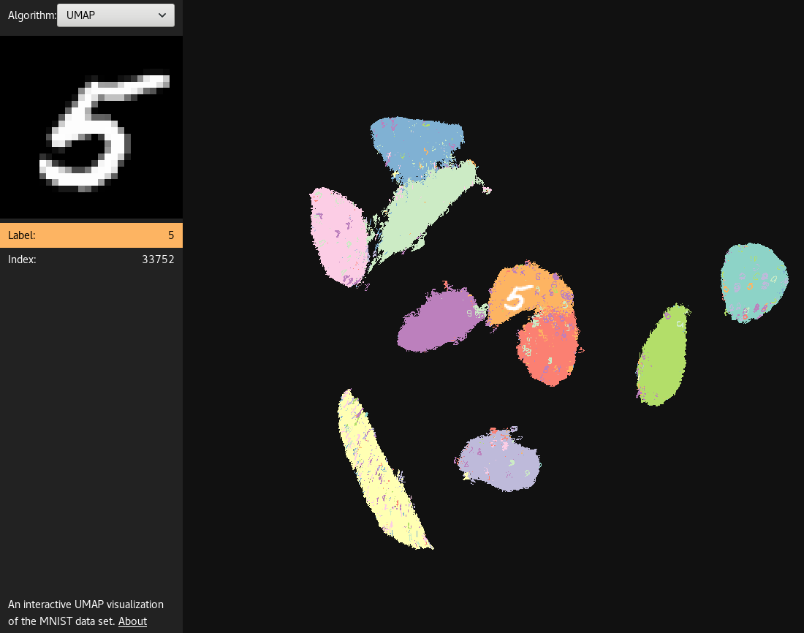
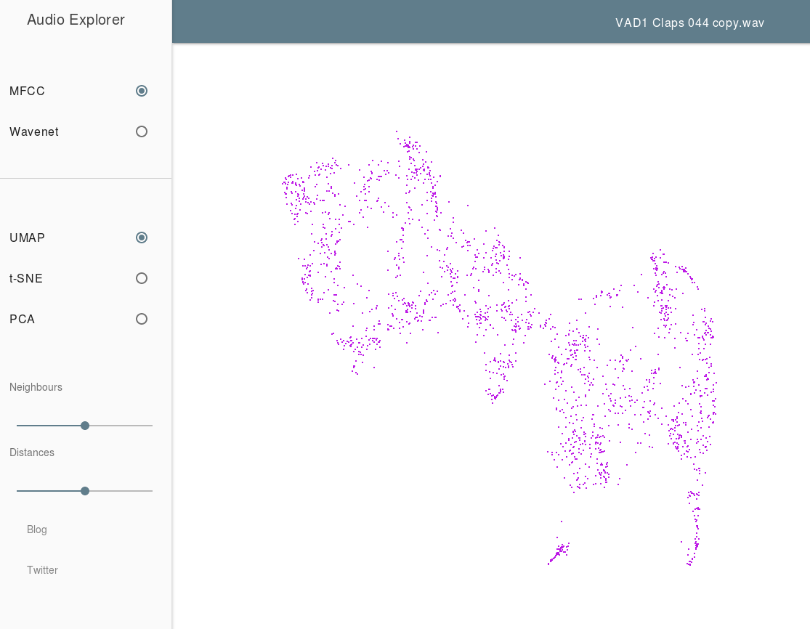
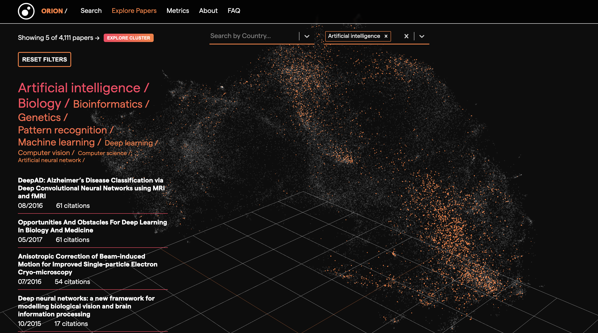
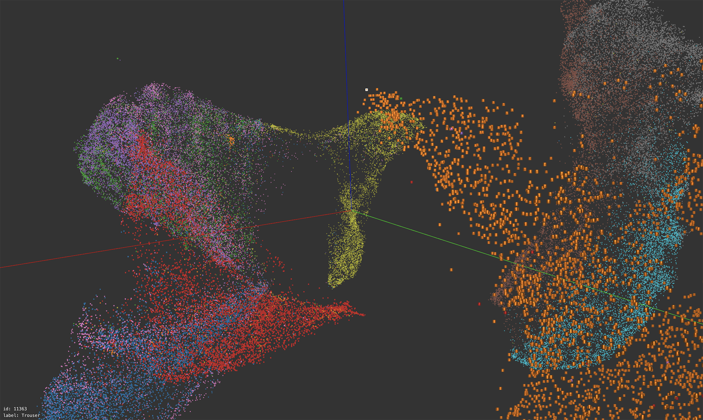
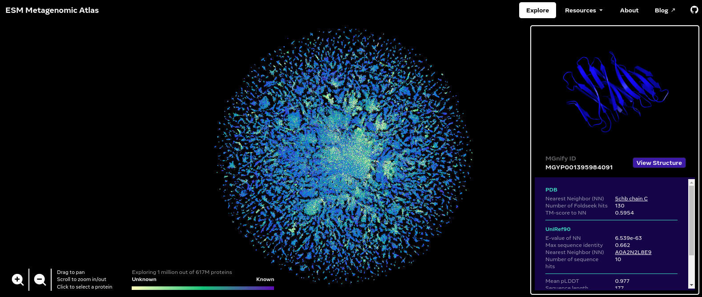

Interactive Visualizations
==========================

UMAP has found use in a number of interesting interactive visualization projects, analyzing everything from
images from photo archives, to word embedding, animal point clouds, and even sound. Sometimes it has also
been used in interesting interactive tools that simply help a user to get an intuition for what the algorithm
is doing (by applying it to intuitive 3D data). Below are some amazing projects that make use of UMAP.

UMAP Zoo
--------
An exploration of how UMAP behaves when dimension reducing point clouds of animals. It is
interactive, letting you switch between 2D and 3D representations and has a wide selection
of different animals. Attempting to guess the animal from the 2D UMAP representation is a
fun game. In practice this tool can go a long way to helping to build at least some intuitions
for what UMAP tends to do with data.

`UMAP Zoo <https://duhaime.s3.amazonaws.com/apps/umap-zoo/index.html>`__

Thanks to Douglas Duhaime.

Tensorflow Embedding Projector
------------------------------
If you just want to explore UMAP embeddings of datasets then the Embedding Projector
from Tensorflow is a great way to do that. As well as having a good interactive 3D view
it also has facilities for inspecting and searching labels and tags on the data. By default
it loads up word2vec vectors, but you can upload any data you wish. You can then select
the UMAP option among the tabs for embeddings choices (alongside PCA and t-SNE).

`Embedding Projector <https://projector.tensorflow.org/>`__

Thanks to Andy Coenen and the Embedding Projector team.

PixPlot
-------
PixPlot provides an overview of large photo-collections. In the demonstration app
from Yale's Digital Humanities lab it provides a window on the Meserve-Kunhardt Collection
of historical photographs. The approach uses convolutional neural nets to reduce the images
to 2048 dimensions, and then uses UMAP to present them in a 2-dimensional map which the
user can interactive pan and zoom around in. This process results in similar photos
ending up in similar regions of the map allowing for easy perusal of large photo
collections. The PixPlot project is also available on github in case you wish to train
it on your own photo collection.

`PixPlot <https://dhlab.yale.edu/projects/pixplot/>`__

Thanks to Douglas Duhaime and the Digital Humanities lab at Yale.

UMAP Explorer
-------------
A great demonstration of building a web based app for interactively exploring a UMAP embedding.
In this case it provides an exploration of UMAP run on the MNIST digits dataset. Each point in
the embedding is rendered as the digit image, and coloured according to the digit class. Mousing
over the images will make them larger and provide a view of the digit in the upper left. You can also pan
and zoom around the emebdding to get a better understanding of how UMAP has mapped the different styles of
handwritten digits down to 2 dimensions.

`UMAP Explorer <https://grantcuster.github.io/umap-explorer/>`__

Thanks to Grant Custer.

Audio Explorer
--------------
The Audio Explorer uses UMAP to embed sound samples into a 2 dimensional space for easy exploration.
The goal here is to take a large library of sounds samples and put similar sounds in similar regions
of the map, allowing a user to quickly mouse over and listen to various variations of a given sample
to quickly find exactly the right sound sample to use. Audio explorer uses MFCCs and/or WaveNet to
provide an initial useful vector representation of the sound samples, before applying UMAP to
generate the 2D embedding.

`Audio Explorer <http://doc.gold.ac.uk/~lfedd001/three/demo.html>`__

Thanks to Leon Fedden.

Orion Search
------------
Orion is an open source research measurement and knowledge discovery tool that enables you to monitor
progress in science, visually explore the scientific landscape and search for relevant publications.
Orion encodes bioRxiv paper abstracts to dense vectors with Sentence Transformers and projects them to
an interactive 3D visualisation with UMAP. You can filter the UMAP embeddings by topic and country.
You can also select a subset of the UMAP embeddings and retrieve those papers and their metadata.

`Orion Search <https://www.orion-search.org/>`__

Thanks to Kostas Stathoulopoulos, Zac Ioannidis and Lilia Villafuerte.

Exploring Fashion MNIST
-----------------------
A web based interactive exploration of a 3D UMAP embedding ran on the Fashion MNIST dataset. Users can
freely navigate the 3D space, jumping to a specific image by clicking an image or entering an image id.
Like Grant Custer's UMAP Explorer, each point is rendered as the actual image and colored according to
the label. It is also similar to the Tensorflow Embedding Projector, but designed more specifically for
Fashion MNIST, thus more efficient and capable of showing all the 70k images.

`Exploring Fashion MNIST <https://observablehq.com/@stwind/exploring-fashion-mnist/>`__

Thanks to stwind.

ESM Metagenomic Atlas
---------------------
The ESM Metagenomic Atlas contains over 600 million predicted protein structures, revealing the 
metagenomic world in a way we have never seen before. The Explore page visualizes a sample of 1 
million of these. (That’s about how much a browser can handle.) We represent each protein in this 
dataset as a single point, and reveal the actual protein structure when zooming in or when hovering 
over it. The color of each point corresponds to the similarity to the closest match we could find in 
UniRef90, the reference database of known protein sequences. The position in the map is a 
two-dimensional projection, which groups sequences by similarity, as determined by our language 
model’s internal representation. The map reveals structure at different scales: local neighbors in 
the same cluster tend to have similar structures, while nearby clusters preserve certain patterns 
like secondary structure elements.

Thanks to the authors of "Evolutionary-scale prediction of atomic level protein structure
with a language model".

`ESM Metagenomic Atlas <https://esmatlas.com/explore>`__