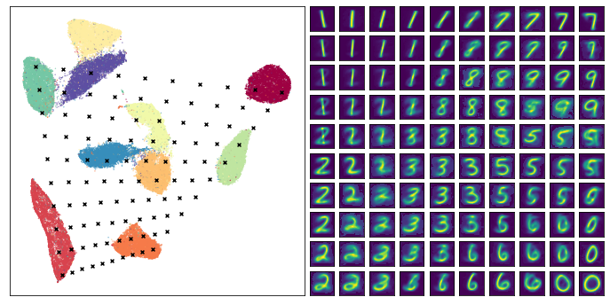
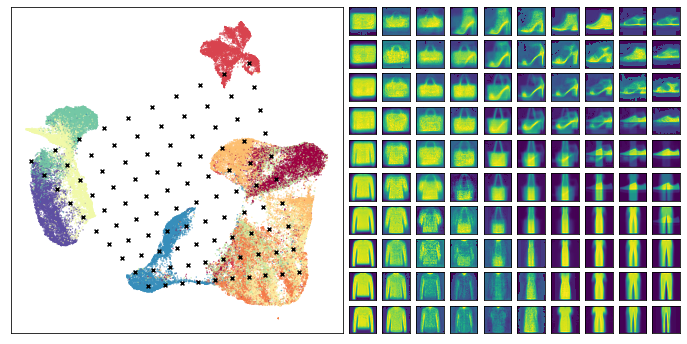

Inverse transforms
==================

UMAP has some support for inverse transforms -- generating a high
dimensional data sample given a location in the low dimensional
embedding space. To start let's load all the relevant libraries.

.. code:: python3

    import numpy as np
    import matplotlib.pyplot as plt
    from matplotlib.gridspec import GridSpec
    import seaborn as sns
    import sklearn.datasets
    import umap
    import umap.plot

We will need some data to test with. To start we'll use the MNIST digits
dataset. This is a dataset of 70000 handwritten digits encoded as
grayscale 28x28 pixel images. Our goal is to use UMAP to reduce the
dimension of this dataset to something small, and then see if we can
generate new digits by sampling points from the embedding space. To load
the MNIST dataset we'll make use of sklearn's ``fetch_openml`` function.

.. code:: python3

    data, labels = sklearn.datasets.fetch_openml('mnist_784', version=1, return_X_y=True)

Now we need to generate a reduced dimension representation of this data.
This is straightforward with UMAP, but in this case rather than using
``fit_transform`` we'll use the fit method so that we can retain the
trained model for later generating new digits based on samples from the
embedding space.

.. code:: python3

    mapper = umap.UMAP(random_state=42).fit(data)

To ensure that things worked correctly we can plot the data (since we
reduced it to two dimensions). We'll use the ``umap.plot`` functionality
to do this.

.. code:: python3

    umap.plot.points(mapper, labels=labels)

This looks much like we would expect. The different digit classes have
been decently separated. Now we need to create a set of samples in the
embedding space to apply the ``inverse_transform`` operation to. To do
this we'll generate a grid of samples linearly interpolating between
four corner points. To make our selection interesting we'll carefully
choose the corners to span over the dataset, and sample different digits
so that we can better see the transitions.

.. code:: python3

    corners = np.array([
        [-5, -10],  # 1
        [-7, 6],  # 7
        [2, -8],  # 2
        [12, 4],  # 0
    ])
    
    test_pts = np.array([
        (corners[0]*(1-x) + corners[1]*x)*(1-y) +
        (corners[2]*(1-x) + corners[3]*x)*y
        for y in np.linspace(0, 1, 10)
        for x in np.linspace(0, 1, 10)
    ])

Now we can apply the ``inverse_transform`` method to this set of test
points. Each test point is a two dimensional point lying somewhere in
the embedding space. The ``inverse_transform`` method will convert this
into an approximation of the high dimensional representation that would
have been embedded into such a location. Following the sklearn API this
is as simple to use as calling the ``inverse_transform`` method of the
trained model and passing it the set of test points that we want to
convert into high dimensional representations. Be warned that this can
be quite expensive computationally.

.. code:: python3

    inv_transformed_points = mapper.inverse_transform(test_pts)

Now the goal is to visualize how well we have done. Effectively what we
would like to do is show the test points in the embedding space, and
then show a grid of the corresponding images generated by the inverse
transform. To get all of this in a single matplotlib figure takes a
little setting up, but is quite manageable -- mostly it is just a matter
of managing ``GridSpec`` formatting. Once we have that setup we just
need a scatterplot of the embedding, a scatterplot of the test points,
and finally a grid of the images we generated (converting the inverse
transformed vectors into images is just a matter of reshaping them back
to 28 by 28 pixel grids and using ``imshow``).

.. code:: python3

    # Set up the grid
    fig = plt.figure(figsize=(12,6))
    gs = GridSpec(10, 20, fig)
    scatter_ax = fig.add_subplot(gs[:, :10])
    digit_axes = np.zeros((10, 10), dtype=object)
    for i in range(10):
        for j in range(10):
            digit_axes[i, j] = fig.add_subplot(gs[i, 10 + j])
    
    # Use umap.plot to plot to the major axis
    # umap.plot.points(mapper, labels=labels, ax=scatter_ax)
    scatter_ax.scatter(mapper.embedding_[:, 0], mapper.embedding_[:, 1],
                       c=labels.astype(np.int32), cmap='Spectral', s=0.1)
    scatter_ax.set(xticks=[], yticks=[])
    
    # Plot the locations of the text points
    scatter_ax.scatter(test_pts[:, 0], test_pts[:, 1], marker='x', c='k', s=15)
    
    # Plot each of the generated digit images
    for i in range(10):
        for j in range(10):
            digit_axes[i, j].imshow(inv_transformed_points[i*10 + j].reshape(28, 28))
            digit_axes[i, j].set(xticks=[], yticks=[])

The end result looks pretty good -- we did indeed generate plausible
looking digit images, and many of the transitions (from 1 to 7 across
the top row for example) seem pretty natural and make sense. This can
help you to understand the structure of the cluster of 1s (it
transitions on the angle, sloping toward what will eventually be 7s),
and why 7s and 9s are close together in the embedding. Of course there
are also some stranger transitions, especially where the test points
fell into large gaps between clusters in the embedding -- in some sense
it is hard to interpret what should go in some of those gaps as they
don't really represent anything resembling a smooth transition).

A further note: None of the test points chosen fall outside the convex
hull of the embedding. This is deliberate -- the inverse transform
function operates poorly outside the bounds of that convex hull. Be
warned that if you select points to inverse transform that are outside
the bounds about the embedding you will likely get strange results
(often simply snapping to a particular source high dimensional vector).

Let's continue the demonstration by looking at the Fashion MNIST
dataset. As before we can load this through sklearn.

.. code:: python3

    data, labels = sklearn.datasets.fetch_openml('Fashion-MNIST', version=1, return_X_y=True)

Again we can fit this data with UMAP and get a mapper object.

.. code:: python3

    mapper = umap.UMAP(random_state=42).fit(data)

Let's plot the embedding to see what we got as a result:

.. code:: python3

    umap.plot.points(mapper, labels=labels)

Again we'll generate a set of test points by making a grid interpolating
between four corners. As before we'll select the corners so that we can
stay within the convex hull of the embedding points and ensure nothing
too strange happens with the inverse transforms.

.. code:: python3

    corners = np.array([
        [-2, -6],  # bags
        [-9, 3],  # boots?
        [7, -5],  # shirts/tops/dresses
        [4, 10],  # pants
    ])
    
    test_pts = np.array([
        (corners[0]*(1-x) + corners[1]*x)*(1-y) +
        (corners[2]*(1-x) + corners[3]*x)*y
        for y in np.linspace(0, 1, 10)
        for x in np.linspace(0, 1, 10)
    ])

Now we simply apply the inverse transform just as before. Again, be
warned, this is quite expensive computationally and may take some time
to complete.

.. code:: python3

    inv_transformed_points = mapper.inverse_transform(test_pts)

And now we can use similar code as above to set up our plot of the
embedding with test points overlaid, and the generated images.

.. code:: python3

    # Set up the grid
    fig = plt.figure(figsize=(12,6))
    gs = GridSpec(10, 20, fig)
    scatter_ax = fig.add_subplot(gs[:, :10])
    digit_axes = np.zeros((10, 10), dtype=object)
    for i in range(10):
        for j in range(10):
            digit_axes[i, j] = fig.add_subplot(gs[i, 10 + j])
    
    # Use umap.plot to plot to the major axis
    # umap.plot.points(mapper, labels=labels, ax=scatter_ax)
    scatter_ax.scatter(mapper.embedding_[:, 0], mapper.embedding_[:, 1],
                       c=labels.astype(np.int32), cmap='Spectral', s=0.1)
    scatter_ax.set(xticks=[], yticks=[])
    
    # Plot the locations of the text points
    scatter_ax.scatter(test_pts[:, 0], test_pts[:, 1], marker='x', c='k', s=15)
    
    # Plot each of the generated digit images
    for i in range(10):
        for j in range(10):
            digit_axes[i, j].imshow(inv_transformed_points[i*10 + j].reshape(28, 28))
            digit_axes[i, j].set(xticks=[], yticks=[])

This time we see some of the interpolations between items looking rather
strange -- particularly the points that lie somewhere between shoes and
pants -- ultimately it is doing the best it can with a difficult
problem. At the same time many of the other transitions seem to work
pretty well, so it is, indeed, providing useful information about how
the embedding is structured.
