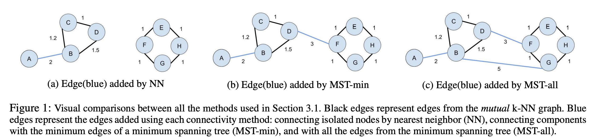
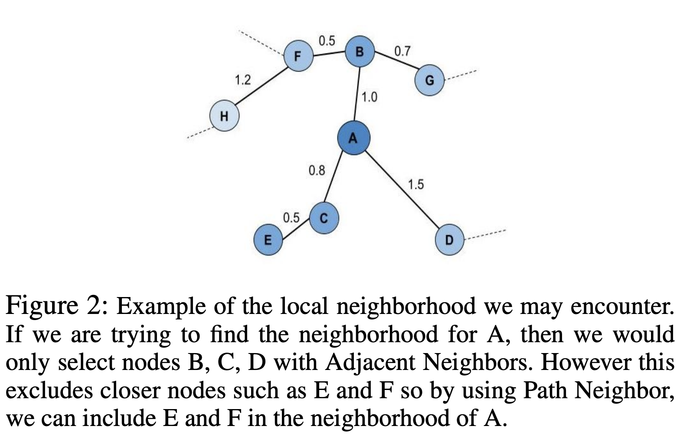
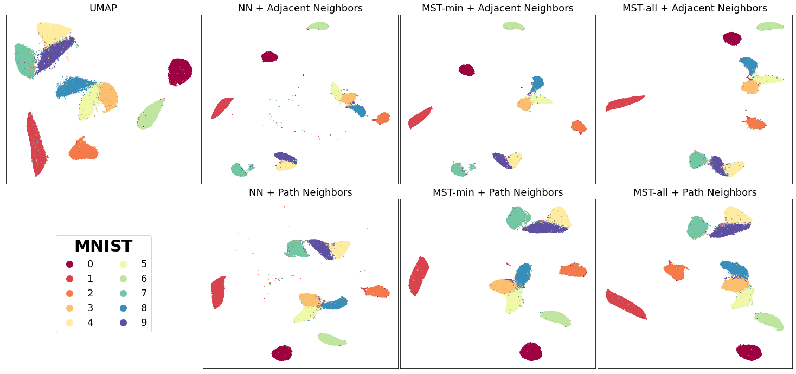
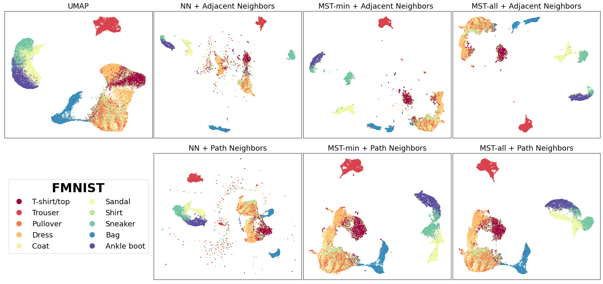
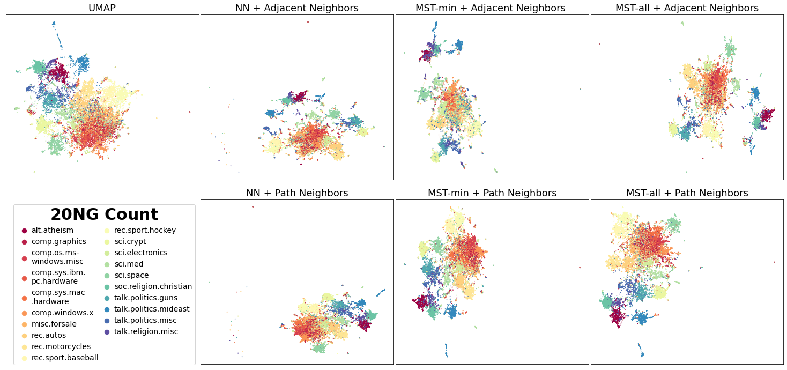
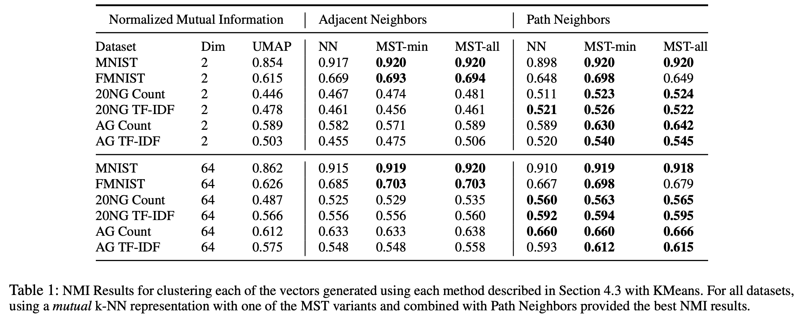

Improving the Separation Between Similar Classes Using a Mutual k-NN Graph
==========================================================================

This post briefly explains how the connectivity of the original graphical representation can adversely affect the resulting UMAP embeddings.

In default UMAP, a weighted k nearest neighbor (k-NN) graph, which connects each
datapoint to its 𝑘 nearest neighbors based on some distance metric, is constructed
and used to generate the initial topological representation of a dataset.

However, previous research has shown that using a weighted k-NN
graph may not provide an accurate representation of the underlying local
structure for a high dimensional dataset. The k-NN graph is relatively susceptible
to the “curse of dimensionality” and the associated distance concentration
effect, where distances are similar in high dimensions, as well as the
hub effect, where certain points become highly influential when highly
connected. This skews the local representation of high dimensional data,
deteriorating its performance for various similarity-based machine learning
tasks.

A recent paper titled
`Clustering with UMAP: Why and How Connectivity Matters <https://arxiv.org/abs/2108.05525>`__
proposes a refinement in the graph construction stage of the UMAP algorithm
that uses a weighted mutual k-NN graph rather than it vanilla counterpart,
to reduce the undesired distance concentration and hub effects.

Mutual k-NN graphs have been shown to contain many
desirable properties  when combating the “curse of dimensionality” as discussed in
`this paper <https://arxiv.org/abs/2108.05525>`__ . However, one pitfall of using a
mutual k-NN graph over the original k-NN graph is that it often
contains disconnected components and potential isolated vertices.

This violates one of UMAP primary assumptions that "The manifold is locally connected." To
combat the issue of isolated components, the authors consider different methods that have
been previously used to augment and increase the connectivity of the mutual k-NN graph:

1. ``NN``: To minimally connect isolated vertices and satisfy the assumption that the underlying manifold is locally connected, we add an undirected edge between each isolated vertex and its original nearest neighbor (de Sousa, Rezende, and Batista 2013).Note that the resulting graph may still contain disconnected components.
2. ``MST-min``: To achieve a connected graph, add the minimum number of edges from a maximum spanning tree to the mutual k-NN graph that has been weighted with similarity-based metrics(Ozaki et al. 2011). We adapt this by calculating the minimum spanning tree for distances.
3. ``MST-all``: Adding all the edges of the MST.



They also different ways to obtain the new local neighborhood for each point ``x_i``:

1. ``Adjacent Neighbors``: Only consider neighbors that are directly connected(adjacent) to ``x_i`` in the connected mutual k-NN graph.
2. ``Path Neighbors``: Using shortest path distance to find the new k closest points to ``x_i`` with respect to the connected mutual k-NN graph. This shortest path distance can be considered a new distance metric as it directly aligns with UMAP’s definition of an extended pseudo-metric space.




Visualizing the Results
----------------------------------------------
To see the differences between using a mutual k-NN graph vs the original k-NN graph as
the starting topology for UMAP, let's visualize the 2D projections generated for MNIST, FMNIST, and 20
NG Count Vectors using each of the discussed methods. For all code snippets to reproduce the results and visualizations, please refer
to this `Github repo <https://github.com/adalmia96/umap-mnn>`__. Will be adding this soon as a
mode to the original implementation.

We’ll start with MNIST digits, a collection of 70,000 gray-scale images of hand-written digits:



In general, for most of the mutual k-NN graph based vectors, there
is a better separation between similar classes than the original UMAP vectors
regardless of connectivity (NN, MST variants). Connecting isolated vertices in
the mutual k-NN graph to their original nearest neighbor produced the desired
separation between similar classes such as with the 4, 7, 9 in MNIST. This follows
our intuition given that mutual k-NN graphs have previously been shown as a useful
method for removing edges between points that are only loosely similar.

Similar results are observed for the Fashion-MNIST(FMNIST) dataset, a collection of 70,000
gray-scale images of fashion items:



For the FMNIST dataset, the vectors using the aforementioned methods preserve
the global structure between clothing classes (T-shirt/top, Coat, Trouser, and etc.)
from footwear classes (Sandal, Sneaker, Ankle-boot) while also depicting a clearer
separation between the footwear classes. This is contrasted with original
UMAP which has poorer separation between similar classes like the footwear classes.

For both MNIST and FMNIST, NN which naively connects isolated vertices
to their nearest neighbor had multiple small clusters of points scattered
throughout the vector space. This makes sense given using NN for connectivity can
still cause the resulting manifold to be broken into many small components.

It would be fair to assume that augmenting the mutual k-NN graph with a "higher connectivity"
would always be better as it reduces random scattering of points. However,
too much connectivity such as with MST-all can also hurt which is further discussed in the paper.

Finally, we depict the embeddings generated using the 20 newsgroup dataset, a collection of
18846 documents, transformed using sklearns CountVectorizer:



We can see there is better distinction between similar subjects such as the recreation
(rec) topics.

Visually, the vector generated using the Adjacent Neighbors
and MST-min result in disperse dense clusters of points e.g, the footwear classes in
FMNIST and the recreation topics in 20 NG. However for Path Neighbors, the groups of
points belonging to the same class are less dispersed. This is because Adjacent Neighbors are not guaranteed to have k connected neighbors for each local
neighborhood. Points with smaller neighborhoods will be close to primarily few adjacent
neighbors and repelled further away from the other points. 

To evaluate these methods quantitatively, the authors compare the clustering performance
of the resulting low dimensional vectors generated. Below shows the Normalised Mutual
Information NMI results after performing KMeans(for more information of the results please refer to `the full
paper <https://arxiv.org/abs/2108.05525>`__).



These quantitative experiments show that MST variants combined with Path
Neighbors can help produce better clustering results and how the initialization
of a weighted connected graph is critical to the success of topology based
dimensionality reduction methods like UMAP.


Citing our work
---------------
If you use this implementation or reference the results in your work, please cite the paper:

.. code:: bibtex

  @article{Dalmia2021UMAPConnectivity,
    author={Ayush Dalmia and Suzanna Sia},
    title={Clustering with {UMAP:} Why and How Connectivity Matters},
    journal={CoRR},
    volume={abs/2108.05525},
    year={2021},
    url={https://arxiv.org/abs/2108.05525},
    eprinttype={arXiv},
    eprint={2108.05525},
    timestamp={Wed, 18 Aug 2021 19:45:42 +0200},
    biburl={https://dblp.org/rec/journals/corr/abs-2108-05525.bib},
    bibsource={dblp computer science bibliography, https://dblp.org}
    }
```
