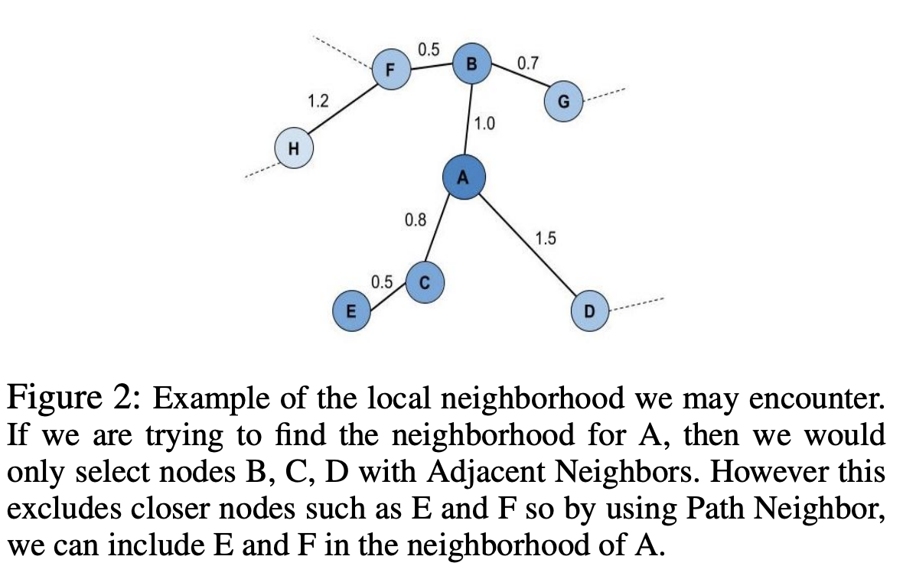

 Improving the Separation Between Similar Classes Using a Mutual k-NN Graph
============================================

In default UMAP, a weighted k nearest neighbor (k-NN) graph, which connects each
datapoint to its 𝑘 nearest neighbors based on some distance metric, is constructed
and used to generate the initial topological representation of a dataset.

However, previous research has shown that using a weighted k-NN
graph may not provide an accurate representation of the underlying local
structure for a high dimensional dataset the k-NN graph is relatively susceptible
to the “curse of dimensionality” and the associated distance concentration
effect, where distances are similar in high dimensions, as well as the
hub effect, where certain points become highly influential when highly
connected. This skews the local representation of high dimensional data,
deteriorating its performance for various similarity-based machine learning
tasks.

A recent paper titled
`Clustering with UMAP: Why and How Connectivity Matters <https://arxiv.org/abs/2108.05525>`__
proposes a refinement in the graph construction stage of the UMAP algorithm
that uses a weighted mutual k-NN graph rather than it vanilla counterpart,
to reduce the undesired distance concentration and hub effects.

A mutual k-NN graph is defined as a graph that only has an undirected edge
between two vertices ``x_i`` and ``x_j`` if ``x_i`` is in k-nearest neighbors
of ``x_j`` and ``x_j`` is in the k-nearest neighbors of ``x_i``. A mutual k-NN
graph can hence be interpreted as a subgraph/subset of the original
k-NN graph for a specific dataset. Mutual k-NN graphs have been shown to contain many
desirable properties  when combating the “curse of dimensionality” as discussed in
`this paper <https://arxiv.org/abs/2108.05525>`__ . However, one pitfall of using a
mutual k-NN graph over the original k-NN graph is that the resulting mutual k-NN graph often
contains disconnected components and potential isolated vertices since a mutual k-NN graph.
only retains a subset of the edges from the original k-NN graph.

This violates one of UMAP primary assumptions that "The manifold is locally connected." To
combat the issue of isolated components, the authors consider different methods that have
been previously used to augment and increase the connectivity of the mutual k-NN graph:

1. ``NN``: To minimally connect isolated vertices and satisfy the assumption that the underlying manifold is locally connected, we add an undirected edge between each isolated vertex and its original nearest neighbor (de Sousa, Rezende, and Batista 2013).Note that the resulting graph may still contain disconnected components.
2. ``MST-min``: To achieve a connected graph, add the minimum number of edges from a maximum spanning tree to the mutual k-NN graph that has been weighted with similarity-based metrics(Ozaki et al. 2011). We adapt this by calculating the minimum spanning tree for distances.
3. ``MST-all``: Adding all the edges of the MST.

.. image:: images/mutual_nn_umap_connectivity.png

They also different ways to obtain the new local neighborhood for each point ``x_i``:

1. ``Adjacent Neighbors``: Only consider neighbors that are directly connected(adjacent) to ``x_i`` in the connected mutual k-NN graph.
2. ``Path Neighbors``: Using shortest path distance to find the new k closest points to ``x_i`` with respect to the connected mutual k-NN graph. This shortest path distance can be considered a new distance metric as it directly aligns with UMAP’s definition of an extended pseudo-metric space.




Visualizing the Results
----------------------------------------------
To see the differences between using a mutual k-NN graph vs the original k-NN graph as
the starting topology for UMAP, let's visualize the 2D projections generated for MNIST, FMNIST, and 20
NG Count Vectors using each of the discussed methods. For all code snippets to reproduce the results and visualizations, please refer to `the paper <https://arxiv.org/abs/2108.05525>`__
and this `Github repo <https://github.com/adalmia96/umap-mnn>`__. Will be adding this soon as a
mode to the original implementation.


We’ll start with MNIST digits, a collection of 70,000 gray-scale images of hand-written digits:

.. image:: images/mutual_nn_umap_MNIST.png
  :width: 800
  :align: center

In general we observe that for most of the mutual k-NN graph based vectors, there
is a better separation between similar classes than the original UMAP vectors
regardless of connectivity (NN, MST variants). Connecting isolated vertices in
the mutual k-NN graph to their original nearest neighbor produced the desired
separation between similar classes such as with the 4, 7, 9 in MNIST. This follows
our intuition given that mutual k-NN graphs have previously been shown as a useful
method for removing edges between points that are only loosely similar.
This directly reduces many of the undesirable consequences of using a k-NN
representation such as the the distance concentration and hub effects.

We see a similar results for the Fashion-MNIST(FMNIST) dataset, a collection of 70,000
gray-scale images of fashion items:
.. image:: images/mutual_nn_umap_FMNIST.png
  :width: 800
  :align: center

For the FMNIST dataset, the vectors using the aforementioned methods preserve
the global structure between clothing classes (T-shirt/top, Coat, Trouser, and etc.)
from footwear classes (Sandal, Sneaker, Ankle-boot) while also depicting a clearer
separation between the footwear classes. This is contrasted with original
UMAP which has poorer separation between similar classes like the footwear classes.

For both MNIST and FMNIST, we see that NN which naively connects isolated vertices
to their nearest neighbor had multiple small clusters of points scattered
throughout the vector space. This makes sense given using NN for connectivity can
still cause the resulting manifold to be broken into many small components. In cases
like these,

We would expect that having higher connectivity that reduces
random scattering of points would be better for clustering. However,
too much connectivity with MST-all can also hurt. We
observe that using all the edges from the MST (MST-all) together
with Path Neighbors can hurt performance on FMNIST (this is
elaborated on in the next section §5.3).

.. image:: images/mutual_nn_umap_20ngc.png
  :width: 800
  :align: center

.. image:: images/mutual_nn_umap_results.png


This is a significantly different result – although notably the same
groupings of digits and overall structure have resulted. The most
striking aspects are that the ones cluster has be compressed into a very
narrow and dense stripe, while other digit clusters, most notably the
zeros and the twos have expanded out to fill more space in the plot.
This is due to the fact that in the high dimensional space the ones are
indeed more densely packed together, with largely only variation along
one dimension (the angle with which the stroke of the one is drawn). In
contrast a digit like the zero has a lot more variation (rounder,
narrower, taller, shorter, sloping one way or another); this results in
less local density in high dimensional space, and this lack of local
density has been preserved by DensMAP.

Let’s now look at the Fashion-MNIST dataset; as before we’ll start by
reminding ourselves what the default UMAP results look like:


And indeed, this looks very much like the original plot, but the bags
(label 8 in blue) are slightly more diffused, and the pants (label 1 in
red) are a little denser. This is very much the default UMAP with just a
tweak to better reflect some notion of local density.


The figure shows that the selected subset of the data set is
unbalanced, but the entire dataset is also unbalanced, so
this experiment will still use this subset. The next step is
to examine the output of the standard DensMAP algorithm.


The standard DensMAP algorithm does not separate the galaxies
according to their type. Supervised DensMAP can do better.


Supervised DensMAP does indeed do better. There is a litle overlap
between some of the classes, but the original dataset
also has some ambiguities in the classification.  The best
check of this method is to project the testing data onto the
learned embedding.


Citing our work
---------------
If you use our implementation in your work, please cite our paper:

.. code:: bibtex

  @article{Dalmia2021UMAPConnectivity,
    author={Ayush Dalmia and Suzanna Sia},
    title={Clustering with {UMAP:} Why and How Connectivity Matters},
    journal={CoRR},
    volume={abs/2108.05525},
    year={2021},
    url={https://arxiv.org/abs/2108.05525},
    eprinttype={arXiv},
    eprint={2108.05525},
    timestamp={Wed, 18 Aug 2021 19:45:42 +0200},
    biburl={https://dblp.org/rec/journals/corr/abs-2108-05525.bib},
    bibsource={dblp computer science bibliography, https://dblp.org}
    }
```
