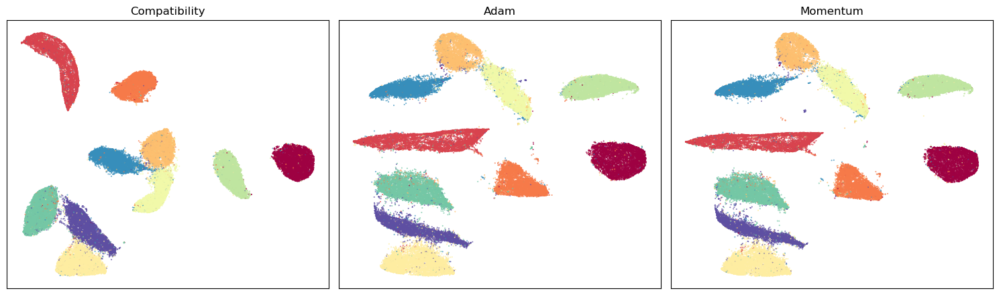

Choosing a UMAP Layout Optimizer
================================

There are two broad stages to fitting a UMAP model. First UMAP
constructs a weighted nearest-neighbor graph representing the topology
of the input data. It then has to find a low dimensional layout of that
graph. Most of the familiar UMAP parameters, such as ``n_neighbors`` and
``metric``, primarily affect the first stage. The ``optimizer``
parameter controls how the layout is improved in the second stage.

Historically UMAP provided a single layout optimizer. Version 0.6 adds
two new optimizers, based on Adam and momentum, while retaining the
original optimizer for compatibility. In this tutorial we will look at
the differences between those choices, how they interact with
initialization and DensMAP, and when the more advanced negative sampling
options may be useful.

To make the timing differences easier to see we will use the MNIST
handwritten digit dataset. This has 70,000 samples, which is large
enough for parallel layout optimization to make a meaningful difference.

.. code:: ipython3

    import contextlib
    import io
    
    import matplotlib.pyplot as plt
    import numpy as np
    import sklearn.datasets
    import umap
    
    mnist = sklearn.datasets.fetch_openml(
        "mnist_784",
        version=1,
        as_frame=False,
    )
    data = np.ascontiguousarray(mnist.data, dtype=np.float32)
    labels = np.asarray(mnist.target, dtype=np.int32)
    
    data.shape, data.dtype, data.flags.c_contiguous

.. parsed-literal::

    ((70000, 784), dtype('float32'), True)

Warming up the implementations
------------------------------

UMAP uses Numba to compile performance-critical functions. The first
call to a particular optimizer in a Python process can therefore include
compilation time that later calls do not pay. Since our goal is to
compare fit times rather than compilation times, we will first run each
optimizer briefly on 5,000 samples. This is large enough to exercise the
large-data optimizer kernels, and uses the same number of features and
the same data type as the full runs below.

The warm-up fits are deliberately not timed. The timings that follow are
consequently warm timings; timings from a fresh process will be longer.

.. code:: ipython3

    %%capture
    warmup_data = np.ascontiguousarray(data[:5000])
    umap.UMAP(
        compatibility_layout=True,
        init="spectral",
        optimizer="compatibility",
        n_epochs=20,
        n_jobs=1,
        random_state=42,
    ).fit(warmup_data)
    umap.UMAP(
        compatibility_layout=False,
        init="recursive",
        optimizer="adam",
        n_epochs=20,
        n_jobs=-1,
        random_state=42,
    ).fit(warmup_data)
    umap.UMAP(
        compatibility_layout=False,
        init="recursive",
        optimizer="momentum",
        n_epochs=20,
        n_jobs=-1,
        random_state=42,
    ).fit(warmup_data)

The compatibility layout
------------------------

For the 0.6 release UMAP uses the compatibility layout by default. Thus
a standard fit continues to use the layout behavior from earlier
releases. Here we set all of the relevant choices explicitly so that the
example will continue to mean the same thing after the default changes:

.. code:: ipython3

    %%time
    compatibility_embedding = umap.UMAP(
        compatibility_layout=True,
        init="spectral",
        optimizer="compatibility",
        n_jobs=1,
        random_state=42,
    ).fit_transform(data)

.. parsed-literal::

    CPU times: user 1min 30s, sys: 1.71 s, total: 1min 32s
    Wall time: 41.9 s

It is worth noting that ``compatibility_layout`` covers a little more
than the final layout optimizer. It also retains the previous
nearest-neighbor search settings, and uses the previous spectral
initialization in place of the new recursive initialization. This makes
it the most convenient choice when an existing application needs to
preserve the behavior of earlier UMAP releases.

The compatibility layout will remain available, but it is intended as a
transition path rather than the long-term default. Version 0.6 warns
that ``compatibility_layout`` will default to ``False`` in a future
release. Code that relies on the old behavior should therefore request
it explicitly.

There is also an ``optimizer="compatibility"`` setting. This selects the
original optimizer, but does not by itself restore the other
nearest-neighbor and initialization choices. Conversely,
``compatibility_layout=True`` takes precedence over ``optimizer`` and
uses the original optimizer as part of the full compatibility path.
Usually the broader ``compatibility_layout`` option is the clearer
choice when preserving the behavior of an older model is the goal.

The Adam optimizer
------------------

For new applications the recommended choice is the Adam optimizer. We
can try it by turning off the compatibility layout and selecting Adam.
We also select recursive initialization explicitly, since this
combination is intended to become the default after the transition
release.

.. code:: ipython3

    %%time
    with contextlib.redirect_stdout(io.StringIO()):
        adam_embedding = umap.UMAP(
            compatibility_layout=False,
            init="recursive",
            optimizer="adam",
            n_jobs=-1,
            random_state=42,
        ).fit_transform(data)

.. parsed-literal::

    CPU times: user 1min 49s, sys: 1min 1s, total: 2min 51s
    Wall time: 5.63 s

Rather than applying every attractive or repulsive force to the
embedding immediately, the new optimizers accumulate forces before
updating a point. Adam keeps running estimates of both the size and
direction of those forces and uses them to adapt the update made for
each coordinate. This makes Adam particularly worth considering for
longer optimization runs, where those adaptive updates have more
opportunity to refine the layout.

The momentum optimizer
----------------------

The other new choice is ``optimizer="momentum"``:

.. code:: ipython3

    %%time
    with contextlib.redirect_stdout(io.StringIO()):
        momentum_embedding = umap.UMAP(
            compatibility_layout=False,
            init="recursive",
            optimizer="momentum",
            n_jobs=-1,
            random_state=42,
        ).fit_transform(data)

.. parsed-literal::

    CPU times: user 1min 50s, sys: 52.3 s, total: 2min 42s
    Wall time: 5.66 s

The momentum optimizer carries some of the previous update direction
into the next update. This tends to smooth the path taken through the
optimization and provides a useful modern alternative to Adam. Adam is
the intended default for new work, while momentum is worth comparing on
datasets where the optimizer choice matters.

The name ``"momentum"`` replaces the ``"standard"`` name used during
early development of the new optimizer code. The old name is not
accepted.

Comparing the resulting embeddings
----------------------------------

We can now plot the three embeddings side by side. Each optimizer
recovers the digit structure, but the coordinates and the arrangement of
clusters are different. This is expected: rotations, reflections, and
larger changes in the arrangement are all possible when the optimization
procedure changes. The useful comparison is whether an embedding
preserves the structure that matters for the application, not whether
its coordinates match an embedding produced by another optimizer.

.. code:: ipython3

    embeddings = [compatibility_embedding, adam_embedding, momentum_embedding]
    titles = ["Compatibility", "Adam", "Momentum"]
    
    fig, axes = plt.subplots(1, 3, figsize=(15, 4.5))
    for embedding, title, axis in zip(embeddings, titles, axes):
        axis.scatter(
            embedding[:, 0],
            embedding[:, 1],
            c=labels,
            cmap="Spectral",
            s=0.15,
            rasterized=True,
        )
        axis.set_title(title)
        axis.set_xticks([])
        axis.set_yticks([])
    plt.tight_layout()
    plt.show()

The displayed timings are specific to this machine and dataset, and
should not be treated as general benchmark results. They do, however,
demonstrate how to make a fair warm comparison. Larger datasets,
different numbers of threads, and different values of ``n_epochs`` can
change the relative timings considerably.

These are timings for the complete configurations shown above rather
than isolated optimizer kernels. In particular, the compatibility path
uses spectral initialization while the modern examples use recursive
initialization. The timings therefore answer the practical question of
how long each complete fit takes, but should not be used to attribute
all of the difference to the optimizer alone.

Reproducibility and parallelism
-------------------------------

One of the major advantages of the new optimizers is that they can make
full use of parallel layout optimization even when ``random_state`` is
fixed. A second fit with the same data, parameters, and random state
will reproduce an Adam or momentum embedding exactly, while still using
the configured Numba threads.

The original optimizer applies updates immediately. If several threads
apply those updates at once, the order depends on races between the
threads and cannot be reproduced from a random seed. A seeded
compatibility fit therefore uses a single thread for layout
optimization. When the broader ``compatibility_layout=True`` option is
used with a seed, UMAP currently also sets ``n_jobs`` to one to preserve
the full compatibility path.

This means that the choice is no longer simply between a fast unseeded
fit and a slower reproducible fit. With Adam or momentum it is possible
to have both parallel layout optimization and exact reproducibility. We
can verify that directly by repeating the Adam fit:

.. code:: ipython3

    %%time
    with contextlib.redirect_stdout(io.StringIO()):
        repeated_adam_embedding = umap.UMAP(
            compatibility_layout=False,
            init="recursive",
            optimizer="adam",
            random_state=42,
            n_jobs=-1,
        ).fit_transform(data)

.. parsed-literal::

    CPU times: user 1min 51s, sys: 56.6 s, total: 2min 47s
    Wall time: 5.7 s

.. code:: ipython3

    np.array_equal(adam_embedding, repeated_adam_embedding)

.. parsed-literal::

    True

The momentum optimizer has the same reproducibility property. Of course
changing optimizers can change the embedding, so we should not expect
Adam or momentum coordinates to match those produced by the
compatibility layout. The important question is whether the result is
stable in the ways that matter for the analysis. The reproducibility
tutorial contains a more detailed discussion of random seeds and thread
control.

Recursive initialization
------------------------

An optimizer does not begin with an empty embedding: it needs a set of
initial coordinates to improve. The new ``init="recursive"`` option
first coarsens the fuzzy graph into a much smaller graph. It lays out
that graph, expands the result back to the next level, and continues
until coordinates have been provided for the original data. This can
provide Adam and momentum with a useful starting point without requiring
a spectral decomposition of the full graph.

The ``recursive_coarsening_ratio`` parameter controls how aggressively
the graph is reduced at each level. It accepts values of ``2``, ``3``,
or ``4``. The default value of ``4`` is the fastest. Values of ``3`` and
``2`` use more coarsening levels, spending additional initialization
time in exchange for a more gradual expansion back to the full graph. As
with the optimizer itself, the useful comparison will depend on the data
and the intended application.

In the release after 0.6, recursive initialization together with Adam is
intended to become the default. Specifying both options explicitly makes
the intended behavior clear and allows code written during the
transition to keep the same behavior across releases.

Using the new optimizers with DensMAP
-------------------------------------

DensMAP changes the objective being optimized; it is not itself an
optimizer. It can therefore be combined with either Adam or momentum by
setting ``densmap=True`` independently:

.. code:: ipython3

    dens_mapper = umap.UMAP(
        compatibility_layout=False,
        init="recursive",
        optimizer="adam",
        densmap=True,
        random_state=42,
    )

Earlier development versions used composite names such as
``"densmap_adam"`` and ``"densmap_momentum"``. These names are no longer
accepted; use ``densmap=True`` together with ``optimizer="adam"`` or
``optimizer="momentum"`` instead. As before, DensMAP requires a
Euclidean output metric. The DensMAP tutorial describes the density
preservation objective and its parameters in more detail.

Controlling negative sample selection
-------------------------------------

UMAP uses negative samples to provide the repulsive forces that prevent
an embedding from collapsing. The existing ``negative_sample_rate``
parameter controls how many negative samples are used, while
``repulsion_strength`` controls the weight given to them. These remain
the main parameters for adjusting repulsion.

The new optimizers also provide some more specialized controls. Most
users should leave these at their defaults. They are primarily useful
when testing hard-negative selection on large datasets, and should be
evaluated on data representative of the final application.

``negative_selection_range``
~~~~~~~~~~~~~~~~~~~~~~~~~~~~

By default this is ``200000``. For datasets no larger than the selection
range all vertices are available as negative samples. On a larger
dataset UMAP can instead select from a local window in an ordering of
the current embedding. This offers harder negative examples, since
candidates in such a window are more likely to lie near the source point
in the embedding. Reducing the value makes the selection more local.

``exclude_graph_neighbors``
~~~~~~~~~~~~~~~~~~~~~~~~~~~

With localized negative selection it becomes more likely that a point
joined to the source by an attractive graph edge will also be selected
as a negative sample. Such a point is a false negative: one part of the
objective is trying to pull it closer while another is trying to push it
away. Setting ``exclude_graph_neighbors=True`` prevents graph neighbors,
and the source point itself, from receiving negative updates.

``negative_sample_scale``
~~~~~~~~~~~~~~~~~~~~~~~~~

Selecting negatives from only part of the data changes the total
repulsive force. UMAP normally derives a correction from the selection
range. ``negative_sample_scale`` can be used to supply that multiplier
explicitly. This is mainly useful for experiments that need to separate
the effect of local negative selection from the effect of changing the
repulsive-force scale.

``negative_sample_scale_adaptation_samples``
~~~~~~~~~~~~~~~~~~~~~~~~~~~~~~~~~~~~~~~~~~~~

When hard-negative selection is active, the Adam optimizer can adapt the
negative-sample scale during the first half of optimization. This
parameter controls how many sample points are used to estimate that
adaptation. The default is ``128``; setting it to ``0`` disables
adaptation.

These controls apply only where the corresponding modern layout kernel
supports them. The selection range, graph-neighbor exclusion, and
explicit scale are available for large Euclidean Adam and momentum
layouts, while automatic scale adaptation is specific to Adam. For small
Euclidean layouts only graph-neighbor exclusion is applicable. These
controls are not used by compatibility layout or DensMAP. For a generic
non-Euclidean output metric only ``negative_selection_range`` is used,
with a small force-ranked set of candidates. The defaults are designed
to work without any special handling, so changing these values should
generally be accompanied by quality and runtime measurements.

Specialized layout objectives
-----------------------------

The optimizer setting applies to fitting a standard UMAP model and to
transforming new points with that model. Some related operations have
their own optimization problem and therefore retain a specialized
implementation. In particular, ``inverse_transform`` uses a dedicated
inverse objective. AlignedUMAP jointly optimizes several embeddings with
alignment constraints and does not currently expose the Adam, momentum,
or compatibility optimizer choices.

Migrating existing code
-----------------------

For most existing code the 0.6 compatibility default provides time to
test the new implementation before changing behavior. The main mappings
for code that used names from development versions are:

.. code:: ipython3

    # Old development names:
    # umap.UMAP(optimizer="standard")
    # umap.UMAP(optimizer="densmap_adam")
    
    momentum_reducer = umap.UMAP(
        compatibility_layout=False,
        optimizer="momentum",
    )
    
    dens_reducer = umap.UMAP(
        compatibility_layout=False,
        optimizer="adam",
        densmap=True,
    )

The removed names are rejected rather than silently translated.
Serialized estimators or saved configurations that contain one of them
should be updated to the current parameters and the resulting embedding
should be checked using the criteria appropriate to the original
application.
