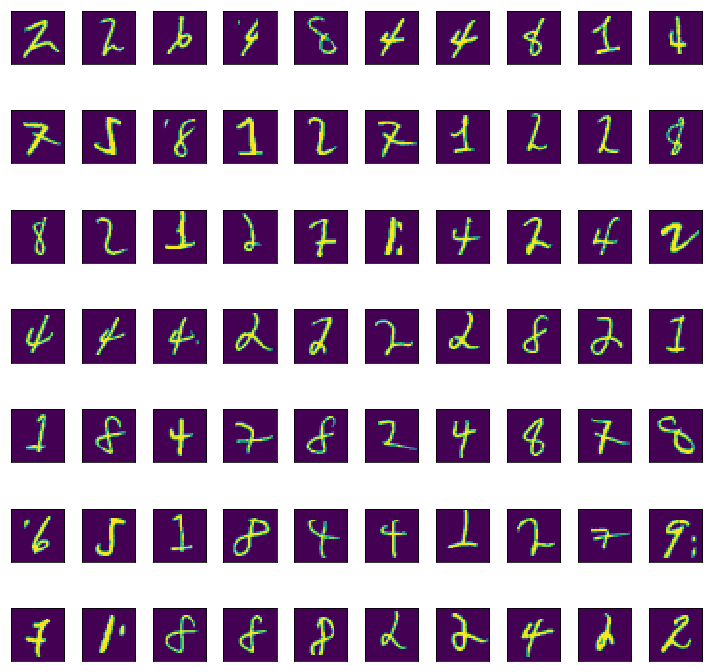
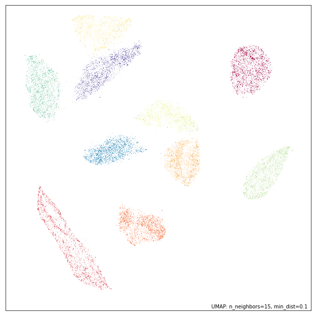
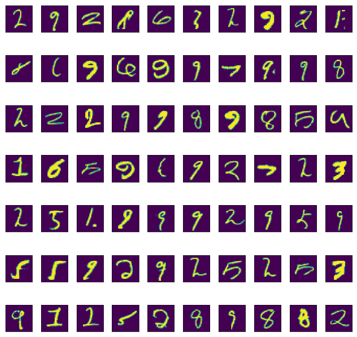
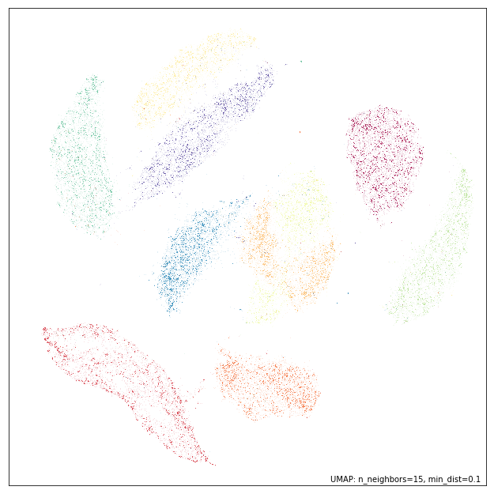
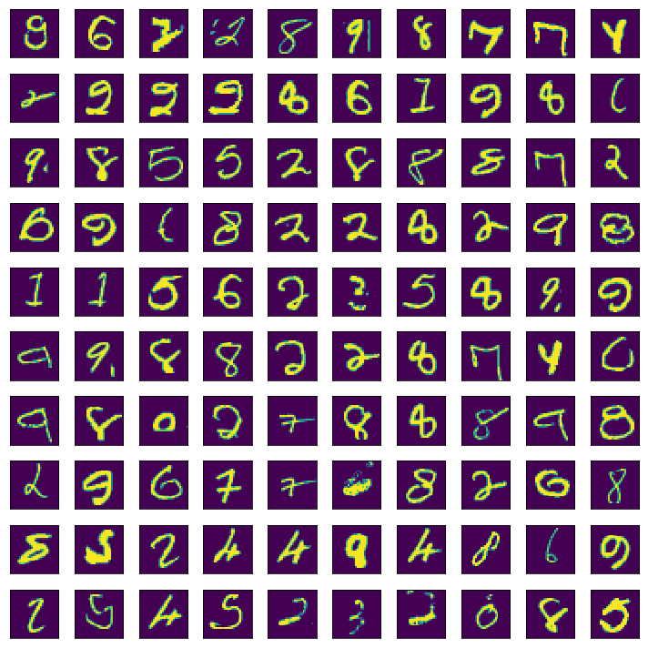

Outlier detection using UMAP
============================

While an earlier tutorial looked at using `UMAP for
clustering <https://umap-learn.readthedocs.io/en/latest/clustering.html>`__,
it can also be used for outlier detection, providing that some care is
taken. This tutorial will look at how to use UMAP in this manner, and
what to look out for, by finding anomalous digits in the MNIST
handwritten digits dataset. To start with let's load the relevant
libraries:

.. code:: python3

    import numpy as np
    import sklearn.datasets
    import sklearn.neighbors
    import umap
    import umap.plot
    import matplotlib.pyplot as plt
    %matplotlib inline

With this in hand, let's grab the MNIST digits dataset from the
internet, using the new ``fetch_ml`` loader in sklearn.

.. code:: python3

    data, labels = sklearn.datasets.fetch_openml('mnist_784', version=1, return_X_y=True)

Before we get started we should try looking for outliers in terms of the
native 784 dimensional space that MNIST digits live in. To do this we
will make use of the `Local Outlier Factor
(LOF) <https://en.wikipedia.org/wiki/Local_outlier_factor>`__ method for
determining outliers since sklearn has an easy to use implementation.
The essential intuition of LOF is to look for points that have a
(locally approximated) density that differs significantly from the
average density of their neighbors. In our case the actual details are
not so important -- it is enough to know that the algorithm is
reasonably robust and effective on vector space data. We can apply it
using the ``fit_predict`` method of the sklearn class. The LOF class
take a parameter ``contamination`` which specifies the percentage of
data that the user expects to be noise. For this use case we will set it
to 0.001428 since, given the 70,000 samples in MNIST, this will result
in 100 outliers, which we can then look at in more detail.

.. code:: python3

    %%time
    outlier_scores = sklearn.neighbors.LocalOutlierFactor(contamination=0.001428).fit_predict(data)

.. parsed-literal::

    CPU times: user 1h 29min 10s, sys: 12.4 s, total: 1h 29min 22s
    Wall time: 1h 29min 53s

It is worth noting how long that took. Over an hour and a half! Why did
it take so long? Because LOF requires a notion of density, which in turn
relies on a nearest neighbor type computation -- which is expensive in
sklearn for high dimensional data. This alone is potentially a reason to
look at reducing the dimension of the data -- it makes it more amenable
to existing techniques like LOF.

Now that we have a set of outlier scores we can find the actual outlying
digit images -- these are the ones with scores equal to -1. Let's
extract that data, and check that we got 100 different digit images.

.. code:: python3

    outlying_digits = data[outlier_scores == -1]
    outlying_digits.shape

.. parsed-literal::

    (100, 784)

Now that we have the outlying digit images the first question we should
be asking is "what do they look like?". Fortunately for us we can
convert the 784 dimensional vectors back into image and plot them,
making it easier to look at. Since we extracted the 100 most outlying
digit images we can just display a 10x10 grid of them.

.. code:: python3

    fig, axes = plt.subplots(7, 10, figsize=(10,10))
    for i, ax in enumerate(axes.flatten()):
        ax.imshow(outlying_digits[i].reshape((28,28)))
        plt.setp(ax, xticks=[], yticks=[])
    plt.tight_layout()

These do certainly look like somewhat strange looking handwritten
digits, so our outlier detection seems to be working to some extent.

Now let's try a naive approach using UMAP and see how far that gets us.
First let's just apply UMAP directly with default parameters to the
MNIST data.

.. code:: python3

    mapper = umap.UMAP().fit(data)

Now we can see what we got using the new plotting tools in umap.plot.

.. code:: python3

    umap.plot.points(mapper, labels=labels)

.. parsed-literal::

    <matplotlib.axes._subplots.AxesSubplot at 0x1c3db71358>

That looks like what we have come to expect from a UMAP embedding of
MNIST. The question is have we managed to preserve outliers well enough
that LOF can still find the bizarre digit images, or has the embedding
lost that information and contracted the outliers into the individual
digit clusters? We can simply apply LOF to the embedding and see what
that returns.

.. code:: python3

    %%time
    outlier_scores = sklearn.neighbors.LocalOutlierFactor(contamination=0.001428).fit_predict(mapper.embedding_)

This was obviously much faster since we are operating in a much lower
dimensional space that is more amenable to the spatial indexing methods
that sklearn uses to find nearest neighbors. As before we extract the
outlying digit images, and verify that we got 100 of them,

.. code:: python3

    outlying_digits = data[outlier_scores == -1]
    outlying_digits.shape

.. parsed-literal::

    (100, 784)

Now we need to plot the outlying digit images to see what kinds of digit
images this approach found to be particularly strange.

.. code:: python3

    fig, axes = plt.subplots(7, 10, figsize=(10,10))
    for i, ax in enumerate(axes.flatten()):
        ax.imshow(outlying_digits[i].reshape((28,28)))
        plt.setp(ax, xticks=[], yticks=[])
    plt.tight_layout()

In many ways this looks to be a *better* result than the original LOF in
the high dimensional space. While the digit images that the high
dimensional LOF found to be strange were indeed somewhat odd looking,
many of these digit images are considerably stranger -- significantly
odd line thickness, warped shapes, and images that are hard to even
recognise as digits. This helps to demonstrate a certain amount of
confirmation bias when examining outliers: since we expect things tagged
as outliers to be strange we tend to find aspects of them that justify
that classification, potentially unaware of how much stranger some of
the data may in fact be. This should make us wary of even this outlier
set: what else might lurk in the dataset?

We can, in fact, potentially improve on this result by tuning the UMAP
embedding a little for the task of finding outliers. When UMAP combines
together the different local simplicial sets (see :doc:`how_umap_works`
for more details) the standard approach uses a union, but we could
instead take an intersection. An intersection ensures that outliers
remain disconnected, which is certainly beneficial when seeking to find
outliers. A downside of the intersection is that it tends to break up
the resulting simplicial set into many disconnected components and a lot
of the more non-local and global structure is lost, resulting in a lot
lower quality of the resulting embedding. We can, however, interpolate 
between the union and intersection. In UMAP this is given by the
``set_op_mix_ratio``, where a value of 0.0 represents an intersection,
and a value of 1.0 represents a union (the default value is 1.0). By
setting this to a lower value, say 0.25, we can encourage the embedding
to do a better job of preserving outliers as outlying, while still
retaining the benefits of a union operation.

.. code:: python3

    mapper = umap.UMAP(set_op_mix_ratio=0.25).fit(data)

.. code:: python3

    umap.plot.points(mapper, labels=labels)

.. parsed-literal::

    <matplotlib.axes._subplots.AxesSubplot at 0x1c3f496908>

As you can see the embedding is not as well structured overall as when
we had a ``set_op_mix_ratio`` of 1.0, but we have potentially done a
better job of ensuring that outliers remain outlying. We can test that
hypothesis by running LOF on this embedding and looking at the resulting
digit images we get out. Ideally we should expect to find some
potentially even stranger results.

.. code:: python3

    %%time
    outlier_scores = sklearn.neighbors.LocalOutlierFactor(contamination=0.001428).fit_predict(mapper.embedding_)

.. code:: python3

    outlying_digits = data[outlier_scores == -1]
    outlying_digits.shape

.. parsed-literal::

    (100, 784)

We have the expected 100 most outlying digit images, so let's visualise
the results and see if they really are particularly strange.

.. code:: python3

    fig, axes = plt.subplots(10, 10, figsize=(10,10))
    for i, ax in enumerate(axes.flatten()):
        ax.imshow(outlying_digits[i].reshape((28,28)))
        plt.setp(ax, xticks=[], yticks=[])
    plt.tight_layout()

Here we see that the line thickness variation (particularly "fat"
digits, or particularly "fine" lines) that the original embedding helped
surface come through even more strongly here. We also see a number of
clearly corrupted images with extra lines, dots, or strange blurring
occurring.

So, in summary, using UMAP to reduce dimension prior to running
classical outlier detection methods such as LOF can improve both the
speed with which the algorithm runs, and the quality of results the
outlier detection can find. Furthermore we have introduced the
``set_op_mix_ratio`` parameter, and explained how it can be used to
potentially improve the performance of outlier detection approaches
applied to UMAP embeddings.
