Basic UMAP Parameters
=====================

UMAP is a fairly flexible non-linear dimension reduction algorithm. It
seeks to learn the manifold structure of your data and find a low
dimensional embedding that preserves the essential topological structure
of that manifold. In this notebook we will generate some visualisable
4-dimensional data, demonstrate how to use UMAP to provide a
2-dimensional representation of it, and then look at how various UMAP
parameters can impact the resulting embedding. This documentation is
based on the work of Philippe Rivière for visionscarto.net.

To start we'll need some basic libraries. First ``numpy`` will be needed
for basic array manipulation. Since we will be visualising the results
we will need ``matplotlib`` and ``seaborn``. Finally we will need
``umap`` for doing the dimension reduction itself.

.. code:: python3

    import numpy as np
    import matplotlib.pyplot as plt
    from mpl_toolkits.mplot3d import Axes3D
    import seaborn as sns
    import umap
    %matplotlib inline

.. code:: python3

    sns.set(style='white', context='poster', rc={'figure.figsize':(14,10)})

Next we will need some data to embed into a lower dimensional
representation. To make the 4-dimensional data "visualisable" we will
generate data uniformly at random from a 4-dimensional cube such that we
can interpret a sample as a tuple of (R,G,B,a) values specifying a color
(and translucency). Thus when we plot low dimensional representations
each point can colored according to its 4-dimensional value. For this we
can use ``numpy``. We will fix a random seed for the sake of
consistency.

.. code:: python3

    np.random.seed(42)
    data = np.random.rand(800, 4)

Now we need to find a low dimensional representation of the data. As in
the Basic Usage documentation, we can do this by using the
:meth:`~umap.umap_.UMAP.fit_transform` method on a :class:`~umap.umap_.UMAP` object.

.. code:: python3

    fit = umap.UMAP()
    %time u = fit.fit_transform(data)

.. parsed-literal::

    CPU times: user 7.73 s, sys: 211 ms, total: 7.94 s
    Wall time: 6.8 s

The resulting value ``u`` is a 2-dimensional representation of the data.
We can visualise the result by using ``matplotlib`` to draw a scatter
plot of ``u``. We can color each point of the scatter plot by the
associated 4-dimensional color from the source data.

.. code:: python3

    plt.scatter(u[:,0], u[:,1], c=data)
    plt.title('UMAP embedding of random colours');

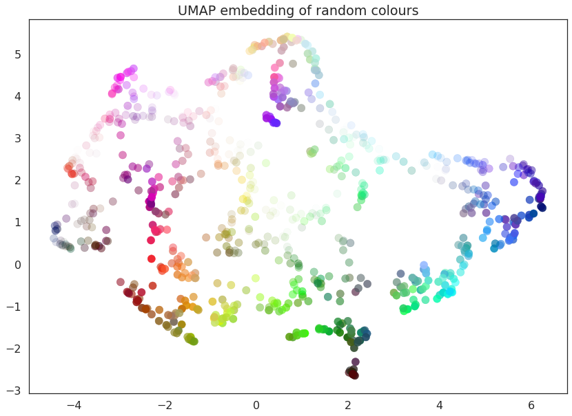

As you can see the result is that the data is placed in 2-dimensional
space such that points that were nearby in in 4-dimensional space (i.e.
are similar colors) are kept close together. Since we drew a random
selection of points in the color cube there is a certain amount of
induced structure from where the random points happened to clump up in
color space.

UMAP has several hyperparameters that can have a significant impact on
the resulting embedding. In this notebook we will be covering the four
major ones:

-  ``n_neighbors``
-  ``min_dist``
-  ``n_components``
-  ``metric``

Each of these parameters has a distinct effect, and we will look at each
in turn. To make exploration simpler we will first write a short utility
function that can fit the data with UMAP given a set of parameter
choices, and plot the result.

.. code:: python3

    def draw_umap(n_neighbors=15, min_dist=0.1, n_components=2, metric='euclidean', title=''):
        fit = umap.UMAP(
            n_neighbors=n_neighbors,
            min_dist=min_dist,
            n_components=n_components,
            metric=metric
        )
        u = fit.fit_transform(data);
        fig = plt.figure()
        if n_components == 1:
            ax = fig.add_subplot(111)
            ax.scatter(u[:,0], range(len(u)), c=data)
        if n_components == 2:
            ax = fig.add_subplot(111)
            ax.scatter(u[:,0], u[:,1], c=data)
        if n_components == 3:
            ax = fig.add_subplot(111, projection='3d')
            ax.scatter(u[:,0], u[:,1], u[:,2], c=data, s=100)
        plt.title(title, fontsize=18)

``n_neighbors``
~~~~~~~~~~~~~~~

This parameter controls how UMAP balances local versus global structure
in the data. It does this by constraining the size of the local
neighborhood UMAP will look at when attempting to learn the manifold
structure of the data. This means that low values of ``n_neighbors``
will force UMAP to concentrate on very local structure (potentially to
the detriment of the big picture), while large values will push UMAP to
look at larger neighborhoods of each point when estimating the manifold
structure of the data, losing fine detail structure for the sake of
getting the broader of the data.

We can see that in practice by fitting our dataset with UMAP using a
range of ``n_neighbors`` values. The default value of ``n_neighbors``
for UMAP (as used above) is 15, but we will look at values ranging from
2 (a very local view of the manifold) up to 200 (a quarter of the data).

.. code:: python3

    for n in (2, 5, 10, 20, 50, 100, 200):
        draw_umap(n_neighbors=n, title='n_neighbors = {}'.format(n))

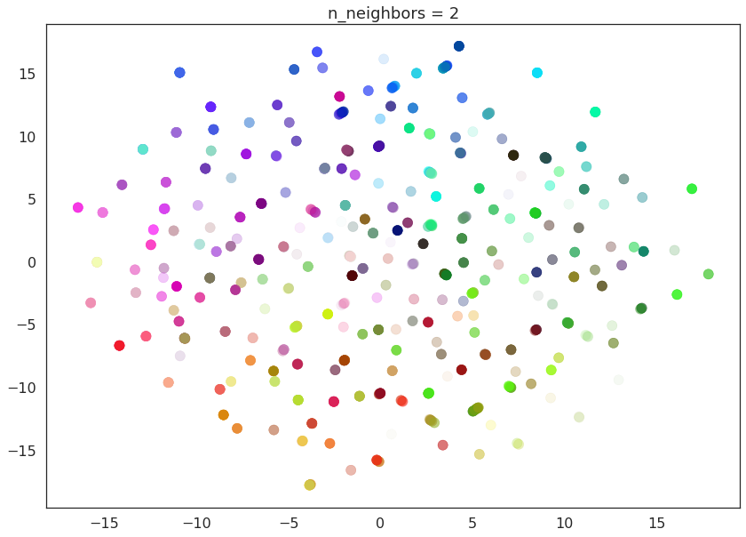

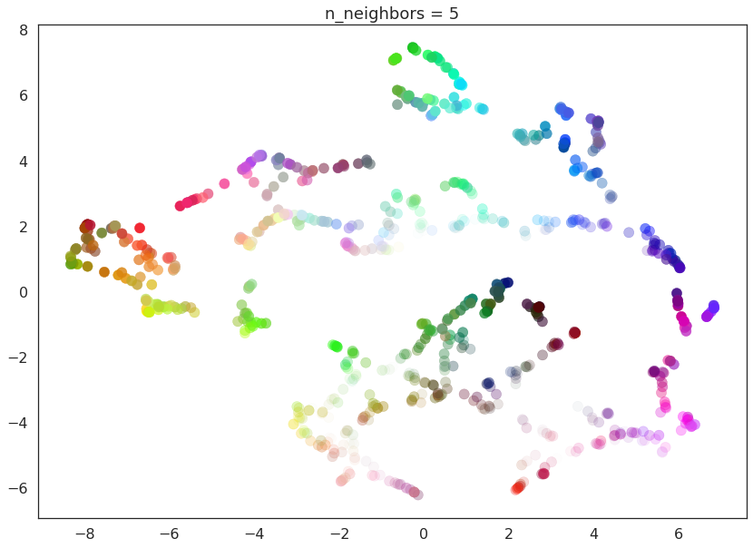

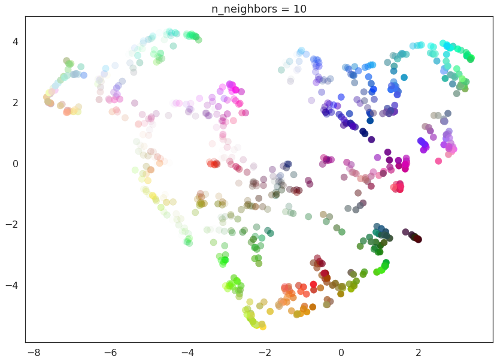

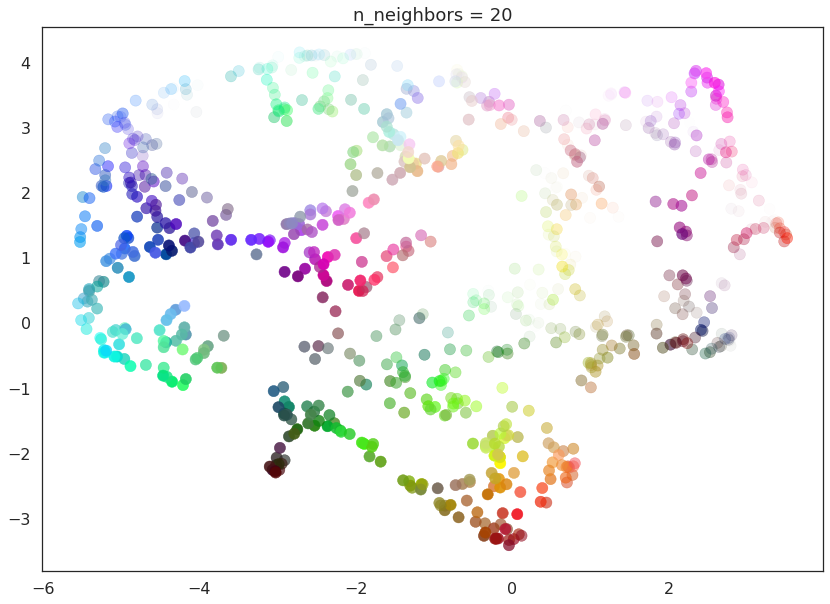

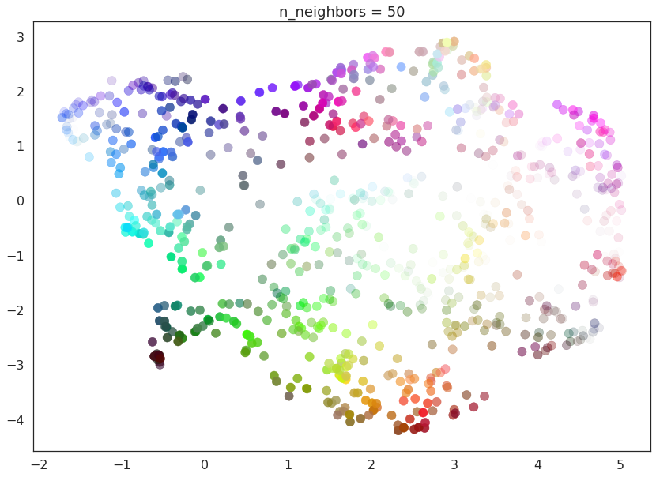

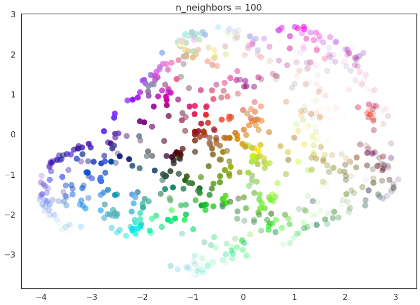

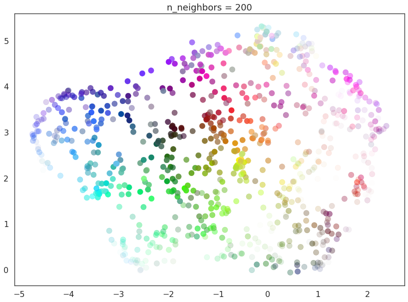

With a value of ``n_neighbors=2`` we see that UMAP merely glues together
small chains, but due to the narrow/local view, fails to see how those
connect together. It also leaves many different components (and even
singleton points). This represents the fact that from a fine detail
point of view the data is very disconnected and scattered throughout the
space.

As ``n_neighbors`` is increased UMAP manages to see more of the overall
structure of the data, gluing more components together, and better
coverying the broader structure of the data. By the stage of
``n_neighbors=20`` we have a fairly good overall view of the data
showing how the various colors interelate to each other over the whole
dataset.

As ``n_neighbors`` increases further more and more focus in placed on
the overall structure of the data. This results in, with
``n_neighbors=200`` a plot where the overall structure (blues, greens,
and reds; high luminance versus low) is well captured, but at the loss
of some of the finer local sturcture (individual colors are no longer
necessarily immediately near their closest color match).

This effect well exemplifies the local/global tradeoff provided by
``n_neighbors``.

``min_dist``
~~~~~~~~~~~~

The ``min_dist`` parameter controls how tightly UMAP is allowed to pack
points together. It, quite literally, provides the minimum distance
apart that points are allowed to be in the low dimensional
representation. This means that low values of ``min_dist`` will result
in clumpier embeddings. This can be useful if you are interested in
clustering, or in finer topological structure. Larger values of
``min_dist`` will prevent UMAP from packing point together and will
focus instead on the preservation of the broad topological structure
instead.

The default value for ``min_dist`` (as used above) is 0.1. We will look
at a range of values from 0.0 through to 0.99.

.. code:: python3

    for d in (0.0, 0.1, 0.25, 0.5, 0.8, 0.99):
        draw_umap(min_dist=d, title='min_dist = {}'.format(d))

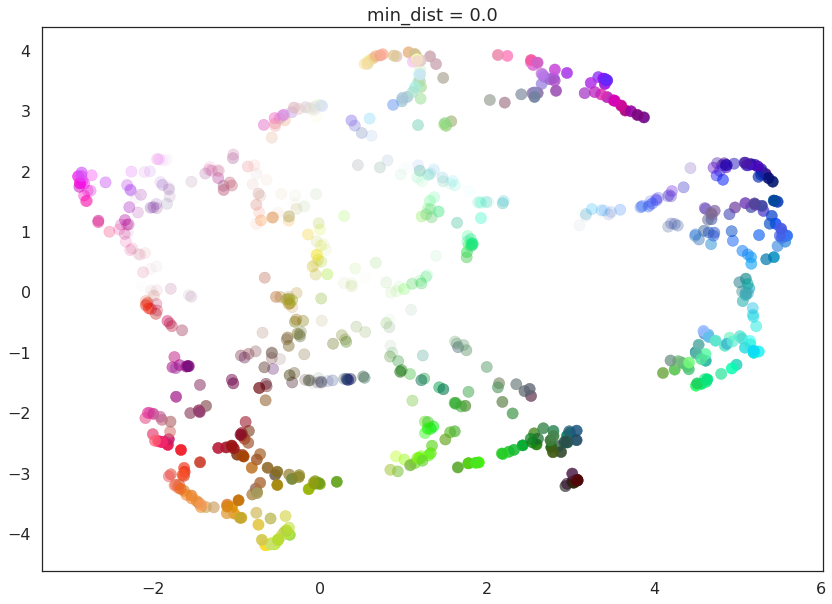

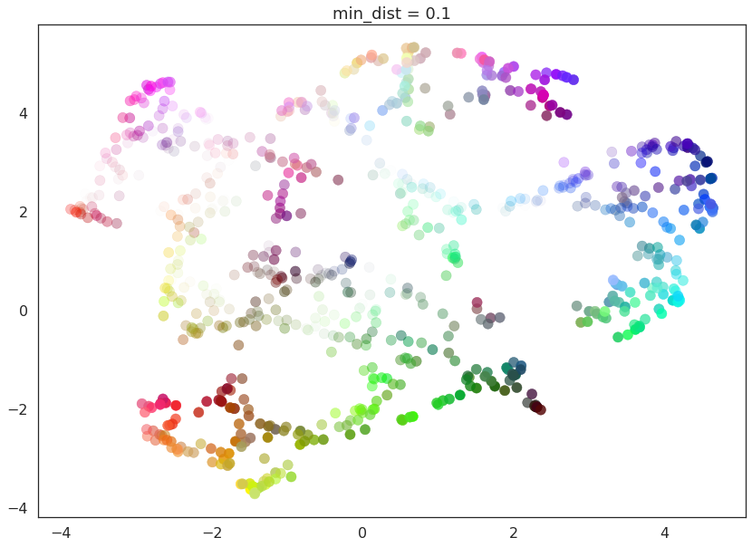

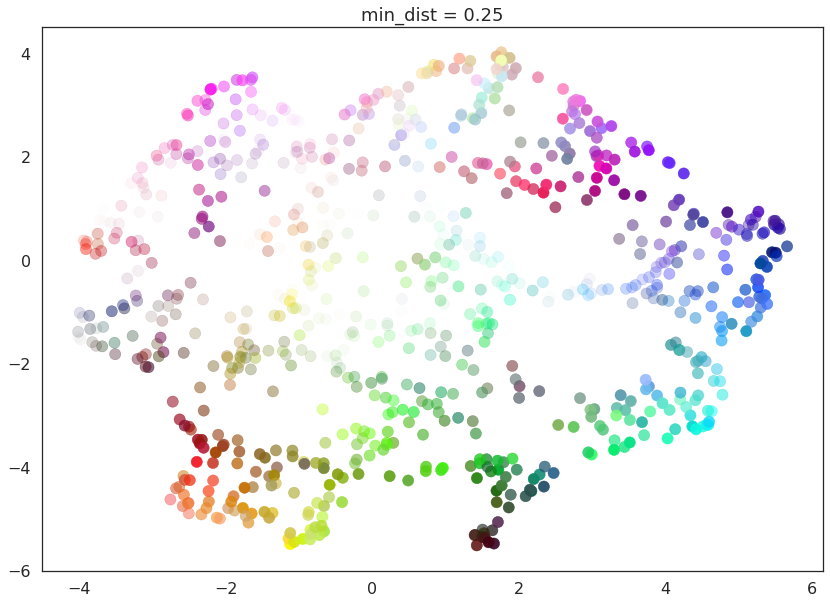

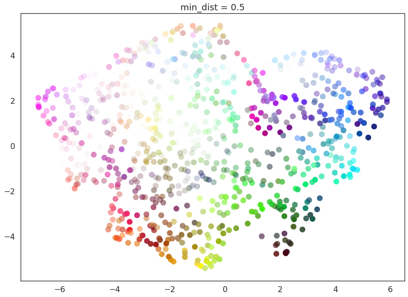

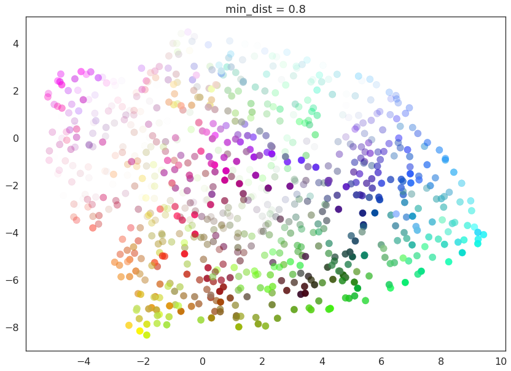

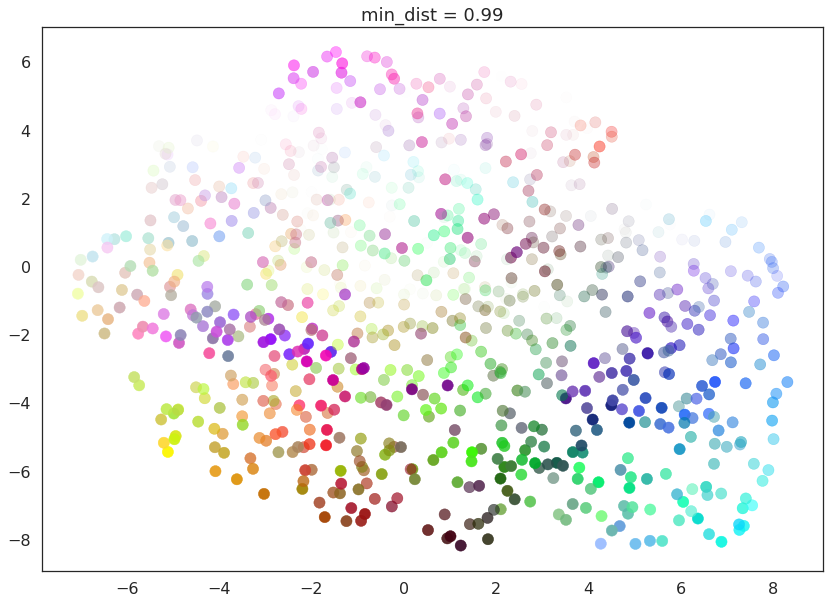

Here we see that with ``min_dist=0.0`` UMAP manages to find small
connected components, clumps and strings in the data, and emphasises
these features in the resulting embedding. As ``min_dist`` is increased
these structures are pushed apart into softer more general features,
providing a better overarching view of the data at the loss of the more
detailed topological structure.

``n_components``
~~~~~~~~~~~~~~~~

As is standard for many ``scikit-learn`` dimension reduction algorithms
UMAP provides a ``n_components`` parameter option that allows the user
to determine the dimensionality of the reduced dimension space we will
be embedding the data into. Unlike some other visualisation algorithms
such as t-SNE UMAP scales well in embedding dimension, so you can use it
for more than just visualisation in 2- or 3-dimensions.

For the purposes of this demonstration (so that we can see the effects
of the parameter) we will only be looking at 1-dimensional and
3-dimensional embeddings, which we have some hope of visualizing.

First of all we will set ``n_components`` to 1, forcing UMAP to embed
the data in a line. For visualisation purposes we will randomly
distribute the data on the y-axis to provide some separation between
points.

.. code:: python3

    draw_umap(n_components=1, title='n_components = 1')

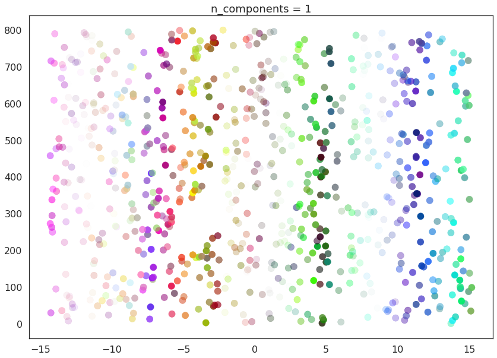

Now we will try ``n_components=3``. For visualisation we will make use
of ``matplotlib``'s basic 3-dimensional plotting.

.. code:: python3

    draw_umap(n_components=3, title='n_components = 3')

.. parsed-literal::

    /opt/anaconda3/envs/umap_dev/lib/python3.6/site-packages/sklearn/metrics/pairwise.py:257: RuntimeWarning: invalid value encountered in sqrt
      return distances if squared else np.sqrt(distances, out=distances)

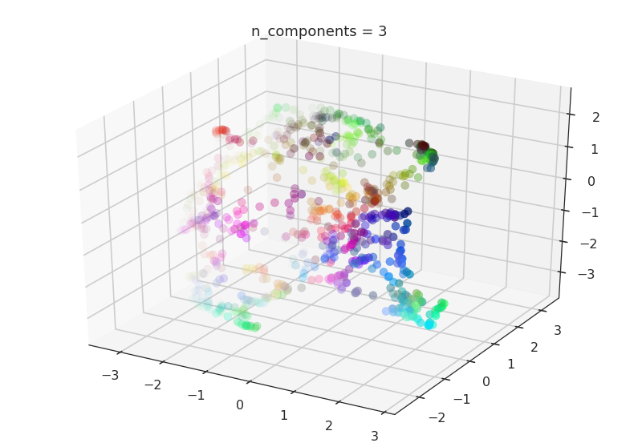

Here we can see that with more dimensions in which to work UMAP has an
easier time separating out the colors in a way that respects the
topological structure of the data.

As mentioned, there is really no requirement to stop at ``n_components``
at 3. If you are interested in (density based) clustering, or other
machine learning techniques, it can be beneficial to pick a larger
embedding dimension (say 10, or 50) closer to the the dimension of the
underlying manifold on which your data lies.

``metric``
~~~~~~~~~~

The final UMAP parameter we will be considering in this notebook is the
``metric`` parameter. This controls how distance is computed in the
ambient space of the input data. By default UMAP supports a wide variety
of metrics, including:

**Minkowski style metrics**

- euclidean
- manhattan
- chebyshev
- minkowski

**Miscellaneous spatial metrics**

- canberra
- braycurtis
- haversine

**Normalized spatial metrics**

- mahalanobis
- wminkowski
- seuclidean

**Angular and correlation metrics**

- cosine
- correlation

**Metrics for binary data**

- hamming
- jaccard
- dice
- russellrao
- kulsinski
- rogerstanimoto
- sokalmichener
- sokalsneath
- yule

Any of which can be specified by setting ``metric='<metric name>'``; for
example to use cosine distance as the metric you would use
``metric='cosine'``.

UMAP offers more than this however -- it supports custom user defined
metrics as long as those metrics can be compiled in ``nopython`` mode by
numba. For this notebook we will be looking at such custom metrics. To
define such metrics we'll need numba ...

.. code:: python3

    import numba

For our first custom metric we'll define the distance to be the absolute
value of difference in the red channel.

.. code:: python3

    @numba.njit()
    def red_channel_dist(a,b):
        return np.abs(a[0] - b[0])

To get more adventurous it will be useful to have some colorspace
conversion -- to keep things simple we'll just use HSL formulas to
extract the hue, saturation, and lightness from an (R,G,B) tuple.

.. code:: python3

    @numba.njit()
    def hue(r, g, b):
        cmax = max(r, g, b)
        cmin = min(r, g, b)
        delta = cmax - cmin
        if cmax == r:
            return ((g - b) / delta) % 6
        elif cmax == g:
            return ((b - r) / delta) + 2
        else:
            return ((r - g) / delta) + 4
        
    @numba.njit()
    def lightness(r, g, b):
        cmax = max(r, g, b)
        cmin = min(r, g, b)
        return (cmax + cmin) / 2.0
    
    @numba.njit()
    def saturation(r, g, b):
        cmax = max(r, g, b)
        cmin = min(r, g, b)
        chroma = cmax - cmin
        light = lightness(r, g, b)
        if light == 1:
            return 0
        else:
            return chroma / (1 - abs(2*light - 1))

With that in hand we can define three extra distances. The first simply
measures the difference in hue, the second measures the euclidean
distance in a combined saturation and lightness space, while the third
measures distance in the full HSL space.

.. code:: python3

    @numba.njit()
    def hue_dist(a, b):
        diff = (hue(a[0], a[1], a[2]) - hue(b[0], b[1], b[2])) % 6
        if diff < 0:
            return diff + 6
        else:
            return diff
    
    @numba.njit()
    def sl_dist(a, b):
        a_sat = saturation(a[0], a[1], a[2])
        b_sat = saturation(b[0], b[1], b[2])
        a_light = lightness(a[0], a[1], a[2])
        b_light = lightness(b[0], b[1], b[2])
        return (a_sat - b_sat)**2 + (a_light - b_light)**2
    
    @numba.njit()
    def hsl_dist(a, b):
        a_sat = saturation(a[0], a[1], a[2])
        b_sat = saturation(b[0], b[1], b[2])
        a_light = lightness(a[0], a[1], a[2])
        b_light = lightness(b[0], b[1], b[2])
        a_hue = hue(a[0], a[1], a[2])
        b_hue = hue(b[0], b[1], b[2])
        return (a_sat - b_sat)**2 + (a_light - b_light)**2 + (((a_hue - b_hue) % 6) / 6.0)

With such custom metrics in hand we can get UMAP to embed the data using
those metrics to measure distance between our input data points. Note
that ``numba`` provides significant flexibility in what we can do in
defining distance functions. Despite this we retain the high performance
we expect from UMAP even using such custom functions.

.. code:: python3

    for m in ("euclidean", red_channel_dist, sl_dist, hue_dist, hsl_dist):
        name = m if type(m) is str else m.__name__
        draw_umap(n_components=2, metric=m, title='metric = {}'.format(name))

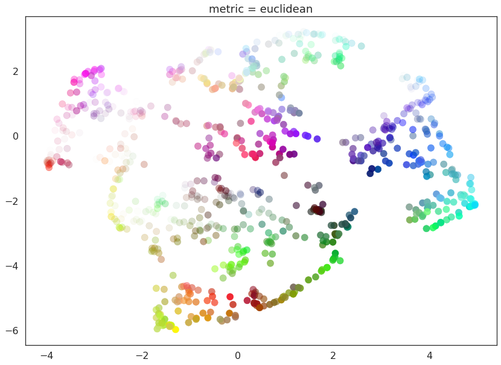

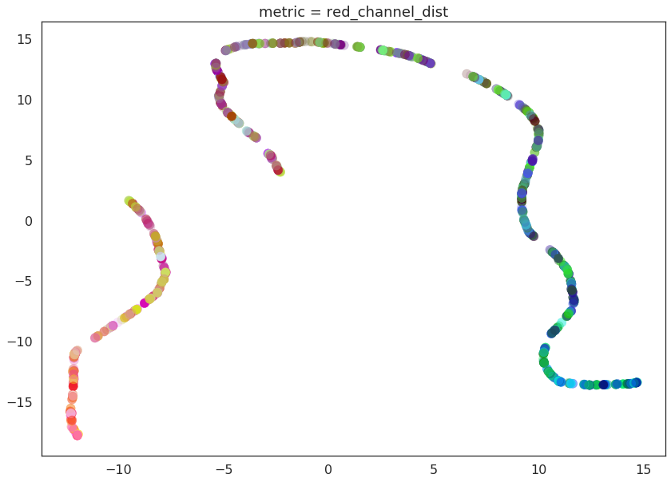

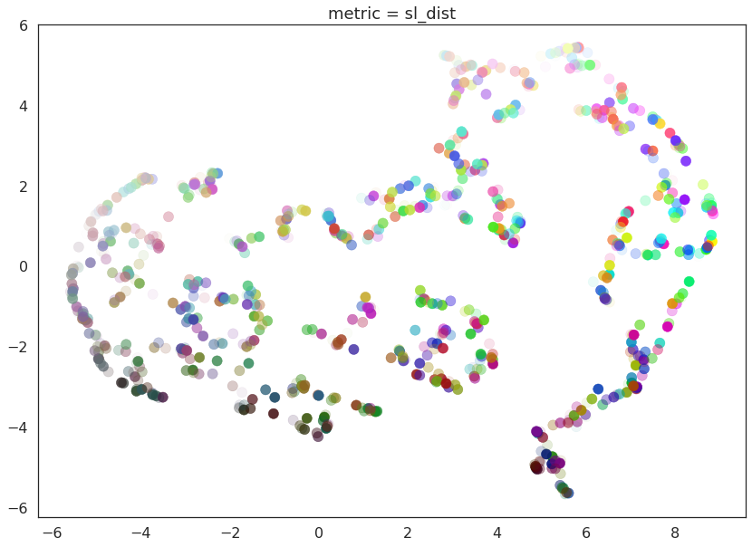

.. image:: images/parameters_32_4.png

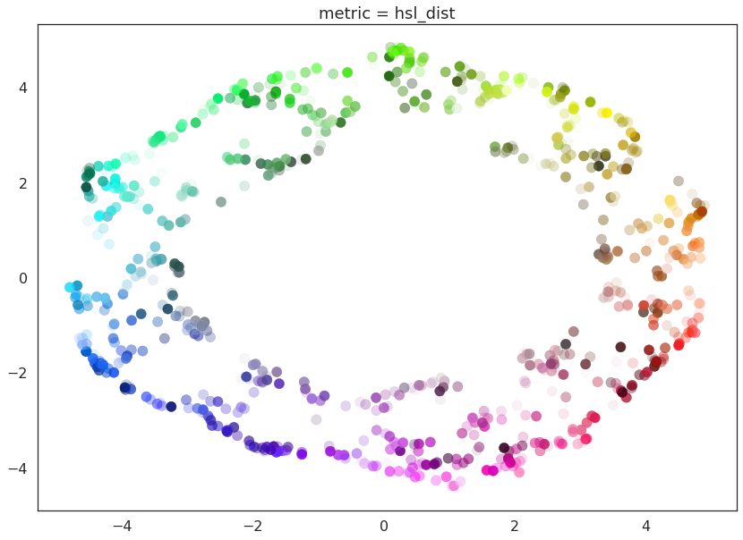

And here we can see the effects of the metrics quite clearly. The pure
red channel correctly see the data as living on a one dimensional
manifold, the hue metric interprets the data as living in a circle, and
the HSL metric fattens out the circle according to the saturation and
lightness. This provides a reasonable demonstration of the power and
flexibility of UMAP in understanding the underlying topology of data,
and finding a suitable low dimensional representation of that topology.
