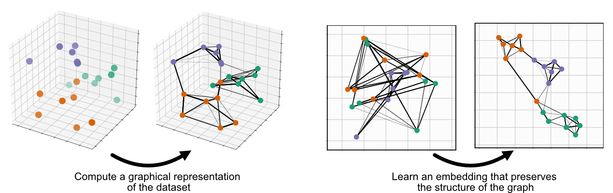
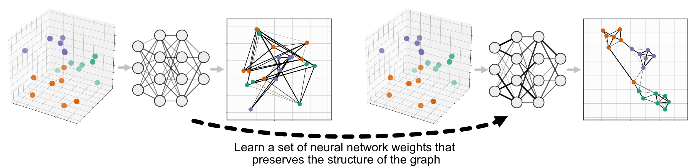
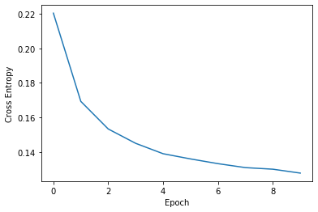

Parametric (neural network) Embedding
=============================

.. role:: python(code)
   :language: python
   
UMAP is comprised of two steps: First, compute a graph representing your data, second, learn an embedding for that graph:



Parametric UMAP replaces the second step, minimizing the same objective function as UMAP (we'll call it non-parametric UMAP here), but learning the relationship between the data and embedding using a neural network, rather than learning the embeddings directly:



Parametric UMAP is simply a subclass of UMAP, so it can be used just like nonparametric UMAP, replacing :python:`umap.UMAP` with :python:`parametric_umap.ParametricUMAP`. The most basic usage of parametric UMAP would be to simply replace UMAP with ParametricUMAP in your code:

.. code:: python3

    from umap.parametric_umap import ParametricUMAP
    embedder = ParametricUMAP()
    embedding = embedder.fit_transform(my_data)

In this implementation, we use Keras and Tensorflow as a backend to train that neural network. The added complexity of a learned embedding presents a number of configurable settings available in addition to those in non-parametric UMAP. A set of Jupyter notebooks walking you through these parameters are available on the  `GitHub repository <https://github.com/lmcinnes/umap/tree/master/notebooks/Parametric_UMAP>`_


Defining your own network
---------------------------

By default, Parametric UMAP uses 3-layer 100-neuron fully-connected neural network. To extend Parametric UMAP to use a more complex architecture, like a convolutional neural network, we simply need to define the network and pass it in as an argument to ParametricUMAP. This can be done easliy, using tf.keras.Sequential. Here's an example for MNIST:

.. code:: python3
    
    # define the network
    import tensorflow as tf
    dims = (28, 28, 1)
    n_components = 2
    encoder = tf.keras.Sequential([
        tf.keras.layers.InputLayer(input_shape=dims),
        tf.keras.layers.Conv2D(
            filters=32, kernel_size=3, strides=(2, 2), activation="relu", padding="same"
        ),
        tf.keras.layers.Conv2D(
            filters=64, kernel_size=3, strides=(2, 2), activation="relu", padding="same"
        ),
        tf.keras.layers.Flatten(),
        tf.keras.layers.Dense(units=256, activation="relu"),
        tf.keras.layers.Dense(units=256, activation="relu"),
        tf.keras.layers.Dense(units=n_components),
    ])
    encoder.summary()
   
To load pass the data into ParametricUMAP, we first need to flatten it from 28x28x1 images to a 784-dimensional vector.
    
.. code:: python3    

    from tensorflow.keras.datasets import mnist
    (train_images, Y_train), (test_images, Y_test) = mnist.load_data()
    train_images = train_images.reshape((train_images.shape[0], -1))/255.
    test_images = test_images.reshape((test_images.shape[0], -1))/255.


We can then pass the network into ParametricUMAP and train:

.. code:: python3 

    # pass encoder network to ParametricUMAP
    embedder = ParametricUMAP(encoder=encoder, dims=dims)
    embedding = embedder.fit_transform(train_images)

If you are unfamilar with Tensorflow/Keras and want to train your own model, we reccomend that you take a look at the `Tensorflow documentation <https://www.tensorflow.org/>`_. 


Saving and loading your model
-----------------------------

Unlike non-parametric UMAP Parametric UMAP cannot be saved simply by pickling the UMAP object because of the Keras networks it contains. To save Parametric UMAP, there is a build in function:

.. code:: python3

    embedder.save('/your/path/here')
    
You can then load parametric UMAP elsewhere:

.. code:: python3

    from umap.parametric_umap import load_ParametricUMAP
    embedder = load_ParametricUMAP('/your/path/here')

This loads both the UMAP object and the parametric networks it contains.


Plotting loss
-------------
Parametric UMAP monitors loss during training using Keras. That loss will be printed after each epoch during training. This loss is saved in :python:`embedder.history`, and can be plotted: 

.. code:: python3
    
    print(embedder._history)
    fig, ax = plt.subplots()
    ax.plot(embedder._history['loss'])
    ax.set_ylabel('Cross Entropy')
    ax.set_xlabel('Epoch')
    


Parametric inverse_transform (reconstruction)
---------------------------------------------
To use a second neural network to learn an inverse mapping between data and embeddings, we simply need to pass `parametric_reconstruction= True` to the ParametricUMAP.


Like the encoder, a custom decoder can also be passed to ParametricUMAP, e.g.

.. code:: python3

            decoder = tf.keras.Sequential([
                tf.keras.layers.InputLayer(input_shape=(n_components)),
                tf.keras.layers.Dense(units=256, activation="relu"),
                tf.keras.layers.Dense(units=7 * 7 * 256, activation="relu"),
                tf.keras.layers.Reshape(target_shape=(7, 7, 256)),
                tf.keras.layers.UpSampling2D((2)),
                tf.keras.layers.Conv2D(
                    filters=64, kernel_size=3, padding="same", activation="relu"
                ),
                tf.keras.layers.UpSampling2D((2)),
                tf.keras.layers.Conv2D(
                    filters=32, kernel_size=3, padding="same", activation="relu"
                ),

            ])
            
In addition, validation data can be used to test reconstruction loss on out-of-dataset samples:

.. code:: python3

    validation_images = test_images.reshape((test_images.shape[0], -1))/255.

Finally, we can pass the validation data and the networks to ParametricUMAP and train:


.. code:: python3

            embedder = ParametricUMAP(
                encoder=encoder,
                decoder=decoder,
                dims=dims,
                parametric_reconstruction= True,
                reconstruction_validation=validation_images,
                verbose=True,
            )
            embedding = embedder.fit_transform(train_images)


Autoencoding UMAP
-----------------


In the example above, the encoder is trained to minimize UMAP loss, and the decoder is trained to minimize reconstruction loss. To train the encoder jointly on both UMAP loss and reconstruction loss, pass :python:`autoencoder_loss = True` into the ParametricUMAP.


.. code:: python3

            embedder = ParametricUMAP(
                encoder=encoder,
                decoder=decoder,
                dims=dims,
                parametric_reconstruction= True,
                reconstruction_validation=validation_images,
                autoencoder_loss = True,
                verbose=True,
            )


Early stopping and Keras callbacks
----------------------------------

It can sometimes be useful to train the embedder until some plateau in training loss is met. In deep learning, early stopping is one way to do this. Keras provides custom `callbacks <https://keras.io/api/callbacks/>`_ that allow you to implement checks during training, such as early stopping. We can use callbacks, such as early stopping, with ParametricUMAP to stop training early based on a predefined training threshold, using the :python:`keras_fit_kwargs` argument:

.. code:: python3

    keras_fit_kwargs = {"callbacks": [
        tf.keras.callbacks.EarlyStopping(
            monitor='loss',
            min_delta=10**-2,
            patience=10,
            verbose=1,
        )
    ]}

    embedder = ParametricUMAP(
        verbose=True,
        keras_fit_kwargs = keras_fit_kwargs,
        n_training_epochs=20
    )


We also passed in :python:`n_training_epochs = 20`, allowing early stopping to end training before 20 epochs are reached. 


Additional important parameters
-------------------------------

* **batch_size:** ParametricUMAP in trained over batches of edges randomly sampled from the UMAP graph, and then trained via gradient descent.  ParametricUMAP defaults to a batch size of 1000 edges, but can be adjusted to a value that fits better on your GPU or CPU.
* **loss_report_frequency:** If set to 1, an epoch in in the Keras embedding refers to a single iteration over the graph computed in UMAP. Setting :python:`loss_report_frequency` to 10, would split up that epoch into 10 seperate epochs, for more frequent reporting. 
* **n_training_epochs:** The number of epochs over the UMAP graph to train for (irrespective of :python:`loss_report_frequency`). Training the network for multiple epochs will result in better embeddings, but take longer. This parameter is different than :python:`n_epochs` in the base UMAP class, which corresponds to the maximum number of times an edge is trained in a single ParametricUMAP epoch.
* **optimizer:** The optimizer used to train the neural network. by default Adam (:python:`tf.keras.optimizers.Adam(1e-3)`) is used. You might be able to speed up or improve training by using a different optimizer.
* **parametric_embedding:** If set to false, a non-parametric embedding is learned, using the same code as the parametric embedding, which can serve as a direct comparison between parametric and non-parametric embedding using the same optimizer. The parametric embeddings are performed over the entire dataset simultaneously. 
* **global_correlation_loss_weight:** Whether to additionally train on correlation of global pairwise relationships (multidimensional scaling)

Extending the model
-------------------
You may want to customize parametric UMAP beyond what we have implemented in this package. To make it as easy as possible to tinker around with Parametric UMAP, we made a few Jupyter notebooks that show you how to extend Parametric UMAP to your own use-cases. 

* https://colab.research.google.com/drive/1WkXVZ5pnMrm17m0YgmtoNjM_XHdnE5Vp?usp=sharing

Citing our work
---------------
If you use Parametric UMAP in your work, please cite our paper:

.. code:: bibtex

    @article{sainburg2021parametric,
     title={Parametric UMAP Embeddings for Representation and Semisupervised Learning},
     author={Sainburg, Tim and McInnes, Leland and Gentner, Timothy Q},
     journal={Neural Computation},
     volume={33},
     number={11},
     pages={2881--2907},
     year={2021},
     publisher={MIT Press One Rogers Street, Cambridge, MA 02142-1209, USA journals-info~…}
   }
```
