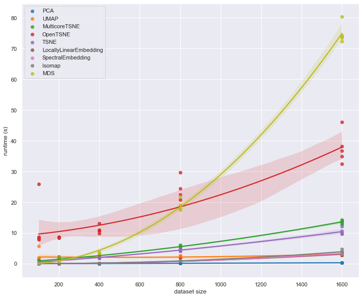
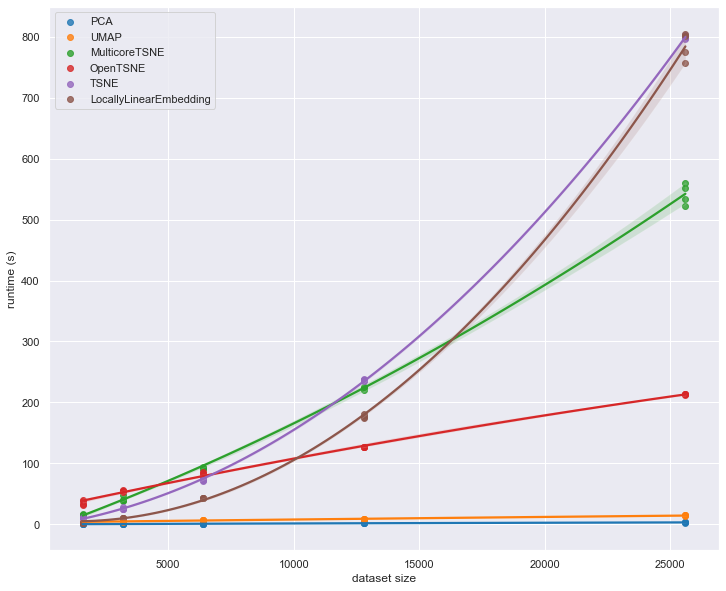
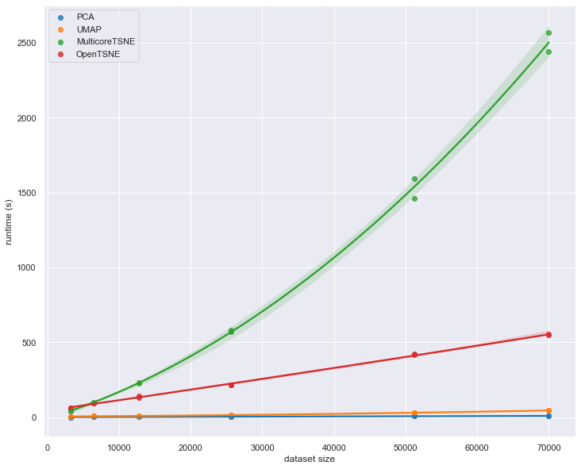

Performance Comparison of Dimension Reduction Implementations
=============================================================

Different dimension reduction techniques can have quite different
computational complexity. Beyond the algorithm itself there is also the
question of how exactly it is implemented. These two factors can have a
significant role in how long it actually takes to run a given dimension
reduction. Furthermore the nature of the data you are trying to reduce
can also matter – mostly the involves the dimensionality of the original
data. Here we will take a brief look at the performance characterstics
of a number of dimension reduction implementations.

To start let’s get the basic tools we’ll need loaded up – numpy and
pandas obviously, but also tools to get and resample the data, and the
time module so we can perform some basic benchmarking.

.. code:: python

    import numpy as np
    import pandas as pd
    from sklearn.datasets import fetch_openml
    from sklearn.utils import resample
    import time

Next we’ll need the actual dimension reduction implementations. For the
purposes of this explanation we’ll mostly stick with
`scikit-learn <http://scikit-learn.org/stable/>`__, but for the sake of
comparison we’ll also include the
`MulticoreTSNE <https://github.com/DmitryUlyanov/Multicore-TSNE>`__
implementation of t-SNE, and
`openTSNE <https://github.com/pavlin-policar/openTSNE>`__ both of which
have historically had significantly better performance than scikit-learn
t-SNE (more recent versions of scikit-learn have improved t-SNE
performance).

.. code:: python

    from sklearn.manifold import TSNE, LocallyLinearEmbedding, Isomap, MDS, SpectralEmbedding
    from sklearn.decomposition import PCA
    from MulticoreTSNE import MulticoreTSNE
    from openTSNE import TSNE as OpenTSNE
    from umap import UMAP

Next we’ll need out plotting tools, and, of course, some data to work
with. For this performance comparison we’ll default to the now standard
benchmark of manifold learning: the MNIST digits dataset. We can use
scikit-learn’s ``fetch_openml`` to grab it for us.

.. code:: python

    import matplotlib.pyplot as plt
    import seaborn as sns
    %matplotlib inline

.. code:: python

    sns.set(context='notebook', 
            rc={'figure.figsize':(12,10)},
            palette=sns.color_palette('tab10', 10))

.. code:: python

    mnist = fetch_openml('mnist_784', version=1, return_X_y=True)

.. code:: python

    mnist_data = mnist[0]
    mnist_labels = mnist[1].astype(int)

Now it is time to start looking at performance. To start with let’s look
at how performance scales with increasing dataset size.

Performance scaling by dataset size
-----------------------------------

As the size of a dataset increases the runtime of a given dimension
reduction algorithm will increase at varying rates. If you ever want to
run your algorithm on larger datasets you will care not just about the
comparative runtime on a single small dataset, but how the performance
scales out as you move to larger datasets. We can similate this by
subsampling from MNIST digits (via scikit-learn’s convenient
``resample`` utility) and looking at the runtime for varying sized
subsamples. Since there is some randomness involved here (both in the
subsample selection, and in some of the algorithms which have stochastic
aspects) we will want to run a few examples for each dataset size. We
can easily package all of this up in a simple function that will return
a convenient pandas dataframe of dataset sizes and runtimes given an
algorithm.

.. code:: python

    def data_size_scaling(algorithm, data, sizes=[100, 200, 400, 800, 1600], n_runs=5):
        result = []
        for size in sizes:
            for run in range(n_runs):
                subsample = resample(data, n_samples=size)
                start_time = time.time()
                algorithm.fit(subsample)
                elapsed_time = time.time() - start_time
                del subsample
                result.append((size, elapsed_time))
        return pd.DataFrame(result, columns=('dataset size', 'runtime (s)'))

Now we just want to run this for each of the various dimension reduction
implementations so we can look at the results. Since we don’t know how
long these runs might take we’ll start off with a very small set of
samples, scaling up to only 1600 samples.

.. code:: python

    all_algorithms = [
        PCA(),
        UMAP(),
        MulticoreTSNE(),
        OpenTSNE(),
        TSNE(),
        LocallyLinearEmbedding(),
        SpectralEmbedding(), 
        Isomap(), 
        MDS(),
    ]
    performance_data = {}
    for algorithm in all_algorithms:
        if 'openTSNE' in str(algorithm.__class__):
            alg_name = "OpenTSNE"
        elif 'MulticoreTSNE' in str(algorithm.__class__):
            alg_name = "MulticoreTSNE"
        else:
            alg_name = str(algorithm).split('(')[0]
            
        performance_data[alg_name] = data_size_scaling(algorithm, mnist_data, n_runs=5)
        
        print(f"[{time.asctime(time.localtime())}] Completed {alg_name}")

.. parsed-literal::

    [Sat Feb 22 09:50:24 2020] Completed PCA
    [Sat Feb 22 09:51:23 2020] Completed UMAP
    [Sat Feb 22 09:53:24 2020] Completed MulticoreTSNE
    [Sat Feb 22 10:00:50 2020] Completed OpenTSNE
    [Sat Feb 22 10:02:22 2020] Completed TSNE
    [Sat Feb 22 10:02:44 2020] Completed LocallyLinearEmbedding
    [Sat Feb 22 10:03:06 2020] Completed SpectralEmbedding
    [Sat Feb 22 10:03:31 2020] Completed Isomap
    [Sat Feb 22 10:11:45 2020] Completed MDS

Now let’s plot the results so we can see what is going on. We’ll use
seaborn’s regression plot to interpolate the effective scaling. For some
algorithms this can be a little noisy, especially in this relatively
small dataset regime, but it will give us a good idea of what is going
on.

.. code:: python

    for alg_name, perf_data in performance_data.items():
        sns.regplot('dataset size', 'runtime (s)', perf_data, order=2, label=alg_name)
    plt.legend()

We can see straight away that there are some outliers here. It is notable that
openTSNE does poorly on small datasets. It does not have the scaling properties of MDS however; for
larger dataset sizes MDS is going to quickly become completely
unmanageable which openTSNE has fairly flat scaling. At the same time
MulticoreTSNE demonstrates that t-SNE can run fairly efficiently. It is
hard to tell much about the other implementations other than the fact
that PCA is far and away the fastest option. To see more we’ll have to
look at runtimes on larger dataset sizes. Both MDS, Isomap and SpectralEmbedding
will actually take too long to run so let’s restrict ourselves to
the fastest performing implementations and see what happens as we extend
out to larger dataset sizes.

.. code:: python

    fast_algorithms = [
        PCA(),
        UMAP(),
        MulticoreTSNE(),
        OpenTSNE(),
        TSNE(),
        LocallyLinearEmbedding(),
    ]
    fast_performance_data = {}
    for algorithm in fast_algorithms:
        if 'openTSNE' in str(algorithm.__class__):
            alg_name = "OpenTSNE"
        elif 'MulticoreTSNE' in str(algorithm.__class__):
            alg_name = "MulticoreTSNE"
        else:
            alg_name = str(algorithm).split('(')[0]
            
        fast_performance_data[alg_name] = data_size_scaling(algorithm, mnist_data, 
                                                       sizes=[1600, 3200, 6400, 12800, 25600], n_runs=4)
        
        print(f"[{time.asctime(time.localtime())}] Completed {alg_name}")

.. parsed-literal::

    [Sat Feb 22 10:12:15 2020] Completed PCA
    [Sat Feb 22 10:14:51 2020] Completed UMAP
    [Sat Feb 22 11:16:05 2020] Completed MulticoreTSNE
    [Sat Feb 22 11:50:17 2020] Completed OpenTSNE
    [Sat Feb 22 13:06:38 2020] Completed TSNE
    [Sat Feb 22 14:14:36 2020] Completed LocallyLinearEmbedding

.. code:: python

    for alg_name, perf_data in fast_performance_data.items():
        sns.regplot('dataset size', 'runtime (s)', perf_data, order=2, label=alg_name)
    plt.legend()

At this point we begin to see some significant differentiation among the
different implementations. In the earlier plot OpenTSNE looked to be
performing relatively poorly, but now the scaling effects kick in, and
we see that is is faster than most. Similarly MulticoreTSNE looked to be
slower than some of the other algorithms in th earlier plot, but as we
scale out to larger datasets we see that its relative scaling
performance is superior to the scikit-learn implementations of
TSNE and locally linear embedding.

It is probably worth extending out further – up to the full MNIST digits
dataset. To manage to do that in any reasonable amount of time we’ll
have to restrict out attention to an even smaller subset of
implementations. We will pare things down to just OpenTSNE,
MulticoreTSNE, PCA and UMAP.

.. code:: python

    very_fast_algorithms = [
        PCA(),
        UMAP(),
        MulticoreTSNE(),
        OpenTSNE(),
    ]
    vfast_performance_data = {}
    for algorithm in very_fast_algorithms:
        if 'openTSNE' in str(algorithm.__class__):
            alg_name = "OpenTSNE"
        elif 'MulticoreTSNE' in str(algorithm.__class__):
            alg_name = "MulticoreTSNE"
        else:
            alg_name = str(algorithm).split('(')[0]
            
        vfast_performance_data[alg_name] = data_size_scaling(algorithm, mnist_data, 
                                                        sizes=[3200, 6400, 12800, 25600, 51200, 70000], n_runs=2)
        
        print(f"[{time.asctime(time.localtime())}] Completed {alg_name}")

.. parsed-literal::

    [Sat Feb 22 14:15:22 2020] Completed PCA
    [Sat Feb 22 14:18:59 2020] Completed UMAP
    [Sat Feb 22 17:04:58 2020] Completed MulticoreTSNE
    [Sat Feb 22 17:54:14 2020] Completed OpenTSNE

.. code:: python

    for alg_name, perf_data in vfast_performance_data.items():
        sns.regplot('dataset size', 'runtime (s)', perf_data, order=2, label=alg_name)
    plt.legend()

Here we see UMAP’s advantages over t-SNE really coming to the forefront.
While UMAP is clearly slower than PCA, its scaling performance is
dramatically better than MulticoreTSNE, and, despite the impressive
scaling performance of openTSNE, UMAP continues to outperform it. Based
on the slopes of the lines, for even larger datasets the difference
between UMAP and t-SNE is only going to grow.

This concludes our look at scaling by dataset size. The short summary is
that PCA is far and away the fastest option, but you are potentially
giving up a lot for that speed. UMAP, while not competitive with PCA, is
clearly the next best option in terms of performance among the
implementations explored here. Given the quality of results that UMAP
can provide we feel it is clearly a good option for dimension reduction.

