Plotting UMAP results
=====================

UMAP is often used for visualization by reducing data to 2-dimensions.
Since this is such a common use case the umap package now includes
utility routines to make plotting UMAP results simple, and provide a
number of ways to view and diagnose the results. Rather than seeking to
provide a comprehensive solution that covers all possible plotting needs
this umap extension seeks to provide a simple to use interface to make
the majority of plotting needs easy, and help provide sensible plotting
choices wherever possible. To get started looking at the plotting
options let's load a variety of data to work with.

.. code:: python3

    import sklearn.datasets
    import pandas as pd
    import numpy as np
    import umap

.. code:: python3

    pendigits = sklearn.datasets.load_digits()
    mnist = sklearn.datasets.fetch_openml('mnist_784')
    fmnist = sklearn.datasets.fetch_openml('Fashion-MNIST')

To start we will fit a UMAP model to the pendigits data. This is as
simple as running the fit method and assigning the result to a variable.

.. code:: python3

    mapper = umap.UMAP().fit(pendigits.data)

If we want to do plotting we will need the ``umap.plot`` package. While
the umap package has a fairly small set of requirements it is worth
noting that if you want to using ``umap.plot`` you will need a variety
of extra libraries that are not in the default requirements for umap. In
particular you will need:

-  `matplotlib <https://matplotlib.org/>`__
-  `pandas <https://pandas.pydata.org/>`__
-  `datashader <http://datashader.org/>`__
-  `bokeh <https://bokeh.pydata.org/en/latest/>`__
-  `holoviews <http://holoviews.org/>`__

All should be either pip or conda installable. With those in hand you
can import the ``umap.plot`` package.

.. code:: python3

    import umap.plot

Now that we have the package loaded, how do we use it? The most
straightforward thing to do is plot the umap results as points. We can
achieve this via the function ``umap.plot.points``. In its most basic
form you can simply pass the trained UMAP model to ``umap.plot.points``:

.. code:: python3

    umap.plot.points(mapper)

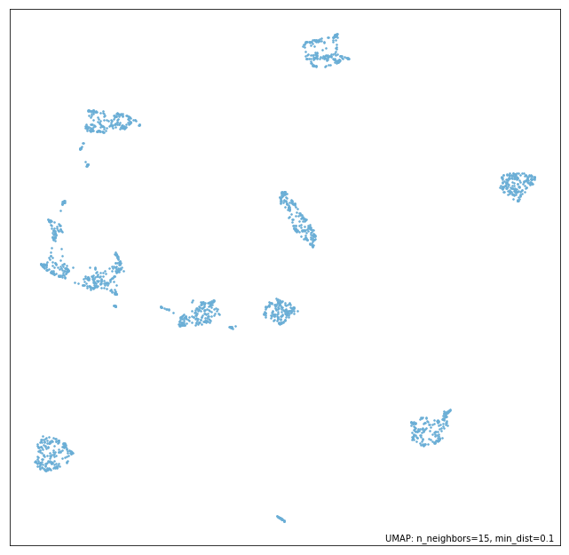

As you can see we immediately get a scatterplot of the UMAP embedding.
Note that the function automatically selects a point-size based on the
data density, and watermarks the image with the UMAP parameters that
were used (this will include the metric if it is non-standard). The
function also returns the matplotlib axes object associated to the plot,
so further matplotlib functions, such as adding titles, axis labels etc.
can be applied by the user if required.

It is common for data passed to UMAP to have an associated set of
labels, which may have been derived from ground-truth, from clustering,
or via other means. In such cases it is desirable to be able to color
the scatterplot according to the labelling. We can do this by simply
passing the array of label information in with the ``labels`` keyword.
The ``umap.plot.points`` function will color the data with a
categorical colormap according to the labels provided.

.. code:: python3

    umap.plot.points(mapper, labels=pendigits.target)

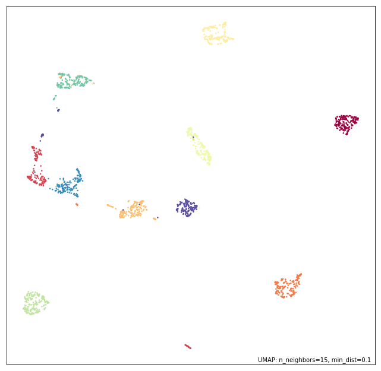

Alternatively you may have extra data that is continuous rather than
categorical. In this case you will want to use a continuous colormap to
shade the data. Again this is straightforward to do -- pass in the
continuous data with the ``values`` keyword and data will be colored
accordingly using a continuous colormap.

Furthermore, if you don't like the default color choices the
``umap.plot.points`` function offers a number of 'themes' that provide
predefined color choices. Themes include:

-  fire
-  viridis
-  inferno
-  blue
-  red
-  green
-  darkblue
-  darkred
-  darkgreen

Here we will make use of the 'fire' theme to demonstrate how simple it
is to change the aesthetics.

.. code:: python3

    umap.plot.points(mapper, values=pendigits.data.mean(axis=1), theme='fire')

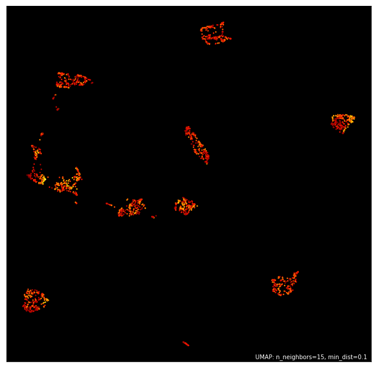

If you want greater control you can specify exact colormaps and
background colors. For example here we want to color the data by label,
but use a black background and use the 'Paired' colormap for the
categorical coloring (passed as ``color_key_cmap``; the ``cmap`` keyword
defines the continuous colormap).

.. code:: python3

    umap.plot.points(mapper, labels=pendigits.target, color_key_cmap='Paired', background='black')

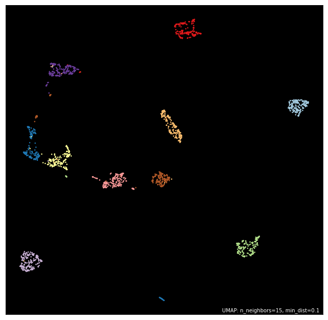

Many more options are available including a ``color_key`` to specify a
dictionary mapping of discrete labels to colors, ``cmap`` to specify the
continous colormap, or the width and height of the resulting plot.
Again, this does not provide comprehensive control of the plot
aesthetics, but the goal here is to provide a simple to use interface
rather than the ability for the user to fine tune all aspects -- users
seeking such control are far better served making use of the individual
underlying packages (matplotlib, datashader, and bokeh) by themselves.

Plotting larger datasets
------------------------

Once you have a lot of data it becomes easier for a simple scatter plot
to lie to you. Most notably overplotting, where markers for points
overlap and pile up on top of each other, can deceive you into thinking
that extremely dense clumps may only contain a few points. While there
are things that can be done to help remedy this, such as reducing the
point size, or adding an alpha channel, few are sufficient to be sure
the plot isn't subtly lying to you in some way. `This essay
<https://datashader.org/user_guide/Plotting_Pitfalls.html>`_ in
the datashader documentation does an excellent job of describing the
issues with overplotting, why the obvious solutions are not quite
sufficient, and how to get around the problem. To make life easier for
users the ``umap.plot`` package will automatically switch to using
datashader for rendering once your dataset gets large enough. This helps
to ensure you don't get fooled by overplotting. We can see this in
action by working with one of the larger datasets such as Fashion-MNIST.

.. code:: python3

    mapper = umap.UMAP().fit(fmnist.data)

Having fit the data with UMAP we can call ``umap.plot.points`` exactly
as before, but this time, since the data is large enough to have
potential overplotting, datashader will be used in the background for
rendering.

.. code:: python3

    umap.plot.points(mapper)

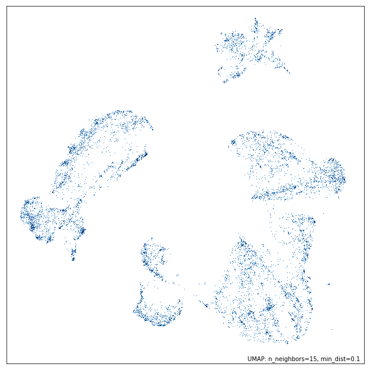

All the same plot options as before hold, so we can color by labels, and
apply the same themes, and it will all seamlessly use datashader for the
actual rendering. Thus, regardless of how much data you have
``umap.plot.points`` will render it well with a transparent user
interface. You, as a user, don't need to worry about switching to
plotting with datashader, or how to convert your plotting to its
slightly different API -- you can just use the same API and trust the
results you get.

.. code:: python3

    umap.plot.points(mapper, labels=fmnist.target, theme='fire')

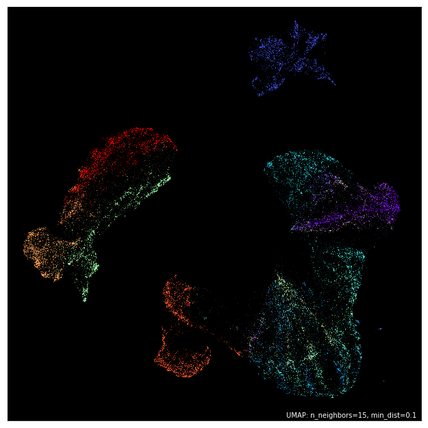

Interactive plotting, and hover tools
-------------------------------------

Rendering good looking static plots is important, but what if you want
to be able to interact with your data -- pan around, and zoom in on the
clusters to see the finer structure? What if you want to annotate your
data with more complex labels than merely colors? Wouldn't it be good to
be able to hover over data points and get more information about the
individual point? Since this is a very common use case ``umap.plot``
tries to make it easy to quickly generate such plots, and provide basic
utilities to allow you to have annotated hover tools working quickly.
Again, the goal is not to provide a comprehensive solution that can do
everything, but rather a simple to use and consistent API to get users
up and running fast.

To make a good example of this let's use a subset of the Fashion MNIST
dataset. We can quickly train a new mapper object on that.

.. code:: python3

    mapper = umap.UMAP().fit(fmnist.data[:30000])

The goal is to be able to hover over different points and see data
associated with the given point (or points) under the cursor. For this
simple demonstration we'll just use the target information of the point.
To create hover information you need to construct a dataframe of all the
data you would like to appear in the hover. Each row should correspond
to a source of data points (appearing in the same order), and the columns
can provide whatever extra data you would like to display in the hover
tooltip. In this case we'll need a dataframe that can include the index
of the point, its target number, and the actual name of the type of
fashion item that target corresponds to. This is easy to quickly put
together using pandas.

.. code:: python3

    hover_data = pd.DataFrame({'index':np.arange(30000),
                               'label':fmnist.target[:30000]})
    hover_data['item'] = hover_data.label.map(
        {
            '0':'T-shirt/top',
            '1':'Trouser',
            '2':'Pullover',
            '3':'Dress',
            '4':'Coat',
            '5':'Sandal',
            '6':'Shirt',
            '7':'Sneaker',
            '8':'Bag',
            '9':'Ankle Boot',
        }
    )

For interactive use the ``umap.plot`` package makes use of bokeh. Bokeh
has several output methods, but in the approach we'll be outputting
inline in a notebook. We have to enable this using the
``output_notebook`` function. Alteratively we could use ``output_file``
or other similar options -- see the bokeh documentation for more
details.

.. code:: python3

    umap.plot.output_notebook()

.. raw:: html

    
        

            
            Loading BokehJS ...
        

Now we can make an interactive plot using ``umap.plot.interactive``.
This has a very similar API to the ``umap.plot.points`` approach, but
also supports a ``hover_data`` keyword which, if passed a suitable
dataframe, will provide hover tooltips in the interactive plot. Since
bokeh allows different outputs, to display it in the notebook we will
have to take the extra stop of calling ``show`` on the result.

.. code:: python3

    p = umap.plot.interactive(mapper, labels=fmnist.target[:30000], hover_data=hover_data, point_size=2)
    umap.plot.show(p)

.. raw:: html
   :file: plotting_interactive_example.html

We get the sort of result one would like -- a fully interactive plot
that can be zoomed in on, and more, but we also now have an interactive
hover tool which presents the data from the dataframe we constructed.
This allows a quick and easy method to get up and running with a richer
interactive exploration of your UMAP plot. ``umap.plot.interactive``
supports all the same aesthetic parameters as ``umap.plot.points`` so
you can theme your plot, color by label or value, and other similar
operations explained above for ``umap.plot.points``.

Plotting connectivity
---------------------

UMAP works by constructing an intermediate topological representation of
the approximate manifold the data may have been sampled from. In
practice this structure can be simplified down to a weighted graph.
Sometimes it can be beneficial to see how that graph (representing
connectivity in the manifold) looks with respect to the resulting
embedding. It can be used to better understand the embedding, and for
diagnostic purposes. To see the connectivity you can use the
``umap.plot.connectivity`` function. It works very similarly to the
``umap.plot.points`` function, and has the option as to whether to
display the embedding point, or just the connectivity. To start let's do
a simple plot showing the points:

.. code:: python3

    umap.plot.connectivity(mapper, show_points=True)

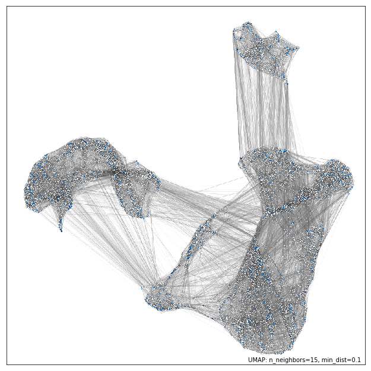

As with ``umap.plot.points`` there are options to control the basic
aesthetics, including theme options and an ``edge_cmap`` keyword
argument to specify the colormap used for displaying the edges.

Since this approach already leverages datashader for edge plotting, we
can go a step further and make use of the edge-bundling options
available in datashader. This can provide a less busy view of
connectivity, but can be expensive to compute, particularly for larger
datasets.

.. code:: python3

    umap.plot.connectivity(mapper, edge_bundling='hammer')

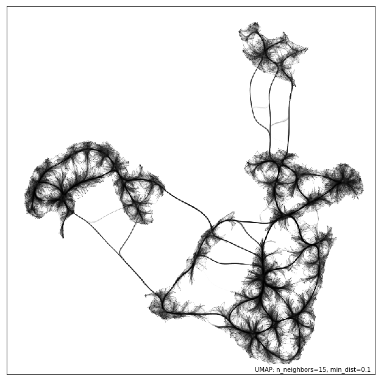

Diagnostic plotting
-------------------

Plotting the connectivity provides at least one basic diagnostic view
that helps a user understand what is going on with an embedding. More
views on data are better, of course, so ``umap.plot`` includes a
``umap.plot.diagnostic`` function that can provide various diagnostic
plots. We'll look at a few of them here. To do so we'll use the full
MNIST digits data set.

.. code:: python3

    mapper = umap.UMAP().fit(mnist.data)

The first diagnostic type is a Principal Components Analysis based
diagnostic, which you can select with ``diagnostic_type='pca'``. The
essence of the approach is that we can use PCA, which preserves global
structure, to reduce the data to three dimensions. If we scale the
results to fit in a 3D cube we can convert the 3D PCA coordinates of
each point into an RGB description of a color. By then coloring the
points in the UMAP embedding with the colors induced by the PCA it is
possible to get a sense of how some of the more large scale global
structure has been represented in the embedding.

.. code:: python3

    umap.plot.diagnostic(mapper, diagnostic_type='pca')

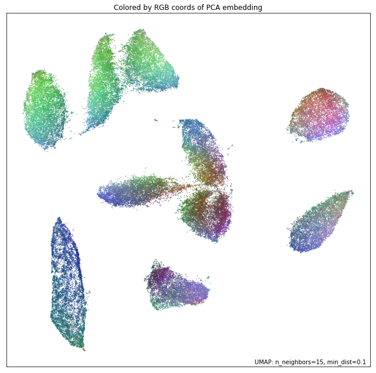

What we are looking for here is a generally smooth transition of colors,
and an overall layout that broadly respects the color transitions. In
this case the far left has a bottom cluster that transitions from dark
green at the bottom to blue at the top, and this matches well with the
cluster in the upper right which have a similar shade of blue at the
bottom before transitioning to more cyan and blue. In contast in the
right of the plot the lower cluster runs from purplish pink to green
from top to bottom, while the cluster above it has its bottom edge more
purple than green, suggesting that perhaps one or the other of these
clusters has been flipped vertically during the optimization process,
and this was never quite corrected.

An alternative, but similar, approach is to use vector quantization as
the method to generate a 3D embedding to generate colors. Vector
quantization effectively finds 3 representative centers for the data,
and then describes each data point in terms of its distance to these
centers. Clearly this, again, captures a lot of the broad global
structure of the data.

.. code:: python3

    umap.plot.diagnostic(mapper, diagnostic_type='vq')

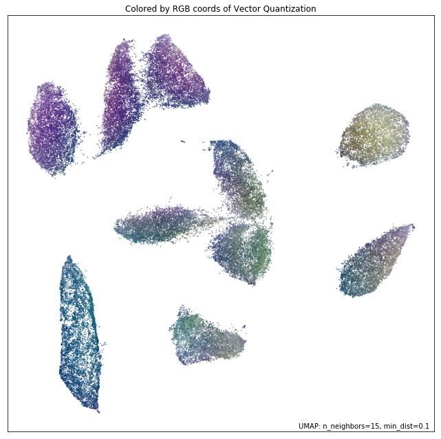

Again we are looking for largely smooth transitions, and for related
colors to match up between clusters. This view supports the fact that
the left hand side of the embedding has worked well, but looking at the
right hand side it seems clear that it is the upper two of the clusters
that has been inadvertently flipped vertically. By contrasting views
like this one can get a better sense of how well the embedding is
working.

For a different perspective we can look at approximations of the local
dimension around each data point. Ideally the local dimension should
match the embedding dimension (although this is often a lot to hope for.
In practice when the local dimension is high this represents points (or
areas of the space) that UMAP will have a harder time embedding as well.
Thus one can trust the embedding to be more accurate in regions where
the points have consistently lower local dimension.

.. code:: python3

    local_dims = umap.plot.diagnostic(mapper, diagnostic_type='local_dim')

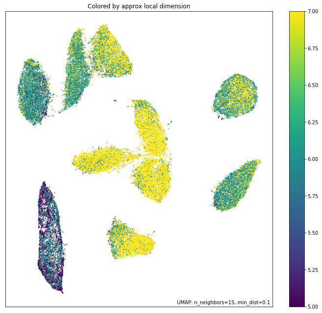

As you can see, the local dimension of the data varies quite widely across
the data. In particular the lower left cluster has the lowest local
dimension -- this is actually unsurprising as this is the cluster
corresponding to the digits 1: there are relatively few degrees of
freedom over how a person draws a number one, and so the resulting local
dimension is lower. In contrast the clusters in the middle have a much
higher local dimension. We should expect the embedidng to be a little
less accurate in these regions: it is hard to represent seven
dimensional data well in only two dimensions, and compromises will need
to be made.

The final diagnostic we'll look at is how well local neighborhoods are
preserved. We can measure this in terms of the Jaccard index of the
local neighborhood in the high dimensional space compared to the
equivalent neighborhood in the embedding. The Jaccard index is
essentially the ratio of the number of neighbors that the two
neighborhoods have in common over the total number of unique neighbors
across the two neighborhoods. Higher values mean that the local
neighborhood has been more accurately preserved.

.. code:: python3

    umap.plot.diagnostic(mapper, diagnostic_type='neighborhood')

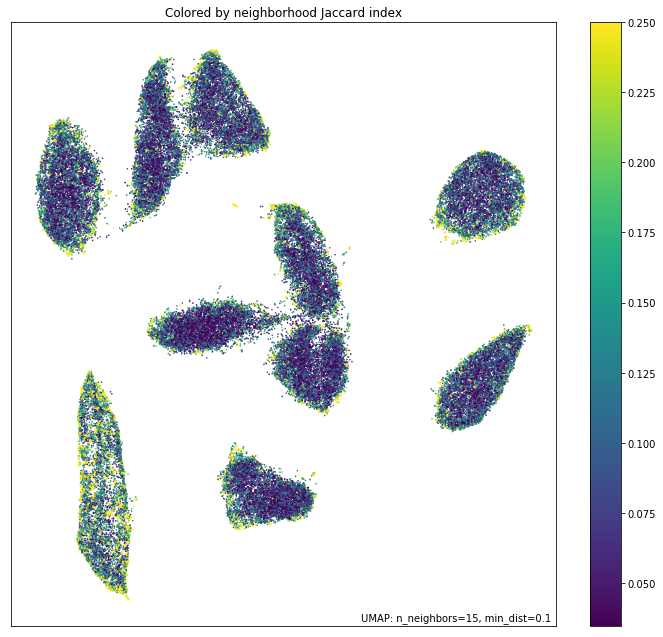

As one might expect the local neighborhood preservation tends to be a
lot better for those points that had a lower local dimension (as seen in
the last plot). There is also a tendency for the edges of clusters
(where there were clear boundaries to be followed) to have a better
preservation of neighborhoods than the centers of the clusters that had
higher local dimension. Again, this provides a view on which areas of
the embedding you can have greater trust in, and which regions had to
make compromises to embed into two dimensions.
