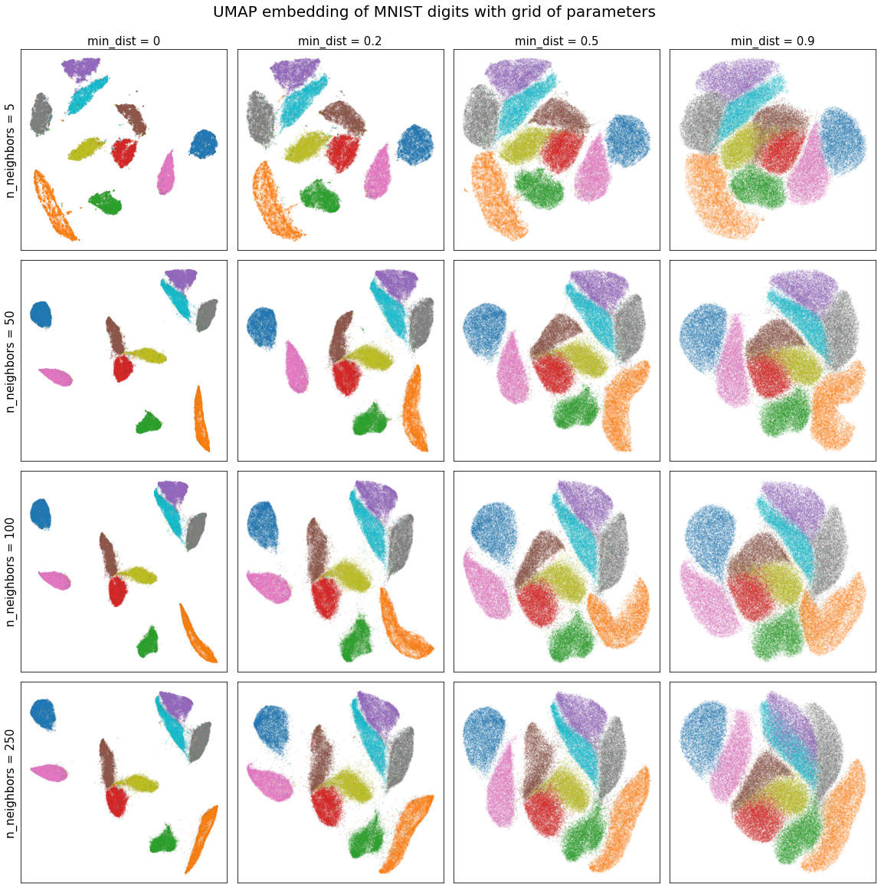
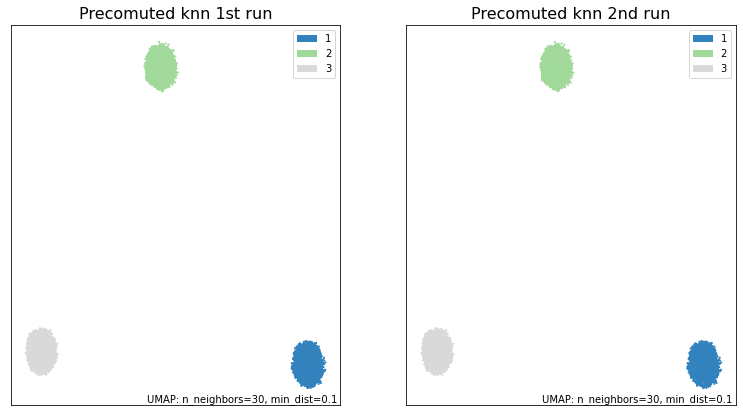
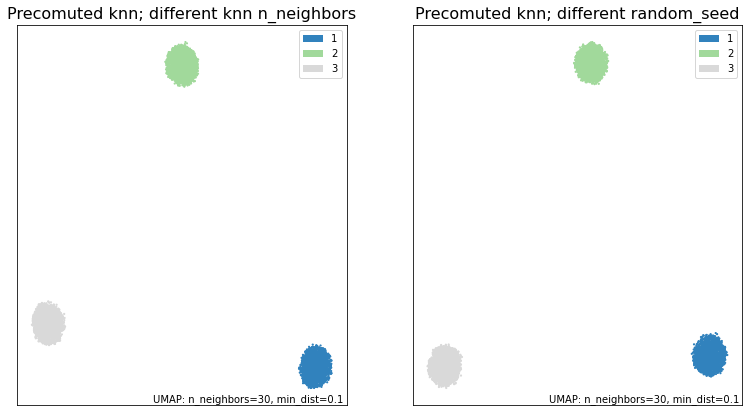
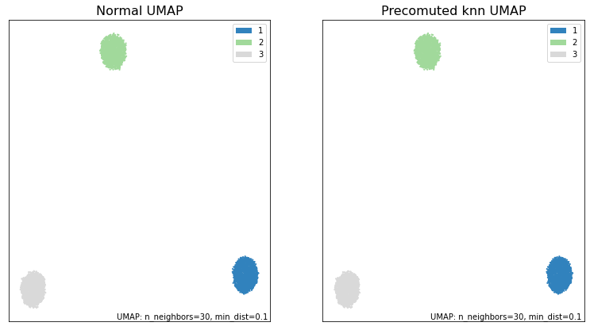

Precomputed k-nn
===================

The purpose of this tutorial is to explore some cases where using a
precomputed_knn might be useful and then discuss how we can obtain
reproducible results with it.

Practical Uses
--------------

Trying UMAP with various parameters
~~~~~~~~~~~~~~~~~~~~~~~~~~~~~~~~~~~~

Let’s look at how we can use precomputed_knn to save time. First we will
test it out on MNIST which has 70,000 samples of 784 dimensions. If we
want to test out a series of n_neighbors and min_dist parameters, we
might lose quite a bit of time recomputing the knn matrices for our
data. Instead, we can compute the knn for the largest n_neighbors we
wish to analyze and then feed that precomputed_knn to UMAP. UMAP will
automatically prune it to the right n_neighbors value and skip the
nearest neighbors step, saving us a lot of time.

We note that we don’t use a random state in order to leverage UMAP’s
parallelization and speed up the calculations.

.. code:: python3

    from sklearn.datasets import fetch_openml
    import numpy as np
    import umap
    import umap.plot
    from umap.umap_ import nearest_neighbors
    
    data, labels = fetch_openml('mnist_784', version=1, return_X_y=True)
    labels = np.asarray(labels, dtype=np.int32)
    
    n_neighbors = [5, 50, 100, 250]
    min_dists = [0, 0.2, 0.5, 0.9]
    normal_embeddings = np.zeros((4, 4, 70000, 2))
    precomputed_knn_embeddings = np.zeros((4, 4, 70000, 2))

.. code:: python3

    %%time
    # UMAP run on the grid of parameters without precomputed_knn
    for i, k in enumerate(n_neighbors):
        for j, dist in enumerate(min_dists):
            normal_embeddings[i, j] = umap.UMAP(n_neighbors=k,
                                                min_dist=dist,
                                               ).fit_transform(data)
    print("\033[1m"+"Time taken to compute UMAP on grid of parameters:\033[0m")

.. parsed-literal::

    **Time taken to compute UMAP on grid of parameters:**
    Wall time: 31min 57s
    

.. code:: python3

    %%time
    # UMAP run on list of n_neighbors without precomputed_knn
    
    # We compute the knn for max(n_neighbors)=250
    mnist_knn = nearest_neighbors(data,
                                  n_neighbors=250,
                                  metric="euclidean",
                                  metric_kwds=None,
                                  angular=False,
                                  random_state=None,
                                 )
    # Now we compute the embeddings for the grid of parameters
    for i, k in enumerate(n_neighbors):
        for j, dist in enumerate(min_dists):
            precomputed_knn_embeddings[i, j] = umap.UMAP(n_neighbors=k,
                                                          min_dist=dist,
                                                          precomputed_knn=mnist_knn,
                                                          ).fit_transform(data)
    print("\033[1m"+"Time taken to compute UMAP on grid of parameters with precomputed_knn:\033[0m")

.. parsed-literal::

    **Time taken to compute UMAP on grid of parameters with precomputed_knn:**
    Wall time: 17min 54s
    

Using a precomputed_knn we have cut the computation time in half!
Observe that half of our n_neighbors values are relatively small. If
instead, we had had a higher distribution of values, the time savings
would have been even greater. Additionaly, we could've saved even more
time by first computing UMAP normally with an *n_neighbors* value of 250
and then extracting the k-nn graph from that UMAP object.

With this, we can easily visualize how the n_neighbors parameter affects
our embedding.

.. code:: python3

    import matplotlib.pyplot as plt
    
    fig, axs = plt.subplots(4, 4, figsize=(20, 20))
    
    for i, ax_row in enumerate(axs):
        for j, ax in enumerate(ax_row):
            ax.scatter(precomputed_knn_embeddings[i, j, :, 0],
                       precomputed_knn_embeddings[i, j, :, 1],
                       c=labels / 9,
                       cmap='tab10',
                       alpha=0.1,
                       s=1,
                       )
            ax.set_xticks([])
            ax.set_yticks([])
            if i == 0:
                ax.set_title("min_dist = {}".format(min_dists[j]), size=15)
            if j == 0:
                ax.set_ylabel("n_neighbors = {}".format(n_neighbors[i]), size=15)
    fig.suptitle("UMAP embedding of MNIST digits with grid of parameters", y=0.92, size=20)
    plt.subplots_adjust(wspace=0.05, hspace=0.05)

We see that in this case, the embedding is robust to the choice of
n_neighbors and that lower min_dist values simply pack the clusters more
tightly.

Reproducibility
----------------

We strongly recommend that you review the UMAP `reproducibility
section <https://umap-learn.readthedocs.io/en/latest/reproducibility.html>`__
in the docs before attempting to reproduce results with
*precomputed_knn*.

Standard Case
~~~~~~~~~~~~~~~

Out of the box, UMAP with precomputed_knn supports creating reproducible
results. This works inexactly the same way as regular UMAP, where, the
user can set a random seed state to ensure that results can be reproduced
exactly. However, some important considerations must be taken into account.

UMAP embeddings are entirely dependent on first, computing the graphical
representation in higher dimensions and second, learning an embedding
that preserves the structure of that graph. Recall that our graphical
representation is based on the k-nn graph of our data. If we have two
different k-nn graphs, then we will naturally have two different
graphical representations of our data. Therefore, **we can only ensure
reproducible results when we use the same k-nn graph**. In our case,
this means that all reproducible results are tied to three values:

.. raw:: html

   <ol>

.. raw:: html

   <li>

The random seed when computing the k-nn.

.. raw:: html

   </li>

.. raw:: html

   <li>

The n_neighbors value when computing the k-nn.

.. raw:: html

   </li>

.. raw:: html

   <li>

The random seed when running UMAP.

.. raw:: html

   </li>

.. raw:: html

   </ol>

Two different runs of UMAP, with these three values being equal, are
guaranteed to return the same result. Let’s look at how this works with
an example. To do this, we’ll create some data to work with; three
random blobs in 60-dimensional space.

.. code:: python3

    y = np.random.rand(1700, 60)
    X = np.concatenate((y+20, y, y-20))
    synthetic_labels = np.repeat([1, 2, 3], repeats=1700)

With the data in hand, we can fix the three parameters listed above and
see how two different UMAP runs give the same result. To avoid confusion
we’ll assume that the UMAP random seed is the same value as the knn
random seed.

.. code:: python3

    import umap.plot
    random_seed = 10
    
    knn = nearest_neighbors(
                            X, 
                            n_neighbors=50,
                            metric='euclidean',
                            metric_kwds=None,
                            angular=False,
                            random_state=random_seed,
                            )
    
    knn_umap = umap.UMAP(n_neighbors=30, precomputed_knn=knn, random_state=random_seed).fit(X)
    knn_umap2 = umap.UMAP(n_neighbors=30, precomputed_knn=knn, random_state=random_seed).fit(X)
    
    fig, ax = plt.subplots(1, 2, figsize=(13,7))
    umap.plot.points(knn_umap, labels=synthetic_labels, ax=ax[0], theme='green')
    umap.plot.points(knn_umap2, labels=synthetic_labels, ax=ax[1], theme='green')
    ax[0].set_title("Precomuted knn 1st run", size=16)
    ax[1].set_title("Precomuted knn 2nd run", size=16)
    plt.show()
    
    print("\033[1m"+"Are the embeddings for knn_umap and knn_umap2 the same?\033[0m")
    print((knn_umap.embedding_ == knn_umap2.embedding_).all())

.. parsed-literal::

    **Are the embeddings for knn_umap and knn_umap2 the same?**
    True
    

As we can see, by fixing the *random_seed* and the *n_neighbors* for the
knn, we have been able to obtain identical results from both UMAP runs.
In contrast, if these differ, we can’t gaurantee the same result.

.. code:: python3

    random_seed2 = 15
    
    # Different n_neighbors
    knn3 = nearest_neighbors(
                            X, 
                            n_neighbors=40,
                            metric='euclidean',
                            metric_kwds=None,
                            angular=False,
                            random_state=random_seed,
                            )
    # Different random seed
    knn4 = nearest_neighbors(
                            X, 
                            n_neighbors=50,
                            metric='euclidean',
                            metric_kwds=None,
                            angular=False,
                            random_state=random_seed2,
                            )
    
    knn_umap3 = umap.UMAP(n_neighbors=30, precomputed_knn=knn3, random_state=random_seed).fit(X)
    knn_umap4 = umap.UMAP(n_neighbors=30, precomputed_knn=knn4, random_state=random_seed2).fit(X)
    
    fig, ax = plt.subplots(1, 2, figsize=(13,7))
    umap.plot.points(knn_umap3, labels=synthetic_labels, ax=ax[0], theme='green')
    umap.plot.points(knn_umap4, labels=synthetic_labels, ax=ax[1], theme='green')
    ax[0].set_title("Precomuted knn; different knn n_neighbors", size=16)
    ax[1].set_title("Precomuted knn; different random_seed", size=16)
    plt.show()
    
    print("\033[1m"+"Are the embeddings for knn_umap and knn_umap3 the same?\033[0m")
    print((knn_umap.embedding_ == knn_umap3.embedding_).all())
    
    print("\033[1m"+"Are the embeddings for knn_umap and knn_umap4 the same?\033[0m")
    print((knn_umap.embedding_ == knn_umap4.embedding_).all())

.. parsed-literal::

    **Are the embeddings for knn_umap and knn_umap3 the same?**
    False
    **Are the embeddings for knn_umap and knn_umap4 the same?**
    False
    

Without those three parameters being equal between runs, we have
obtained different results.

Reproducing normal UMAP with precomputed_knn
~~~~~~~~~~~~~~~~~~~~~~~~~~~~~~~~~~~~~~~~~~~~

With some extra considerations, we can also reproduce
precomputed_knn results with normal UMAP and vice-versa. As in
the previous case, we must keep in mind that the k-nn graphs have to be
same. Additionaly, we also must consider how UMAP uses the *random_seed*
that we provide it.

If you provide UMAP a *random_seed*, it converts it into an
*np.random.RandomState* (RNG). This RNG is then used to fix the state
for all the relevant steps in the algorithm. The important thing to
note, is that the RNG is mutated everytime it’s used. So, if we want to
reproduce results with precomputed_knn we’ll have to mimic how UMAP 
manipulates the RNG when calling the *fit()* function.

For more information on random states and their behavior, please refer to
`[1] <https://scikit-learn.org/dev/common_pitfalls.html#randomness>`__.

We’ll look at one example of how this can be accomplished. Other cases
can be easily infered from this. Using the same random blobs as before,
we seek to run UMAP normally and then reproduce the results with a
precomputed_knn. To accomplish this, we have to create a new k-nn graph
using the *nearest_neighbors()* function in the same way that
*fit()* would.

.. code:: python3

    from sklearn.utils import check_random_state
    
    # First we run the normal UMAP to compare with
    random_seed3 = 12
    normal_umap = umap.UMAP(n_neighbors=30, random_state=random_seed3).fit(X)
    
    # Now we run precomputed_knn UMAP
    random_state3 = check_random_state(random_seed3)
    # random_state3 = numpy.random.RandomState(random_seed3)
    knn5 = nearest_neighbors(
                            X, 
                            n_neighbors=30,
                            metric='euclidean',
                            metric_kwds=None,
                            angular=False,
                            random_state=random_state3,
                            )
    # This mutated RNG can now be fed into precompute_knn UMAP to obtain
    # the same results as in normal UMAP
    knn_umap5 = umap.UMAP(n_neighbors=30, 
                          precomputed_knn=knn5, 
                          random_state=random_state3,  # <--- This is a RNG
                         ).fit(X)

Note that in this case we create a numpy.random.mtrand.RandomState
instance with *check_random_state()* because we want to ensure that
our RNG is created and mutated in exactly the same way that UMAP
normally does. Equivalently, we could call *numpy.random.RandomState()*
directly.

Graphing and comparing the embeddings, we see that we were able to
obtain the same results.

.. code:: python3

    fig, ax = plt.subplots(1, 2, figsize=(13,7))
    umap.plot.points(normal_umap, labels=synthetic_labels, ax=ax[0], theme='green')
    umap.plot.points(knn_umap5, labels=synthetic_labels, ax=ax[1], theme='green')
    ax[0].set_title("Normal UMAP", size=16)
    ax[1].set_title("Precomuted knn UMAP", size=16)
    plt.show()
    
    print("\033[1m"+"Are the embeddings for normal_umap and knn_umap5 the same?\033[0m")
    print((normal_umap.embedding_ == knn_umap5.embedding_).all())

.. parsed-literal::

    **Are the embeddings for normal_umap and knn_umap5 the same?**
    True
    
