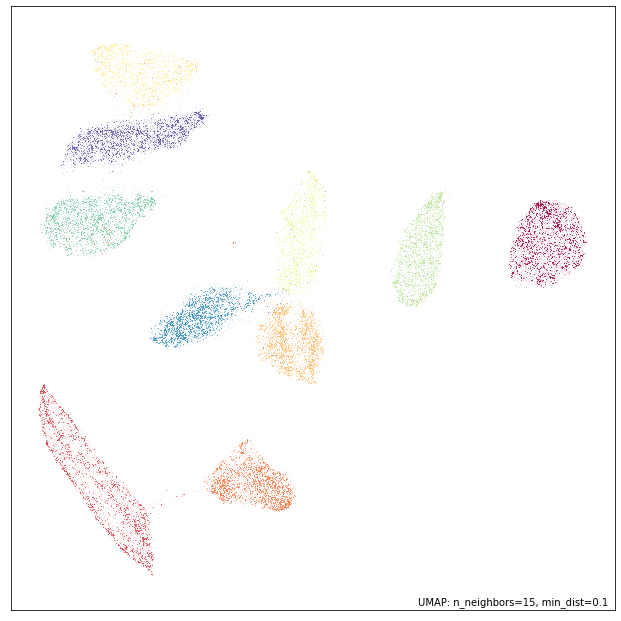

UMAP Reproducibility
====================

UMAP is a stochastic algorithm -- it makes use of randomness both to
speed up approximation steps, and to aid in solving hard optimization
problems. This means that different runs of UMAP can produce different
results. UMAP is relatively stable -- thus the variance between runs
should ideally be relatively small -- but different runs may have
variations none the less. To ensure that results can be reproduced
exactly UMAP allows the user to set a random seed state.

Since version 0.4 UMAP has also supported multi-threading for faster
performance. The original layout optimizer applies updates immediately,
and in multi-threaded mode the order of those updates depends on race
conditions between threads. Those races are acceptable for finding a good
embedding, but cannot be controlled by a random seed. Thus the compatibility
layout has traditionally had to trade some performance for exact
reproducibility.

The new Adam and momentum optimizers do not have this restriction. They can
use parallel layout optimization and still produce exactly reproducible
results with a fixed ``random_state``. In this tutorial we'll first look at
the behavior of the original compatibility layout, and then see how the new
optimizers change the performance trade-off. First let's load the relevant
libraries and get some data; in this case the MNIST digits dataset.

.. code:: python3

    import numpy as np
    import sklearn.datasets
    import umap
    import umap.plot

.. code:: python3

    data, labels = sklearn.datasets.fetch_openml(
        'mnist_784', version=1, return_X_y=True
    )

With data in hand let's run UMAP on it, and note how long it takes to
run:

.. code:: python3

    %%time
    mapper1 = umap.UMAP(compatibility_layout=True).fit(data)

.. parsed-literal::

    CPU times: user 3min 18s, sys: 3.84 s, total: 3min 22s
    Wall time: 1min 29s

The thing to note here is that the "Wall time" is significantly smaller
than the CPU time -- this means that multiple CPU cores were used. For
this particular demonstration I am making use of the latest version of
PyNNDescent for nearest neighbor search (UMAP will use it if you have it
installed) which supports multi-threading as well. The result is a very
fast fitting to the data that does an effective job of using several
cores. If you are on a large server with many cores available and don't
wish to use them *all* (which is the default situation) you can
currently control the number of cores used by setting the numba
environment variable ``NUMBA_NUM_THREADS``; see the `numba
documentation <https://numba.pydata.org/numba-doc/dev/reference/envvars.html#threading-control>`__
for more details.

Now let's plot our result to see what the embedding looks like:

.. code:: python3

    umap.plot.points(mapper1, labels=labels)

Now, let's run UMAP again and compare the results to that of our first
run.

.. code:: python3

    %%time
    mapper2 = umap.UMAP(compatibility_layout=True).fit(data)

.. parsed-literal::

    CPU times: user 2min 53s, sys: 4.16 s, total: 2min 57s
    Wall time: 1min 5s

You will note that this time we ran *even faster*. This is because
during the first run numba was still JIT compiling some of the code in
the background. In contrast, this time that work has already been done,
so it no longer takes up any of our run-time. We see that we are still
making use of multiple cores well.

Now let's plot the results of this second run and compare to the first:

.. code:: python3

    umap.plot.points(mapper2, labels=labels)

Qualitatively this looks very similar, but a little closer inspection
will quickly show that the results are actually different between the
runs. Note that even in versions of UMAP prior to 0.4 this would have
been the case -- since we fixed no specific random seed, and were thus
using the current random state of the system which will naturally differ
between runs. This is the default behaviour, as is standard with sklearn
estimators that are stochastic. Rather than having a default random seed
the user is required to explicitly provide one should they want a
reproducible result. As noted by Vito Zanotelli

    ... setting a random seed is like signing a waiver "I am aware that
    this is a stochastic algorithm and I have done sufficient tests to
    confirm that my main conclusions are not affected by this
    randomness".

With that in mind, let's see what happens if we set an explicit
``random_state`` value:

.. code:: python3

    %%time
    mapper3 = umap.UMAP(
        compatibility_layout=True,
        random_state=42,
    ).fit(data)

.. parsed-literal::

    CPU times: user 2min 27s, sys: 4.16 s, total: 2min 31s
    Wall time: 1min 56s

The first thing to note is that this run can take significantly longer
(despite having all the functions JIT compiled by numba already). For
the compatibility layout, the Wall time and CPU times are now much
closer to each other: a fixed ``random_state`` makes layout optimization
single threaded so that its immediate updates remain reproducible. The
compatibility path also sets ``n_jobs`` to one in this case, preserving the
behavior of earlier UMAP releases. Let's plot the results:

.. code:: python3

    umap.plot.points(mapper3, labels=labels)

We arrive at much the same results as before from a qualitative point of
view, but again inspection will show that there are some differences.
More importantly this result should now be reproducible. Thus we can run
UMAP again, with the same ``random_state`` set ...

.. code:: python3

    %%time
    mapper4 = umap.UMAP(
        compatibility_layout=True,
        random_state=42,
    ).fit(data)

.. parsed-literal::

    CPU times: user 2min 26s, sys: 4.13 s, total: 2min 30s
    Wall time: 1min 54s

Again, this takes longer than the earlier runs with no ``random_state``
set. However when we plot the results of the second run we see that they
look not merely qualitatively similar, but instead appear to be almost
identical:

.. code:: python3

    umap.plot.points(mapper4, labels=labels)

.. image:: images/reproducibility_18_1.png

We can, in fact, check that the results are identical by verifying that
each and every coordinate of the resulting embeddings match perfectly:

.. code:: python3

    np.all(mapper3.embedding_ == mapper4.embedding_)

.. parsed-literal::

    True

So we have, in fact, reproduced the embedding exactly.

Reproducibility with the new optimizers
---------------------------------------

The new Adam and momentum optimizers change the trade-off we have just seen.
They accumulate updates in a way that allows parallel layout optimization to
remain deterministic, so setting ``random_state`` no longer forces that part
of fitting to use a single thread. Adam is generally the recommended choice,
and we can select it explicitly as follows:

.. code:: python3

    mapper5 = umap.UMAP(
        random_state=42,
        compatibility_layout=False,
        optimizer="adam",
    ).fit(data)

Running this configuration again with the same data and ``random_state``
produces the same embedding while allowing the Adam layout optimizer to use
all configured Numba threads. The momentum optimizer has the same
reproducibility property. Of course changing optimizers can change the
embedding, so we should not expect these coordinates to match those produced
by the compatibility layout. The important question is whether the result is
stable in the ways that matter for the analysis. See :doc:`optimizers` for a
more complete discussion of the available choices.
