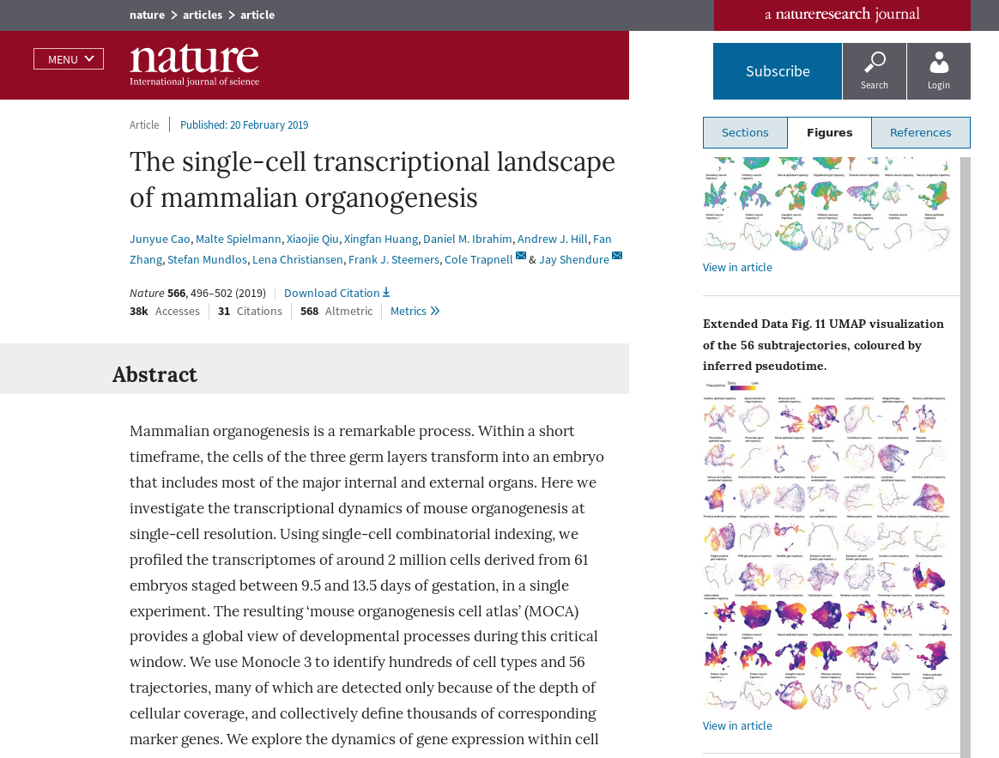
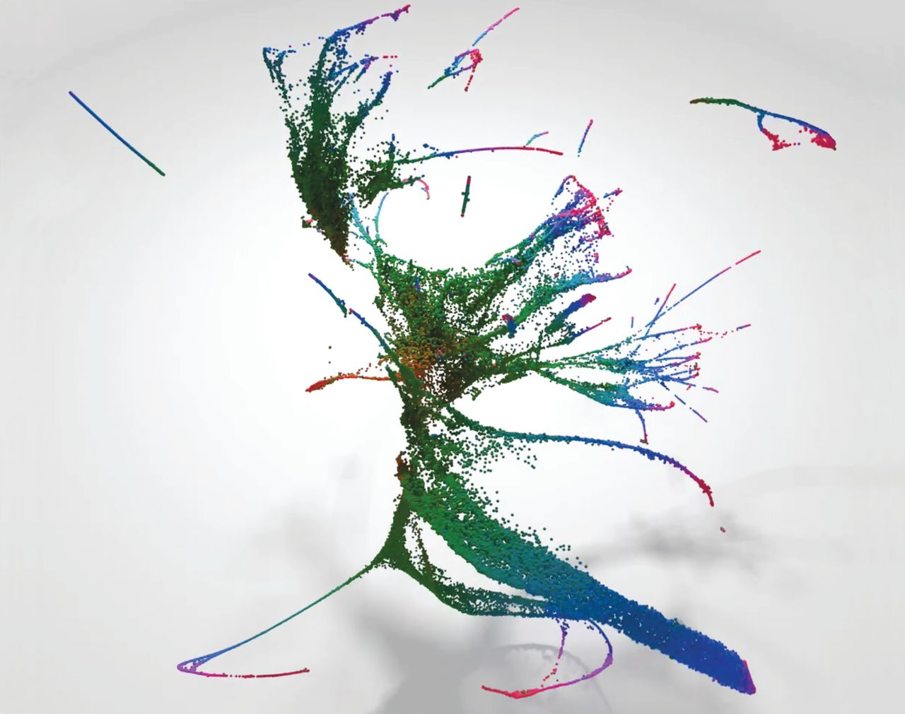
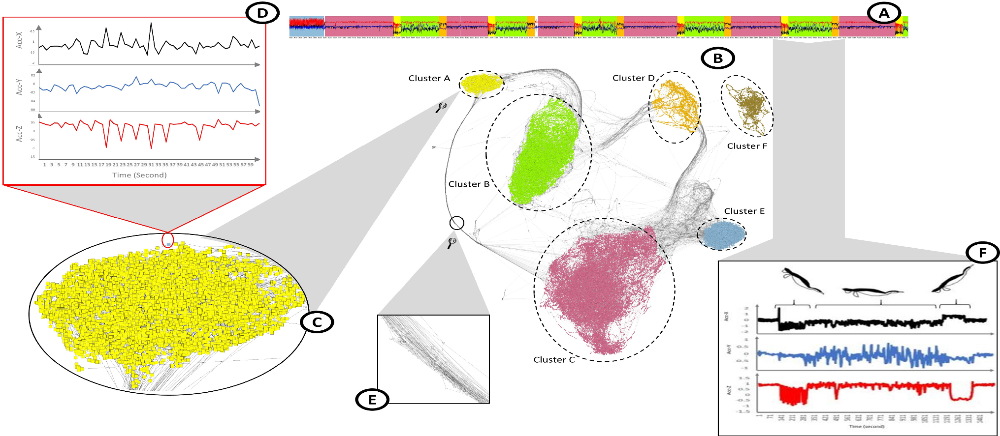
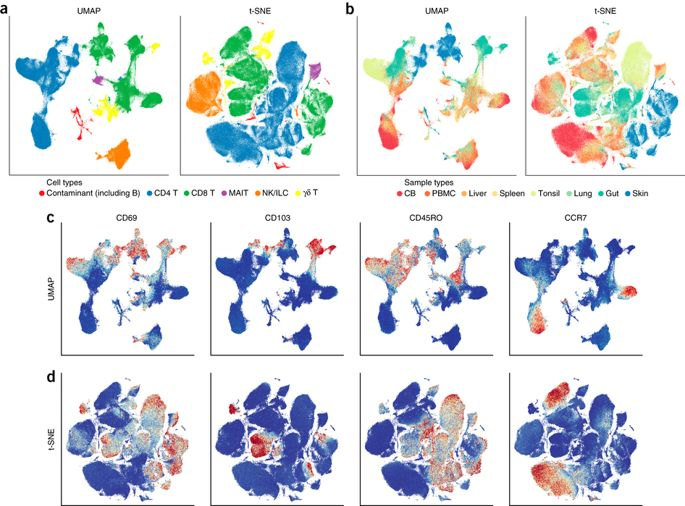
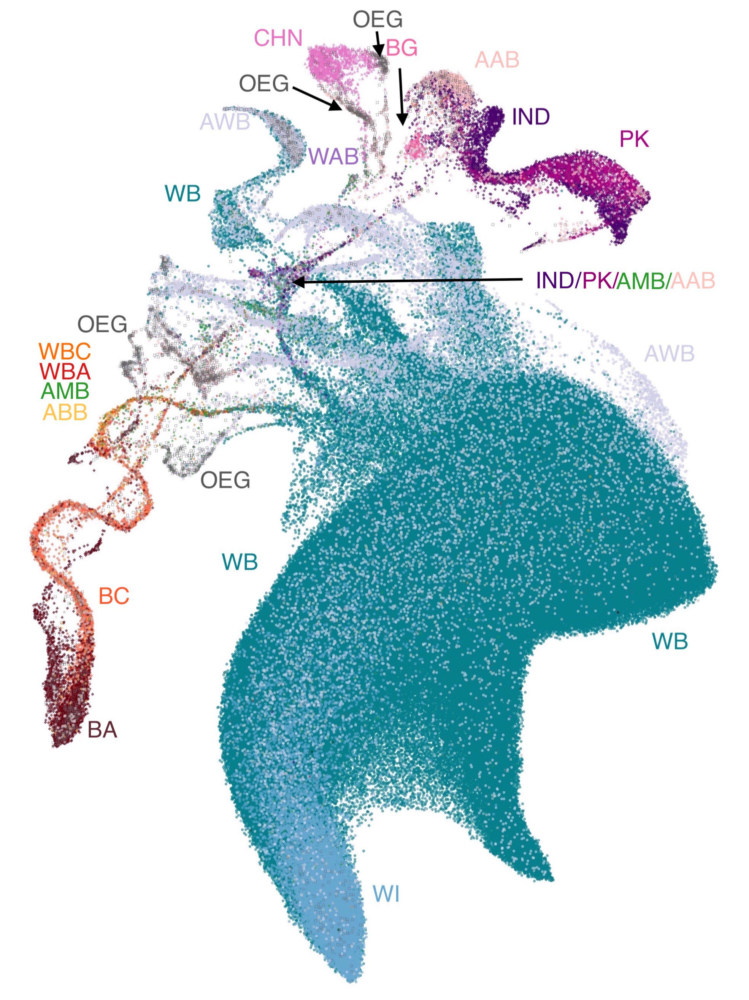
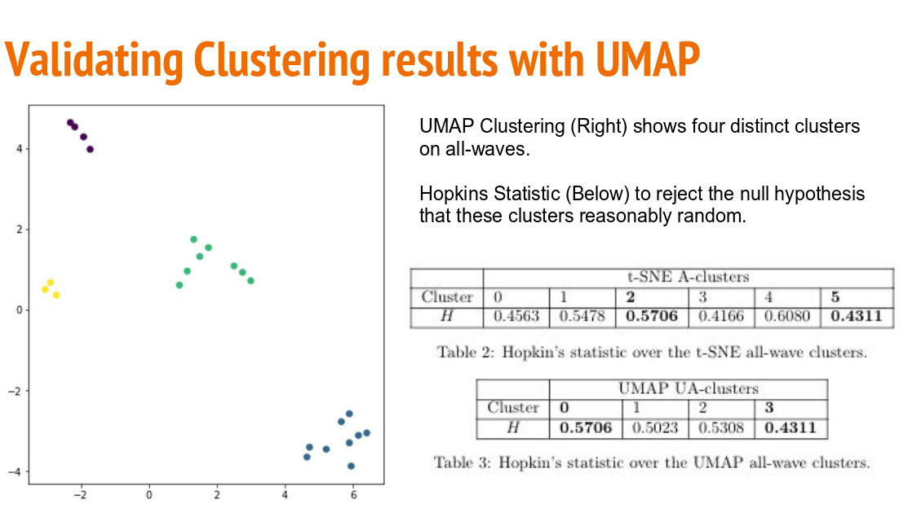

Scientific Papers
=================

UMAP has been used in a wide variety of scientific publications from a diverse range of
fields. Here we will highlight a small selection of papers that demonstrate both
the depth of analysis, and breadth of subjects, UMAP can be used for. These range from biology,
to machine learning, and even social science.

The single-cell transcriptional landscape of mammalian organogenesis
--------------------------------------------------------------------
A detailed look at the development of mouse embryos from a single-cell view. UMAP
is used as a core piece of The Monocle3 software suite for identifying cell types
and trajectories. This was a major paper in Nature, demonstrating the power
of UMAP for large scale scientific endeavours.

`Link to the paper <https://www.nature.com/articles/s41586-019-0969-x>`__

A lineage-resolved molecular atlas of C. elegans embryogenesis at single-cell resolution
----------------------------------------------------------------------------------------
Still in the realm of single cell biology this paper looks at the developmental
landscape of the round-word C. elegans. UMAP is used for detailed analysis of
the developmental trajectories of cells, looking at global scales, and then
digging down to look at individual organs. The result is an impressive
array of UMAP visualisations that tease out ever finer structures in
cellular development.

`Link to the paper <https://science.sciencemag.org/content/early/2019/09/04/science.aax1971>`__

Exploring Neural Networks with Activation Atlases
-------------------------------------------------
Understanding the image processing capabilities (and deficits!) of modern
convolutional neural networks is a challenge. This interactive paper from
Distill seeks to provide a way to "peek inside the black box" by looking
at the activations throughout the network. By mapping this high dimensional
data down to 2D with UMAP the authors can construct an "atlas" of how
different images are perceived by the network.

.. image:: images/activation_atlas.png
   :width: 400px

`Link to the paper <https://distill.pub/2019/activation-atlas/>`__

TimeCluster: dimension reduction applied to temporal data for visual analytics
------------------------------------------------------------------------------
An interesting approach to time-series analysis, targeted toward cases where the
time series has repeating patterns -- though no necessarily of a consistently
periodic nature. The approach involves dimension reduction and clustering
of sliding window blocks of the time-series. The result is a map where
repeating behaviour is exposed as loop structures. This can be useful
for both clustering similar blocks within a time-series, or finding
outliers.

`Link to the paper <https://link.springer.com/article/10.1007/s00371-019-01673-y>`__

Dimensionality reduction for visualizing single-cell data using UMAP
--------------------------------------------------------------------
An early paper on applying UMAP to single-cell biology data. It looks at
both, gene-expression data and flow-cytometry data, and compares UMAP to
t-SNE both in terms of performance and quality of results. This is a good
introduction to using UMAP for single-cell biology data.

`Link to the paper <https://www.nature.com/articles/nbt.4314>`__

Revealing multi-scale population structure in large cohorts
-----------------------------------------------------------
A paper looking at population genetics which uses UMAP as a means
to visualise population structures. This produced some intriguing
visualizations, and was one of the first of several papers taking
this visualization approach. It also includes some novel visualizations
using UMAP projections to 3D as RGB color specifications for
data points, allowing the UMAP structure to be visualized in
geographic maps based on where the samples were drawn from.

`Link to the paper <https://www.biorxiv.org/content/10.1101/423632v2>`__

Understanding Vulnerability of Children in Surrey
--------------------------------------------------
An example of the use of UMAP in sociological studies -- in this case
looking at children in Surrey, British Columbia. Here UMAP is used as
a tool to aid in general data analysis, and proves effective for the
tasks to which it was put.

`Link to the paper <https://dsi.ubc.ca/sites/default/files/education-dssg-report-2018.pdf>`__