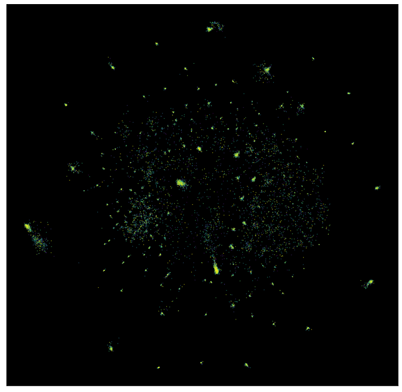
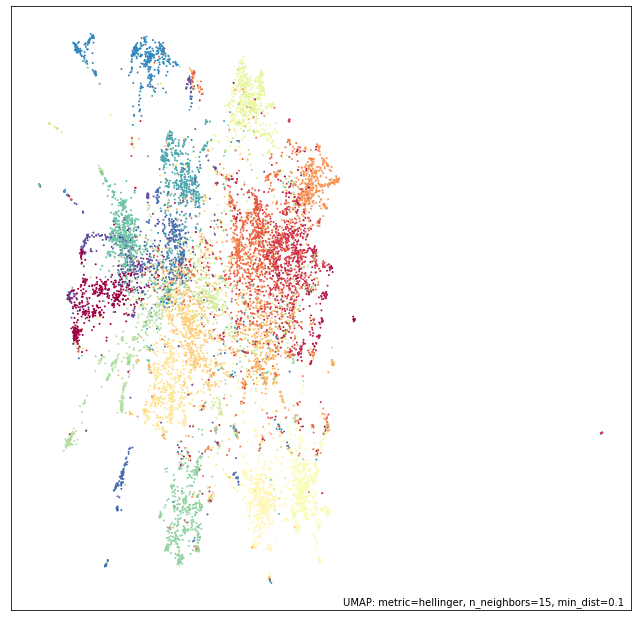
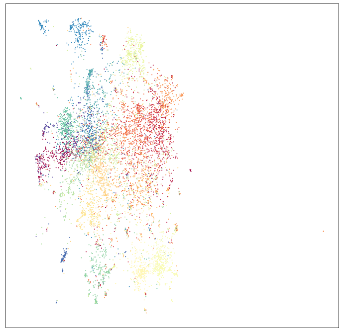

UMAP on sparse data
===================

Sometimes datasets get very large, and potentially very very high
dimensional. In many such cases, however, the data itself is sparse --
that is, while there are many many features, any given sample has only a
small number of non-zero features observed. In such cases the data can
be represented much more efficiently in terms of memory usage by a
sparse matrix data structure. It can be hard to find dimension reduction
techniques that work directly on such sparse data -- often one applies a
basic linear technique such as ``TruncatedSVD`` from sklearn (which does
accept sparse matrix input) to get the data in a format amenable to
other more advanced dimension reduction techniques. In the case of UMAP
this is not necessary -- UMAP can run directly on sparse matrix input.
This tutorial will walk through a couple of examples of doing this.
First we'll need some libraries loaded. We need ``numpy`` obviously, but
we'll also make use of ``scipy.sparse`` which provides sparse matrix
data structures. One of our examples will be purely mathematical, and
we'll make use of ``sympy`` for that; the other example is test based
and we'll use sklearn for that (specifically
``sklearn.feature_extraction.text``). Beyond that we'll need umap, and
plotting tools.

.. code:: python3

    import numpy as np
    import scipy.sparse
    import sympy
    import sklearn.datasets
    import sklearn.feature_extraction.text
    import umap
    import umap.plot
    import matplotlib.pyplot as plt
    %matplotlib inline

A mathematical example
----------------------

Our first example constructs a sparse matrix of data out of pure math.
This example is inspired by the work of `John
Williamson <https://johnhw.github.io/umap_primes/index.md.html>`__, and
if you haven't looked at that work you are strongly encouraged to do so.
The dataset under consideration will be the integers. We will represent
each integer by a vector of its divisibility by distinct primes. Thus
our feature space is the space of prime numbers (less than or equal to
the largest integer we will be considering) -- potentially very high
dimensional. In practice a given integer is divisible by only a small
number of distinct primes, so each sample will be mostly made up of
zeros (all the primes that the number is not divisible by), and thus we
will have a very sparse dataset.

To get started we'll need a list of all the primes. Fortunately we have
``sympy`` at our disposal and we can quickly get that information with a
single call to ``primerange``. We'll also need a dictionary mapping the
different primes to the column number they correspond to in our data
structure; effectively we'll just be enumerating the primes.

.. code:: python3

    primes = list(sympy.primerange(2, 110000))
    prime_to_column = {p:i for i, p in enumerate(primes)}

Now we need to construct our data in a format we can put into a sparse
matrix easily. At this point a little background on sparse matrix data
structures is useful. For this purpose we'll be using the so called
`"LIL"
format <https://scipy-lectures.org/advanced/scipy_sparse/lil_matrix.html>`__.
LIL is short for "List of Lists", since that is how the data is
internally stored. There is a list of all the rows, and each row is
stored as a list giving the column indices of the non-zero entries. To
store the data values there is a parallel structure containing the value
of the entry corresponding to a given row and column.

To put the data together in this sort of format we need to construct
such a list of lists. We can do that by iterating over all the integers
up to a fixed bound, and for each integer (i.e. each row in our dataset)
generating the list of column indices which will be non-zero. The column
indices will simply be the indices corresponding to the primes that
divide the number. Since ``sympy`` has a function ``primefactors`` which
returns a list of the unique prime factors of any integer we simply need
to map those through our dictionary to covert the primes into column
numbers.

Parallel to that we'll construct the corresponding structure of values
to insert into a matrix. Since we are only concerned with divisibility
this will simply be a one in every non-zero entry, so we can just add a
list of ones of the appropriate length for each row.

.. code:: python3

    %%time
    lil_matrix_rows = []
    lil_matrix_data = []
    for n in range(100000):
        prime_factors = sympy.primefactors(n)
        lil_matrix_rows.append([prime_to_column[p] for p in prime_factors])
        lil_matrix_data.append([1] * len(prime_factors))

.. parsed-literal::

    CPU times: user 2.07 s, sys: 26.4 ms, total: 2.1 s
    Wall time: 2.1 s

Now we need to get that into a sparse matrix. Fortunately the
``scipy.sparse`` package makes this easy, and we've already built the
data in a fairly useful structure. First we create a sparse matrix of
the correct format (LIL) and the right shape (as many rows as we have
generated, and as many columns as there are primes). This is essentially
just an empty matrix however. We can fix that by setting the ``rows``
attribute to be the rows we have generated, and the ``data`` attribute
to be the corresponding structure of values (all ones). The result is a
sparse matrix data structure which can then be easily manipulated and
converted into other sparse matrix formats easily.

.. code:: python3

    factor_matrix = scipy.sparse.lil_matrix((len(lil_matrix_rows), len(primes)), dtype=np.float32)
    factor_matrix.rows = np.array(lil_matrix_rows)
    factor_matrix.data = np.array(lil_matrix_data)
    factor_matrix

.. parsed-literal::

    <100000x10453 sparse matrix of type '<class 'numpy.float32'>'
    	with 266398 stored elements in LInked List format>

As you can see we have a matrix with 100000 rows and over 10000 columns.
If we were storing that as a numpy array it would take a great deal of
memory. In practice, however, there are only 260000 or so entries that
are not zero, and that's all we really need to store, making it much
more compact.

The question now is how can we feed that sparse matrix structure into
UMAP to have it learn an embedding. The answer is surprisingly
straightforward -- we just hand it directly to the fit method. Just like
other sklearn estimators that can handle sparse input UMAP will detect
the sparse matrix and just do the right thing.

.. code:: python3

    %%time
    mapper = umap.UMAP(metric='cosine', random_state=42, low_memory=True).fit(factor_matrix)

.. parsed-literal::

    CPU times: user 9min 36s, sys: 6.76 s, total: 9min 43s
    Wall time: 9min 7s

That was easy! But is it really working? We can easily plot the results:

.. code:: python3

    umap.plot.points(mapper, values=np.arange(100000), theme='viridis')

.. image:: images/sparse_11_1.png

And this looks very much in line with the results `John Williamson
got <https://johnhw.github.io/umap_primes/index.md.html>`__ with the
proviso that we only used 100,000 integers instead of 1,000,000 to
ensure that most users should be able to run this example (the full
million may require a large memory compute node). So it seems like this
is working well. The next question is whether we can use the
``transform`` functionality to map new data into this space. To test
that we'll need some more data. Fortunately there are more integers.
We'll grab the next 10,000 and put them in a sparse matrix, much as we
did for the first 100,000.

.. code:: python3

    %%time
    lil_matrix_rows = []
    lil_matrix_data = []
    for n in range(100000, 110000):
        prime_factors = sympy.primefactors(n)
        lil_matrix_rows.append([prime_to_column[p] for p in prime_factors])
        lil_matrix_data.append([1] * len(prime_factors))

.. parsed-literal::

    CPU times: user 214 ms, sys: 1.99 ms, total: 216 ms
    Wall time: 222 ms

.. code:: python3

    new_data = scipy.sparse.lil_matrix((len(lil_matrix_rows), len(primes)), dtype=np.float32)
    new_data.rows = np.array(lil_matrix_rows)
    new_data.data = np.array(lil_matrix_data)
    new_data

.. parsed-literal::

    <10000x10453 sparse matrix of type '<class 'numpy.float32'>'
    	with 27592 stored elements in LInked List format>

To map the new data we generated we can simply hand it to the
``transform`` method of our trained model. This is a little slow, but it
does work.

.. code:: python3

    new_data_embedding = mapper.transform(new_data)

And we can plot the results. Since we just got the locations of the
points this time (rather than a model) we'll have to resort to
matplotlib for plotting.

.. code:: python3

    fig = plt.figure(figsize=(12,12))
    ax = fig.add_subplot(111)
    plt.scatter(new_data_embedding[:, 0], new_data_embedding[:, 1], s=0.1, c=np.arange(10000), cmap='viridis')
    ax.set(xticks=[], yticks=[], facecolor='black');

The color scale is different in this case, but you can see that the data
has been mapped into locations corresponding to the various structures
seen in the original embedding. Thus, even with large sparse data we can
embed the data, and even add new data to the embedding.

A text analysis example
-----------------------

Let's look at a more classical machine learning example of working with
sparse high dimensional data -- working with text documents. Machine
learning on text is hard, and there is a great deal of literature on the
subject, but for now we'll just consider a basic approach. Part of the
difficulty of machine learning with text is turning language into
numbers, since numbers are really all most machine learning algorithms
understand (at heart anyway). One of the most straightforward ways to do
this for documents is what is known as the `"bag-of-words"
model <https://en.wikipedia.org/wiki/Bag-of-words_model>`__. In this
model we view a document as simply a multi-set of the words contained in
it -- we completely ignore word order. The result can be viewed as a
matrix of data by setting the feature space to be the set of all words
that appear in any document, and a document is represented by a vector
where the value of the *i*\ th entry is the number of times the *i*\ th
word occurs in that document. This is a very common approach, and is
what you will get if you apply sklearn's ``CountVectorizer`` to a text
dataset for example. The catch with this approach is that the feature
space is often *very* large, since we have a feature for each and every
word that ever occurs in the entire corpus of documents. The data is
sparse however, since most documents only use a small portion of the
total possible vocabulary. Thus the default output format of
``CountVectorizer`` (and other similar feature extraction tools in
sklearn) is a ``scipy.sparse`` format matrix.

For this example we'll make use of the classic 20newsgroups dataset, a
sampling of newsgroup messages from the old NNTP newsgroup system
covering 20 different newsgroups. The ``sklearn.datasets`` module can
easily fetch the data, and, in fact, we can fetch a pre-vectorized
version to save us the trouble of running ``CountVectorizer`` ourselves.
We'll grab both the training set, and the test set for later use.

.. code:: python3

    news_train = sklearn.datasets.fetch_20newsgroups_vectorized(subset='train')
    news_test = sklearn.datasets.fetch_20newsgroups_vectorized(subset='test')

If we look at the actual data we have pulled back, we'll see that
sklearn has run a ``CountVectorizer`` and produced the data in the sparse
matrix format.

.. code:: python3

    news_train.data

.. parsed-literal::

    <11314x130107 sparse matrix of type '<class 'numpy.float64'>'
    	with 1787565 stored elements in Compressed Sparse Row format>

The value of the sparse matrix format is immediately obvious in this
case; while there are only 11,000 samples there are 130,000 features! If
the data were stored in a standard ``numpy`` array we would be using up
10GB of memory! And most of that memory would simply be storing the
number zero, over and over again. In the sparse matrix format it easily fits
in memory on most machines. This sort of dimensionality of data is very
common with text workloads.

The raw counts are, however, not ideal since common words such as "the" and
"and" will dominate the counts for most documents, while contributing
very little information about the actual content of the document. We can
correct for this by using a ``TfidfTransformer`` from sklearn, which
will convert the data into `TF-IDF
format <https://en.wikipedia.org/wiki/Tf%E2%80%93idf>`__. There are lots
of ways to think about the transformation done by TF-IDF, but I like to
think of it intuitively as follows. The information content of a word
can be thought of as (roughly) proportional to the negative log of the
frequency of the word; the more often a word is used, the less
information it tends to carry, and infrequent words carry more
information. What TF-IDF is going to do can be thought of as akin to
re-weighting the columns according to the information content of the
word associated to that column. Thus the common words like "the" and
"and" will get down-weighted, as carrying less information about the
document, while infrequent words will be deemed more imporant and have
their associated columns up-weighted. We can apply this transformation
to both the train and test sets (using the same transformer trained on
the training set).

.. code:: python3

    tfidf = sklearn.feature_extraction.text.TfidfTransformer(norm='l1').fit(news_train.data)
    train_data = tfidf.transform(news_train.data)
    test_data = tfidf.transform(news_test.data)

The result is still a sparse matrix, since TF-IDF doesn't change the
zero elements at all, nor the number of features.

.. code:: python3

    train_data

.. parsed-literal::

    <11314x130107 sparse matrix of type '<class 'numpy.float64'>'
    	with 1787565 stored elements in Compressed Sparse Row format>

Now we need to pass this very high dimensional data to UMAP. Unlike some
other non-linear dimension reduction techniques we don't need to apply
PCA first to get the data down to a reasonable dimensionality; nor do we
need to use other techniques to reduce the data to be able to be
represented as a dense ``numpy`` array; we can work directly on the
130,000 dimensional sparse matrix.

.. code:: python3

    %%time
    mapper = umap.UMAP(metric='hellinger', random_state=42).fit(train_data)

.. parsed-literal::

    CPU times: user 8min 40s, sys: 3.07 s, total: 8min 44s
    Wall time: 8min 43s

Now we can plot the results, with labels according to the target
variable of the data -- which newsgroup the posting was drawn from.

.. code:: python3

    umap.plot.points(mapper, labels=news_train.target)

We can see that even going directly from a 130,000 dimensional space
down to only 2 dimensions UMAP has done a decent job of separating out
many of the different newsgroups.

We can now attempt to add the test data to the same space using the
``transform`` method.

.. code:: python3

    test_embedding = mapper.transform(test_data)

While this is somewhat expensive computationally, it does work, and we
can plot the end result:

.. code:: python3

    fig = plt.figure(figsize=(12,12))
    ax = fig.add_subplot(111)
    plt.scatter(test_embedding[:, 0], test_embedding[:, 1], s=1, c=news_test.target, cmap='Spectral')
    ax.set(xticks=[], yticks=[]);

