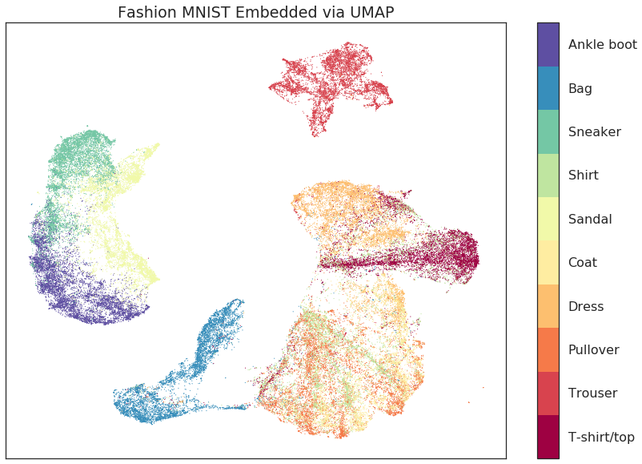
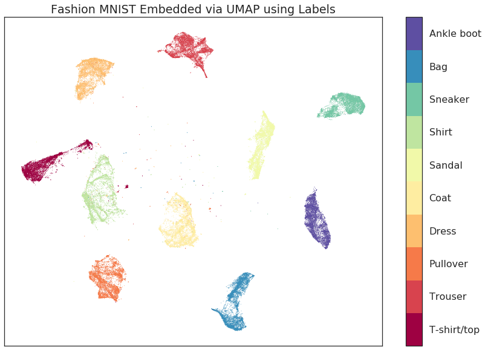
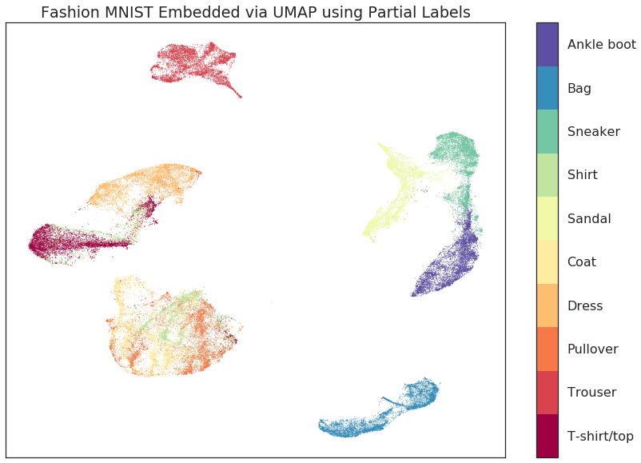
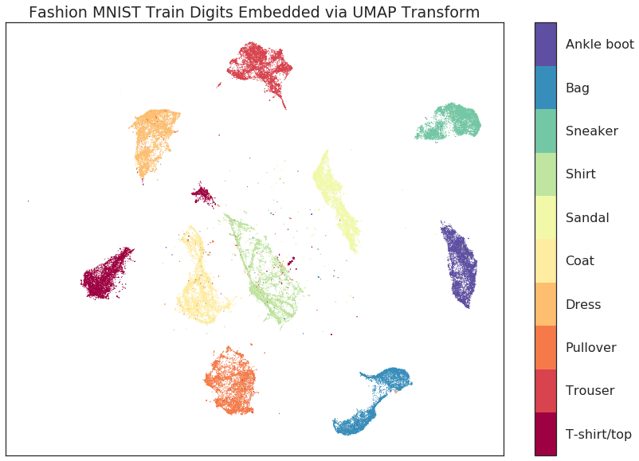
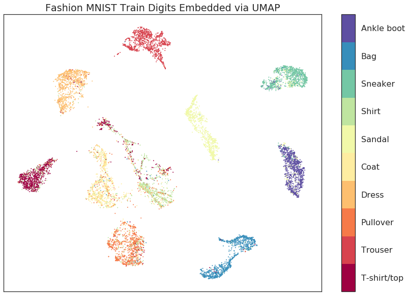
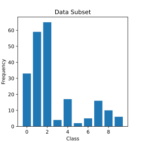
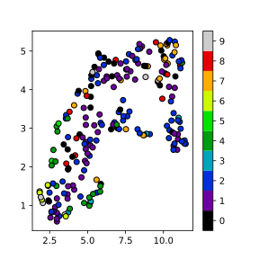
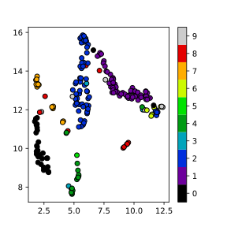

UMAP for Supervised Dimension Reduction and Metric Learning
===========================================================

While UMAP can be used for standard unsupervised dimension reduction the
algorithm offers significant flexibility allowing it to be extended to
perform other tasks, including making use of categorical label
information to do supervised dimension reduction, and even metric
learning. We'll look at some examples of how to do that below.

First we will need to load some base libraries -- ``numpy``, obviously,
but also ``mnist`` to read in the Fashion-MNIST data, and matplotlib and
seaborn for plotting.

.. code:: python3

    import numpy as np
    from mnist.loader import MNIST
    import matplotlib.pyplot as plt
    %matplotlib inline
    import seaborn as sns
    sns.set(style='white', context='poster')

Our example dataset for this exploration will be the `Fashion-MNIST
dataset from Zalando
Research <https://github.com/zalandoresearch/fashion-mnist>`__. It is
designed to be a drop-in replacement for the classic MNIST digits
dataset, but uses images of fashion items (dresses, coats, shoes, bags,
etc.) instead of handwritten digits. Since the images are more complex
it provides a greater challenge than MNIST digits. We can load it in
(after downloading the dataset) using the `mnist
library <https://pypi.org/project/python-mnist/>`__. We can then package
up the train and test sets into one large dataset, normalise the values
(to be in the range [0,1]), and set up labels for the 10 classes.

.. code:: python3

    mndata = MNIST('fashion-mnist/data/fashion')
    train, train_labels = mndata.load_training()
    test, test_labels = mndata.load_testing()
    data = np.array(np.vstack([train, test]), dtype=np.float64) / 255.0
    target = np.hstack([train_labels, test_labels])
    classes = [
        'T-shirt/top',
        'Trouser',
        'Pullover',
        'Dress',
        'Coat',
        'Sandal',
        'Shirt',
        'Sneaker',
        'Bag',
        'Ankle boot']

Next we'll load the ``umap`` library so we can perform dimension reduction on
this dataset.

.. code:: python3

    import umap

UMAP on Fashion MNIST
---------------------

First we'll just do standard unsupervised dimension reduction using UMAP
so we have a baseline of what the results look like for later
comparison. This is simply a matter of instantiating a :class:`~umap.umap_.UMAP` object (in
this case setting the :attr:`~umap.umap_.UMAP.n_neighbors` parameter to be 5 -- we are
interested mostly in very local information), then calling the
:meth:`~umap.umap_.UMAP.fit_transform` method with the data we wish to reduce. By default
UMAP reduces to two dimensions, so we'll be able to view the results as
a scatterplot.

.. code:: python3

    %%time
    embedding = umap.UMAP(n_neighbors=5).fit_transform(data)

.. parsed-literal::

    CPU times: user 1min 45s, sys: 7.22 s, total: 1min 52s
    Wall time: 1min 26s

That took a little time, but not all that long considering it is 70,000
data points in 784 dimensional space. We can simply plot the results as
a scatterplot, colored by the class of the fashion item. We can use
matplotlib's colorbar with suitable tick-labels to give us the color key.

.. code:: python3

    fig, ax = plt.subplots(1, figsize=(14, 10))
    plt.scatter(*embedding.T, s=0.3, c=target, cmap='Spectral', alpha=1.0)
    plt.setp(ax, xticks=[], yticks=[])
    cbar = plt.colorbar(boundaries=np.arange(11)-0.5)
    cbar.set_ticks(np.arange(10))
    cbar.set_ticklabels(classes)
    plt.title('Fashion MNIST Embedded via UMAP');

The result is fairly good. We successfully separated a number of the
classes, and the global structure (separating pants and footwear from
shirts, coats and dresses) is well preserved as well. Unlike results for
MNIST digits, however, there were a number of classes that did not
separate quite so cleanly. In particular T-shirts, shirts, dresses,
pullovers, and coats are all a little mixed. At the very least the
dresses are largely separated, and the T-shirts are mostly in one large
clump, but they are not well distinguished from the others. Worse still
are the coats, shirts, and pullovers (somewhat unsurprisingly as these
can certainly look very similar) which all have significant overlap with
one another. Ideally we would like much better class separation. Since
we have the label information we can actually give that to UMAP to use!

Using Labels to Separate Classes (Supervised UMAP)
--------------------------------------------------

How do we go about coercing UMAP to make use of target labels? If you
are familiar with the sklearn API you'll know that the :meth:`~umap.umap_.UMAP.fit` method
takes a target parameter ``y`` that specifies supervised target
information (for example when training a supervised classification
model). We can simply pass the :class:`~umap.umap_.UMAP` model that target data when
fitting and it will make use of it to perform supervised dimension
reduction!

.. code:: python3

    %%time
    embedding = umap.UMAP().fit_transform(data, y=target)

.. parsed-literal::

    CPU times: user 3min 28s, sys: 9.17 s, total: 3min 37s
    Wall time: 2min 45s

This took a little longer -- both because we are using a larger
:py:obj:`~umap.umap_.UMAP.n_neighbors` value (which is suggested when doing supervised
dimension reduction; here we are using the default value of 15), and
because we need to condition on the label data. As before we have
reduced the data down to two dimensions so we can again visualize the
data with a scatterplot, coloring by class.

.. code:: python3

    fig, ax = plt.subplots(1, figsize=(14, 10))
    plt.scatter(*embedding.T, s=0.1, c=target, cmap='Spectral', alpha=1.0)
    plt.setp(ax, xticks=[], yticks=[])
    cbar = plt.colorbar(boundaries=np.arange(11)-0.5)
    cbar.set_ticks(np.arange(10))
    cbar.set_ticklabels(classes)
    plt.title('Fashion MNIST Embedded via UMAP using Labels');

The result is a cleanly separated set of classes (and a little bit of
stray noise -- points that were sufficiently different from their class
as to not be grouped with the rest). Aside from the clear class
separation however (which is expected -- we gave the algorithm all the
class information), there are a couple of important points to note. The
first point to note is that we have retained the internal structure of
the individual classes. Both the shirts and pullovers still have the
distinct banding pattern that was visible in the original unsupervised
case; the pants, t-shirts and bags both retained their shape and
internal structure; etc. The second point to note is that we have also
retained the global structure. While the individual classes have been
cleanly separated from one another, the inter-relationships among the
classes have been preserved: footwear classes are all near one another;
trousers and bags are at opposite sides of the plot; and the arc of
pullover, shirts, t-shirts and dresses is still in place.

The key point is this: the important structural properties of the data
have been retained while the known classes have been cleanly pulled
apart and isolated. If you have data with known classes and want to
separate them while still having a meaningful embedding of individual
points then supervised UMAP can provide exactly what you need.

Using Partial Labelling (Semi-Supervised UMAP)
----------------------------------------------

What if we only have some of our data labelled, however, and a number of
items are without labels. Can we still make use of the label information
we do have? This is now a semi-supervised learning problem, and yes, we
can work with those cases too. To set up the example we'll mask some of
the target information -- we'll do this by using the sklearn standard of
giving unlabelled points a label of -1 (such as, for example,
the noise points from a DBSCAN clustering).

.. code:: python3

    masked_target = target.copy().astype(np.int8)
    masked_target[np.random.choice(70000, size=10000, replace=False)] = -1

Now that we have randomly masked some of the labels we can try to
perform supervised learning again. Everything works as before, but UMAP
will interpret the -1 label as being an unlabelled point and learn
accordingly.

.. code:: python3

    %%time
    fitter = umap.UMAP().fit(data, y=masked_target)
    embedding = fitter.embedding_

.. parsed-literal::

    CPU times: user 3min 8s, sys: 7.85 s, total: 3min 16s
    Wall time: 2min 40s

Again we can look at a scatterplot of the data colored by class.

.. code:: python3

    fig, ax = plt.subplots(1, figsize=(14, 10))
    plt.scatter(*embedding.T, s=0.1, c=target, cmap='Spectral', alpha=1.0)
    plt.setp(ax, xticks=[], yticks=[])
    cbar = plt.colorbar(boundaries=np.arange(11)-0.5)
    cbar.set_ticks(np.arange(10))
    cbar.set_ticklabels(classes)
    plt.title('Fashion MNIST Embedded via UMAP using Partial Labels');

The result is much as we would expect -- while we haven't cleanly
separated the data as we did in the totally supervised case, the classes
have been made cleaner and more distinct. This semi-supervised approach
provides a powerful tool when labelling is potentially expensive, or
when you have more data than labels, but want to make use of that extra
data.

Training with Labels and Embedding Unlabelled Test Data (Metric Learning with UMAP)
-----------------------------------------------------------------------------------

If we have learned a supervised embedding, can we use that to embed new
previously unseen (and now unlabelled) points into the space? This would
provide an algorithm for `metric
learning <https://en.wikipedia.org/wiki/Similarity_learning#Metric_learning>`__,
where we can use a labelled set of points to learn a metric on data, and
then use that learned metric as a measure of distance between new
unlabelled points. This can be particularly useful as part of a machine
learning pipline where we learn a supervised embedding as a form of
supervised feature engineering, and then build a classifier on that new
space -- this is viable as long as we can pass new data to the embedding
model to be transformed to the new space.

To try this out with UMAP let's use the train/test split provided by
Fashion MNIST:

.. code:: python3

    train_data = np.array(train)
    test_data = np.array(test)

Now we can fit a model to the training data, making use of the training
labels to learn a supervised embedding.

.. code:: python3

    %%time
    mapper = umap.UMAP(n_neighbors=10).fit(train_data, np.array(train_labels))

.. parsed-literal::

    CPU times: user 2min 18s, sys: 7.53 s, total: 2min 26s
    Wall time: 1min 52s

Next we can use the :meth:`~umap.umap_.UMAP.transform` method on that model to transform the
test set into the learned space. This time we won't pass the label
information and let the model attempt to place the data correctly.

.. code:: python3

    %%time
    test_embedding = mapper.transform(test_data)

.. parsed-literal::

    CPU times: user 17.3 s, sys: 986 ms, total: 18.3 s
    Wall time: 15.4 s

UMAP transforms are not as fast as some approaches, but as you can see
this was still fairly efficient. The important question is how well we
managed to embed the test data into the existing learned space. To start
let's visualise the embedding of the training data so we can get a sense
of where things *should* go.

.. code:: python3

    fig, ax = plt.subplots(1, figsize=(14, 10))
    plt.scatter(*mapper.embedding_.T, s=0.3, c=np.array(train_labels), cmap='Spectral', alpha=1.0)
    plt.setp(ax, xticks=[], yticks=[])
    cbar = plt.colorbar(boundaries=np.arange(11)-0.5)
    cbar.set_ticks(np.arange(10))
    cbar.set_ticklabels(classes)
    plt.title('Fashion MNIST Train Digits Embedded via UMAP Transform');

As you can see this has done a similar job as before, successfully
embedding the separate classes while retaining both the internal
structure and the overall global structure. We can now look at how the
test set, for which we provided no label information, was embedded via
the :meth:`~umap.umap_.UMAP.transform` method.

.. code:: python3

    fig, ax = plt.subplots(1, figsize=(14, 10))
    plt.scatter(*test_embedding.T, s=2, c=np.array(test_labels), cmap='Spectral', alpha=1.0)
    plt.setp(ax, xticks=[], yticks=[])
    cbar = plt.colorbar(boundaries=np.arange(11)-0.5)
    cbar.set_ticks(np.arange(10))
    cbar.set_ticklabels(classes)
    plt.title('Fashion MNIST Train Digits Embedded via UMAP');

As you can see we have replicated the layout of the training data,
including much of the internal structure of the classes. For the most
part assignment of new points follows the classes well. The greatest
source of confusion are some t-shirts that ended up mixed with the
shirts, and some pullovers which are confused with the coats. Given the
difficulty of the problem this is a good result, particularly when
compared with current state-of-the-art approaches such as `siamese and
triplet
networks <https://github.com/adambielski/siamese-triplet/blob/master/Experiments_FashionMNIST.ipynb>`__.

Supervised UMAP on the Galaxy10SDSS dataset
-------------------------------------------

The `Galaxy10SDSS dataset <https://astronn.readthedocs.io/en/latest/galaxy10sdss.html>`__
is a crowd sourced human labelled dataset of galaxy images,
which have been separated in to ten classes. Umap can
learn an embedding that partially separates the data. To
keep runtime small, UMAP is applied to a subset of the
data.

.. code:: python3

    import numpy as np
    import h5py
    import matplotlib.pyplot as plt
    import umap
    import os
    import math
    import requests

    if not os.path.isfile("Galaxy10.h5"):
        url = "http://astro.utoronto.ca/~bovy/Galaxy10/Galaxy10.h5"
        r = requests.get(url, allow_redirects=True)
        open("Galaxy10.h5", "wb").write(r.content)

    # To get the images and labels from file
    with h5py.File("Galaxy10.h5", "r") as F:
        images = np.array(F["images"])
        labels = np.array(F["ans"])

    X_train = np.empty([math.floor(len(labels) / 100), 14283], dtype=np.float64)
    y_train = np.empty([math.floor(len(labels) / 100)], dtype=np.float64)
    X_test = X_train
    y_test = y_train
    # Get a subset of the data
    for i in range(math.floor(len(labels) / 100)):
        X_train[i, :] = np.array(np.ndarray.flatten(images[i, :, :, :]), dtype=np.float64)
        y_train[i] = labels[i]
        X_test[i, :] = np.array(
            np.ndarray.flatten(images[i + math.floor(len(labels) / 100), :, :, :]),
            dtype=np.float64,
        )
        y_test[i] = labels[i + math.floor(len(labels) / 100)]

    # Plot distribution
    classes, frequency = np.unique(y_train, return_counts=True)
    fig = plt.figure(1, figsize=(4, 4))
    plt.clf()
    plt.bar(classes, frequency)
    plt.xlabel("Class")
    plt.ylabel("Frequency")
    plt.title("Data Subset")
    plt.savefig("galaxy10_subset.svg")

The figure shows that the selected subset of the data set is 
unbalanced, but the entire dataset is also unbalanced, so 
this experiment will still use this subset. The next step is
to examine the output of the standard UMAP algorithm.

.. code:: python3
    
    reducer = umap.UMAP(
        n_components=2, n_neighbors=5, random_state=42, transform_seed=42, verbose=False
    )
    reducer.fit(X_train)

    galaxy10_umap = reducer.transform(X_train)
    fig = plt.figure(1, figsize=(4, 4))
    plt.clf()
    plt.scatter(
        galaxy10_umap[:, 0],
        galaxy10_umap[:, 1],
        c=y_train,
        cmap=plt.cm.nipy_spectral,
        edgecolor="k",
        label=y_train,
    )
    plt.colorbar(boundaries=np.arange(11) - 0.5).set_ticks(np.arange(10))
    plt.savefig("galaxy10_2D_umap.svg")
    
  

The standard UMAP algorithm does not separate the galaxies 
according to their type. Supervised UMAP can do better.
 
.. code:: python3
 
    reducer = umap.UMAP(
        n_components=2, n_neighbors=15, random_state=42, transform_seed=42, verbose=False
    )
    reducer.fit(X_train, y_train)

    galaxy10_umap_supervised = reducer.transform(X_train)
    fig = plt.figure(1, figsize=(4, 4))
    plt.clf()
    plt.scatter(
        galaxy10_umap_supervised[:, 0],
        galaxy10_umap_supervised[:, 1],
        c=y_train,
        cmap=plt.cm.nipy_spectral,
        edgecolor="k",
        label=y_train,
    )
    plt.colorbar(boundaries=np.arange(11) - 0.5).set_ticks(np.arange(10))
    plt.savefig("galaxy10_2D_umap_supervised.svg")    
    

Supervised UMAP does indeed do better. There is a litle overlap
between some of the classes, but the original dataset
also has some ambiguities in the classification.  The best
check of this method is to project the testing data onto the
learned embedding.
    
.. code:: python3
    
    galaxy10_umap_supervised_prediction = reducer.transform(X_test)
    fig = plt.figure(1, figsize=(4, 4))
    plt.clf()
    plt.scatter(
        galaxy10_umap_supervised_prediction[:, 0],
        galaxy10_umap_supervised_prediction[:, 1],
        c=y_test,
        cmap=plt.cm.nipy_spectral,
        edgecolor="k",
        label=y_test,
    )
    plt.colorbar(boundaries=np.arange(11) - 0.5).set_ticks(np.arange(10))
    plt.savefig("galaxy10_2D_umap_supervised_prediction.svg")
      

This shows that the learned embedding can be used on new data
sets, and so this method may be helpful for examining images
of galaxies. Try out this method on the full 200 Mb dataset
as well as the newer 2.54 Gb
`Galaxy 10 DECals dataset <https://astronn.readthedocs.io/en/latest/galaxy10.html>`__
