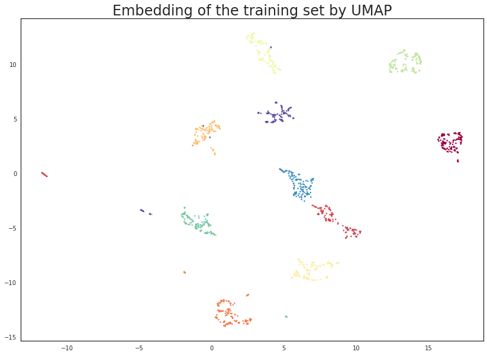
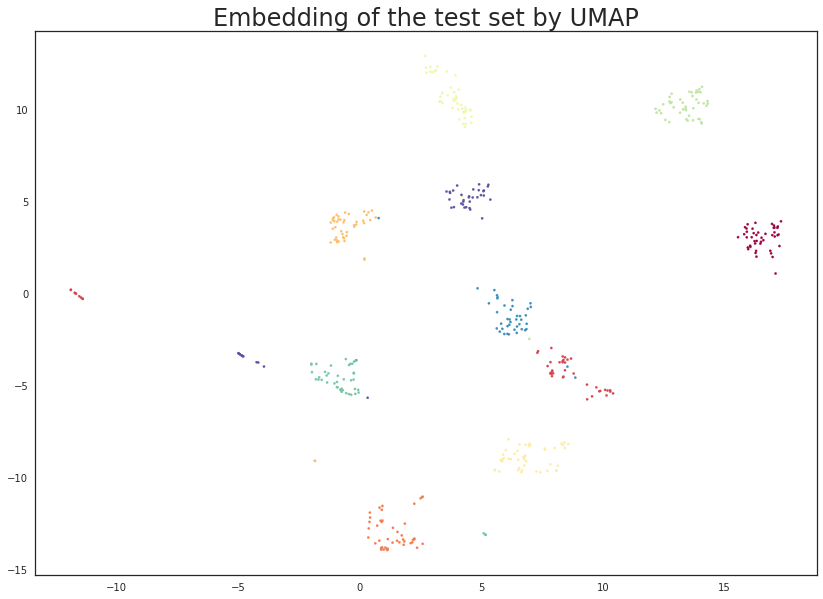

Transforming New Data with UMAP
===============================

UMAP is useful for generating visualisations, but if you want to make
use of UMAP more generally for machine learning tasks it is important to
be be able to train a model and then later pass new data to the model
and have it transform that data into the learned space. For example if
we use UMAP to learn a latent space and then train a classifier on data
transformed into the latent space then the classifier is only useful for
prediction if we can transform data for which we want a prediction into
the latent space the classifier uses. Fortunately UMAP makes this
possible, albeit more slowly than some other transformers that allow
this.

To demonstrate this functionality we'll make use of
`scikit-learn <http://scikit-learn.org/stable/index.html>`__ and the
digits dataset contained therein (see :doc:`basic_usage` for an example
of the digits dataset). First let's load all the modules we'll need to
get this done.

.. code:: python3

    import numpy as np
    from sklearn.datasets import load_digits
    from sklearn.model_selection import train_test_split, cross_val_score
    from sklearn.neighbors import KNeighborsClassifier
    from sklearn.svm import SVC
    
    import matplotlib.pyplot as plt
    import seaborn as sns
    %matplotlib inline

.. code:: python3

    sns.set(context='notebook', style='white', rc={'figure.figsize':(14,10)})

.. code:: python3

    digits = load_digits()

To keep everything honest let's use sklearn ``train_test_split`` to
separate out a training and test set (stratified over the different
digit types). By default ``train_test_split`` will carve off 25% of the
data for testing, which seems suitable in this case.

.. code:: python3

    X_train, X_test, y_train, y_test = train_test_split(digits.data, 
                                                        digits.target, 
                                                        stratify=digits.target,
                                                        random_state=42)

Now to get a benchmark idea of what we are looking at let's train a
couple of different classifiers and then see how well they score on the
test set. For this example lets try a support vector classifier and a
KNN classifier. Ideally we should be tuning hyper-parameters (perhaps a
grid search using k-fold cross validation), but for the purposes of this
simple demo we will simply use default parameters for both classifiers.

.. code:: python3

    svc = SVC().fit(X_train, y_train)
    knn = KNeighborsClassifier().fit(X_train, y_train)

The next question is how well these classifiers perform on the test set.
Conveniently sklearn provides a ``score`` method that can output the
accuracy on the tets set.

.. code:: python3

    svc.score(X_test, y_test), knn.score(X_test, y_test)

.. parsed-literal::

    (0.62, 0.9844444444444445)

The result is that the support vector classifier apparently had poor
hyper-parameters for this case (I expect with some tuning we could build
a much more accurate mode) and the KNN classifier is doing very well.

The goal now is to make use of UMAP as a preprocessing step that one
could potentially fit into a pipeline. We will therefore obviously need
the ``umap`` module loaded.

.. code:: python3

    import umap

To make use of UMAP as a data transformer we first need to fit the model
with the training data. This works exactly as in the :doc:`basic_usage`
example using the fit method. In this case we simply hand it the
training data and it will learn an appropriate (two dimensional by
default) embedding.

.. code:: python3

    trans = umap.UMAP(n_neighbors=5, random_state=42).fit(X_train)

Since we embedded to two dimensions we can visualise the results to
ensure that we are getting a potential benefit out of this approach.
This is simply a matter of generating a scatterplot with data points
colored by the class they come from. Note that the embedded training
data can be accessed as the ``.embedding_`` attribute of the UMAP model
once we have fit the model to some data.

.. code:: python3

    plt.scatter(trans.embedding_[:, 0], trans.embedding_[:, 1], s= 5, c=y_train, cmap='Spectral')
    plt.title('Embedding of the training set by UMAP', fontsize=24);

This looks very promising! Most of the classes got very cleanly
separated, and that gives us some hope that it could help with
classifier performance. It is worth noting that this was a completely
unsupervised data transform; we could have used the training label
information, but that is the subject of :doc:`a later tutorial <supervised>`.

We can now train some new models (again an SVC and a KNN classifier) on
the embedded training data. This looks exactly as before but now we pass
it the embedded data. Note that calling ``transform`` on input identical
to what the model was trained on will simply return the ``embedding_``
attribute, so sklearn pipelines will work as expected.

.. code:: python3

    svc = SVC().fit(trans.embedding_, y_train)
    knn = KNeighborsClassifier().fit(trans.embedding_, y_train)

Now we want to work with the test data which none of the models (UMAP or
the classifiers) have seen. To do this we use the standard sklearn API
and make use of the ``transform`` method, this time handing it the new
unseen test data. We will assign this to ``test_embedding`` so that we
can take a closer look at the result of applying an existing UMAP model
to new data.

.. code:: python3

    %time test_embedding = trans.transform(X_test)

.. parsed-literal::

    CPU times: user 867 ms, sys: 70.7 ms, total: 938 ms
    Wall time: 335 ms

Note that the transform operations works very efficiently -- taking less
than half a second. Compared to some other transformers this is a little
on the slow side, but it is fast enough for many uses. Note that as the
size of the training and/or test sets increase the performance will slow
proportionally. It's also worth noting that the first call to transform
may be slow due to Numba JIT overhead -- further runs will be very fast.

The next important question is what the transform did to our test data.
In principle we have a new two dimensional representation of the
test-set, and ideally this should be based on the existing embedding of
the training set. We can check this by visualising the data (since we
are in two dimensions) to see if this is true. A simple scatterplot as
before will suffice.

.. code:: python3

    plt.scatter(test_embedding[:, 0], test_embedding[:, 1], s= 5, c=y_test, cmap='Spectral')
    plt.title('Embedding of the test set by UMAP', fontsize=24);

The results look like what we should expect; the test data has been
embedded into two dimensions in exactly the locations we should expect
(by class) given the embedding of the training data visualised above.
This means we can now try out of models that were trained on the
embedded training data by handing them the newly transformed test set.

.. code:: python3

    svc.score(trans.transform(X_test), y_test), knn.score(trans.transform(X_test), y_test)

.. parsed-literal::

    (0.9844444444444445, 0.9844444444444445)

The results are pretty good. While the accuracy of the KNN classifier
did not improve there was not a lot of scope for improvement given the
data. On the other hand the SVC has improved to have equal accuracy to
the KNN classifier. Of course we could probably have achieved this level
of accuracy by better setting SVC hyper-parameters, but the point here
is that we can use UMAP as if it were a standard sklearn transformer as
part of an sklearn machine learning pipeline.

Just for fun we can run the same experiments, but this time reduce to
ten dimensions (where we can no longer visualise). In practice this will
have little gain in this case -- for the digits dataset two dimensions
is plenty for UMAP and more dimensions won't help. On the other had for
more complex datasets where more dimensions may allow for a much more
faithful embedding it is worth noting that we are not restricted to only
two dimension.

.. code:: python3

    trans = umap.UMAP(n_neighbors=5, n_components=10, random_state=42).fit(X_train)

.. code:: python3

    svc = SVC().fit(trans.embedding_, y_train)
    knn = KNeighborsClassifier().fit(trans.embedding_, y_train)

.. code:: python3

    svc.score(trans.transform(X_test), y_test), knn.score(trans.transform(X_test), y_test)

.. parsed-literal::

    (0.9822222222222222, 0.9822222222222222)

And we see that in this case we actually marginally lowered our accuracy
scores (within the potential noise in such scoring mind you). However
for more interesting datasets the larger dimensional embedding may have
been a significant gain -- it is certainly worth exploring as one of the
parameters in a grid search across a pipeline that includes UMAP.
