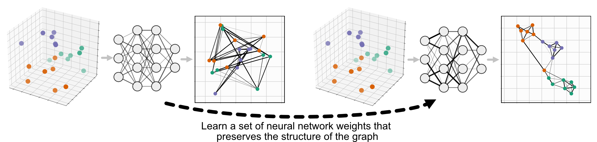

Transforming New Data with Parametric UMAP
==========================================

There are many cases where one may want to take an existing UMAP model and use it to embed new data into the learned space. For a simple example where the overall distribution of the higher-dimensional training data matches that of the new data being embedded, see :doc:`transform`. We can't always be sure that this will be the case, however. To simulate a case where we have novel behaviour that we want to include in our embedding space, we will use the MNIST digits dataset (see :doc:`basic_usage` for a basic example).

To follow along with this example, see the MNIST_Landmarks notebook on the `GitHub repository <https://github.com/lmcinnes/umap/tree/master/notebooks/>`_

.. code :: python3

    import keras
    from sklearn.model_selection import train_test_split
    
    from umap import UMAP, ParametricUMAP
    
    import matplotlib.pyplot as plt
    
    import numpy as np
    import pandas as pd

We'll start by loading in the dataset, and splitting it into 2 equal parts with ``sklearn``'s ``train_test_split`` function. This will give us two partitions to work with, one to train our original embedding and another to test it. In order to simulate new behaviour appearing in our data we remove one of the MNIST categories ``N`` from the ``x1`` partition. In this case we'll use ``N=2``, so our model will be trained on all of the digits other than 2.

.. code:: python3

    (X, y), (_, _) = keras.datasets.mnist.load_data()
    x1, x2, y1, y2 = train_test_split(X, y, test_size=0.5, random_state=42)

    # Reshape to 1D vectors
    x1 = x1.reshape((x1.shape[0], 28*28))
    x2 = x2.reshape((x2.shape[0], 28*28))
    
    # Remove one category from the train dataset.
    # In the case of MNIST digits, this will be the digit we are removing.
    N = 2
    
    x1 = x1[y1 != N]
    y1 = y1[y1 != N]
    
    print(x1.shape, x2.shape)

.. parsed-literal::

    (26995, 784) (30000, 784)

New data with UMAP
------------------

To start with, we'll identify the issues with using UMAP as-is in this case, and then we'll see how to fix them with Parametric UMAP. First off, we need to train a ``UMAP`` model on our ``x1`` partition:

.. code:: python3

    embedder = UMAP()
    
    emb_x1 = embedder.fit_transform(x1)

Visualising our results:

.. code:: python3

    plt.scatter(emb_x1[:,0], emb_x1[:,1], c=y1, cmap='Spectral', s=2, alpha=0.2)

.. image:: images/retrain_pumap_emb_x1.png

This is a clean and successful embedding, as we would expect from UMAP on this relatively-simple example. We see the normal structure one would expect from embedding MNIST, but without any of the 2s. The ``UMAP`` class is built to be compatible with ``scikit-learn``, so passing new data through is as simple as using the ``transform`` method and passing through the new data. We'll pass through ``x2``, which contains unseen examples of the original classes, and also samples from our holdout class, ``N`` (the 2s).

To make samples from ``N`` Stand out more, we'll over-plot them in black.

.. code:: python3

    emb_x2 = embedder.transform(x2)

.. code:: python3

    plt.scatter(emb_x2[:,0], emb_x2[:,1], c=y2, cmap='Spectral', s=2, alpha=0.2)
    plt.scatter(emb_x2[y2==N][:,0], emb_x2[y2==N][:,1], c='k', s=2, alpha=0.5)

.. image:: images/retrain_pumap_emb_x2.png

While our ``UMAP`` embedder has correctly handled the classes present in ``x1`` it has treated examples from our holdout class ``N`` poorly. Many of these points are concentrated on top of existing classes, with some spread out between them. This inability to generalize is not unique to UMAP, but is more generally a difficulty with learned embeddings. It also may or may not be an issue, depending on your use case. 

New data with Parametric UMAP
-----------------------------

We can improve this outcome with Parametric UMAP. Parametric UMAP differs from UMAP in that it learns the relationship between the data and embedding with a neural network, instead of learning embeddings directly. This means we can incorporate new data by continuing to train the neural network, updating the weights to incorporate our new information. 

For more complete information on Parametric UMAP and the many options it provides, see :doc:`parametric_umap`.  

We will start adressing this by training a ``ParametricUMAP`` embedding model, and running the same experiment:

.. code:: python3

    p_embedder = ParametricUMAP()
    
    p_emb_x1 = p_embedder.fit_transform(x1)

.. code:: python3

    plt.scatter(p_emb_x1[:,0], p_emb_x1[:,1], c=y1, cmap='Spectral', s=2, alpha=0.2)

.. image:: images/retrain_pumap_p_emb_x1.png

Again, we get good results on our initial embedding of ``x1``. If we pass ``x2`` through without re-training, we get a similar problem to our ``UMAP`` model:

.. code:: python3

    p_emb_x2 = p_embedder.transform(x2)

.. code:: python3

    plt.scatter(p_emb_x2[:,0], p_emb_x2[:,1], c=y2, cmap='Spectral', s=2, alpha=0.2)
    plt.scatter(p_emb_x2[y2==N][:,0], p_emb_x2[y2==N][:,1], c='k', s=2, alpha=0.5)

.. image:: images/retrain_pumap_p_emb_x2.png

Re-training Parametric UMAP with landmarks
------------------------------------------

To update our embedding to include the new class, we'll fine-tune our existing ``ParametricUMAP`` model. Doing this without any other changes will start from where we left off, but our embedding space's structure may drift and change. This is because the UMAP loss function is invariant to translation and rotation, as it is only concerned with the relative positions and distances between points.

In order to keep our embedding space more consistent, we'll use the landmarks option for ``ParametricUMAP``. We retrain the model on the ``x2`` partition, along with some points chosen as landmarks from ``x1``. We'll choose 1% of the samples in ``x1`` to be included, along with their current position in the embedding space to be used in the landmarks loss function.

The default ``landmark_loss_fn`` is the euclidean distance between the point's original position and it's current one. The only change we'll make is to set ``landmark_loss_weight=0.01``.

.. code:: python3

    # Select landmarks indexes from x1.
    #
    landmark_idx = list(np.random.choice(range(x1.shape[0]), int(x1.shape[0]/100), replace=False))
    
    # Add the landmark points to x2 for training.
    #
    x2_lmk = np.concatenate((x2, x1[landmark_idx]))
    y2_lmk = np.concatenate((y2, y1[landmark_idx]))
    
    # Make our landmarks vector, which is nan where we have no landmark information.
    #
    landmarks = np.stack(
        [np.array([np.nan, np.nan])]*x2.shape[0] + list(
            p_embedder.transform(
                x1[landmark_idx]
            )
        )
    )
    
    # Set landmark loss weight and continue training our Parametric UMAP model.
    #
    p_embedder.landmark_loss_weight = 0.01
    p_embedder.fit(x2_lmk, landmark_positions=landmarks)
    p_emb2_x2 = p_embedder.transform(x2)
    
    # Check how x1 looks when embedded in the space retrained on x2 and landmarks.
    #
    p_emb2_x1 = p_embedder.transform(x1)

Plotting all of the different embeddings to compare them:

.. code:: python3

    fig, axs = plt.subplots(3, 2, figsize=(16, 24), sharex=True, sharey=True)
    
    axs[0,0].scatter(
        emb_x1[:, 0], emb_x1[:, 1], c=y1, cmap='Spectral', s=2, alpha=0.2,
    )
    axs[0,0].set_ylabel('UMAP Embedding', fontsize=20)
    
    axs[0,1].scatter(
        emb_x2[:, 0], emb_x2[:, 1], c=y2, cmap='Spectral', s=2, alpha=0.2,
    )
    axs[0,1].scatter(
        emb_x2[y2==N][:,0], emb_x2[y2==N][:,1], c='k', s=2, alpha=0.5,
    )
    
    axs[1,0].scatter(
        p_emb_x1[:, 0], p_emb_x1[:, 1], c=y1, cmap='Spectral', s=2, alpha=0.2,
    )
    axs[1,0].set_ylabel('Initial P-UMAP Embedding', fontsize=20)
    
    axs[1,1].scatter(
        p_emb_x2[:, 0], p_emb_x2[:, 1], c=y2, cmap='Spectral', s=2, alpha=0.2,
    )
    axs[1,1].scatter(
        p_emb_x2[y2==N][:,0], p_emb_x2[y2==N][:,1], c='k', s=2, alpha=0.5
    )
    
    axs[2,0].scatter(
        p_emb2_x1[:, 0], p_emb2_x1[:, 1], c=y1, cmap='Spectral', s=2, alpha=0.2,
    )
    axs[2,0].set_ylabel('Updated P-UMAP Embedding', fontsize=20)
    axs[2,0].set_xlabel(f'x1, No {N}s', fontsize=20)
    
    axs[2,1].scatter(
        p_emb2_x2[:, 0], p_emb2_x2[:, 1], c=y2, cmap='Spectral', s=2, alpha=0.2,
    )
    axs[2,1].scatter(
        p_emb2_x2[y2==N][:,0], p_emb2_x2[y2==N][:,1], c='k', s=2, alpha=0.5,
    )
    axs[2,1].set_xlabel('x2, All Classes', fontsize=20)
    
    plt.tight_layout()

.. image:: images/retrain_pumap_summary_2_removed.png

Here we see that our approach has been successful, The embedding space has been kept consistent and we now have a clear cluster of our new class, the 2s. This new cluster shows up in a sensible part of the embedding space, and the rest of the structure is preserved.

It is worth double checking here that the landmark loss is not too constraining, we still would like a good UMAP structure.
To do so, we can interrogate the history of our embedder, which will retain the history through our re-training steps.

.. code:: python3

    plt.plot(p_embedder._history['loss'])
    plt.ylabel('Loss')
    plt.xlabel('Epoch')

.. image:: images/retrain_pumap_history.png

We can identify the spike in loss where we introduce ``x2``, and can confirm that the resulting loss is comparable to the loss from our initial training on ``x1``. This tells us that the model is not having to compromise too much between the UMAP loss and the landmark loss. If this were not the case, it could potentially be improved by lowering the ``landmark_loss_weight`` attribute of our embedder object. There is a tradeoff to be made here between the consistency of the space and minimizing UMAP loss, but the key is we have smooth variation in the embedding space, which will make downstream tasks easier to adjust. In this case, we could probably stand to increase the ``landmark_loss_weight`` to keep the space more consistent.

In addition to ``landmark_loss_weight``, there are a number of other options available to us to try and get better results on this or other examples:

- Continuing the training with a larger portion of points from the original data, in our case ``x1``. Not all of these points need to be landmarked, but they can contribute to a consistent graph structure in higher dimensions.
- Changing the ``landmark_loss_fn``. For example, if we want to allow for points to move if they have to we could truncate the default euclidean loss function, allowing the metaphorical rubber band to snap at a certain point and prioritising a good UMAP structure once we discover that sticking to the landmark position is not correct.
- Being more intelligent with our selection of landmark points, for example using submodular optimization with a package like `apricot-select <https://apricot-select.readthedocs.io/en/latest/>`__ or chosing points from different parts of a hierarchical clustering like `HDBSCAN <https://hdbscan.readthedocs.io/en/latest/index.html>`__

